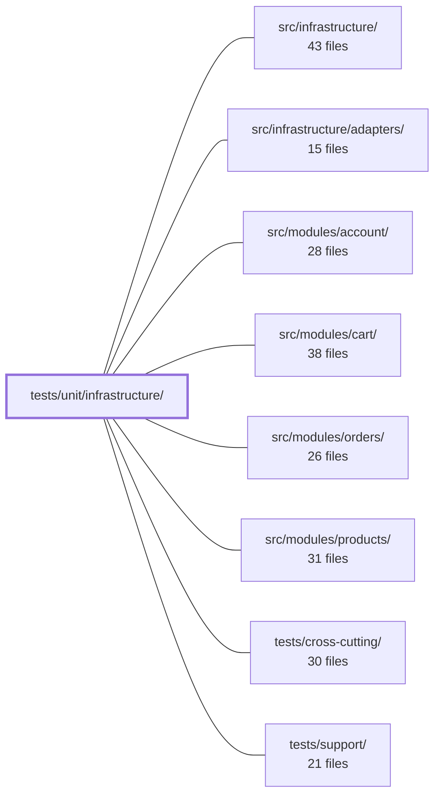

---
tags:
  - 2repo
  - 2repo/module
  - project/boilerplate-node-backend
type: module
module: tests/unit/infrastructure/
files: 27
updated: 2026-09-02T18:37:07.796846+00:00
---

# tests/unit/infrastructure/

## Purpose

Unit tests for the `src/infrastructure/` layer—HTTP plumbing, i18n, observability, persistence helpers, and runtime configuration. The suite isolates pure logic, middleware decision-making, and wire-format contracts that integration and cluster suites either cannot reach or would only exercise indirectly, ensuring each infrastructure concern is verified in fast, container-free `npm test` runs.

## Key parts

- **HTTP core** (`http/`): Tests for the response envelope (`response.test.ts`), request-parsing helpers (`request.test.ts`), shared scalar schemas (`schemas.test.ts`), upload shape-normalisation (`uploads.test.ts`), error-classification pipeline (`errors.test.ts`), and a guard on Express-internal router structure that the shared `tests/support/routes.ts` helper depends on (`router-internals.test.ts`).
- **Middleware** (`http/middlewares/`): Covers the response-cache decision logic, `attachLocale` / `AsyncLocalStorage` scoping, the `routeFlag` param-mutation contract, non-blocking `requestLogger`, the rate-limit store factory (split across two files to isolate `jest.mock` strategies), the Redis `init()` double-`connect` race, and the `isMetricsScraper` auth bypass.
- **i18n** (`i18n/`): Locale negotiation from `Accept-Language`, `AsyncLocalStorage`-based per-request context, catalog discovery/registration, and the locale-override overlay (load, delete, refresh-timer lifecycle).
- **Observability** (`observability/`): Analytics provider wire-payload assertions, audit-log emission and safe degradation, dependency-health state-to-word mapping, HTTP Prometheus metrics, SSE stream timer/error absorption, and OpenTelemetry tracer helpers.
- **Persistence helpers** (`persistence/`): `buildWhere` query compilation, shared fixture coercions (`toObjectId`, `stripUndefined`, etc.), and the `upsertById` skip branch.
- **Runtime** (`runtime/`): Failure-mode coverage for `environmentNumber` and `environmentFlag` coercion helpers.

## How it connects

- **`src/infrastructure/`** — Every test file in this module exercises a concrete function, class, or middleware exported from `src/infrastructure/` (HTTP helpers, i18n utilities, observability emitters, persistence factories, environment coercions).
- **`src/infrastructure/adapters/`** — The analytics tests (`analytics.test.ts`) assert wire payloads for the Umami and PostHog adapter implementations; the rate-limit store tests reference `RedisStore` and `MemoryStore` adapter classes.
- **`src/modules/{account,cart,orders,products}/`** — The middleware and i18n tests pin contracts (locale context via `AsyncLocalStorage`, rate-limit budgets, `routeFlag` param names) that those modules' controllers and services rely on at runtime.
- **`tests/cross-cutting/`** — The response-envelope, schema, and i18n tests lock in the shared API dialect and query-parameter vocabulary that cross-cutting contract suites assume but do not themselves define.
- **`tests/support/`** — `router-internals.test.ts` guards the Express internals that `tests/support/routes.ts` reads; `fixtures.test.ts` and `seed.test.ts` verify the helpers that every module's fixture files compose.

## Where to start

1. **`http/response.test.ts`** — the response envelope is the single contract every endpoint answers in; reading it first gives you the vocabulary (status→code, success/reject shapes) that most other tests reference.
2. **`i18n/context.test.ts`** — the `AsyncLocalStorage` locale scoping mechanism underlies the `attachLocale` middleware, the `t()` helper, and every endpoint's localised error messages; understanding it makes the rest of the HTTP and middleware tests read naturally.

## Connected modules

[[boilerplate-node-backend_src_infrastructure|src/infrastructure/]] · [[boilerplate-node-backend_src_infrastructure_adapters|src/infrastructure/adapters/]] · [[boilerplate-node-backend_src_modules_account|src/modules/account/]] · [[boilerplate-node-backend_src_modules_cart|src/modules/cart/]] · [[boilerplate-node-backend_src_modules_orders|src/modules/orders/]] · [[boilerplate-node-backend_src_modules_products|src/modules/products/]] · [[boilerplate-node-backend_tests_cross-cutting|tests/cross-cutting/]] · [[boilerplate-node-backend_tests_support|tests/support/]]

## Files
- `tests/unit/infrastructure/http/errors.test.ts` — Unit tests for `src/infrastructure/http/errors.ts`, covering the `ExtendedError` class (construction, message composition, `instanceof` semantics, default operational flag, and the logging-on-construction contract) and the `databaseErrorInterpreter` / `isDuplicateKey` pipeline (mapping driver and Mongoose errors to `[httpCode, message]` tuples). The tests pin behavior that guards against two failure modes: a client error (4xx) being reported as a server error (500), and a server bug being swallowed as a routine operational failure.
- `tests/unit/infrastructure/http/middlewares/cache.test.ts` — Unit tests for the HTTP response-cache middleware (`setCache` and friends). The file exercises everything the middleware *decides*—cache-key construction, response headers, TTL clamping, the size gate, and corrupt-entry recovery—against real implementations, while stubbing only the Redis round-trip (`getCacheValue` / `setCacheValue` / `invalidateCacheTags`).
- `tests/unit/infrastructure/http/middlewares/locale.test.ts` — Unit tests for the `attachLocale` Express middleware. They verify the four contracts the middleware must fulfil — locale negotiation onto the request, executing `next` inside an `AsyncLocalStorage`-based locale context, setting the correct response headers, and graceful degradation on malformed input — so that downstream services reading the ambient `t()` or the locale context keep working.
- `tests/unit/infrastructure/http/middlewares/rate-limit-store-selection.test.ts` — Unit tests for the `rateLimitStore` factory's **selection and wiring** logic: which concrete store is built (in-process `MemoryStore` vs. `RedisStore`), URL-resolution priority, lazy construction and memoisation, the missing-config alert path, and the init-failure fail-open regression. It is deliberately kept separate from `rate-limit-store.test.ts` because this file mocks `RedisStore` at the class level (via `jest.mock('rate-limit-redis')`) to control `init`/`increment` directly, whereas the sibling file lets a real `RedisStore` run against a fake low-level `redis` client to exercise the `connecting`-promise handshake. One `jest.mock('rate-limit-redis')` per file, so the two strategies cannot coexist in a single file.
- `tests/unit/infrastructure/http/middlewares/rate-limit-store.test.ts` — Unit test guarding a specific race in the Redis-backed rate-limit store: two `init()`-triggered Lua script loads issued back-to-back must not each call `connect()` on the same socket. It reproduces the exact node-redis handshake interleaving (fake client where `isReady` stays false until the promise resolves) and asserts a single `connect()` call plus no destructive `destroy()`. It exists to catch that regression in the fast, container-free `npm test` gate, complementing the slower cluster suite in `tests/cluster/rate-limit.test.ts`.
- `tests/unit/infrastructure/http/middlewares/rate-limit.test.ts` — Unit tests that pin two things about the rate-limit module: (1) the structural relationship between the three default budgets (browsing, credential, submission), and (2) the full behaviour of `isMetricsScraper`, the only auth check in the codebase that bypasses the JWT middleware. The scraper tests exist at unit level because "deny by default" is a security invariant that must not depend on an integration suite running.
- `tests/unit/infrastructure/http/middlewares/request-logger.test.ts` — Unit tests for the `requestLogger` Express middleware. Verifies that the middleware is non-blocking, defers logging until the response `finish` event, selects the correct log level by status code, emits only a fixed set of metadata fields, and fires the log call exactly once regardless of how many times `finish` is emitted.
- `tests/unit/infrastructure/http/middlewares/route-flag.test.ts` — Unit tests that pin the contract of the `routeFlag` middleware: it writes a named flag (as a **string**) onto `request.params` so that alternate URL patterns (e.g. `/hard` vs `?hardDelete=true`) can share a single controller entry point. End-to-end routing behaviour is covered by integration suites; these tests isolate the middleware's own mutation of the params object.
- `tests/unit/infrastructure/http/request.test.ts` — Unit tests for the `readInput` function (and, by import, `callerContextOf`, `extractAndValidateId`, `isValidObjectId`) in `@infrastructure/http/request`. The file exists because `readInput` is a small, always-in-the-path helper whose failure mode (a crash on a body-less request under Express 5) is invisible to integration and contract suites that only ever send well-formed payloads.
- `tests/unit/infrastructure/http/response.test.ts` — Unit tests for the API response-envelope helpers in `src/infrastructure/http/response.ts`. They pin the public contract every endpoint answers in: the shape of success/reject bodies, the status→`code` mapping, the status→`message` wording, and the Express-send wrappers. The file exists because the envelope is the API's dialect, not an implementation detail, and a well-meaning refactor could silently drop guarantees (e.g. an empty `errors` array, a leaked 5xx sub-code) without any caller noticing.
- `tests/unit/infrastructure/http/router-internals.test.ts` — Pins the undocumented Express internals (`Router.stack`, `layer.route.methods`, `route.stack[].handle`) that the shared test helper `tests/support/routes.ts` relies on. If Express changes this internal shape in a future version, this single test fails with a clear message pointing at the helper that needs updating — rather than letting twelve downstream suites fail opaquely with `cannot read properties of undefined`.
- `tests/unit/infrastructure/http/schemas.test.ts` — Unit tests for the shared scalar schemas (`hardDeleteSchema`, `pageSchema`, `pageSizeSchema`, `paginationSchema`) that guarantee every endpoint interprets the same query-parameter questions identically. The file exists to lock in the contract so that a value like `?hardDelete=false` can never be misread as "delete" and a `pageSize` out of range can never be answered differently by two controllers.
- `tests/unit/infrastructure/http/uploads.test.ts` — Unit tests for the upload helper functions in `src/infrastructure/http/uploads.ts`. The file exists to lock down two invariants: (1) `getFormFiles` collapses all three multer request shapes (`single`, `array`, `fields`) into one uniform return type, and (2) `resolveImageUrl` reads the URL only from the image store and never falls back to a filesystem path. It also covers the small `toPosixPath` normalizer.
- `tests/unit/infrastructure/i18n/catalog.test.ts` — Unit tests for the i18n catalog layer: locale discovery, per-dictionary loading with module merge, and the resource shape handed to `i18next.init()`. The suite guards the invariant that the supported-locale list stays in lockstep with the resources `i18next` actually registered at init time.
- `tests/unit/infrastructure/i18n/context.test.ts` — Unit tests for the request-scoped i18n context — the `AsyncLocalStorage`-based mechanism that lets `t()` resolve against the locale set by the current request, while silently falling back to the global instance outside any scope. The file exists because the failure modes it guards (out-of-scope raw keys, concurrent-request cross-talk) are invisible to integration tests and only surface under deliberate concurrency or out-of-band code paths.
- `tests/unit/infrastructure/i18n/negotiate.test.ts` — Unit tests for `negotiateLocale`, the pure function that resolves a client-supplied `Accept-Language` header (or the absence of one) into a concrete supported locale. Because malformed and edge-case headers are tedious to reproduce over real HTTP, the function is exercised here directly rather than only through integration tests.
- `tests/unit/infrastructure/i18n/overrides.test.ts` — Unit tests for the locale-override overlay layer. Validates that overrides correctly layer on top of deployed translation files without corrupting them, that deletion and provider failures are handled safely, and that the background refresh timer behaves predictably across start/stop lifecycles.
- `tests/unit/infrastructure/observability/analytics.test.ts` — Unit tests for the analytics provider port and its implementations (Umami, PostHog, none). Because the analytics contract is fire-and-forget by design—no return value, no acknowledgement—these tests assert on the **wire payload** (URL, headers, JSON body) rather than on a function result. They exist to pin down non-obvious provider behaviours (e.g. Umami's silent 200-OK discard of events missing a `User-Agent`) that are invisible from source code alone.
- `tests/unit/infrastructure/observability/audit.test.ts` — Unit tests for the core audit-logging subsystem: event emission, sink registration, request-context extraction, and the app-level security action constants. Ensures the audit path degrades safely (no disk writes, no exceptions escaping) in test and worker environments.
- `tests/unit/infrastructure/observability/dependency-health.test.ts` — Unit tests that pin the exact mapping from each dependency's raw state to its health word and the fold from individual words to an overall service status (`ok` / `degraded`). The contract suite elsewhere can only assert that the payload uses the four allowed words; this file locks *which* word each state produces and *when* the service degrades, covering two mappings that are easy to invert (`disabled` must not degrade, `connecting` must not read as broken).
- `tests/unit/infrastructure/observability/metrics-http.test.ts` — Unit tests for the HTTP request metrics module (`metrics-http.ts`). Validates that route labels are derived safely (bounded cardinality), that Prometheus counters/gauges are incremented correctly, and that histogram-percentile math behaves as expected.
- `tests/unit/infrastructure/observability/stream.test.ts` — Unit tests for the SSE observability metrics stream. The suite exists because three failure modes in `stream.ts` are silent — wire-format whitespace, uncleared timers on disconnect, and unhandled rejections inside interval callbacks — and none of them produce an error visible to the developer. The tests pin the exact bytes written to the socket, the timer lifecycle, and the error-absorption contract.
- `tests/unit/infrastructure/observability/tracer.test.ts` — Unit tests for the OpenTelemetry tracing utilities in `src/infrastructure/observability/tracer.ts`. Verifies that the four exported helpers (`getTracer`, `withSpan`, `getActiveSpanContext`, `recordErrorOnActiveSpan`) behave correctly on both success and failure paths without requiring a live collector.
- `tests/unit/infrastructure/persistence/create-repository.test.ts` — Unit tests for the `buildWhere` method returned by `createRepository`, which compiles a caller's filter bag into a MongoDB query object. The tests are pure and DB-free: the Mongoose model is a stub that is never invoked, so the suite isolates the id-coercion, blank/empty handling, and per-kind compilation rules (objectIds, exact, booleans, regex, arrayRegex, text, ranges) without any database or Mongoose internals.
- `tests/unit/infrastructure/persistence/fixtures.test.ts` — Unit tests for the four shared fixture helpers (`toObjectId`, `stripUndefined`, `toDate`, `identityOf`) that every module's `fixtures.ts` composes. The tests exist to pin down the contract for what happens when a seeded record omits a field—specifically the silent-failure modes (string leaking into a `$match`, `undefined` suppressing Mongoose defaults, `Invalid Date` persisting as `null`) and the non-obvious derivation rules (timestamps pulled from the ObjectId's embedded time, `updatedAt` defaulting to `createdAt`).
- `tests/unit/infrastructure/persistence/seed.test.ts` — Unit tests for the `upsertById` helper, covering both branches of its upsert policy: the **created** path (no prior document) and the **skipped** path (id already present). The skip arm historically went unexercised by integration suites (which always seed into a fresh database), leaving that branch invisible to coverage; this file exists to pin that behavior explicitly.
- `tests/unit/infrastructure/runtime/environment.test.ts` — Exhaustive unit tests for the two shared environment-variable coercions (`environmentNumber` and `environmentFlag`). The suite focuses on failure modes — unset, blank, partial, and unrecognised inputs — because those are the silent regressions (NaN leaking into `Date`/`maxAge`, `parseInt` reading a prefix, inconsistent flag vocabulary) the helpers exist to prevent.

---
[[boilerplate-node-backend_INDEX|← boilerplate-node-backend index]]
