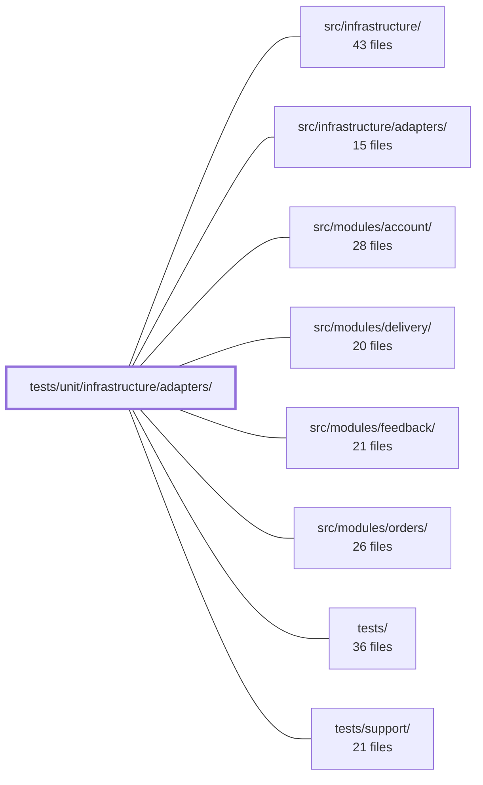

---
tags:
  - 2repo
  - 2repo/module
  - project/boilerplate-node-backend
type: module
module: tests/unit/infrastructure/adapters/
files: 17
updated: 2026-09-02T18:37:22.240873+00:00
---

# tests/unit/infrastructure/adapters/

## Purpose

Unit tests for every adapter in `src/infrastructure/adapters/`. The suite pins the behavioral, security, and availability contracts each adapter exposes to the rest of the application—fail-open guarantees, key/credential isolation, content-based validation, and delivery branching—so that a refactor or dependency upgrade cannot silently break a production invariant.

## Key parts

- **Connection & cache** — `managed-connection.test.ts` locks down the shared Redis/RabbitMQ lifecycle state machine (reuse, fail-open, shutdown) that both `cache.test.ts` and `queue.test.ts` depend on; `cache.test.ts` verifies the fail-open and key-prefixing invariants of the Redis wrapper.
- **Mailer & email delivery** — `mailer-transport.test.ts` (SMTP option mapping, especially the `secure`-vs-port security pairing), `mailer-dispatch.test.ts` (three-branch `enqueueEmail` logic), `mailer-templates.test.ts` (real EJS render across every locale to catch unresolved i18next keys), and `demo-outbox.test.ts` (the in-process email sink used by local/dev profiles).
- **Image pipeline** — `image-signatures.test.ts` (magic-byte identification security contract), `image-store.test.ts` (quarantine/promote path logic against a real temp dir), `image.test.ts` (actual `sharp` encode output: format, dimensions, EXIF), and `image.worker.test.ts` (digest decision logic with all I/O mocked).
- **Upload security & filesystem** — `storage.test.ts` (multer callbacks + content-validation middleware—the repo's entire upload boundary), `filesystem.test.ts` (cross-device `moveFile` fallback), and `quarantine-uploaded-images.test.ts` (Express middleware orchestration and cleanup on failure).
- **Queue & workers** — `queue.test.ts` (RabbitMQ publish/consume, DLQ wiring, four-arm ack policy) and `workers.test.ts` (decision logic for `handleEmailJob` and `handlePdfJob`: what dead-letters vs. what requeues).
- **Logging & PDF** — `logger.test.ts` (credential redaction via example, property-based, and policy-table tests) and `pdf.test.ts` (puppeteer invocation contract: sandbox flags, wait strategy, guaranteed teardown—no browser binary needed).

## How it connects

- **`src/infrastructure/adapters/`** is the sole subject; every file here imports the adapter under test directly and asserts its public contract.
- **`src/infrastructure/`** (parent) provides the broader infrastructure layer; these tests stay at the adapter boundary and do not reach into higher-level composition.
- **`src/modules/account/`, `src/modules/delivery/`, `src/modules/feedback/`, `src/modules/orders/`** are downstream consumers. Their integration with these adapters (e.g., account calling `enqueueEmail`, delivery calling the image pipeline) is covered by their own module test suites; here the tests confirm the adapters those modules rely on behave correctly in isolation.
- **`tests/`** (parent) and **`tests/support/`** supply shared fixtures, temp-directory helpers, and any utility assertions reused across adapter test files.

## Where to start

1. **`managed-connection.test.ts`** — it documents the shared lifecycle state machine (handle reuse, fail-open, graceful shutdown) that both the cache and queue adapters build on. Understanding this one file makes the `cache` and `queue` tests much easier to follow.
2. **`storage.test.ts`** — it is the most self-contained security-critical suite (multer callbacks + content validation) and doubles as a reference for how the project tests a full public surface with explicit behavioural assertions rather than mock-call counts.

## Connected modules

[[boilerplate-node-backend_src_infrastructure|src/infrastructure/]] · [[boilerplate-node-backend_src_infrastructure_adapters|src/infrastructure/adapters/]] · [[boilerplate-node-backend_src_modules_account|src/modules/account/]] · [[boilerplate-node-backend_src_modules_delivery|src/modules/delivery/]] · [[boilerplate-node-backend_src_modules_feedback|src/modules/feedback/]] · [[boilerplate-node-backend_src_modules_orders|src/modules/orders/]] · [[boilerplate-node-backend_tests|tests/]] · [[boilerplate-node-backend_tests_support|tests/support/]]

## Files
- `tests/unit/infrastructure/adapters/cache.test.ts` — Unit tests for the cache adapter (`src/infrastructure/adapters/cache.ts`). Verifies the two invariants the adapter promises—**fail-open** (every path resolves, never rejects, so a Redis outage degrades to a cache-miss rather than a 500) and **key prefixing** (namespaced keys prevent two deployments sharing a Redis instance from reading each other's entries). Also pins the one exception: `clearCache` must distinguish "nothing to clear" (exit 0) from "could not clear" (exit non-zero).
- `tests/unit/infrastructure/adapters/demo-outbox.test.ts` — Unit tests for the demo profile's email-sink adapter (`demo-outbox`). They verify the recording, ordering, token-extraction, recipient-serialization, and reset behaviors of the outbox, ensuring that the token captured from email link URLs stays correct—a regression here would surface as a confusing "empty inbox" failure in a separate frontend repo's password-reset and verification suites.
- `tests/unit/infrastructure/adapters/filesystem.test.ts` — Unit tests for `moveFile` from `@infrastructure/adapters/filesystem`, verifying both the happy path (rename) and the cross-device fallback (copy-then-unlink on EXDEV). The EXDEV case is not an edge case here — on a typical Linux host the temp dir is tmpfs and the public dir is a real disk, so the fallback is the production path.
- `tests/unit/infrastructure/adapters/image-signatures.test.ts` — Unit tests for the magic-byte image identification functions (`identifyImage`, `identifyImageFile`). The file exists to pin down the security contract: identification is purely content-based (magic bytes), ignores extensions and declared MIME types, and reads only the minimal header from disk. It also documents the known boundary — identifying format is not the same as scanning for embedded payloads.
- `tests/unit/infrastructure/adapters/image-store.test.ts` — Unit tests for `filesystemImageStore` that exercise every public method (`quarantine`, `readQuarantined`, `removeQuarantined`, `promote`, `putDerivative`, `remove`) against a real temp directory. The tests deliberately use actual filesystem I/O rather than a mocked `fs` because the critical property under test is *which path* is computed and operated on, not merely that a call was made.
- `tests/unit/infrastructure/adapters/image.test.ts` — Unit tests for the image adapter (`digestImage` and `thumbnailImage`) that use the **real** `sharp` native module against generated fixture buffers. The goal is to assert properties of the actual encoded output bytes (format, dimensions, EXIF presence) rather than verifying that mocked methods were called.
- `tests/unit/infrastructure/adapters/image.worker.test.ts` — Unit tests for the image-digest pipeline in `image.worker.ts`, covering the three public entry points (`digestQuarantinedImage`, `handleImageDigestJob`, `enqueueImageDigest`). The tests verify decision logic (ack / dead-letter / requeue, writeback cleanup, inline fallback) while mocking out all I/O: image encoding, file storage, format identification, and the message broker.
- `tests/unit/infrastructure/adapters/logger.test.ts` — Unit tests for the logger adapter's redaction and error-serialization logic. Its stated job is to guarantee that credentials never reach a log aggregator (e.g. Datadog). The suite covers example-based assertions, property-based invariants (via fast-check), and table-driven checks over the actual policy sets, so that a new sensitive field is tested automatically and a removed one is caught by a size guard.
- `tests/unit/infrastructure/adapters/mailer-dispatch.test.ts` — Unit tests for the `enqueueEmail` dispatch function in `mailer.ts`, covering its three delivery branches (no broker → inline send; broker OK → queue publish; broker publish fails → inline fallback) plus the edge case where the queue adapter rejects instead of returning `false`. The file exists to pin down a "three-branch claim" that no other test in the codebase asserted, and to document why each branch's logging, return shape, and payload shape matter for production delivery of password-reset and auth emails.
- `tests/unit/infrastructure/adapters/mailer-templates.test.ts` — Guards the email-templating pipeline end-to-end: it asserts the templates directory is resolvable and populated, then renders **every** `.ejs` template in **every** supported locale through the real builder functions that supply its copy. This catches two silent failure modes that no type-check or mocked-filesystem suite can: a misconfigured `EMAIL_TEMPLATES_DIR`, and an i18next key that resolves to the key string itself (a valid string, so nothing throws).
- `tests/unit/infrastructure/adapters/mailer-transport.test.ts` — Unit tests for the SMTP transport option-building logic in `src/infrastructure/adapters/mailer.ts`. Verifies that the options object handed to `nodemailer.createTransport` correctly maps environment variables to port, TLS mode, credentials, and identity — with emphasis on the `secure`-vs-port pairing, which is a security decision, not a mere setting.
- `tests/unit/infrastructure/adapters/managed-connection.test.ts` — Unit tests for the `manageConnection` lifecycle adapter, verifying its state machine, handle reuse, fail-open guarantees, and shutdown behavior using fake handles — no real Redis or RabbitMQ needed. The file exists so that the shared state rules (which both the cache and queue adapters rely on) are tested once against a single implementation.
- `tests/unit/infrastructure/adapters/pdf.test.ts` — Unit tests for `renderHtmlToPdf` (the HTML → PDF adapter). The suite verifies four externally observable decisions—executable-path resolution at call time, sandbox flag args, `networkidle0` wait strategy, and guaranteed browser teardown via `finally`—without launching a real browser. `puppeteer-core` is fully mocked, so no Chromium binary is required in the test environment.
- `tests/unit/infrastructure/adapters/quarantine-uploaded-images.test.ts` — Unit tests for the `quarantineUploadedImages` Express middleware. The file verifies that staged Multer uploads are correctly committed into quarantine (or digested inline when no broker is running), and that every failure path triggers appropriate cleanup so no orphaned files remain. The store and digest pipeline are fully mocked; the middleware's orchestration logic is what is under test.
- `tests/unit/infrastructure/adapters/queue.test.ts` — Unit tests for the RabbitMQ queue adapter (`src/infrastructure/adapters/queue.ts`). Validates the enable/disable gate, publish/consume lifecycle, dead-letter queue wiring, channel supervision, and the four-arm acknowledgement policy (ack / discard / requeue / discard-malformed) — all against a fully mocked `amqplib` channel, with no broker required.
- `tests/unit/infrastructure/adapters/storage.test.ts` — Unit tests for the upload-security surface of `src/infrastructure/adapters/storage.ts`: the multer callbacks (`fileFilter`, `resolveUploadDestination`, `resolveUploadFilename`) and the post-upload content-validation middleware (`validateUploadedImages`). These functions constitute the repository's entire upload security boundary, and this file pins their behavioural guarantees (field whitelist, client-name discarding, MIME allow-list, byte-level content check, staged-file deletion on rejection) so that refactors must preserve them.
- `tests/unit/infrastructure/adapters/workers.test.ts` — Unit tests for the two queue workers (`handleEmailJob` and `handlePdfJob`), focusing exclusively on their **decision logic**: which malformed payloads are refused (resolve `false` → dead-letter) versus which infrastructure failures are allowed to propagate (reject → broker requeues). All side effects (nodemailer, puppeteer, ejs) are mocked; the tests never exercise actual delivery or rendering.

---
[[boilerplate-node-backend_INDEX|← boilerplate-node-backend index]]
