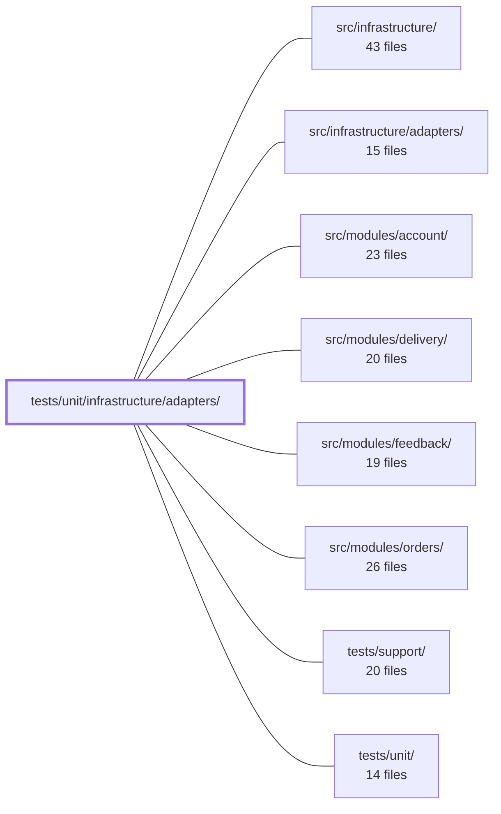

---
tags:
  - 2repo
  - 2repo/module
  - project/boilerplate-node-backend
type: module
module: tests/unit/infrastructure/adapters/
files: 17
updated: 2026-08-31T20:59:31.677117+00:00
---

# tests/unit/infrastructure/adapters/

## Purpose

Unit tests for every adapter in `src/infrastructure/adapters/`. Each file pins the behavioural contract of one adapter (or one function group) so that infrastructure-level bugs—Redis fail-open, email-silent-drop, wrong-file-delete, credential leakage into logs—surfice as test failures rather than production incidents. The suite deliberately favours real dependencies (sharp, generated buffers, temp directories) over mocks where the *output* is the contract, and mocks external I/O (broker, SMTP, Chromium) where only the *decision logic* matters.

## Key parts

- **Cache & connection lifecycle** — `cache.test.ts` and `managed-connection.test.ts`. The first locks down Redis fail-open and key-prefixing invariants; the second tests the shared `manageConnection` state machine (handle reuse, shutdown) that both cache and queue adapters depend on.
- **Upload & image pipeline** — `storage.test.ts`, `quarantine-uploaded-images.test.ts`, `image-signatures.test.ts`, `image-store.test.ts`, `image.test.ts`, `image.worker.test.ts`, `filesystem.test.ts`. Together they cover the full path from Multer field whitelist → magic-byte identification → quarantine commit → sharp digest/thumbnail → final move (including the EXDEV cross-device fallback that is the normal production path on Linux).
- **Email & queue** — `mailer-dispatch.test.ts`, `mailer-templates.test.ts`, `mailer-transport.test.ts`, `demo-outbox.test.ts`, `queue.test.ts`, `workers.test.ts`. These verify the three-branch `enqueueEmail` dispatch, SMTP option mapping (especially the `secure`/port pairing), EJS template resolution across locales, the RabbitMQ adapter's public API, and the two worker entry points' ack/nack decision logic.
- **Logging & PDF** — `logger.test.ts` (redaction + error-serialisation, property-based) and `pdf.test.ts` (puppeteer-core fully mocked; asserts sandbox flags, wait strategy, teardown).

## How it connects

- **src/infrastructure/adapters/** — Every test file here imports and exercises one or more exports from this module. The tests are the executable specification for the adapters; a failing test here means a contract violation in the adapter source.
- **src/infrastructure/** — The parent directory that houses the adapters. The tests implicitly validate the infrastructure layer's isolation boundary: adapters are tested in isolation with their dependencies (Redis, RabbitMQ, SMTP, disk) mocked or sandboxed, which is the architectural promise the module enforces.
- **src/modules/account/** — The demo-outbox tests explicitly reference the password-reset and verification flows that the account module drives; a regression in token-extraction or recipient-serialisation would surface first in those flows.
- **src/modules/delivery/** — The mailer-dispatch, mailer-transport, and worker tests protect the delivery path (email rendering, PDF generation) that the delivery module orchestrates through the queue.
- **src/modules/feedback/** / **src/modules/orders/** — These modules consume the cache and queue adapters; the fail-open and ack-policy invariants tested here are the guarantees those modules rely on at runtime.
- **tests/support/** — Shared test helpers (temp-dir setup, fixture generation, assertion utilities) that individual adapter tests import to stay focused on the adapter contract.
- **tests/unit/** — The parent test directory; this module is one of its sub-trees and follows its naming and co-location conventions.

## Where to start

1. **`cache.test.ts`** — The shortest file and the clearest illustration of the testing philosophy: two invariants (fail-open, key-prefixing), one exception (`clearCache` exit codes). It shows how the suite pins *what the adapter promises* rather than *how it is implemented*.
2. **`storage.test.ts`** — The broadest single file; it covers the upload security boundary end-to-end (field whitelist → filename sanitisation → MIME allow-list → byte-level content check → staged-file cleanup). Reading it reveals the layered defence-in-depth that the rest of the image pipeline builds on.

## Connected modules

[[boilerplate-node-backend_src_infrastructure|src/infrastructure/]] · [[boilerplate-node-backend_src_infrastructure_adapters|src/infrastructure/adapters/]] · [[boilerplate-node-backend_src_modules_account|src/modules/account/]] · [[boilerplate-node-backend_src_modules_delivery|src/modules/delivery/]] · [[boilerplate-node-backend_src_modules_feedback|src/modules/feedback/]] · [[boilerplate-node-backend_src_modules_orders|src/modules/orders/]] · [[boilerplate-node-backend_tests_support|tests/support/]] · [[boilerplate-node-backend_tests_unit|tests/unit/]]

## Files
- `tests/unit/infrastructure/adapters/cache.test.ts` — Unit tests for the cache adapter (`src/infrastructure/adapters/cache.ts`). Verifies the two invariants the adapter promises—**fail-open** (every path resolves, never rejects, so a Redis outage degrades to a cache-miss rather than a 500) and **key prefixing** (namespaced keys prevent two deployments sharing a Redis instance from reading each other's entries). Also pins the one exception: `clearCache` must distinguish "nothing to clear" (exit 0) from "could not clear" (exit non-zero).
- `tests/unit/infrastructure/adapters/demo-outbox.test.ts` — Unit tests for the demo profile's email-sink adapter (`demo-outbox`). They verify the recording, ordering, token-extraction, recipient-serialization, and reset behaviors of the outbox, ensuring that the token captured from email link URLs stays correct—a regression here would surface as a confusing "empty inbox" failure in a separate frontend repo's password-reset and verification suites.
- `tests/unit/infrastructure/adapters/filesystem.test.ts` — Unit tests for `moveFile` from `@infrastructure/adapters/filesystem`, verifying both the happy path (rename) and the cross-device fallback (copy-then-unlink on EXDEV). The EXDEV case is not an edge case here — on a typical Linux host the temp dir is tmpfs and the public dir is a real disk, so the fallback is the production path.
- `tests/unit/infrastructure/adapters/image-signatures.test.ts` — Unit tests for the magic-byte image identification functions (`identifyImage`, `identifyImageFile`). The file exists to pin down the security contract: identification is purely content-based (magic bytes), ignores extensions and declared MIME types, and reads only the minimal header from disk. It also documents the known boundary — identifying format is not the same as scanning for embedded payloads.
- `tests/unit/infrastructure/adapters/image-store.test.ts` — Unit tests for `filesystemImageStore` — the sole module that maps a client-supplied `imageUrl` to a filesystem path and performs create/read/delete operations on it. Because a wrong translation deletes the wrong file, these tests use real files in a real temp directory rather than a mocked `fs`, asserting on *which* path is touched rather than that a path was touched.
- `tests/unit/infrastructure/adapters/image.test.ts` — Unit tests for the image adapter (`digestImage` and `thumbnailImage`) that use the **real** `sharp` native module against generated fixture buffers. The goal is to assert properties of the actual encoded output bytes (format, dimensions, EXIF presence) rather than verifying that mocked methods were called.
- `tests/unit/infrastructure/adapters/image.worker.test.ts` — Unit tests for the image-digest pipeline in `image.worker.ts`, covering the three public entry points (`digestQuarantinedImage`, `handleImageDigestJob`, `enqueueImageDigest`). The tests verify decision logic (ack / dead-letter / requeue, writeback cleanup, inline fallback) while mocking out all I/O: image encoding, file storage, format identification, and the message broker.
- `tests/unit/infrastructure/adapters/logger.test.ts` — Unit and property-based tests for the redaction and error-serialization helpers in `src/infrastructure/adapters/logger.ts`. The file exists to prove that sensitive values (passwords, tokens, auth headers) never survive into log output and that error serialization behaves correctly across environments. The header docblock frames a miss as "a password in Datadog forever" rather than a feature bug.
- `tests/unit/infrastructure/adapters/mailer-dispatch.test.ts` — Unit tests for `enqueueEmail` in `src/infrastructure/adapters/mailer.ts`, covering all three dispatch branches (no broker, broker OK, broker publish failure) plus the contract that the queue adapter answers `false` rather than rejecting. The file exists because the three-branch dispatch logic was previously untested and a silent failure (unresolved broker, no fallback) would drop password-reset emails invisibly.
- `tests/unit/infrastructure/adapters/mailer-templates.test.ts` — Guards the email-template pipeline end-to-end at the copy level: verifies the template directory resolves to real files, then renders every `.ejs` template in every supported locale through the same builders that fill them in production. Catches two silent failure modes that no type-check or mock-based test can see — a wrong `EMAIL_TEMPLATES_DIR` and missing i18n keys that i18next would silently return as the key string itself.
- `tests/unit/infrastructure/adapters/mailer-transport.test.ts` — Unit tests for the SMTP transport option-building logic in `src/infrastructure/adapters/mailer.ts`. Verifies that the options object handed to `nodemailer.createTransport` correctly maps environment variables to port, TLS mode, credentials, and identity — with emphasis on the `secure`-vs-port pairing, which is a security decision, not a mere setting.
- `tests/unit/infrastructure/adapters/managed-connection.test.ts` — Unit tests for the `manageConnection` lifecycle adapter, verifying its state machine, handle reuse, fail-open guarantees, and shutdown behavior using fake handles — no real Redis or RabbitMQ needed. The file exists so that the shared state rules (which both the cache and queue adapters rely on) are tested once against a single implementation.
- `tests/unit/infrastructure/adapters/pdf.test.ts` — Unit tests for `renderHtmlToPdf` (the HTML → PDF adapter). The suite verifies four externally observable decisions—executable-path resolution at call time, sandbox flag args, `networkidle0` wait strategy, and guaranteed browser teardown via `finally`—without launching a real browser. `puppeteer-core` is fully mocked, so no Chromium binary is required in the test environment.
- `tests/unit/infrastructure/adapters/quarantine-uploaded-images.test.ts` — Unit tests for the `quarantineUploadedImages` Express middleware. The file verifies that staged Multer uploads are correctly committed into quarantine (or digested inline when no broker is running), and that every failure path triggers appropriate cleanup so no orphaned files remain. The store and digest pipeline are fully mocked; the middleware's orchestration logic is what is under test.
- `tests/unit/infrastructure/adapters/queue.test.ts` — Unit tests for the RabbitMQ queue adapter (`src/infrastructure/adapters/queue.ts`). Validates the adapter's public API — enablement detection, publish, consume, lifecycle management, dead-letter wiring, and the ack/nack acknowledgement policy — using a fully mocked `amqplib` layer so no real broker is needed.
- `tests/unit/infrastructure/adapters/storage.test.ts` — Unit tests for the upload-security surface of `src/infrastructure/adapters/storage.ts`: the multer callbacks (`fileFilter`, `resolveUploadDestination`, `resolveUploadFilename`) and the post-upload content-validation middleware (`validateUploadedImages`). These functions constitute the repository's entire upload security boundary, and this file pins their behavioural guarantees (field whitelist, client-name discarding, MIME allow-list, byte-level content check, staged-file deletion on rejection) so that refactors must preserve them.
- `tests/unit/infrastructure/adapters/workers.test.ts` — Unit tests for the two queue workers (`handleEmailJob` and `handlePdfJob`), focusing exclusively on their **decision logic**: which malformed payloads are refused (resolve `false` → dead-letter) versus which infrastructure failures are allowed to propagate (reject → broker requeues). All side effects (nodemailer, puppeteer, ejs) are mocked; the tests never exercise actual delivery or rendering.

---
[[boilerplate-node-backend_INDEX|← boilerplate-node-backend index]]
