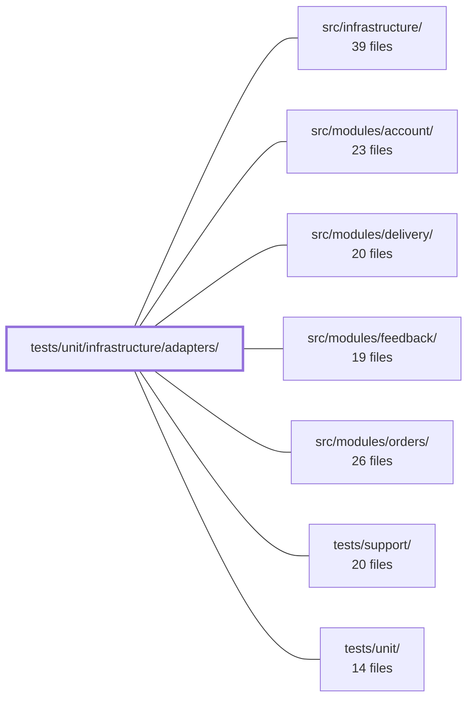

---
tags:
  - 2repo
  - 2repo/module
  - project/boilerplate-node-backend
type: module
module: tests/unit/infrastructure/adapters/
files: 14
updated: 2026-08-28T12:02:57.164223+00:00
---

# tests/unit/infrastructure/adapters/

## Purpose

This module contains the unit-test suite for every adapter under `src/infrastructure/adapters/`. Each test file pins the behavioural and security contracts of one adapter—cache, mail, file storage, image validation, PDF rendering, queue, and logging—using mocked external dependencies (Redis, RabbitMQ, `nodemailer`, `puppeteer-core`, `fs`) so that no real broker, browser, or disk layout is required at test time. The emphasis is on the invariants that would otherwise be invisible to TypeScript: fail-open semantics, key namespacing, content-based image identification, redaction guarantees, and path-traversal safety.

## Key parts

- **Upload & file-security boundary** — `storage.test.ts`, `store-uploaded-images.test.ts`, `image-signatures.test.ts`, `image-store.test.ts`, `filesystem.test.ts`. Together they cover multer callbacks, the post-upload content-validation middleware, magic-byte identification, the `imageUrl` → filesystem-path translation, and the `moveFile` rename/EXDEV-fallback logic.
- **Email pipeline** — `mailer-dispatch.test.ts` (three-branch `enqueueEmail`), `mailer-transport.test.ts` (SMTP option mapping incl. `secure`/port pairing), `mailer-templates.test.ts` (EJS rendering across all locales against real template files), `demo-outbox.test.ts` (recording/ordering/token-extraction in the demo sink).
- **Queue & workers** — `queue.test.ts` (RabbitMQ adapter API, dead-letter wiring, ack/nack policy) and `workers.test.ts` (decision logic for `handleEmailJob` and `handlePdfJob`: which failures dead-letter vs. requeue).
- **PDF rendering** — `pdf.test.ts` (executable resolution, sandbox flags, `networkidle0` wait, guaranteed teardown—fully mocked `puppeteer-core`).
- **Cache & logging** — `cache.test.ts` (Redis adapter fail-open + key prefixing) and `logger.test.ts` (property-based redaction: sensitive values must never reach log output).

## How it connects

- **`src/infrastructure/`** — every file here tests a module inside this directory; the test names map one-to-one to the adapter source files (e.g. `cache.test.ts` → `cache.ts`, `mailer-dispatch.test.ts` → `mailer.ts`).
- **`src/modules/account/`** — the mailer and demo-outbox tests protect the password-reset and verification flows that the account module drives; the storage tests guard avatar/upload paths that account uses.
- **`src/modules/delivery/`** and **`src/modules/orders/`** — the PDF and email worker tests cover the rendering and dispatch steps those modules depend on for order confirmations and shipping notifications.
- **`src/modules/feedback/`** — the upload-security tests (`storage.test.ts`, `image-signatures.test.ts`) protect the image-attachment path the feedback module uses.
- **`tests/support/`** — shared fixtures and helpers (mock factories, temp-directory setup) are consumed by several test files here to keep the mocked-external-dependency pattern consistent.
- **`tests/unit/`** — parent suite; this directory is one of several parallel adapter/module test groups run together by the unit-test script.

## Where to start

1. **`storage.test.ts`** — it is the densest single file and introduces the module's recurring theme: each adapter's test pins a security or correctness contract (field whitelist, MIME allow-list, byte-level check, staged-file cleanup) that a naive refactor would silently break. Reading it first makes the "why this test exists" pattern obvious.
2. **`mailer-dispatch.test.ts`** — the three-branch dispatch logic (no broker / broker OK / publish failure) is the shortest example of the fail-open + dead-letter philosophy that recurs across `queue.test.ts`, `workers.test.ts`, and `cache.test.ts`.

## Connected modules

[[boilerplate-node-backend_src_infrastructure|src/infrastructure/]] · [[boilerplate-node-backend_src_modules_account|src/modules/account/]] · [[boilerplate-node-backend_src_modules_delivery|src/modules/delivery/]] · [[boilerplate-node-backend_src_modules_feedback|src/modules/feedback/]] · [[boilerplate-node-backend_src_modules_orders|src/modules/orders/]] · [[boilerplate-node-backend_tests_support|tests/support/]] · [[boilerplate-node-backend_tests_unit|tests/unit/]]

## Files
- `tests/unit/infrastructure/adapters/cache.test.ts` — Unit tests for the Redis-backed cache adapter (`src/infrastructure/adapters/cache.ts`). They verify the adapter's three public surfaces — `clearCache`, `getCacheValue`, and `setCacheValue` (including tag-index registration) — with a fully mocked `redis` client, covering the two governing invariants: fail-open (every path resolves, never rejects) and key prefixing (namespaced keys prevent cross-deployment leakage).
- `tests/unit/infrastructure/adapters/demo-outbox.test.ts` — Unit tests for the demo profile's email-sink adapter (`demo-outbox`). They verify the recording, ordering, token-extraction, recipient-serialization, and reset behaviors of the outbox, ensuring that the token captured from email link URLs stays correct—a regression here would surface as a confusing "empty inbox" failure in a separate frontend repo's password-reset and verification suites.
- `tests/unit/infrastructure/adapters/filesystem.test.ts` — Unit tests for `moveFile` from `@infrastructure/adapters/filesystem`, verifying both the happy path (rename) and the cross-device fallback (copy-then-unlink on EXDEV). The EXDEV case is not an edge case here — on a typical Linux host the temp dir is tmpfs and the public dir is a real disk, so the fallback is the production path.
- `tests/unit/infrastructure/adapters/image-signatures.test.ts` — Unit tests for the magic-byte image identification functions (`identifyImage`, `identifyImageFile`). The file exists to pin down the security contract: identification is purely content-based (magic bytes), ignores extensions and declared MIME types, and reads only the minimal header from disk. It also documents the known boundary — identifying format is not the same as scanning for embedded payloads.
- `tests/unit/infrastructure/adapters/image-store.test.ts` — Integration-style unit tests for `filesystemImageStore`, exercising `put` and `remove` against a real temporary directory rather than a mocked `fs`. The file exists to pin down the one code path that translates a client-supplied `imageUrl` into a filesystem path — a translation where a mistake deletes the wrong file or allows path traversal.
- `tests/unit/infrastructure/adapters/logger.test.ts` — Unit and property-based tests for the redaction and error-serialization helpers in `src/infrastructure/adapters/logger.ts`. The file exists to prove that sensitive values (passwords, tokens, auth headers) never survive into log output and that error serialization behaves correctly across environments. The header docblock frames a miss as "a password in Datadog forever" rather than a feature bug.
- `tests/unit/infrastructure/adapters/mailer-dispatch.test.ts` — Unit tests for `enqueueEmail` in `src/infrastructure/adapters/mailer.ts`, covering all three dispatch branches (no broker, broker OK, broker publish failure) plus the contract that the queue adapter answers `false` rather than rejecting. The file exists because the three-branch dispatch logic was previously untested and a silent failure (unresolved broker, no fallback) would drop password-reset emails invisibly.
- `tests/unit/infrastructure/adapters/mailer-templates.test.ts` — Guards the EJS email-template pipeline end-to-end: asserts the template directory is real, that every `.ejs` file resolves, and that each template renders in every supported locale with no leaked i18n keys. It exists because a wrong `EMAIL_TEMPLATES_DIR` or a missing translation key is invisible to TypeScript and to tests that mock the filesystem — only actual file I/O plus rendering surfaces the failure.
- `tests/unit/infrastructure/adapters/mailer-transport.test.ts` — Unit tests for the SMTP transport option-building logic in `src/infrastructure/adapters/mailer.ts`. Verifies that the options object handed to `nodemailer.createTransport` correctly maps environment variables to port, TLS mode, credentials, and identity — with emphasis on the `secure`-vs-port pairing, which is a security decision, not a mere setting.
- `tests/unit/infrastructure/adapters/pdf.test.ts` — Unit tests for `renderHtmlToPdf` (the HTML → PDF adapter). The suite verifies four externally observable decisions—executable-path resolution at call time, sandbox flag args, `networkidle0` wait strategy, and guaranteed browser teardown via `finally`—without launching a real browser. `puppeteer-core` is fully mocked, so no Chromium binary is required in the test environment.
- `tests/unit/infrastructure/adapters/queue.test.ts` — Unit tests for the RabbitMQ queue adapter (`src/infrastructure/adapters/queue.ts`). Validates the adapter's public API — enablement detection, publish, consume, lifecycle management, dead-letter wiring, and the ack/nack acknowledgement policy — using a fully mocked `amqplib` layer so no real broker is needed.
- `tests/unit/infrastructure/adapters/storage.test.ts` — Unit tests for the upload-security surface of `src/infrastructure/adapters/storage.ts`: the multer callbacks (`fileFilter`, `resolveUploadDestination`, `resolveUploadFilename`) and the post-upload content-validation middleware (`validateUploadedImages`). These functions constitute the repository's entire upload security boundary, and this file pins their behavioural guarantees (field whitelist, client-name discarding, MIME allow-list, byte-level content check, staged-file deletion on rejection) so that refactors must preserve them.
- `tests/unit/infrastructure/adapters/store-uploaded-images.test.ts` — Unit tests for the `storeUploadedImages` Express middleware, which is the single point that commits multer-staged temporary files into permanent object-storage. The tests verify that the middleware's error-handling and cleanup logic is correct—specifically that failures never leave orphaned storage objects, undeleted temp files, or silent success on a broken image—while the storage and filesystem layers themselves are fully mocked.
- `tests/unit/infrastructure/adapters/workers.test.ts` — Unit tests for the two queue workers (`handleEmailJob` and `handlePdfJob`), focusing exclusively on their **decision logic**: which malformed payloads are refused (resolve `false` → dead-letter) versus which infrastructure failures are allowed to propagate (reject → broker requeues). All side effects (nodemailer, puppeteer, ejs) are mocked; the tests never exercise actual delivery or rendering.

---
[[boilerplate-node-backend_INDEX|← boilerplate-node-backend index]]
