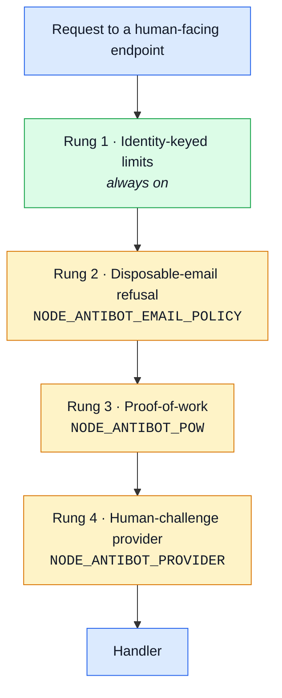

# Anti-automation — asking whether a caller is a person

## The problem

Several endpoints in this API exist for humans. Signing up. Sending a contact message. Asking for
a password reset. Logging in.

Each is a single HTTP request. A script can send it, and a script can send it a million times.
Nothing in the application ever asks whether there is a person on the other end.

What stands in the way today is rate limiting: a bounded number of requests per window, keyed on
the caller's IP address, plus one honeypot field on the contact form — a hidden input a real
browser leaves empty and a careless bot fills in.

**Both defences are weaker than they look.**

Residential proxy pools cost roughly $20 for millions of addresses, and a single IPv6 customer is
allocated 18 quintillion of them. A per-address budget bounds one person on one connection. It
bounds almost nothing about someone who is actually trying. And a honeypot stops only a bot that
does not read the form it is submitting; skipping a hidden field is one line of code.

What that leaves reachable at scale:

| Endpoint       | Abuse                                                                             |
| -------------- | --------------------------------------------------------------------------------- |
| Signup         | Sybil accounts — whatever an account is worth, multiplied                         |
| Contact form   | Spam relay. THIS server sends the mail, so THIS domain's sending reputation burns |
| Password reset | Mail-bombing one victim until the mail provider suspends the sender               |
| Login          | Credential stuffing from leaked username/password lists                           |

## The shape of the answer

Anti-automation is not one control, it is a ladder, and different projects want different rungs. A
boilerplate that hard-wires one vendor makes that vendor every downstream project's problem —
their privacy policy, their accessibility, their outage.

So: **every rung is built, every rung is off by default, and each is switched on by one environment
variable.** A deployment climbs as far as its abuse actually justifies.

This mirrors how payment providers already work here: a port, a no-op implementation that ships in
the box, and a real one swapped in per deployment.

Each rung is independent. Turning on rung 4 does not require rung 3. A rung that is off costs one
boolean read per request and nothing else.

## Rung 1 — Identity-keyed limits (always on, no switch)

The free tier, and the one thing missing today that costs no dependency and no privacy trade.

The credential endpoints already carry a per-account budget alongside the per-address one. Signup
does not — it cannot key on an account that does not exist yet, so it keys on the address alone.

- Key the signup budget on the **submitted email address**, normalised, not only on the caller's
  address. A million proxies do not help someone registering the same mailbox.
- Key the contact form and the reset request the same way.
- Add a **per-address-block** budget (an IPv6 /64, an IPv4 /24) above the per-address one, since a
  /64 is one customer and one customer should not read as 18 quintillion callers.

No configuration. This is what the limits should always have been.

## Rung 2 — Refuse disposable addresses (`NODE_ANTIBOT_EMAIL_POLICY`)

Most throwaway signups come from a few hundred well-known domains.

- `off` (default) — any address accepted.
- `disposable` — refuse a domain on the blocklist.
- `mx` — additionally refuse a domain with no MX record, which catches typo domains and
  never-registered ones.

Kept deliberately small: a blocklist is maintenance, and an aggressive one refuses real people who
use forwarding services for legitimate privacy reasons. `off` by default for exactly that reason.

## Rung 3 — Proof-of-work (`NODE_ANTIBOT_POW`)

The client must burn CPU before the server will consider the request. No vendor, no third-party
script, no personal data leaving the deployment.

- Server issues a short-lived, signed challenge on request.
- Client finds a nonce whose hash meets a difficulty target.
- Server verifies in microseconds and refuses a challenge already spent.

**Be honest about the economics: they run backwards.** A second of work on an attacker's rented
server is far cheaper than a second on an honest visitor's phone. Proof-of-work raises the price of
bulk abuse and taxes real users to do it. It is here because it is the only rung that needs no
third party at all, which for some deployments is the deciding constraint — not because it is the
strongest.

Difficulty is a second variable, so a deployment can dial the tax rather than accept one.

## Rung 4 — A human-challenge provider (`NODE_ANTIBOT_PROVIDER`)

The rung that actually works, and the one a boilerplate must not choose on anyone's behalf.

A port with the same shape as the payment provider port:

- `none` (default) — a no-op that always passes. The demo and every test run through this.
- One real implementation shipped as the worked example, selected by name.

The port is small: issue whatever the client needs to render a challenge, and verify a token the
client returns. Everything vendor-specific — script URL, site key, verification endpoint, scoring
— lives behind it.

What a project must weigh before switching it on, and what the documentation must say plainly:

- a third-party script runs in your pages, and that vendor sees your users' traffic;
- there is a data-protection question to answer, and it is the deployment's to answer;
- challenges are an accessibility cost for real people;
- solver farms exist. This raises the price of abuse; it does not end it.

## Which endpoints each rung guards

Configured per endpoint group, not globally — a challenge on every request is a tax on browsing.

| Group                  | Why                                                                                                   |
| ---------------------- | ----------------------------------------------------------------------------------------------------- |
| Signup                 | The Sybil surface                                                                                     |
| Contact form           | The spam-relay surface                                                                                |
| Password-reset request | The mail-bombing surface                                                                              |
| Login                  | Credential stuffing — but only AFTER repeated failure, so an honest first attempt is never challenged |

Login is the one that needs care. Challenging every login punishes everyone for an attack most
callers are not part of; challenging only after a budget is partly spent puts the cost on the
behaviour rather than on the population.

## What this does not solve

Worth stating so nobody reads the ladder as a finish line.

- A determined attacker with a solver farm passes rung 4.
- None of this helps against a stolen credential that is simply correct.
- Verified email (a separate piece of work) removes most of the _value_ of a fake account, which
  is a different and arguably better lever than making accounts harder to create.

## Sequencing

1. **Rung 1.** No switch, no dependency, no decision. It should have been this way already.
2. **The port and `none`.** Ship the seam with a no-op behind it. Nothing changes behaviour, and
   the integration point exists for whoever needs it under pressure later.
3. **Rung 2.** Small, self-contained, easy to leave off.
4. **Rung 4's reference implementation.** One vendor, documented as an example rather than a
   recommendation.
5. **Rung 3.** Last, because it is the rung whose value is most situational.

## Contract and configuration work

- The environment variables above belong in `.env-example`, terse, with the trade-off named.
- A challenge that must be rendered means the frontend needs to know which rung is active, so the
  active provider's public parameters have to be readable from an endpoint — a contract change,
  which follows the usual fragment → bundle → generate → sync order.
- Every rung needs a test asserting it is OFF by default. A boilerplate that silently enables a
  third-party challenge would be worse than one that ships none.
