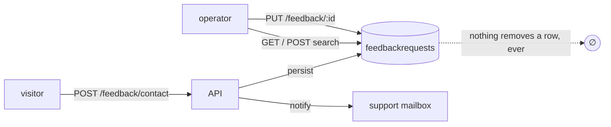

# Feedback: what this module actually is, and the three directions it can go

Written 2026-08-31, prompted by the retention question `CONTRACT_PLAN_POLYMORPHISM.md` parked and
never answered ("feedback has no delete at all, which is a retention question, not a polymorphism
one").

The question that document could not answer, because it is not a contract question:

> **What is this module for, and what does a boilerplate owe it?**

Everything below is measured against that second half. This repo is a **boilerplate**, so the
budget that matters is not money — it is the maintenance a reference implementation can carry
before it stops being a reference and starts being someone else's product.

---

## What it is today

Not user feedback on products. It is the **public contact form**, plus the operator's inbox.

| Piece                    | Where                                        | Note                                                                                     |
| ------------------------ | -------------------------------------------- | ---------------------------------------------------------------------------------------- |
| `POST /feedback/contact` | `routes.ts:25`, above the guard              | **`security: []`** — open to the internet, no account needed                             |
| Everything else          | below `router.use(getAuth, isAuth, isAdmin)` | list, search, `PUT /feedback/{id}` to move a ticket's status                             |
| Stored                   | `model.ts`                                   | `name`, `email`, `subject`, `message`, `adminNotes`, `status`, `respondedAt`, timestamps |
| Status set               | `FeedbackRequestStatus`                      | closed enum, `default: new` — one shared schema, five `$ref`s                            |
| Index                    | `{ status: 1, createdAt: -1 }`               | deliberately none on `email` — the inbox sorts, it does not look up                      |
| Side effect              | `emails.ts`                                  | every accepted submission emails the support mailbox                                     |

That dotted arrow is the whole problem.

---

## Two things that are not directions — they are owed whichever direction you pick

### 1. Nothing can ever delete a row

- No `DELETE /feedback*` exists. Not soft, not hard.
- No TTL index exists anywhere in this repo.
- Account deletion does not touch it — `src/modules/account` has **zero** references to feedback.
  It could not help anyway: most submissions come from people who never had an account.

So an anonymous stranger writes their name, email and free text into your database, and the
system has no mechanism — not even a manual one — to take it back out. That is a GDPR erasure
problem wearing a missing-endpoint costume.

**The cheapest honest fix is two things, and they are not alternatives:**

| Fix                                 | Buys                                                   | Cost                      |
| ----------------------------------- | ------------------------------------------------------ | ------------------------- |
| TTL index on `createdAt`            | tickets age out; the table stops growing forever       | one line in `model.ts`    |
| `DELETE /feedback/{id}`, admin-only | an erasure request has an answer on the day it arrives | one controller, one route |

TTL alone fails an erasure request that arrives on day 1 of a 400-day window. Delete alone lets
the collection grow without bound. Neither is a substitute for the other.

### 2. The public endpoint is an email amplifier

Found while writing this, and it is worth its own line.

`POST /feedback/contact` sends an email on every accepted submission, and carries **only the global
rate limit** — `rateLimiter`, 100/min per IP (`DEFAULT_RATE_LIMIT_MAX`), applied app-wide at
`src/app/security.ts:95`.

Compare the account module. Every endpoint there that sends mail or touches a credential —
`/login`, `/reset`, `/verify-request` — carries `credentialLimiters` on top: **10/min per identity,
30/min per address**.

The contact form sends mail and carries neither. One IP can drive 100 outbound operator emails a
minute, from an endpoint that requires no account. There is no captcha, no honeypot, no
per-endpoint bucket.

**Fix:** put `credentialLimiters` — or a sibling keyed on the submitted email — on
`/contact`. It is one import and one argument, and it is the single highest-value line in this
document.

---

## The three directions

### A — Finish the contact form it already is

Keep the scope. Close the holes. Nothing new on the wire except the delete.

- retention (TTL + `DELETE /feedback/{id}`)
- the rate limiter on `/contact`
- optionally: a honeypot field, and `respondedAt` actually being set when an operator replies
  (today it is a column nothing writes)

**Standard?** Yes — this is what a contact form is, everywhere.
**Quick?** Yes. A day, most of it tests.
**Budget?** The cheapest thing that stops being negligent.

### B — Grow it into a thread

Status triage becomes a conversation: store operator replies, thread them under the ticket, let
`respondedAt` mean something, maybe email the visitor back.

**Standard?** This is where every contact form eventually goes, and also where every contact form
becomes a helpdesk nobody asked for. The honest name for the finished version is Zendesk.
**Quick?** No. New sub-resource, new contract surface, reply authorship, outbound mail to an
address you never verified — which is a deliverability and abuse problem of its own.
**Budget?** Poor. It doubles the module to demonstrate something a boilerplate does not need to
demonstrate.

### C — Delete the module, use a service

Crisp, Formspree, Intercom, Zendesk. The form posts somewhere else; the module and its collection
go away; the PII stops being yours.

**Standard?** Extremely — this is what most teams actually do, and it is the same question
`REINVENTING_THE_WHEEL.md` asks about guards, applied to a feature.
**Quick?** Deleting is quick. But a boilerplate's job is to _show how_, and a boilerplate whose
answer to "handle inbound mail" is "pay someone" has taught nothing.
**Budget?** Best in money, worst in reference value. That trade is the whole decision.

---

## Comparison

|                                   | **A — finish it**                        | **B — thread it**        | **C — outsource it**       |
| --------------------------------- | ---------------------------------------- | ------------------------ | -------------------------- |
| Most standard                     | ✅ for a contact form                    | ✅ for a helpdesk        | ✅ for a real business     |
| Quickest                          | ~a day                                   | ~a week+                 | ~an hour to remove         |
| Best for a _boilerplate's_ budget | ✅                                       | ❌                       | ❌                         |
| Fixes retention                   | ✅                                       | ✅ (still must be built) | ✅ (becomes their problem) |
| Fixes the email amplifier         | ✅                                       | ✅ (still must be built) | ✅                         |
| Teaches something                 | public endpoint + admin gate + retention | ticketing, badly         | nothing                    |

---

## Recommendation

**A, and only A.**

The module is already the right size for what a boilerplate should demonstrate: one public route
above a positional admin gate, a closed status enum shared across five `$ref`s, a cached admin
search with two spellings. That is a good reference. It is not a good reference while it also
demonstrates _collect PII forever with no way to delete it and no brake on outbound mail._

B is a product decision disguised as a feature, and the moment it is finished the correct advice
becomes C.

C is the right answer for a real deployment and the wrong answer for this repo, because the repo's
output is the example.

**Order, if you agree:**

1. `credentialLimiters` on `/contact` — one line, biggest win
2. TTL index on `createdAt`
3. `DELETE /feedback/{id}`, admin-only
4. make `respondedAt` mean something, or drop the field

Steps 1 and 2 are independent and can land in either order. Step 3 is the one that needs a
contract change, so it is the one that needs `contracts:bundle` → `gen:api` → `sync:frontend`.

---

## What NOT to do

- **Do not add three delete spellings** because products/users/orders have them. There is no
  soft-delete tier here and no `hardDelete` to spell three ways —
  `CONTRACT_PLAN_POLYMORPHISM.md`'s trigger rule applies, and symmetry is not a reason.
- **Do not add a `POST /feedback/search` filter set that outgrows the URL.** It already has both
  spellings at 5 filters; that is the sibling doing its job, not an invitation to grow.
- **Do not index `email`.** `model.ts:68` explains why, and an erasure lookup by email is rare
  enough to scan.
- **Do not email the visitor back** without solving verification first. The address is
  self-asserted by an anonymous caller; replying to it turns the form into an open relay for
  whoever puts someone else's address in the box.

---

## Open question

Retention window. A TTL needs a number, and the number is a legal answer, not a technical one —
how long do you claim you need a contact request for? Common answers are 12 or 24 months. Until
that is decided, step 2 is blocked and steps 1, 3 and 4 are not.
