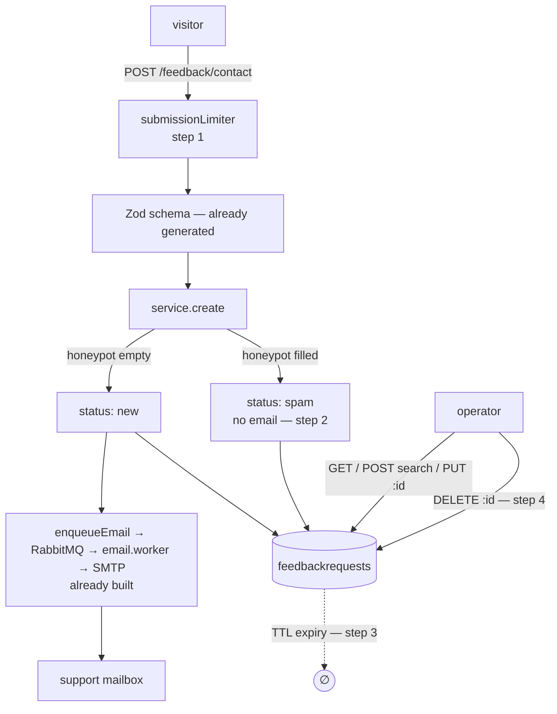

# Feedback: a brake on the mail, and a way out of the database

Plan for closing the two holes `FEEDBACK.md` found — _collect PII forever with no way to delete it,
and no brake on outbound mail_ — without growing the module past what a boilerplate should
demonstrate.

Status: **implemented.** Steps 1–5 are done, `npm run complete` is green (including `regenerate`
run without `--no-sync`, against the frontend checkout at `../boilerplate-vue-frontend`). Not
done: `npm run test:mutation:baseline` — see the note at the end of this file.

Direction: `FEEDBACK.md` option **A**. Four changes, one contract bundle. Everything larger that was
considered is in [Documented upgrades](#documented-upgrades) with the reason it was cut, so the
reasoning survives even though the code does not.

---

## Two corrections to `FEEDBACK.md`

Both found while reading the code for this plan. Both change what the work is.

### 1. `credentialLimiters` does not fix the email amplifier

`FEEDBACK.md` calls this "one import and one argument… the single highest-value line in this
document." The import is right. The limiter is wrong.

```ts
// rate-limit.ts:150 — both halves of the pair
skipSuccessfulRequests: true,
```

That flag is correct for `/login`: only a _failed_ credential attempt spends the budget, so an
office sharing one address is never locked out by people typing their password correctly.

The contact form's abuse is the opposite shape. **Every abusive submission succeeds.** A bot posts
a well-formed body, gets a `201`, sends an operator email, and spends nothing — because the request
succeeded. Mounting `credentialLimiters` on `/contact` would change nothing at all about the
amplifier.

### 2. `respondedAt` is not "a column nothing writes"

`service.ts` already stamps it, once, on the first transition to `resolved`:

```ts
if (nextStatus === FeedbackRequestStatus.resolved && !feedback.respondedAt)
    feedback.respondedAt = new Date();
```

`FEEDBACK.md`'s step 4 is already done. It is struck from this plan.

---

## The target shape



`FEEDBACK.md`'s dotted arrow to nowhere now goes somewhere, twice: on a timer and on demand.

---

## Step 1 — one rate limiter on `/contact`

A new export in `src/infrastructure/http/middlewares/rate-limit.ts`, beside `credentialLimiters`.

**One limiter, not a pair.** The two-bucket design exists because credential stuffing has two
distinct shapes — a botnet spreading guesses at one account, versus one host spraying a user list.
Contact-form spam has one shape: **volume**. A second bucket keyed on the submitted `email` would
key on unvalidated free text that a spammer varies for free, so it would be decorative.

```ts
/**
 * The budget for public submissions that cause an outbound email.
 *
 * Unlike `credentialLimiters`, a SUCCESSFUL request spends it: the abuse here is a well-formed
 * submission repeated, not a failed one. Keyed on the address, since the only identity a
 * contact form carries is free text.
 */
export const submissionLimiter: RequestHandler = rateLimit({
    ...limiterOptions(rateLimitStore('submissions'), true),
    limit: environmentNumber('NODE_SUBMISSION_RATE_LIMIT_MAX', DEFAULT_SUBMISSION_RATE_LIMIT_MAX, 1)
});
```

`DEFAULT_SUBMISSION_RATE_LIMIT_MAX = 5`. A person files a contact request once; five a minute from
one address is already generous, against a global brake of 100.

`audit: true` — a burst of refusals here is the signal that the form is being hammered, exactly as
it is for credentials.

Mounted in `src/modules/feedback/routes.ts`, before the cache middleware:

```ts
router.post('/contact', submissionLimiter, invalidateCache(['feedback']), postFeedbackContact);
```

`NODE_SUBMISSION_RATE_LIMIT_MAX=5` goes in `.env-example` beside `NODE_AUTH_RATE_LIMIT_MAX`
(line 93), with the same one-line _why_ the neighbouring entries carry.

---

## Step 2 — honeypot

A field a human never sees and a bot always fills.

**It must be declared in the contract.** `CreateFeedbackRequest` sets
`additionalProperties: false` and the generated `CreateFeedbackRequestBody` Zod object is strict, so
an _undeclared_ honeypot field is a `422` for everyone — the bot and the real browser sending it
empty. That is not the leak it sounds like: bots read your HTML form, not your OpenAPI document,
and the paired frontend can only send fields the generated client knows about.

```yaml
# src/modules/feedback/openapi.yaml → CreateFeedbackRequest
website:
    type: string
    maxLength: 200
    description: >
        Honeypot. Hidden in the form and always submitted empty by a real client; a non-empty
        value marks the submission as spam. Named for what a scraper expects to find.
```

Not added to `FeedbackRequest` — it is an input signal, never persisted and never returned.

**Disposition: persisted with `status: spam`, no email sent.**

- The enum already has `spam`. Nothing new on the wire.
- A real `201` with a real id goes back, so the bot learns nothing from the response.
- The operator can see what was caught, which is how you find out the honeypot is eating real
  traffic.
- Step 3 expires it.

**The decision belongs in `service.create`, not the controller.** `create` already owns the
notification for the reason its own comment gives — _who gets told is a fact about the ticket_ —
and `side-effects-have-one-layer.test.ts` enforces that the queue job is published from one layer.
So the service reads `payload.website`, chooses the status, and skips the enqueue. The controller
stays as it is.

```ts
const suspectedSpam = Boolean(payload.website?.trim());
```

Trade-off accepted knowingly: this converts an email amplifier into a storage amplifier. Step 1
bounds it, step 3 expires it.

---

## Step 3 — TTL index

Copy `audit-logs/model.ts` — the constant at line 45, the index at line 154, and the caveat comment
at 149 that explains why changing it later needs a migration.

```ts
// src/modules/feedback/model.ts
const retentionDays = environmentNumber('NODE_FEEDBACK_RETENTION_DAYS', 730, 1);

feedbackRequestSchema.index({ createdAt: 1 }, { expireAfterSeconds: retentionDays * 24 * 60 * 60 });
```

**Its own index, not the existing one.** Mongo honours `expireAfterSeconds` only on a **single-field
ascending** index. The existing `{ status: 1, createdAt: -1 }` is compound and descending; attaching
the option there produces an index that silently never deletes anything.

**On the number.** `FEEDBACK.md` parks this as blocking and calls it a legal answer, not a technical
one. It is — but a boilerplate still has to ship a default, and shipping none is what produced the
current situation. **730 days (24 months):** a contact request can be evidence in a commercial
dispute, and 24 months sits inside the common limitation periods. `audit-logs` ships 90 for a
different reason — hot write path, operational signal. Change it with a comment saying why.

**No migration to create it.** Mongoose builds missing indexes on model init; confirm `autoIndex`
is not disabled on the target deployment before relying on that. A migration _is_ required for any
later change to the window, via `collMod` —
`db/migrations/20260808180000-prune-unused-indexes.js` is the house style for touching indexes
outside a schema, down-migration included.

---

## Step 4 — `DELETE /feedback/{id}`

Admin-only, below the guard. One destructive operation, no flag.

**Not `createDeleteController`.** That factory exists for the soft/hard triplet and reads
`hardDelete` from three surfaces. There is no soft-delete tier in this module and none is being
added — `FEEDBACK.md`'s rule holds. Hand-write `controllers/delete-feedback.ts`, matching the
one-file-per-route shape the module's three existing controllers already follow.

The service gains `remove(id, context?)` on the pattern `updateStatusById` already sets: `findById`,
404 through `generateReject` if it misses, then `feedbackRequestRepository.deleteOne(document)`
(already on the shared repository, `create-repository.ts:299`), then emit the audit event.

```yaml
# src/modules/feedback/openapi.yaml → /feedback/{id}, beside the existing `put`
delete:
    tags: [Feedback]
    summary: Delete feedback request
    description: Permanently removes the feedback request identified by `{id}`.
    operationId: deleteFeedbackRequest
    security:
        - bearerAuth: []
    parameters:
        - $ref: '../../../shared/contracts/openapi.root.yaml#/components/parameters/IdPathParam'
    responses:
        '200': { $ref: '../../../shared/contracts/openapi.root.yaml#/components/responses/Success' }
        '401':
            {
                $ref: '../../../shared/contracts/openapi.root.yaml#/components/responses/Unauthorized'
            }
        '403':
            { $ref: '../../../shared/contracts/openapi.root.yaml#/components/responses/Forbidden' }
        '404':
            { $ref: '../../../shared/contracts/openapi.root.yaml#/components/responses/NotFound' }
        '422':
            {
                $ref: '../../../shared/contracts/openapi.root.yaml#/components/responses/ValidationError'
            }
        '500':
            {
                $ref: '../../../shared/contracts/openapi.root.yaml#/components/responses/InternalError'
            }
```

Shared `Success` response and no `HardDeleteParam`/`HardDeleteRequest` — that is what makes this one
spelling rather than three. `deleteOrderById` at `orders/openapi.yaml:224` is the shape to copy
_minus_ the hard-delete surfaces.

One new action in `src/modules/feedback/audit.ts`, by augmentation like the existing two:

```ts
ADMIN_FEEDBACK_DELETED: 'admin.feedback.deleted';
```

**Erasure works through this endpoint.** A GDPR request names an address, not an ObjectId — but the
operator already has `GET /feedback?email=` and `POST /feedback/search`. They search the address,
see the rows, delete them. A dedicated erase endpoint would be a convenience wrapper over a loop,
for something that happens a few times a year.

`email` stays unindexed. `20260808180000-prune-unused-indexes.js` already dropped that index and
explains why — the match is case-insensitive and unanchored, so no B-tree serves it and the
collection is scanned either way. Say so in a comment so nobody "fixes" it.

---

## Step 5 — regenerate, then sync

Steps 2 and 4 both change the wire. One run at the end, not two.

```
npm run regenerate
```

That is the whole command. `scripts/regenerate-artifacts.ts` runs six steps in the only order that
works — `contracts:bundle`, `gen:api`, `gen:asyncapi`, `docs:graph`, `seed:export`, and
**`sync:frontend` last**. Do not run the pieces by hand.

Never hand-edit the root `openapi.yaml` — it is a generated artifact and an edit there is
overwritten on the next bundle.

The catch: `.husky/pre-commit` runs `regenerate --no-sync`, which skips that sixth step. So a
committed, green, `npm run complete`-passing tree can still be paired with a frontend holding the
old client. **This is not finished until `regenerate` has run _without_ `--no-sync`, against the
frontend checkout.**

---

## Tests

**Unit**

- `submissionLimiter`: a **successful** request spends the budget. This is the regression test for
  correction 1 and the most important new test in the plan.
- Honeypot filled → row written with `status: spam`, `enqueueEmail` never called.
- Honeypot empty → normal path, email enqueued.
- `website` never appears on the persisted document or the response envelope.

**Integration**

- TTL index present with the right `expireAfterSeconds`, on a **single ascending** field.
  `audit-logs/tests/unit/schema-contract.test.ts:78-90` is the pattern — it asserts both the option
  and the direction, and the direction is the half that catches the real mistake.
- `DELETE /feedback/{id}` removes the row; unknown id → 404; malformed id → 404, not 500.
- The delete emits `admin.feedback.deleted` with `target_id`.

**Contract**

- New path and field round-trip through `api.contract.test.ts`.
- `contract-search-parity.test.ts` stays green — the two search spellings are untouched.

**Cross-cutting, likely to need attention**

`authenticated-controllers.test.ts` (a new admin controller reading the caller),
`audit-actions.test.ts` (one new action), `write-routes-are-guarded.test.ts` (a new write route),
`contract-error-declarations.test.ts` (declared vs. reachable statuses on the new path).

Then `npm run test:mutation:baseline` — the score will have shifted and the old baseline is a lie.

---

## Docs

- `docs/modules/feedback.md` — the diagram above; the honeypot and its `spam` disposition; why
  erasure goes through search + delete; why `email` stays unindexed.
- `docs/tools/security.md` — a short section under `## The two rate-limit budgets` (line 66)
  making it three, and stating the `skipSuccessfulRequests` difference explicitly. That distinction
  is the trap this whole plan turns on.
- `docs/reference/ops.md` — the retention window, and that changing it needs a `collMod` migration
  rather than a restart.
- `.env-example` — `NODE_SUBMISSION_RATE_LIMIT_MAX=5` and `NODE_FEEDBACK_RETENTION_DAYS=730`, each
  with the one-line _why_.

---

## Things that will bite

1. **`skipSuccessfulRequests`.** Mounting `credentialLimiters` on `/contact` looks like the fix, is
   one import, passes review, and does nothing. Correction 1.
2. **Strict Zod on the honeypot.** An _undeclared_ honeypot field 422s real browsers too. It must be
   in the contract.
3. **TTL on the wrong index.** `expireAfterSeconds` is silently ignored on the existing compound
   `{ status: 1, createdAt: -1 }`. Assert the shape, not just the presence.
4. **Changing the retention window does nothing.** Mongo will not modify an existing TTL index's
   `expireAfterSeconds`. A `.env` edit on a live database is a no-op until a migration runs.
   `audit-logs/model.ts:149` already says this; the same comment belongs here, so the next person
   does not learn it from an empty deletion log.
5. **Spam rows are still rows.** The honeypot trades an email amplifier for a storage amplifier.
   Bounded by step 1, expired by step 3 — but if spam ever swamps real traffic, revisit the
   disposition, not the honeypot.
6. **`sync:frontend` is not optional.** The pre-commit hook's `--no-sync` run leaves it out, so
   everything is green while the frontend still holds the old client.

---

## Open question

**The retention window.** 730 days is the recommendation and the shipped default. Confirm or
replace — it is the one number here that is a business answer, not a technical one, and everything
else in this plan proceeds without it.

---

## Documented upgrades

Considered, deliberately not built. Each is a real option that stopped being worth it at this size.

**Proof-of-work captcha (Cap.js, Apache-2.0).** The honeypot plus step 1's limiter is the 90%; PoW
is the next 9%, and it costs a dependency, a challenge endpoint, a Redis keyspace, a contract field
and a frontend widget. Add it if spam actually arrives — that is when you will also know which
shape it takes.

**A `FeedbackSink` port** (`database` / `email` / `webhook` / `none`, on the pattern of
`src/modules/payments/providers/`). It is the repo's own idiom and it would make the write path
swappable — but the read path is not swappable, so the port needs a `readable()` flag and a `501`
middleware whose only job is to hide that the seam does not fit half the module. When a seam needs a
compensating mechanism, the seam is wrong. Worth revisiting the day a second sink actually exists.

**Anonymization instead of deletion** — null `name`/`email` after N days, keep message, status and
timestamps. Better policy: it preserves ticket history and volume statistics while removing the PII.
It is also the only option here that adds infrastructure, because **this repo has no scheduler** —
cleanup is piggybacked on request paths (`runTokenCleanup` runs during login and refresh) or
exposed as an admin endpoint, and a low-traffic contact form gives a piggybacked job nothing to ride
on. A TTL index is one line that Mongo executes for free. Revisit if a scheduler ever arrives for
another reason.

**A helpdesk in front of the mailbox** — FreeScout (AGPL-3.0) is the light answer, Chatwoot (MIT
core) if live chat and a help center are also wanted, Zammad (AGPL-3.0) if there are real agents.
All three ingest plain email, so this is a deployment decision with **zero code impact**: point one
at whatever `NODE_CONTACT_NOTIFY_EMAIL` already resolves to. Nothing in this repo needs to know.

The one mail-layer requirement that _is_ worth writing down: **SPF, DKIM and DMARC on the sending
domain.** Since the 2024 Gmail/Yahoo bulk-sender rules an unauthenticated notification is a
notification in the spam folder, which is the same as having no ticketing at all. That is DNS
configuration, not a service to run.

---

## Out of scope, deliberately

- **Reply threading in this database.** A helpdesk's job, and it does it better than this module
  will. The moment it is built here, the correct advice becomes "use the helpdesk."
- **Emailing the visitor back.** Unverified, self-asserted address — an open relay for whoever types
  someone else's address in the box.
- **A form builder** (OpnForm, Formbricks, Typebot, HeyForm). They solve _"non-developers need to
  make forms."_ There is one form here and the codebase is contract-first. Wrong tool.
- **A second or third delete spelling.** No soft-delete tier exists here and none is being added.
- **Growing `POST /feedback/search`.** Five filters and two spellings is the sibling doing its job.
- **`respondedAt` work.** Already correct — correction 2.

---

## Order of work

| #   | Step                                                    | Contract change? |
| --- | ------------------------------------------------------- | ---------------- |
| 1   | `submissionLimiter`, mounted on `/contact`              | no               |
| 2   | Honeypot field + `spam` disposition in `service.create` | yes              |
| 3   | TTL index + `NODE_FEEDBACK_RETENTION_DAYS`              | no               |
| 4   | `DELETE /feedback/{id}` + `admin.feedback.deleted`      | yes              |
| 5   | `npm run regenerate` (without `--no-sync`)              | —                |

Step 1 is independent of everything else and can land alone: it is the live bug.

---

## Implementation note

Everything above landed as specified, with one deliberate omission: `npm run test:mutation:baseline`
was not run. It requires a full `npm run test:mutation` first, which is an unbounded, sometimes
OOM-prone Stryker run across the whole `src` tree (`docs/tools/mutation-testing.md` documents the
failure mode) — not something to kick off unattended in the same pass as everything else here.
Every touched file that already has unit-level coverage (`rate-limit.ts`'s `isMetricsScraper`) is
unaffected; the feedback module's own files (`service.ts`, `model.ts`, `routes.ts`, the
controllers) were already recorded at 0% in `mutation-baseline.json` before this work, because they
are exercised by the integration and contract suites, which Stryker's config excludes — so the new
code follows the same, already-accepted pattern rather than introducing a new gap. Run
`npm run test:mutation -- --mutate 'src/modules/feedback/**/*.ts,src/infrastructure/http/middlewares/rate-limit.ts'`
followed by `npm run test:mutation:baseline` to record fresh scores when there's time to watch it.
