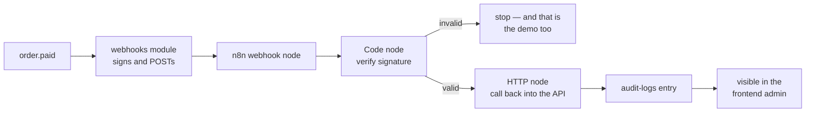

# n8n as the Integration Showcase

Split out of `OUTBOUND_WEBHOOKS.md`. **Deferred, not rejected.** `webhook-tester` ships first and
covers the everyday need; this document is what we would do if and when we want the second half.

Delete this file when the work has landed, or when we decide it never will.

---

## Status

|            |                                                                                                                 |
| ---------- | --------------------------------------------------------------------------------------------------------------- |
| Decided    | `webhook-tester` is the default sink. It is in `docker-compose.yml` now, behind `--profile integrations`.       |
| Deferred   | n8n, everything in this document.                                                                               |
| Blocked on | Item 7 of `PRODUCTION_READINESS.md` — the `api-keys` module. See [The loop needs a key](#the-loop-needs-a-key). |

---

## Why n8n at all, when webhook-tester exists

They answer different questions, and only one of them is interesting.

- **webhook-tester answers "did we send it, and what did it look like?"** It captures the request
  and shows the headers. That is the everyday development need, and it is enough for ninety percent
  of sessions.
- **n8n answers "can a real consumer actually use this?"** That is a different claim, and no sink we
  point at ourselves can make it. `OUTBOUND_WEBHOOKS.md` names Zapier, n8n and Make as the audience
  for the whole feature; demonstrating against one of them is **proof**, where a sink of our own
  choosing is a rehearsal.

The second claim is worth something exactly once — when the feature is new and nobody believes it
yet. After that it is furniture. Which is the argument for building it eventually and not first.

### The part that is genuinely useful

n8n does **not** verify Standard Webhooks signatures natively. A consumer has to write a Code node
that does it.

That is the feature, not the friction. The node becomes copy-pasteable documentation of "here is
how you consume our webhooks", written in the environment the consumer is already in — worth more
than the same twenty lines in a `docs/` page, because it demonstrably runs.

---

## The licence, stated accurately

n8n is **fair-code** under the Sustainable Use License, not OSI open source. The commonly repeated
version of this — "not for commercial use" — is wrong, and wrong in the direction that scares off
people who are entirely in the clear.

The actual grant (verified against `LICENSE.md` in `n8n-io/n8n`):

|                  |                                                                                         |
| ---------------- | --------------------------------------------------------------------------------------- |
| Allowed          | Use for **your own internal business purposes** — including inside a for-profit company |
| Allowed          | Modifying it for that internal use                                                      |
| Not allowed      | Offering n8n itself to your users as a service, or charging anyone for it               |
| Not allowed      | Redistributing it, except free of charge and for non-commercial purposes                |
| Separate licence | Files marked `.ee.` require an n8n Enterprise Licence                                   |

The line is **internal use versus reselling**, not commercial versus non-commercial.

### Why no README warning is planned

A compose service **references** an image; it does not vendor or redistribute one. Nothing in this
repository contains n8n, and `podman compose pull` fetches it from a registry under whatever terms
bind the person running it. The distribution clause is never engaged by anything we ship.

So the decision is: **no warning in `README.md`.** One line on the tool's own docs page is enough,
for the reader deciding whether to enable the profile — not as a caution, as a fact about a
dependency, the same way any other licence is recorded.

---

## Shape in this repo

Identical in kind to `webhook-tester`, which is the point: the pattern is already established and
this adds no new one.

- One service in `docker-compose.yml`, on the **same** `integrations` profile. A plain `up` is
  unchanged.
- SQLite storage, so no second database container.
- A seeded workflow JSON, mounted read-only, so the demo exists on first boot without anyone
  importing anything by hand.
- **Nothing under `src/`.** No import, no `requiredConfig` entry, no reference by name. The
  application cannot tell whether n8n is running.
- One port from this repo's `3000-3099` block, recorded in `docs/tools/pairing-and-ports.md` like
  every other.

---

## The closed loop

The demo worth building is circular, because a one-way arrow is what `webhook-tester` already
shows.

The callback writes an **audit-log entry**. Chosen because that module already exists, the write is
harmless, and the result surfaces somewhere a person can look without a database client.

### The loop needs a key

For n8n to call **back** into the API it needs a credential. That is item 7, the `api-keys` module.

Which means one workflow ends up demonstrating machine-to-machine authentication in both
directions at once — our signature going out, their API key coming in. That is a better
demonstration than either half alone, and it is the concrete reason this waits.

It also answers question 5 of `OUTBOUND_WEBHOOKS.md` without needing a separate opinion: webhooks
follow API keys, because the demo we actually want does not exist before them.

---

## Keeping it out of the product

The rule, and the four ways it gets broken:

| Failure                                                   | Guard                                                                 |
| --------------------------------------------------------- | --------------------------------------------------------------------- |
| A test points at the n8n container                        | Tests use their own throwaway HTTP listener. Never a compose service. |
| A seeded subscription URL survives into production config | The seed reads an env var that is unset by default.                   |
| The workflow accumulates real business logic              | It is demo furniture, reviewed as such. Logic belongs in a module.    |
| `requiredConfig` grows an n8n entry                       | It must not. The module boots with no sink configured.                |

The precedent is already in the tree: `src/infrastructure/adapters/demo-outbox.ts` is demo-only
infrastructure, inert unless `NODE_DEMO=true`, and it has not leaked into anything.

---

## Cost, honestly

|                     |                                                                                                                 |
| ------------------- | --------------------------------------------------------------------------------------------------------------- |
| One compose service | ~15 lines, same shape as `webhook-tester`                                                                       |
| One workflow JSON   | Hand-built once, then static                                                                                    |
| One docs page       | `docs/tools/` has one per container; this is the house rule, not extra                                          |
| Two table rows      | The port map, and the container reference                                                                       |
| Image size          | Substantially larger than `webhook-tester`'s scratch image — the reason it is profile-gated rather than default |

No new dependency in `package.json`. No contract change. No `src/` change.

---

## Questions, for when this is picked up

1. **Is the loop still worth it once `webhook-tester` has been in use for a while?** The honest
   answer may be no — that the everyday sink is sufficient and this was novelty. Worth asking
   before building rather than after.
2. **Does the seeded workflow ship in the repo, or is it a `docs/` snippet someone imports?**
   Shipping it is more impressive and one more thing to keep working.
3. **Same profile as `webhook-tester`, or its own?** Same is simpler; separate lets someone take
   the small sink without the large one.
