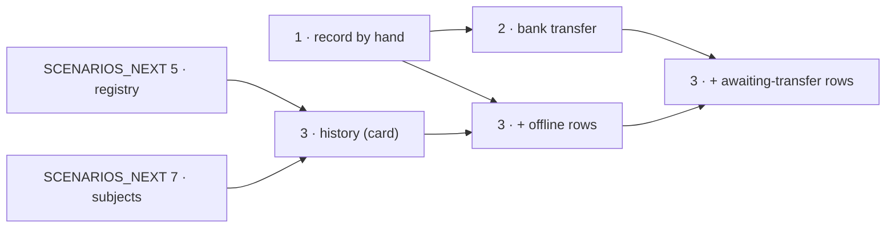

# Offline payments and a shop with a real past

Three things, in order:

1. an admin can record money that arrived outside the card provider — cash, a transfer, anything
2. a customer can choose **bank transfer** at checkout, and the order waits for it
3. the demo shop gets realistic paid / shipped / refunded history, produced by driving the real
   flows — card payments first, then offline and transfer ones as 1 and 2 land

Born from the scenarios plan's "flow-driven slices" question on 2026-09-11. The shop is a demo of
a **real** ecommerce, not scaffolding — so realistic history, and the feature it needs, are in
scope.

Payments run on the `fake` provider stub. Everything here works with it, and with a real PSP later.

This file is the index. Each numbered file holds one category and ends with an `## Answer` list.

## Start here

| #   | File                                                             | What                                                      | Blocks                             | Status                   |
| --- | ---------------------------------------------------------------- | --------------------------------------------------------- | ---------------------------------- | ------------------------ |
| 1   | [Record by hand](OFFLINE_PAYMENTS_1_RECORD_BY_HAND.md)           | admin records an offline payment on a pending order       | 2, the offline rows of 3           | done, backend + frontend |
| 2   | [Bank transfer at checkout](OFFLINE_PAYMENTS_2_BANK_TRANSFER.md) | customer picks transfer; the order waits days, not 30 min | the awaiting-transfer rows of 3    | decided, not done        |
| 3   | [Realistic history](OFFLINE_PAYMENTS_3_REALISTIC_HISTORY.md)     | flows once per boot, restored from memory                 | deleting `scenarios/audit-logs.ts` | decided, not done        |

## Order of work

- **3 does not wait for 1.** Card-paid history needs only the `SCENARIOS_NEXT` groundwork.
- **2 is built on 1.** The admin's "money arrived" action is the same endpoint in both.

## Decided on 2026-09-11

| Decision                                           | Why                                                                                    |
| -------------------------------------------------- | -------------------------------------------------------------------------------------- |
| both: admin records first, checkout transfer after | asked — the user's answer                                                              |
| record a **payment**, never flip the order status  | keeps "money moved iff the order says `paid`"; stock, events, emails all fire as usual |
| history: flows once per boot, restore from memory  | the only option that makes restores cheaper — see 3                                    |

The smaller decisions sit in each file, under `## Decided`.

## Answer

- [x] Scope: admin records first, then bank transfer at checkout — answered 2026-09-11
- [x] File 2: add `ibantools` for IBAN validation at boot — answered 2026-09-11. Documented under
      [DEPENDENCY_DOCS](DEPENDENCY_DOCS.md)'s rule
