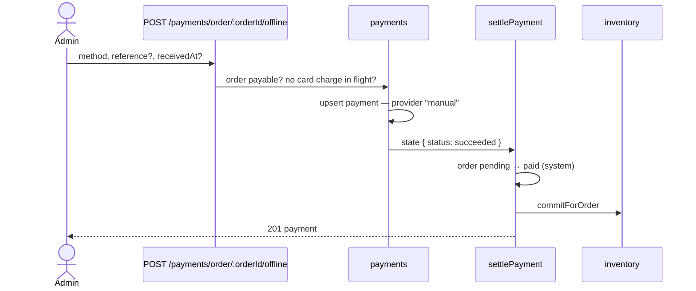

# Offline payments — 1. Record a payment by hand

Back to the [index](OFFLINE_PAYMENTS.md).

**What:** an admin, on a `pending` order, records that the money arrived another way — cash at the
counter, a phone order paid by transfer, anything the card provider never saw.

**Blocks:** [2](OFFLINE_PAYMENTS_2_BANK_TRANSFER.md) (its "transfer arrived" button is this
endpoint) and the offline rows of [3](OFFLINE_PAYMENTS_3_REALISTIC_HISTORY.md).

## What exists today

Read on 2026-09-11.

| Fact                                                            | Where                                                         |
| --------------------------------------------------------------- | ------------------------------------------------------------- |
| one payment document per order — `unique` on `orderId`          | `payments/model.ts:55-60`                                     |
| `settlePayment` is the one place money is reconciled            | `payments/services/settlement.ts:91-184`                      |
| `pending → paid` is a `system`-only move — no admin may make it | `orders/domain/lifecycle.ts:25-27`                            |
| settlement commits the stock hold, then emits the events        | `settlement.ts:170-180`                                       |
| a refund asks the **configured** provider, not the row's own    | `payments/services/refunds.ts` → `resolvePaymentProvider()`   |
| a refund of a payment with no `providerRef` logs "corrupted"    | `refunds.ts:46-57`                                            |
| the provider port is card-shaped: prepare, confirm, retrieve    | `payments/providers/index.ts:65-120`                          |
| `payments.manage` is held by `moderator` and `owner`            | `shared/authorization-roles.yaml:101-111`                     |
| an unpaid order's hold lasts `NODE_RESERVATION_TTL_MINUTES`, 30 | `inventory/config.ts:20`; the sweep is triggered from outside |

## Design

- **The admin records a payment. Settlement moves the order.** Same code path as a card, so the
  stock commits, `ORDER_STATUS_CHANGED` and `PAYMENT_SUCCEEDED` fire, webhooks and emails follow.
- **`manual` is not a port implementation.** The port is card-shaped; a `manual` adapter would be
  three methods that throw. Instead the offline path writes the row and calls `settlePayment`.
- **Refunds dispatch on the payment's own `provider`.** Today they ask whichever provider is
  configured — wrong for `manual`, and wrong for any deployment that changes provider. A `manual`
  refund moves the status, calls nothing, and marks it "return the money by hand".

## Contract

In `src/modules/payments/openapi.yaml`, then the `CLAUDE.md` order.

| Change                                       | Shape                                                                                   |
| -------------------------------------------- | --------------------------------------------------------------------------------------- |
| new `POST /payments/order/{orderId}/offline` | body `{ method, reference?, receivedAt? }` → `201 Payment`                              |
| `method`                                     | `bank_transfer` \| `cash` \| `other`                                                    |
| `reference`                                  | free text, ≤ 120 chars — a bank transaction id, a receipt number                        |
| `receivedAt`                                 | date-time, not in the future; default now                                               |
| `Payment` gains `method`                     | `card` \| `bank_transfer` \| `cash` \| `other`; the card path writes `card`             |
| `Payment` gains `reference`, `receivedAt`    | offline payments only                                                                   |
| `Payment` gains `refundedByHand`             | `true` on a refunded `manual` payment — the UI shows "return the money to the customer" |
| `provider` description                       | `fake`, `manual`, or a real PSP's name                                                  |

## Decided

| Question                                                       | Decision                                                                                                                                      |
| -------------------------------------------------------------- | --------------------------------------------------------------------------------------------------------------------------------------------- |
| permission                                                     | `payments.create`, fresh auth (`REAUTH_TIME_CRITICAL`) like the refund. Moderators get it through `payments.manage` — the audit row names who |
| amount                                                         | always the order total. Partial and over-payments are out of scope — handled by hand, off-system                                              |
| an existing card payment `requires_confirmation` or `declined` | allowed: nothing was charged. The row becomes the offline one                                                                                 |
| an existing card payment `requires_action` or `processing`     | **409**: money may be moving at the provider — recording it too could charge twice                                                            |
| order not `pending`                                            | 409 `PAYMENT_ORDER_NOT_PAYABLE`, as the intent already answers                                                                                |
| recorded twice                                                 | the second is 409 — settlement is already at-most-once                                                                                        |
| audit                                                          | `payment.recorded_offline`: actor, method, reference                                                                                          |
| a long wait (a transfer arranged by email)                     | not here. The 30-minute hold still applies; [2](OFFLINE_PAYMENTS_2_BANK_TRANSFER.md) fixes it                                                 |

## Work

Backend:

- [x] contract, per the table; `npm run regenerate`
- [x] `recordOfflinePayment` in `payments/services/offline.ts`; controller and route
- [x] refunds dispatch on `payment.provider`; `manual` → status only, `refundedByHand: true`
- [x] the intent path writes `method: 'card'`
- [x] audit action, analytics event, locale strings (`en`, `it`)
- [x] `docs/modules/payments.md`: an "Offline payments" section, the status table updated

Frontend (its own repo — `boilerplate-vue-frontend`, `offline-payments` branch):

- [x] `OrderEdit.vue`: "Record offline payment" — method, reference, date received
- [x] `PaymentPanel.vue`: shows method and reference; a `refundedByHand` notice

Tests, through the route (`src/modules/payments/tests/integration/`):

- [x] records → order `paid`, stock committed, payment `manual` with its method
- [x] refused: order not pending; card payment in flight; no permission; recorded twice
- [x] cancelling an offline-paid order → payment `refunded`, `refundedByHand`, no provider call
- [x] a card refund still reaches the card provider, whatever `NODE_PAYMENT_PROVIDER` says now

## Answer

- [x] Record a payment, never flip the status — decided 2026-09-11
- [ ] Veto any row under `## Decided` — none yet
