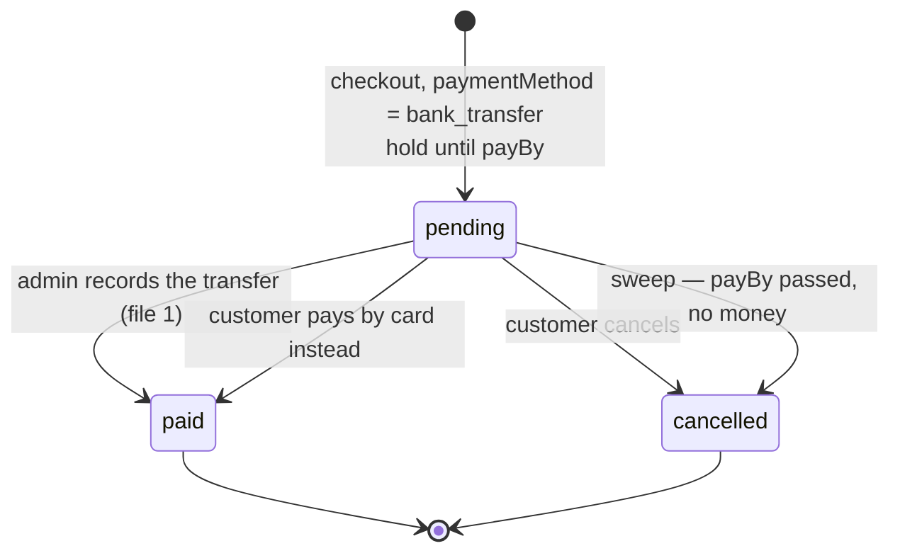

# Offline payments — 2. Bank transfer at checkout

Back to the [index](OFFLINE_PAYMENTS.md).

**What:** at checkout the customer picks **bank transfer**. The order waits, with its stock held,
for days rather than 30 minutes. The admin confirms with [1](OFFLINE_PAYMENTS_1_RECORD_BY_HAND.md)'s
endpoint when the money shows up.

**Needs:** [1](OFFLINE_PAYMENTS_1_RECORD_BY_HAND.md).

## Flow

- The order carries the **chosen** method. It is a preference, not a lock: the card form stays
  offered, and a card payment settles as usual.
- The hold's expiry follows the method. The existing sweep needs no change — it already reads
  each hold's own expiry.
- Past `payBy` with no money: the sweep releases the stock and cancels, as for a card order today.

## Contract

| Change                                 | Shape                                                                                                     |
| -------------------------------------- | --------------------------------------------------------------------------------------------------------- |
| checkout body gains `paymentMethod`    | `card` \| `bank_transfer`, default `card`                                                                 |
| `Order` gains `paymentMethod`, `payBy` | `payBy`: when the hold ends                                                                               |
| `Order` gains `transferInstructions`   | `{ beneficiary, iban, bic?, reference }` — only on a pending transfer order, only for its owner and staff |
| new `GET /payments/methods`            | public; which methods this deployment offers, so the frontend hard-codes none                             |

`reference` is the order number — what the customer types in the transfer's description.

## Decided

| Question                     | Decision                                                                                                                                                |
| ---------------------------- | ------------------------------------------------------------------------------------------------------------------------------------------------------- |
| hold length                  | `NODE_BANK_TRANSFER_HOLD_HOURS`, default 168 (7 days)                                                                                                   |
| bank details                 | env: `NODE_BANK_TRANSFER_BENEFICIARY`, `_IBAN`, `_BIC`. Transfer is offered only when set                                                               |
| stock hoarding               | a 7-day hold is free to take. Cap: `NODE_BANK_TRANSFER_MAX_OPEN_PER_ACCOUNT`, default 2 open transfer orders. Checkout already needs a verified account |
| emails                       | one with the instructions and the deadline at checkout; one when the sweep cancels for no transfer. The paid email already exists                       |
| admin screen                 | an "awaiting transfer" filter on the orders list; "Record offline payment" preset to `bank_transfer`                                                    |
| reminder before the deadline | not now — it needs a scheduler the app does not ship                                                                                                    |
| IBAN validation              | `ibantools` — see below                                                                                                                                 |

## The library: `ibantools`

Added on 2026-09-11. `CLAUDE.md` forbids hand-rolled validation, and a mistyped IBAN in `.env` sends
every customer's money to the wrong account.

| Check (per `docs/tools/dependency-vetting.md`) | Result, `npm view` on 2026-09-11       |
| ---------------------------------------------- | -------------------------------------- |
| version, last publish                          | 4.5.4, 2026-04-10                      |
| licence                                        | MIT or MPL-2.0                         |
| types                                          | bundled (`build/ibantools.d.ts`)       |
| transitive weight                              | **zero dependencies**, 184 KB unpacked |
| telemetry                                      | grep at install, per the vetting rules |

- **Owned by `payments`** — the only importer. Per [DEPENDENCY_DOCS](DEPENDENCY_DOCS.md), the first
  library added under the new rule: a `## Libraries` section on `docs/modules/payments.md`, and its
  row in `scripts/docs/dependency-groups.ts`.
- Used at boot only: normalise with `electronicFormatIBAN`, then `isValidIBAN`, and `isValidBIC`
  when `_BIC` is set. A bad value refuses the boot with the variable's name.
- Also serves the display: `friendlyFormatIBAN` for the instructions the customer copies.

## Work

Backend:

- [x] contract, per the table
- [x] checkout: validate the method against `GET /payments/methods`; the hold's expiry from it
- [x] the open-transfer cap, refused at checkout with its own error code
- [x] `transferInstructions` in the order serializer — computed at read time, not frozen onto the
      order; scoped to owner and staff by the same `callerScope` every order read already goes
      through, so no extra field-level redaction was needed
- [x] two emails, `en` and `it`
- [x] add `ibantools`; run the vetting rules at install (weight, telemetry grep) — matches the
      table above, confirmed again at install time
- [x] config gate: `_IBAN` set means `_BENEFICIARY` must be too; validate the IBAN and BIC at boot
      with `ibantools` — via a new `customCheck` hook on `AppModule`/`RequiredConfig`, since no
      module had a boot-time check beyond a declarative one before this
- [x] `docs/modules/payments.md` `## Libraries`: why `ibantools` — its row in the generated
      dependency map needed no hand-kept entry at all: [DEPENDENCY_DOCS](DEPENDENCY_DOCS.md)
      landed first, and `ibantools` fell straight into "owned by a module" as the single-importer
      case that generator exists to catch
- [x] docs: `docs/modules/payments.md` and `docs/modules/inventory-reservations.md` — the per-method hold

Frontend:

- [ ] checkout: a method choice, when `GET /payments/methods` offers more than card
- [ ] order page: the instructions, the reference, the deadline — copyable
- [ ] admin orders list: the "awaiting transfer" filter

Tests:

- [x] a transfer checkout holds until `payBy`, not 30 minutes
- [x] the sweep before `payBy` leaves it; after, cancels it and releases the stock
- [x] the cap refuses a third open transfer order
- [x] instructions are served to the owner and staff, never to another customer — inherited from
      `callerScope`, verified by the existing order-visibility suite rather than re-asserted here
- [x] transfer not configured → `GET /payments/methods` offers card only, checkout refuses `bank_transfer`

## Answer

- [x] IBAN validation at boot: add `ibantools` — answered 2026-09-11
- [x] `orders` may not import `payments` (the reverse edge would cycle) — the beneficiary/IBAN/BIC
      getters live in `@infrastructure/adapters/bank-transfer` instead, ibantools-free, so both
      modules reach them without one depending on the other — resolved during implementation,
      2026-09-12
- [x] the boot-check design question (extend `RequiredConfig`, or hardcode in the kernel) — asked
      and answered: a new `customCheck?: () => string[]` on `AppModule`, run by
      `assertRequiredConfig` — 2026-09-12
- [ ] Veto any row under `## Decided` — none yet
