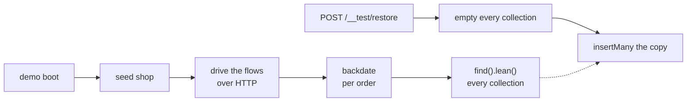

# Offline payments — 3. A shop with a real past

Back to the [index](OFFLINE_PAYMENTS.md).

**What:** `inventory`, `payments` and `delivery` have no seeded slice — their states are reachable
only by driving the app. Drive it: log in, check out, pay, ship, refund — so every row in the demo
shop is one the application itself produced.

**Needs:** from `SCENARIOS_NEXT` — [5](SCENARIOS_NEXT_5_STRUCTURE.md) (the registry) and
[7](SCENARIOS_NEXT_7_GUARANTEES_FRONTEND.md) (subjects). Card history needs nothing from
[1](OFFLINE_PAYMENTS_1_RECORD_BY_HAND.md) or [2](OFFLINE_PAYMENTS_2_BANK_TRANSFER.md); their rows
join when they land.

Already in place, from `aaf4789c`: a restore empties the database and never drops it (one
`emptyDatabase()`), and restores are serialised by one queue in `src/app/demo.ts`. The
restore-from-memory path below **relies on that queue** — two overlapping `insertMany`s of the copy
would collide on `_id`.

This was the scenarios plan's "flow-driven slices" question; its option C is the one decided here.

## Where the flows run — decided: once per boot, restored from memory

A flow is slow and **not idempotent** — checking out twice makes two orders. And `shop` is seeded
on every container boot and every e2e restore. So:

| Runner           | What it does                                                                                                                     |
| ---------------- | -------------------------------------------------------------------------------------------------------------------------------- |
| demo profile     | seeds, drives the flows against **itself**, keeps the copy. A restore is plain inserts: no bcrypt, no flows                      |
| `scenario:apply` | boots the app in-process on a loopback ephemeral port and drives the same runner. Refuses a non-empty database without `--reset` |

**This reverses a deliberate choice.** `scenarios/apply.ts:36-43` avoids importing the app today;
booting it in-process means `apply.ts` now does. Say so in its docblock when the change lands.

Why a restore should get **faster**, measured 2026-09-11: `shop` restores in 0.58 s, `blank` in
0.15 s. The likely bulk, by reading only, is 14 bcrypt cost-12 hashes per `shop`
(`src/modules/users/model.ts:598-600`) — which a restore from the copy skips.

The options not taken, for the record:

| Option                                  | Why not                                                                                        |
| --------------------------------------- | ---------------------------------------------------------------------------------------------- |
| a separate `history` scenario           | two furnished shops to keep coherent; a spec wanting a paid order must restore a different one |
| flows inside `shop`, skipped if present | every restore pays for every flow; per-flow detection                                          |

## The history to produce

Staff actions by `root` (owner); customers by the customer account and the filler users.

| Row                                                    | How                                                                              | Subject (for 7)                    |
| ------------------------------------------------------ | -------------------------------------------------------------------------------- | ---------------------------------- |
| opening stock, per product                             | `POST /inventory/receipts` — before any checkout. Products seed `onHand: 0`      | —                                  |
| pending, holding stock                                 | checkout, nothing more                                                           | `order.ownerPending`               |
| paid by card                                           | checkout → intent → confirm `pm_card_visa`                                       | `order.paid`                       |
| declined, then paid                                    | confirm `pm_card_declined`, then `pm_card_visa`                                  | —                                  |
| paid after a challenge                                 | `pm_card_authentication_required` → `/sync`                                      | —                                  |
| processing, shipped, in transit, delivered             | admin `PUT /orders/:id` through the **real** lifecycle; `POST /delivery/advance` | `order.shipped`, `order.delivered` |
| cancelled by the customer                              | checkout → cancel — the stock comes back                                         | `order.cancelled`                  |
| paid, cancelled, refunded                              | pay → admin cancel → the listener refunds                                        | `payment.refunded`                 |
| soft-deleted                                           | admin `DELETE /orders/:id`                                                       | `order.softDeleted`                |
| paid offline (after 1)                                 | `POST /payments/order/:id/offline`, `cash`                                       | `order.paidOffline`                |
| awaiting transfer (after 2)                            | checkout with `bank_transfer`                                                    | `order.awaitingTransfer`           |
| a product edited, a locale entry edited, a user banned | the admin routes                                                                 | —                                  |

The last row plus the checkout and refund rows cover all five audit entries — so
`scenarios/audit-logs.ts` and the static history in `scenarios/orders.ts` are deleted. Until then,
[SCENARIOS_NEXT 6](SCENARIOS_NEXT_6_SEEDED_DATA.md) D2 corrects the static audit rows.

## Decided

| Question                                    | Decision                                                                                                                                                              |
| ------------------------------------------- | --------------------------------------------------------------------------------------------------------------------------------------------------------------------- |
| driven over HTTP or through services        | HTTP — the audit rows, actor scopes and events are then the real ones                                                                                                 |
| every row dated boot time                   | **backdate per order** after the flows: the order, its payment, shipment, movements and audit rows shift together by that order's offset, spread over the past months |
| order ids are no longer pinned              | subjects for flow rows are recorded by the runner at boot and served by `GET /__test/scenario`; pinned products stay in `subjects.ts`                                 |
| client collections need an order id         | they chain a list request and take the id from it, instead of a literal                                                                                               |
| in-process state the copy cannot hold       | the fake provider's memory: no payment is left in flight. The locale overlay: already refreshed after every restore (`aaf4789c`)                                      |
| `_id` time vs backdated `createdAt`         | check at implementation: orders sort by `DEFAULT_SORT` — confirm it is not `_id`                                                                                      |
| live e2e resets with `scenario:apply:reset` | pays for the flows per reset. Accepted — the live profile is not the fast one                                                                                         |

## Research, re-verified 2026-09-11

| Question                   | Answer                                                                                                                                                                                                                                                                                                                                                                                                       |
| -------------------------- | ------------------------------------------------------------------------------------------------------------------------------------------------------------------------------------------------------------------------------------------------------------------------------------------------------------------------------------------------------------------------------------------------------------ |
| driving the app in-process | supertest or a loopback port. `NODE_ENV=test` stops auto-listen (`src/app.ts:193`), but a script also needs what `tests/support/setup.ts` does: i18n before any Zod message thunk (`:1-23`) and raised rate limits (`:45-121`)                                                                                                                                                                               |
| checkout                   | `POST /cart/checkout` (`src/modules/cart/routes.ts:37,44-50`): `isAuth` + fresh + verified. A real login counts as fresh; the named accounts are verified                                                                                                                                                                                                                                                    |
| payment                    | `POST /payments/intent { orderId }` → `POST /payments/:id/confirm { paymentMethodRef }`. Fake methods (`payments/providers/fake.ts:29-52`): `pm_card_visa` succeeds, `pm_card_declined` 409, `pm_card_authentication_required` → `requires_action` then `/sync`, `pm_card_processing`. Fake outcomes live in process memory. Refund: `POST /payments/order/:orderId/refund`, needs `payments.update`         |
| shipment                   | settlement moves `pending → paid` (`settlement.ts:121-127`). Admin `PUT /orders/:id` (`orders/routes.ts:66`) to `processing`, then `shipped` (`orders/domain/lifecycle.ts:29-36`); `orders/services/crud.ts` emits `ORDER_STATUS_CHANGED`; `delivery` ships on `shipped` (`delivery/module.ts:31`). The contract test's `updateStatusIfIn(['pending'], 'shipped')` breaks the lifecycle — **do not copy it** |
| advancing a shipment       | `POST /delivery/advance` — no body, one global tick. Needs `delivery.update`                                                                                                                                                                                                                                                                                                                                 |
| inventory                  | `POST /inventory/receipts { productId, quantity }`, `POST /inventory/adjustments { productId, delta, note? }`. Needs `inventory.create`                                                                                                                                                                                                                                                                      |
| who drives                 | `root` (owner). `all.manage` expands over every declared tenant key (`src/kernel/ability.ts:10-11`). `a12c0def`'s fail-closed branch bites only a `.manage` check on a family with no concrete write — inventory, delivery, payments and orders all have one, so it never blocks the runner                                                                                                                  |

## Work

- [x] the flow runner: `scenarios/flows/` — `client.ts` (one signed-in caller), `actions.ts` (the
      verbs), `shop-history.ts` (the story), `loopback.ts` (the throwaway listener)
- [x] products seed `onHand: 0`; opening receipts come from the runner — closes SCENARIOS_NEXT 6 D4
- [x] the backdating pass — `scenarios/flows/backdate.ts`, six collections per order
- [x] the in-memory copy and the restore-from-copy path in `src/app/demo.ts`
- [x] `scenario:apply`: in-process app on loopback; the empty-database guard; `--describe-to=<file>`
- [x] subjects: runner-recorded ids merged into `GET /__test/scenario`; the shop test checks each
- [x] client collections: `{{orderId}}`, a collection variable, plus a probe that fetches the list
- [x] delete `scenarios/audit-logs.ts`, `scenarios/orders.ts` and `scenarios/cart.ts`
- [x] re-measure — see below

Two things the plan did not foresee, decided at implementation:

| Found                                                                    | Done                                                                                                                                     |
| ------------------------------------------------------------------------ | ---------------------------------------------------------------------------------------------------------------------------------------- |
| a checkout EMPTIES the cart, so `scenarios/cart.ts`'s rows were wiped    | the four baskets are filled by the runner too, last, through `POST /cart`. `scenarios/cart.ts` deleted                                   |
| `marcus` was seeded `active: false`, so the runner could not sign him in | seeded active; the owner bans him through `PUT /users/{id}` after his two orders, which is what produces the `admin.user.banned` row     |
| `bank_transfer` was configured nowhere, so `order.awaitingTransfer` 409s | `.env-example`, `run-server.ts` and `tests/support/setup.ts` all name a beneficiary and IBAN; the runner refuses to build a shop without |

## Measured, 2026-09-13

| Thing                                | Before | After                     |
| ------------------------------------ | ------ | ------------------------- |
| `shop` restore                       | 0.58 s | **~0.012 s**              |
| `blank` restore                      | 0.15 s | **~0.006 s**              |
| demo boot to listening               | ~1 s   | **~2.9 s**, 326 requests  |
| `tests/integration/.../shop.test.ts` | —      | 7.7 s for the whole build |

The shop it produces: 27 orders spread from 80 days back to today, 239 audit rows, every product's
stock arriving by receipt. An order, its payment and its shipment all carry the same backdated
date.

## Answer

- [x] Once per boot, restored from memory — decided 2026-09-11
- [x] Every order flow-driven, filler history included — answered 2026-09-13
- [x] Backdating capped at 80 days, inside the audit TTL — answered 2026-09-13
- [ ] Veto any row under `## Decided` — none yet

**Backend done 2026-09-13.** Frontend: SCENARIOS_NEXT 7's list lands in the same pass.
