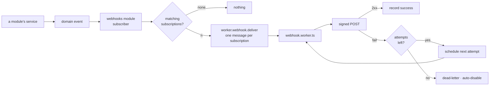

# Outbound Webhooks

Item 6 of `PRODUCTION_READINESS.md`. Delete both when the work has landed.

You asked for a better explanation of what this is and why it belongs here. This document is that,
plus the design, plus the one genuinely hard integration decision.

---

## What is missing

Today the arrow points one way.

The repo **receives** webhooks: `src/modules/payments/controllers/post-payment-sync.ts` handles a
provider's callback, and `AppModule.rawBodyPaths` exists in the kernel manifest for exactly this — so
the JSON parser keeps the bytes verbatim and a signature can be verified over what was actually sent.
That is careful, correct work.

Nothing in the repo can **tell** a third party that anything happened.

## Why that matters

A backend that cannot emit events forces every integration into polling. The consequences are
concrete:

- **A merchant's ERP** wants `order.paid` the moment it happens. Without webhooks it polls
  `GET /orders` every minute, forever, mostly getting nothing — and still sees the event up to a
  minute late.
- **A fulfilment partner** wants `order.shipped`. Same problem.
- **Zapier, n8n, Make** — the entire low-code integration layer — speak webhooks and nothing else.
  Without them, this API cannot be integrated by anyone who is not writing code.
- **An internal service** that wants to react to `user.deleted` has to either share the database or
  poll.

Webhooks are the single most-requested integration surface for a commerce backend, and the reason
people reach for a boilerplate rather than writing one is that doing it _correctly_ is about eighty
percent edge cases — retries, signing, replay protection, SSRF, circuit breaking. The naive version is
forty lines and is a security incident.

## Why it fits this repo unusually well

Every ingredient already exists. This is assembly, not invention:

| Ingredient                  | Already here                                                        |
| --------------------------- | ------------------------------------------------------------------- |
| Something to publish        | `kernel/events.ts` — the domain event bus                           |
| Async delivery with retries | `infrastructure/adapters/queue.ts` — RabbitMQ, per-queue DLQ        |
| A public event contract     | `asyncapi.public.yaml` — **already exists**, already generated      |
| A place for the worker      | `email.worker.ts`, `pdf.worker.ts`, `image.worker.ts` — the pattern |
| A deletable home            | The module system, with permissions, locales and contract fragments |
| Retention                   | TTL indexes, three collections already doing it                     |
| An attack-surface doc       | `docs/theory/web-attack-catalog.md` and its defences companion      |

The `asyncapi.public.yaml` bundle is the striking one. This repo already draws a line between the
async surface it uses internally and the async surface it is willing to show the world — that
document _is_ the webhook event catalogue, and it exists before the feature does.

---

## What "correct" means

This is the part that makes webhooks expensive. Each row is a way naive implementations fail.

| Concern             | The naive answer                     | What it has to be                                                                                                |
| ------------------- | ------------------------------------ | ---------------------------------------------------------------------------------------------------------------- |
| **Delivery**        | Fire and forget                      | At-least-once, never exactly-once. Every event carries a stable id so the consumer can dedupe.                   |
| **Retries**         | Retry three times immediately        | Exponential backoff with jitter, over hours. A consumer's five-minute outage must not lose the event.            |
| **Signing**         | A shared secret in a query parameter | HMAC over `id.timestamp.body`, timestamp inside the signed payload, tolerance window, rotatable secret ring.     |
| **Replay**          | Not considered                       | The signed timestamp plus the consumer's tolerance window is what makes a captured request unusable later.       |
| **SSRF**            | `fetch(subscription.url)`            | Resolve DNS, check the **resolved** address against private ranges, refuse redirects, hard timeout.              |
| **Ordering**        | Assumed                              | Not guaranteed, and said so in the contract. Consumers order by the event's own timestamp.                       |
| **Fan-out cost**    | Unbounded                            | One event × N subscriptions = N deliveries. Cap subscriptions per tenant.                                        |
| **Dead endpoints**  | Retry forever                        | Auto-disable after sustained failure, and notify the owner. Otherwise one dead URL burns the queue indefinitely. |
| **Observability**   | A log line                           | A delivery log with response codes and durations, per-endpoint success rate, and a manual replay action.         |
| **Secret handling** | Shown in the UI forever              | Shown once at creation. Rotatable without downtime — two active secrets during the overlap.                      |

### The SSRF row deserves its own paragraph

A webhook URL is attacker-controlled input that causes an outbound HTTP request **from inside your
network**. A subscription pointing at `http://169.254.169.254/latest/meta-data/` reads cloud instance
credentials. One at `http://localhost:9200` reads an internal Elasticsearch. One at a hostname whose
DNS record resolves to a private address passes a naive string check and then does the same thing.

The mitigations are known and non-negotiable: require HTTPS, resolve the hostname first and validate
the **resolved IP** against private, loopback, link-local and IPv6-mapped ranges, pin the connection
to that validated address, refuse redirects entirely, and set a hard total timeout.

This belongs in `docs/theory/web-attack-catalog.md` and its defences companion, and the guard is
perfect material for `tests/fuzz` — a table of hostile URLs is exactly what a property test is for.

---

## Signing: use the standard

`standardwebhooks@1.1.1`, published 2026-08-28, MIT, typed.

The [Standard Webhooks](https://www.standardwebhooks.com) specification defines the headers
`webhook-id`, `webhook-timestamp` and `webhook-signature`, the signed payload format, and the
verification procedure. It is the closest thing the ecosystem has to a shared answer, and it is what
Svix, Clerk, Resend and a growing set of others emit.

**Why it is the future-proof choice here.** Every consumer library that already speaks Standard
Webhooks verifies our deliveries with zero custom code. And if this ever outgrows a self-built
delivery pipeline and moves to a hosted service, the consumers do not have to change — the wire format
is the same.

**The alternative** is hand-rolling HMAC-SHA256 with `node:crypto` — genuinely about thirty lines, no
dependency, and the repo's own rule says a tiny obvious helper beats a dependency. The argument
against is that this particular helper is the one that is easiest to get subtly wrong (timing-safe
comparison, what exactly is signed, timestamp tolerance, encoding), and getting it wrong is a security
bug rather than a bug. And a bespoke scheme means every consumer writes bespoke verification.

**Recommended: `standardwebhooks`.** It is one small, current, MIT dependency for the highest-risk,
most-standardised part of the feature. **Question at the bottom.**

---

## Shape in this repo

### Which tier owns which half

The feature is not one thing, and splitting it correctly is what keeps it from inventing a new
pattern. The repo already answered this shape once, for email —
`shared/contracts/asyncapi.workers.yaml` states the test out loud:

> Sending an email and rendering a PDF are **verbs, not domains** … Neither half stops making sense
> in an app with no modules.

Webhooks split on exactly that line:

| Piece                                                              | Verb or domain   | Where                                             |
| ------------------------------------------------------------------ | ---------------- | ------------------------------------------------- |
| Sign, resolve DNS, validate the resolved IP, POST, time out        | verb — substrate | `src/infrastructure/adapters/webhook-delivery.ts` |
| Consume the queue, record the attempt                              | verb — substrate | `src/infrastructure/adapters/webhook.worker.ts`   |
| Register that worker                                               | assembly         | `src/app/workers.ts`, beside the other three      |
| The queue's contract                                               | app-owned        | `shared/contracts/asyncapi.workers.yaml`          |
| Subscriptions, delivery log, admin endpoints, permissions, locales | **domain**       | `src/modules/webhooks/`                           |
| Does this event match this filter? What is the next backoff?       | pure rules       | `src/modules/webhooks/domain/`                    |

Checked against the question [Layers](docs/theory/layers.md) uses for every placement — _does it
survive an application with no modules?_ The signer and the SSRF guard do: they are about the
network. Subscriptions do not: they are meaningless without domains to subscribe to.

The SSRF guard is infrastructure rather than `domain/` for a second reason worth stating, because
it looks like a pure rule and is not: it resolves DNS. `domain/` is lint-guaranteed free of I/O.

### No new boundary crossings

`webhooks` has to react to `order.paid` without importing `orders`. That is what `kernel/events.ts`
exists for, and [Layers](docs/theory/layers.md) names this exact case — "the reverse edge becomes a
domain event".

So: `orders` → the bus → `webhooks`. No import, no new `eslint-plugin-boundaries` rule, and
`npm run check:dependencies` stays quiet. A module reaching for another module's internals to learn
that an order was paid would be the failure mode here, and the bus is what makes it unnecessary.

### A new module

`src/modules/webhooks/` — deletable like every other, with its own `openapi.yaml` fragment,
`asyncapi.yaml` fragment, `permissions`, `locales` and `requiredConfig`.

### Collections

| Collection             | Holds                                                                                         |
| ---------------------- | --------------------------------------------------------------------------------------------- |
| `webhooksubscriptions` | Tenant, URL, secret ring, event filter, enabled flag, consecutive-failure count, disabled-at  |
| `webhookdeliveries`    | Subscription, event id, attempt number, status, response code, duration, error. TTL-retained. |

### The event catalogue is a contract, not an accident

The public event list must not be "whatever a module happens to emit". `kernel/events.ts` is an
internal bus with no durability and no replay, and its own docblock says so — exposing it wholesale
would publish internal coupling as an external promise.

Instead: **a module declares its public events in its own `asyncapi.yaml` fragment**, and
`asyncapi.public.yaml` — which already exists and is already generated and linted — becomes the
catalogue. Adding a public event is then the same four-step contract workflow as adding an endpoint,
with the same gates, and the frontend and any consumer get generated types for free.

That is the single best thing about building this here rather than anywhere else.

### The delivery path



`worker.webhook.deliver` is a new `WORKER_CHANNELS` entry — which means it is declared in
`shared/contracts/asyncapi.workers.yaml` and **generated**, not typed by hand. The worker lives at
`src/infrastructure/adapters/webhook.worker.ts`, beside the three that already exist.

---

## The one genuinely hard decision: delayed retry

The existing queue helper has two failure paths (`queue.ts:438-440`):

- handler returns `false` → `nack` without requeue → **dead-letter**
- handler throws → `nack` with requeue → **retried immediately**

Neither is a backoff. A webhook needs "try again in 5 minutes", and stock RabbitMQ has no delayed
delivery. Three options:

### (a) The `rabbitmq_delayed_message_exchange` plugin

**For.** Purpose-built. `x-delay` on the message and the broker holds it.

**Against.** Not in the stock image, so `docker-compose.yml` needs a custom RabbitMQ build — a
Dockerfile, a pinned plugin version matching the broker version, and a new thing to maintain across
upgrades. It is also a community plugin, not core.

### (b) A TTL + dead-letter retry ladder

One queue per delay tier — `webhook.retry.5s`, `.5m`, `.30m`, `.2h`, `.10h` — each with a message TTL
and a dead-letter route back to the work queue. A message that fails moves to the next tier up.

**For.** Works on stock RabbitMQ. A well-known pattern. Delays are precise. Nothing new to install.

**Against.** Five extra queues and their bindings, declared in AsyncAPI to stay contract-first. It is
the ugliest option to read, and the tier list is fixed at declaration time.

### (c) `nextAttemptAt` on the delivery document, polled by the cron container

The delivery row carries the time of its next attempt. A job — running in the cron container from item
1 — sweeps due deliveries and enqueues them.

**For.** Simplest by a distance. **Item 1 is being built anyway**, so this costs one crontab line and
one query. The backoff schedule is data, changeable without touching the broker. The delivery log is
already the source of truth, so there is no second place where retry state lives. And it degrades
well: if the sweeper stops, deliveries queue up rather than vanish.

**Against.** Delay granularity is the sweep interval — a one-minute sweep means a "5 second" retry is
really up to a minute. For webhooks that is fine; nobody's SLA is sub-minute on a retry. And it makes
the webhook feature depend on the cron container being alive, which is a dependency the health probe
from item 1 already covers.

### Recommendation

**(c).** It reuses a component this plan is building regardless, keeps retry state in one place, and
avoids both a custom broker image and five extra queues. Revisit if delivery volume ever makes a
one-minute sweep too coarse — at which point (b) is the upgrade, and it is additive.

This is also the point where BullMQ (see `SCHEDULING_AND_COORDINATION.md`) becomes tempting, because
delayed retry with backoff is precisely what it does natively. Recording that here rather than
pretending it did not come up: if the answer to that document's first question is "adopt BullMQ", then
this decision changes and (c) becomes unnecessary.

---

## Secrets: the one place this differs from API keys

Item 7's API keys are stored as a hash and never recovered — we only ever need to _verify_ one.

A webhook secret is different: we need the **plaintext** to sign every delivery. So the choice is:

- **Store plaintext.** Simple. A database compromise lets an attacker forge deliveries that consumers
  will accept as genuine.
- **Encrypt at rest** with a key from the environment. The database alone is not enough. This is the
  same shape as the token key ring in item 4 and can share its rotation story.

**Proposed: encrypted at rest**, using `node:crypto` AES-256-GCM with a key from `requiredConfig`,
because the failure mode of the alternative is silent forgery of events that trigger money movement in
someone else's system.

The subscription carries a **ring** of secrets, not one, so a consumer can rotate: add a secret, both
are used to produce two signature values in one header (the Standard Webhooks format allows a
space-separated list precisely for this), the consumer switches, the old one is removed.

---

## Admin surface

- `GET/POST/PATCH/DELETE /webhooks/subscriptions` — tenant-scoped, permission-keyed.
- `GET /webhooks/deliveries` — the log, filterable by subscription and status.
- `POST /webhooks/deliveries/{id}/replay` — re-send one. The single most-requested support action.
- `GET /webhooks/events` — the catalogue, served from the generated public AsyncAPI so it cannot drift.

All contract fragments in the module's own `openapi.yaml`. **This is a contract change** and needs
sign-off before the code.

---

## Seeing it work

A sender with nothing to send to is untestable by hand. Two tiers, and only the first is required.

### Tier 0 — the tests, which own correctness

An integration test starts its own throwaway HTTP listener and asserts the things that matter:
delivery arrives signed, a 500 produces a retry, sustained failure auto-disables the subscription,
replay re-sends, the delivery log records what happened.

This needs no container and no profile. **It is the correctness proof**; everything below is for
human eyes.

### Tier 1 — `webhook-tester`, already in the stack

`ghcr.io/tarampampam/webhook-tester` — MIT, self-hosted webhook.site. It is in `docker-compose.yml`
now, on the `integrations` profile, so a plain `up` is unchanged:

```bash
npm run compose -- --profile integrations up -d
```

Then the sink UI is on `WEBHOOK_TESTER_PORT` (default `3070`), showing each captured request with
its headers — which is what makes `webhook-signature` checkable by eye.

Two details that make it self-demoing rather than something to configure:

- `AUTO_CREATE_SESSIONS=true` means a POST to `/<any-uuid>` creates that session on arrival. A
  seeded subscription can point at a fixed id without a human opening the UI to obtain one first.
- `GET /api/session/<uuid>/requests` returns the captured requests as JSON, so a manual check is a
  `curl`, not a screenshot.

The demo subscription itself is a **fixture**, not code — `demo/webhooks.ts`, registered in
`demo/index.ts`'s table, per [Data](docs/reference/data.md#the-demo-dataset). It reads a sink URL
from the environment and seeds **nothing** when that is unset, so a developer who never enables the
profile never gets a dead subscription auto-disabling in their logs.

### Tier 2 — n8n

Deferred. `N8N_INSERT.md` has the whole argument: what it proves that `webhook-tester` cannot, the
closed loop back into the API, the licence stated accurately, and why it waits behind item 7.

### The line between demo and product

Worth stating once, because it is cheap now and expensive later. The sender is product: real code,
tested, working with no containers running. The sink, the profile and the seeded subscription are
demo furniture, in the same sense as the seeded catalogue.

| Failure                                                 | Guard                                                        |
| ------------------------------------------------------- | ------------------------------------------------------------ |
| A test points at a compose service                      | Tests start their own listener. Tier 0 never touches Tier 1. |
| A demo subscription URL survives into production config | The seed reads an env var that is unset by default.          |
| `requiredConfig` grows a sink entry                     | It must not. The module boots with no sink configured.       |

`src/infrastructure/adapters/demo-outbox.ts` is the precedent already in the tree: demo-only
infrastructure, inert unless `NODE_DEMO=true`, and it has not leaked into anything.

---

## The alternative worth naming: do not build it

`svix@2.3.0` (2026-09-03) is a hosted and self-hostable webhook service that does all of the above,
including the parts that are hard. For a **product**, outsourcing this is often the right call.

For a **boilerplate** it is not: it would make an external service mandatory for a core capability, in
a repo whose whole premise is that you can `git clone` it and have a working system.

But the compromise is free. **Signing with the Standard Webhooks format means a later move to Svix is
a configuration change, not a consumer-breaking migration.** That is the entire future-proofing
argument for the dependency recommended above, and it is why the format choice matters more than the
implementation choice.

---

## Tests

- **Unit** — signature generation against the spec's own test vectors; the backoff schedule; the
  event-filter matcher; secret-ring rotation producing two signatures.
- **Fuzz** — the SSRF guard against a hostile URL table: private ranges, IPv6-mapped IPv4,
  decimal-encoded IPs, DNS names resolving to private space, redirect chains, credentials in the URL.
  `tests/fuzz` exists for exactly this.
- **Integration** — real database and a local listener: successful delivery, a 500 producing a retry,
  sustained failure auto-disabling the subscription, replay re-sending, the delivery log recording
  what happened.
- **Contract** — the admin endpoints match the bundled spec; every event in `asyncapi.public.yaml` has
  a producer.
- **Cross-cutting** — no module emits a public event that the public AsyncAPI bundle does not declare.

---

## Decided since this document was written

|                |                                                                        |
| -------------- | ---------------------------------------------------------------------- |
| The dev sink   | `webhook-tester`, MIT, profile-gated. In `docker-compose.yml` now.     |
| n8n            | Deferred to `N8N_INSERT.md`. Not rejected.                             |
| Tier placement | Substrate/domain split as above. No new pattern, no new boundary rule. |
| **Question 5** | **Answered: this waits behind item 7.** See below.                     |

## Questions

1. **`standardwebhooks` (one dependency) or hand-rolled HMAC (~30 lines)?** Recommended the
   dependency, on the grounds that it is the highest-risk piece and the format is the thing that keeps
   options open later.
2. **Delayed retry: (a) plugin, (b) TTL ladder, or (c) `nextAttemptAt` swept by cron?** Recommended
   (c), because item 1 pays for it already. This answer changes if BullMQ is adopted.
3. **Webhook secrets encrypted at rest, or stored plaintext?** Recommended encrypted; it costs a
   `requiredConfig` entry and a key-rotation story that item 4 is writing anyway.
4. **Which events are public in v1?** Proposed: `order.created`, `order.paid`, `order.shipped`,
   `order.cancelled`, `payment.succeeded`, `payment.failed`. Deliberately no account or user events in
   v1 — those carry PII and deserve their own consent conversation.

    Note what that list is: the **demo domain**. The shipped thing is the mechanism — a module
    declares its public events in its own `asyncapi.yaml` fragment — and these six are the worked
    example a clone deletes along with the shop. A deployment with members and volunteers instead of
    orders declares its own six and changes nothing else.

5. ~~**Is this v1 at all, or does it wait behind item 7?**~~ **Answered: it waits.** Two reasons,
   and the second is the stronger one:
    - The two share secret-handling conventions, so doing API keys first means webhooks inherit them
      rather than inventing a second set.
    - The closed-loop demo in `N8N_INSERT.md` needs a credential for the call **back** into the API,
      and that credential is item 7. The demo we actually want does not exist before it.
