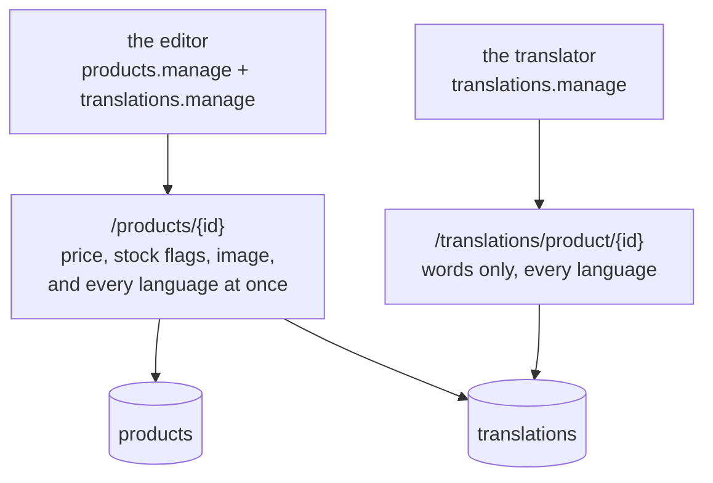

# The multilingual product write surface

**Status:** backend done, frontend not started. Phase 5 of `TRANSLATION_UPGRADE.md`, split out
because it replaces three endpoints, both frontend forms and the product form's validation schema on
both sides. Steps 1–4 of [Order of work](#order-of-work) are done — the contract, the service, the
controller/routes, and the admin read; steps 5–6 (`sync:frontend`, the two views, `schemas.ts`, the
demo seeders) remain.

Read `TRANSLATION_UPGRADE.md` first. This document assumes its decisions: every locale is a row, the
source locale is the deployment's `NODE_FALLBACK_LOCALE`, and a product always has a fallback-locale
row.

## Why this exists

Once a product's words live in a `translations` row per locale, **an editor cannot create a product
with the endpoints that exist.**

`POST /products` takes one `title` and one `description`. To author a product in five languages an
editor would have to create it in one language, then make five more calls to a separate translation
resource. Between the first call and the last, a half-authored product is live in the catalogue —
findable, orderable, and named in whatever language happened to go first.

The write has to be one request, or the product is not really created by any of them.

## What is being replaced

Three entry points, all going through `writeProducts`
(`src/modules/products/controllers/write-products.ts`), all accepting `multipart/form-data` with an
`imageUpload` part:

| method | path             | routes.ts | today                |
| ------ | ---------------- | --------- | -------------------- |
| `POST` | `/products`      | :35       | create, one language |
| `PUT`  | `/products`      | :45       | update, id in body   |
| `PUT`  | `/products/{id}` | :181\*    | update, id in path   |

\* `src/modules/products/openapi.yaml`.

**They are removed, not deprecated.** `CLAUDE.md` is explicit: replace, don't shim, and no
`@deprecated` kept "for later". A single-language product write is not a smaller version of the new
one — it is a write that cannot express a valid product any more.

The `PUT /products` / `PUT /products/{id}` duplication goes with them. One update path, id in the
URL, is the shape the rest of the repo uses.

What replaces them:

| method  | path             | semantics                                                     |
| ------- | ---------------- | ------------------------------------------------------------- |
| `POST`  | `/products`      | Create. The fallback locale's entry is required               |
| `PATCH` | `/products/{id}` | Update, **merging** — see [The write shape](#the-write-shape) |

`PATCH`, not `PUT`, because the update merges rather than replaces. That is not a new convention:
`src/modules/locales/openapi.yaml:355` already splits the same collection two ways — `PUT` replaces
its entries, `PATCH` merges them — and says why in the operation's own description: _"the choice
lives in the method."_ A merging `PUT` would be the one spelling that lies.

No replacing counterpart is offered for products. Nobody asked for one, and the destructive half of
"replace" — silently dropping every language the caller did not resend — is the exact failure this
design is avoiding.

## Two doors, and why both stay

This endpoint is **not** a replacement for `GET` / `PATCH` `/translations/{entityType}/{id}`.



| door                              | who        | may change a price | generic across entities |
| --------------------------------- | ---------- | ------------------ | ----------------------- |
| `/products/{id}`                  | editor     | **yes**            | no — products only      |
| `/translations/{entityType}/{id}` | translator | **no**             | yes                     |

Collapsing them would hand the translator `products.manage`, which destroys the separation the whole
side-collection design was argued from: _a mistranslation can never become a mischanged price._ The
generic door also has to survive for the CMS pages and email templates that become translatable
later.

## The write shape

One body, product fields once, words per locale:

```jsonc
{
    "price": 24.9,
    "active": true,
    "requiresShipping": true,
    "categories": ["dog"],
    "tags": ["bed", "premium"],
    "onHand": 40, // create only
    "translations": {
        "en": { "title": "Orthopedic Memory Foam Dog Bed", "description": "…" },
        "it": { "title": "Cuccia ortopedica in memory foam", "description": "…" }
    }
}
```

Rules, all enforced server-side:

- On `POST`, the **fallback locale's entry is required**. Its absence is a 422, not a silently empty
  product.
- Every other locale is optional. A product may ship in one language and gain the rest later.
- Every key in `translations` MUST exist and be `active` in the `locales` collection.
- Every field name MUST be one the `translatables` registry entry declares for `product`. An
  unknown field is a 422, not a silently dropped key.
- The per-locale title rules that `zodProductSchema` enforces today apply **per locale**, so the
  error path has to name which language failed.

### What each language slot means on a `PATCH`

Three signals, three meanings, and no way for one to be mistaken for another:

| the request says | the server does                        |
| ---------------- | -------------------------------------- |
| `"fr"` is absent | Leaves the French row exactly as it is |
| `"fr": { … }`    | Upserts the French row from the fields |
| `"fr": null`     | **Deletes** the French row             |

An empty object, or an object whose title is `""`, is a **422** — never a delete.

That is the whole point of the `null`. A form that clears its text boxes sends `""`; producing
`null` takes the deliberate act of removing a language. So a mis-click can never delete translated
work, and a delete still rides in the same request as the edits beside it — one write, all of it or
none of it.

`null` on the **fallback locale** is a 422. Deleting it would leave the product with nothing to fall
back to, which `TRANSLATION_UPGRADE.md` forbids by construction.

**The merge stops at the locale. It does not reach inside one.** A locale's `fields` object is
written whole: `"it": { "title": "X" }` on a row that also held a `description` leaves that row with
a title and no description. Sending a locale means sending that language's copy as it should now
stand.

Two levels of merge would need a third signal to clear one field, and the only honest candidate —
`""` — is already spoken for as a validation error on `title`. One level of merge needs none: the
form holds a whole tab and sends a whole tab.

This applies identically to the translator's door. The two doors never differ in how a language is
written.

### Errors say which language

A validation failure needs a locale in the pointer, or an editor with five tabs open cannot tell
which one to fix. `translations.it.title` — not `title`.

This is the one genuinely new shape in the response contract, and it is worth getting right before
the frontend is written against it.

## The image stays multipart

All three current endpoints accept `multipart/form-data` with an `imageUpload` file part
(`upload.single('imageUpload')` in `src/modules/products/routes.ts`). That does not change.

What changes is that the JSON half is now nested. A `multipart/form-data` part carrying a nested
object is a JSON string in a field, not flat form keys — so the contract has to say that explicitly
and the controller has to parse it before validating.

The alternative — a JSON endpoint plus a separate image upload — is two requests to create one
product, which is the problem this document exists to remove.

## The admin read

`GET /products/{id}` is public and resolves to one language. The editor needs all of them.

A separate admin read, rather than a query parameter on the public one: the public route is cached
for an hour on a locale-keyed key (`src/infrastructure/http/middlewares/cache.ts:203`), and a
parameter that changes the response shape on the same path is how a cached response gets served to
the wrong caller. Different shape, different route, different cache policy — the admin read is not
cached at all, the same way `get-locale-entries.ts` deliberately is not: it is the screen someone is
actively typing into.

## The frontend

Both forms are rebuilt:

- `src/modules/products/views/ProductCreate.vue` (207 lines)
- `src/modules/products/views/ProductEdit.vue` (338 lines)
- `src/modules/products/schemas.ts` — `productsSchema` currently has flat `title` / `description`
  and must become per-locale.

**The UI question:** how does an editor see five languages at once without the form becoming a wall?

| approach               | reads well when              | costs                                             |
| ---------------------- | ---------------------------- | ------------------------------------------------- |
| Tabs per language      | 2–5 languages                | A validation error hides behind an unselected tab |
| Accordion per language | many languages               | Lots of vertical scrolling; hard to compare two   |
| Side-by-side pairs     | translating against a source | Only really works for two at a time               |

**Recommended: tabs, with the error state on the tab itself.** A tab whose language failed
validation shows the count, so the hidden-error problem the tabs approach normally has is answered
rather than accepted. The fallback locale's tab is first and is never removable.

Language switching inside the form is **not** the app's locale switch. An editor writing Italian
copy while using the admin in English is the normal case, so the form's language selector must be
local state, unrelated to `changeLanguage`.

## Order of work

1. **Contract first (done).** `src/modules/products/openapi.yaml` — the new write body, the admin
   read, the per-locale error pointer. The three old operations are gone.
   `npm run contracts:bundle` and `npm run gen:api` ran clean.
2. **The service (done).** `productService.writeCreate`/`writeUpdate` write the product and its rows
   in one operation — the create path also writes the fallback row, landing
   `TRANSLATION_UPGRADE.md`'s "the service writes the fallback row" decision. `getAdmin` backs the
   admin read.
3. **The controller and routes (done).** `writeProducts` is gone, replaced by
   `create-product.ts`/`update-product.ts`; routes collapse to `POST /products` and
   `PATCH /products/{id}`, both stacking `products.*` and `translations.manage`.
4. **The admin read (done).** `GET /products/{id}/admin`, uncached, gated on `products.update` +
   `translations.read`.
5. **`npm run sync:frontend`,** then the two views and `schemas.ts` — **not started**.
6. **Demo seeders,** which call the write path — `demo/products.ts`, `demo/demo-catalog.ts` — **not
   started**; both still write flat `title`/`description` directly through the repository, which
   still works but bypasses the new write surface entirely.

## Tests

Same rule as the parent document: they ship with the behaviour, not after it.

| suite                  | what it must prove                                                                                                                                        |
| ---------------------- | --------------------------------------------------------------------------------------------------------------------------------------------------------- |
| unit (products)        | A `POST` missing the fallback locale is refused. An unknown field name is refused.                                                                        |
| unit (products)        | The three `PATCH` signals: absent leaves the row, an object upserts it, `null` deletes it.                                                                |
| unit (products)        | `null` on the fallback locale is refused, and an empty object is refused rather than treated as a delete.                                                 |
| unit (products)        | The per-locale error pointer names the locale — `translations.it.title`, not `title`.                                                                     |
| integration (products) | Create writes the product and every row in one operation; a rejected write leaves neither.                                                                |
| integration (products) | One `PATCH` carrying an edit and a `null` applies both, or neither — the atomicity the single request was chosen for.                                     |
| contract (products)    | The new write body and the admin read match the spec.                                                                                                     |
| contract (products)    | The three removed operations are gone from the bundle — no orphaned client method.                                                                        |
| integration (system)   | The editor's door may set a price; the translator's door may not, over real HTTP.                                                                         |
| fuzz                   | A `translations` map with an unregistered locale, an inactive one, an empty object, a `null` on the fallback, and a nested object where a string belongs. |
| e2e (admin)            | Create a product in two languages in one submit; both storefront languages show it.                                                                       |
| e2e (admin)            | Remove a language and edit another in one Save; the removed one is gone and the edited one kept.                                                          |
| e2e (admin)            | A validation error in a language whose tab is not selected is visible on the tab.                                                                         |
| a11y                   | The language tabs are reachable and announced.                                                                                                            |

## Settled, for the record

Both questions this document opened with are answered, and they answer each other.

**A `PATCH` merges.** Sending `it` alone changes Italian and leaves every other language untouched.
Merge was chosen over replace because a form that ever sends fewer languages than it loaded would,
under replace, silently destroy the rest.

**Deletion is `null`, not omission and not emptiness.** Merge already spends "absent" on _leave this
alone_, so deletion needed its own signal. `null` is the one a form cannot produce by accident, and
keeping it inside the same request means an edit and a removal saved together either both land or
both fail — which a separate `DELETE` call could not promise.

What follows from that pair: there is no replacing counterpart, no tombstone object, and no second
delete endpoint on the product resource.
