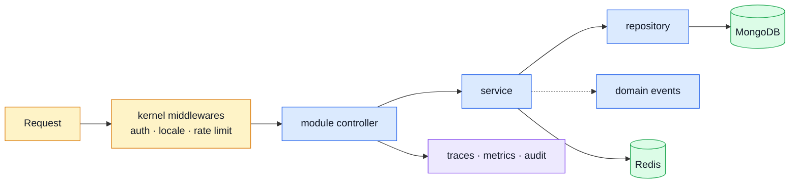

# boilerplate-node-api-mongodb-mongoose

> Express 5 + TypeScript + Mongoose REST API. Contract-first, modular, observable.
> Paired with [`boilerplate-vue-frontend`](https://github.com/Guebbit/boilerplate-vue-frontend).

**📚 The documentation is the real reference — this file is only the door.**
Run `npm run docs:dev` (or open `:3090` once the stack is up), or read `docs/`.

::: danger Uploaded images do not outlive the container
`imageStore` (`src/infrastructure/adapters/image-store.ts`) writes uploads to the container's own
filesystem. **Rebuild or remove the container and every uploaded image goes with it** — `docker
compose down -v`, a redeploy, a moved host. Only `public/images/seed/` survives, because those files
are committed. Two replicas do not share what they store either: an image uploaded to one is a 404
on the other.

A bind-mounted volume is the stopgap. It works, and it pins the deployment to one disk. The durable
answer is a second `ImageStore` implementation over an S3-compatible bucket or a CDN — nothing
selects a backend yet, on purpose, and `image-store.ts` documents what such an implementation has to
get right before anyone writes one.
:::

---

## Start here

This stack is **container-first**: the shipped `.env` uses compose service hostnames, because the
things that make it worth cloning — Tempo, Loki, Prometheus, Grafana, Alloy, Umami — only exist
inside the compose stack.

```bash
npm install
cp .env-example .env      # then set NODE_TOKEN_ACCESS and NODE_TOKEN_REFRESH
npm run compose:restart   # docker or podman, auto-detected
```

That is the whole setup. The `app` container runs `npm run db:bootstrap` before starting, so the
database is migrated and seeded on first boot — you get demo products, users and orders rather
than empty lists.

```bash
curl http://localhost:3000/            # health probe, with trace headers
curl http://localhost:3000/products    # the seeded demo data
```

::: warning Use the scripts, not a bare `compose up`
The scripts pass the runtime's Promtail override with `-f`. A bare `compose up` runs the base file
only: Loki stays empty and Grafana's log panels stay blank, with no error anywhere.
:::

→ Host mode, the collections, the pre-commit gate: **[Getting Started](./docs/getting-started.md)**
→ Ports and running the pair: **[Pairing & Ports](./docs/tools/pairing-and-ports.md)**

---

## What this is



Four ideas carry the whole repository:

1. **A module is a value, not a convention.** Every domain declares what it needs — routes,
   locales, seeds, event subscriptions, contract fragments — in one typed object. `src/modules.ts`
   lists them, and the registry validates the dependency graph at boot rather than at the first 500. Adding a domain is one folder plus one line; removing it is `rm -rf` plus that line.
2. **The contract is an output, not a document.** `openapi.yaml` is assembled from per-module
   fragments and generates the typed client and Zod schemas that both repositories import.
3. **Layers stay honest.** `kernel` knows no domain, `infrastructure` knows no domain,
   `modules/*` know each other only through declared dependencies or domain events.
4. **Observability is wired, not planned.** OpenTelemetry traces, Prometheus metrics, Winston to
   Loki, an audit trail, and Grafana dashboards, all running in the dev stack.

---

## Where things live

|                      |                                                                |
| -------------------- | -------------------------------------------------------------- |
| `src/modules/*`      | the domains — each one deletable                               |
| `src/kernel`         | registry, domain events, auth primitives                       |
| `src/infrastructure` | http, persistence, adapters, observability, runtime            |
| `src/app`            | assembly: routes, security, error handling, telemetry, workers |
| `api/`               | generated types and Zod schemas — never edited by hand         |
| `shared/`            | contract fragments and EJS email templates                     |
| `db/`                | migrations and seeds                                           |

---

## The map

| You want to                   | Read                                                                                                                    |
| ----------------------------- | ----------------------------------------------------------------------------------------------------------------------- |
| Get it running                | [Getting Started](./docs/getting-started.md)                                                                            |
| **Read the code, first time** | **[Reading Path](./docs/theory/reading-path.md)** — nine files, in order                                                |
| Understand the shape          | [Architecture](./docs/theory/architecture.md) · [Layers](./docs/theory/layers.md) · [Modules](./docs/theory/modules.md) |
| Add or remove a domain        | [Adding & Removing a Module](./docs/theory/module-lifecycle.md)                                                         |
| Change an endpoint            | [OpenAPI Workflow](./docs/api/openapi-workflow.md) · [Regenerating](./docs/api/regenerating.md)                         |
| Run the pair                  | [Pairing & Ports](./docs/tools/pairing-and-ports.md)                                                                    |
| Look up a script              | [Package Scripts](./docs/tools/package-scripts.md)                                                                      |
| Understand a dependency       | [Tools Explained](./docs/tools/tools-explained.md)                                                                      |
| Test something                | [Testing overview](./docs/tools/testing-and-docs.md)                                                                    |
| Deploy it                     | `.docker/Dockerfile.production` · `docker-compose.production.yml`                                                       |

---

## Before you commit

```bash
npm run complete    # build + all tests + lint + format check — ~90s
```

Exactly what the pre-commit hook runs; `npm run complete:fix` is the same gate with lint and
formatting fixed rather than reported. Outside it, by hand: `npm run complete:manual`
(`test:prism`), `npm run test:mutation`, `npm run test:fuzz`, and `npm run bench`.

Per-suite numbers, so a doubling reads as a regression rather than as a mood:
[Test timings](./docs/tools/testing-and-docs.md#test-timings).

---

## License

AGPL-3.0. See [LICENSE](./LICENSE).
