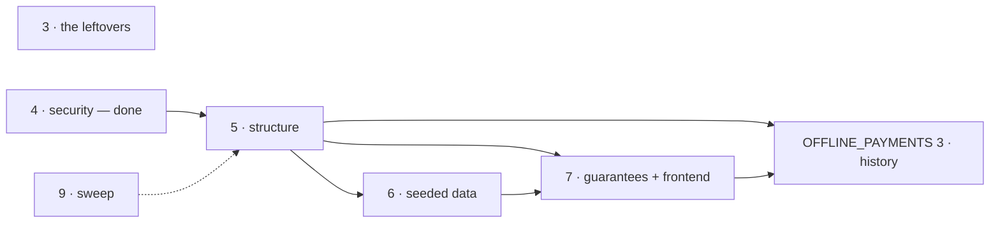

# Scenarios — next

The one plan for the `scenarios/` layer from here on.

Re-verified against `main` at `aaf4789c` on 2026-09-11 — every open item checked against the code
in both repos, not against commit messages. **Amended 2026-09-12 at `6eaf0ffd`:** five commits
landed in between and moved evidence these files rest on — each affected row says so, and four open
questions were answered (4 S1's scope, 6 D4, 9's count policy, the CI-first order).

This file is the index. Each numbered file holds **one** category, opens with a status line, its
question and my recommendation, and ends with an `## Answer` list. Every question is answered;
nothing waits on a decision — only on work.

## Start here

| #   | File                                                                   | What                                                    | Status                                                                                                              |
| --- | ---------------------------------------------------------------------- | ------------------------------------------------------- | ------------------------------------------------------------------------------------------------------------------- |
| 3   | [Bootstrap, CI and the dataset](SCENARIOS_NEXT_3_BOOTSTRAP_DATASET.md) | delete `dataset.json`; `subjects.ts` + one test         | **built** — stale references fixed; CI-green, docker build (env-blocked) and frontend e2e-live left                 |
| 5   | [One registry, one vocabulary](SCENARIOS_NEXT_5_STRUCTURE.md)          | the registry, the moves out of `src/`, the renames      | **built**, 2026-09-12 — the registry, every move and every rename landed; `npm run complete`'s relevant pieces pass |
| 6   | [Seed a shop the app could make](SCENARIOS_NEXT_6_SEEDED_DATA.md)      | D1 A, D2, D3, D5 webhook allowance, D4 receipts, D7     | decided, not started                                                                                                |
| 7   | [Guarantees that name rows](SCENARIOS_NEXT_7_GUARANTEES_FRONTEND.md)   | subjects, `GET /__test/scenario`, frontend `cy.subject` | groundwork only (`subjects.ts` ids, the check in `npm test`)                                                        |
| 9   | [Sweep](SCENARIOS_NEXT_9_SWEEP.md)                                     | stale text, dead code, missing tests                    | ~10 of ~70 done, ~15 partly                                                                                         |

Done and deleted:

| Was | What                                                                                                                 | Commits                                                | Where the reasons live now                                                                                                                                           |
| --- | -------------------------------------------------------------------------------------------------------------------- | ------------------------------------------------------ | -------------------------------------------------------------------------------------------------------------------------------------------------------------------- |
| 1   | one prefix: `/__test/*` for both routes                                                                              | `aaf4789c`, frontend `111f910e` `4c416c5c`             | `CHANGELOG.md` "Breaking — tooling"; "demo" names the profile, these routes are test control                                                                         |
| 2   | a restore empties, never drops; pinned tenant `_id`; seed before listen; serialised                                  | `aaf4789c`                                             | the docblocks of `emptyDatabase()`, `run-server.ts`, `src/app/demo.ts`                                                                                               |
| 4   | S1 `enableDemoProfile()` replaces `NODE_DEMO`; S2/S4 loopback binds; S4 seed-password refusal; S5 advisory; T1 tests | `84206c6f` `3847ad6e` `0aaee347` `3d212b81` `94cfcdc5` | `CHANGELOG.md` "Breaking — security"; S4's frontend-only follow-up (`NODE_ENV: test` in the paired frontend's `e2e-live.yml`) belongs to that repo, not tracked here |
| 8   | where flows run: once per boot, restored from memory                                                                 | —                                                      | moved whole to [OFFLINE_PAYMENTS 3](OFFLINE_PAYMENTS_3_REALISTIC_HISTORY.md)                                                                                         |

The flag-off → 404 route test from 1 was its last open thread — closed by 4's T1
(`tests/integration/app/demo-routes.test.ts`'s mount-gate case).

## Order of work

- **CI green comes first.** Three cheap fixes, decided 2026-09-12 — see [3](SCENARIOS_NEXT_3_BOOTSTRAP_DATASET.md#what-is-left).
  A red baseline hides whatever the work below breaks.
- **3's leftovers are independent** — five one-line edits and three checks.
- **5 is done.** It came after 4 because it moved the files 4 edited; 6 and 7 are unblocked now.
- **6 D1 is still worth doing early**, but no longer urgent: `6eaf0ffd` alarms the paid commit that
  finds no hold, so the state is wrong rather than silently wrong.
- **9's prose half is one pass after 5**, not a ride-along — see its own
  [policy](SCENARIOS_NEXT_9_SWEEP.md#how-to-treat-an-item). Code items still ride along.

## Where things stand

| Phase (original plan)      | State                                  | Commits                                                            |
| -------------------------- | -------------------------------------- | ------------------------------------------------------------------ |
| 1 · fix and prune          | done                                   | `973abb6b`                                                         |
| 2 · `fixtures` → factories | done                                   | `01fe51ce`                                                         |
| 3 · `demo/` → `scenarios/` | done, minus scenario arguments         | `2aeffa49`                                                         |
| 4 · build and restore      | pivoted: no dataset at all, now        | `117c7cf3` `2fca43dd` `5f21020e` `d4506845`                        |
| 5a · guarantees + `blank`  | done, products only                    | `2275d138` `8dc05a6c`                                              |
| 5b · flow-driven slices    | moved                                  | → [OFFLINE_PAYMENTS 3](OFFLINE_PAYMENTS_3_REALISTIC_HISTORY.md)    |
| restore correctness        | done                                   | `aaf4789c`                                                         |
| 6 · frontend               | unbroken; the subject work not started | frontend `111f910e` → [7](SCENARIOS_NEXT_7_GUARANTEES_FRONTEND.md) |
| 7 · migrate specs lazily   | not started                            | → [7](SCENARIOS_NEXT_7_GUARANTEES_FRONTEND.md)                     |

## What changed from the original plan, and why

**The dataset is gone** (`d4506845`). It stopped being committed in `117c7cf3`; now it is not built
either. The dozen values it served live in the import-free `scenarios/subjects.ts`. These fell away
with it:

- the EJSON snapshot and the restore-from-snapshot pipeline
- `build/{generate,normalize,dump,assemble}.ts`, `export-dataset.ts` and the pinned clock
- the timestamp dilemma (option A vs B) — moot

**The dilemma's premise was also false.** It assumed a real `create()` overwrites a factory's
`createdAt`. Mongoose 9.9.5 keeps a supplied `createdAt` on insert and sets `updatedAt` to it
(`node_modules/mongoose/lib/helpers/timestamps/setDocumentTimestamps.js`, read). So:

- `createdAt` still derives from each pinned `_id` — the spread across 2024 survives
- only a product's `updatedAt` moves to seed time, through the translation write's `updateOne`

**Two guardrails went with the committed file**; one is back:

- contract conformance of seeded rows — back, in `tests/integration/scenarios/shop.test.ts`
- the serializer-drift diff — gone for good; nothing committed to diff against

**Seeds run everywhere**: on every container boot (`db:bootstrap`) and every restore — no longer at
`postinstall`. That is why flows moved to OFFLINE_PAYMENTS 3's once-per-boot design.

## Vocabulary, as built

| Word         | Means                                         | Where today                                                      | Gap                                                                   |
| ------------ | --------------------------------------------- | ---------------------------------------------------------------- | --------------------------------------------------------------------- |
| **factory**  | a builder that makes one row                  | `src/modules/*/factories.ts`, `*/tests/factories.ts`             | none                                                                  |
| **scenario** | a named whole-database state                  | `SCENARIOS` registry (`scenarios/index.ts`) — `shop`, `blank`    | none — closed by [5](SCENARIOS_NEXT_5_STRUCTURE.md)                   |
| **seed**     | the act of writing a scenario into a database | `insertIfAbsent` / `insertIfAbsentForOwner`, `scenarios/seed.ts` | none — renamed and moved by [5](SCENARIOS_NEXT_5_STRUCTURE.md)        |
| **subject**  | a named row a consumer asks for               | `scenarios/subjects.ts` — ids only, no names                     | [7](SCENARIOS_NEXT_7_GUARANTEES_FRONTEND.md)                          |
| **demo**     | the in-memory run profile only                | `npm run demo`, `src/app/demo.ts`, `scenarios/run-server.ts`     | none — data identifiers renamed by [5](SCENARIOS_NEXT_5_STRUCTURE.md) |

`snapshot` is dropped from the vocabulary. OFFLINE_PAYMENTS 3 brings back an in-memory copy, never
a committed one.

## Measured (live, 2026-09-11)

| What                                  | Plan said  | Measured                                   |
| ------------------------------------- | ---------- | ------------------------------------------ |
| `POST /__test/restore` → `shop`       | ~50 ms     | **0.58 s** (0.578–0.603, 4 runs)           |
| `POST /__test/restore` → `blank`      | ~10 ms     | **0.15 s** (0.148–0.152, 3 runs)           |
| `shop` before the pinning was removed | 583–611 ms | unchanged — the pinning was never the cost |

Probable dominant cost, by reading only: 14 bcrypt cost-12 hashes per `shop`, 4 per `blank`
(`src/modules/users/model.ts:598-600`). Not profiled. Measured before `aaf4789c`; not re-measured.

## Still rejected

| Option                                         | Why not                                                                                                                                                                   |
| ---------------------------------------------- | ------------------------------------------------------------------------------------------------------------------------------------------------------------------------- |
| a backend alias for `/__demo/reset`            | `CLAUDE.md`: replace, don't shim. The frontend changed instead                                                                                                            |
| rebuild the EJSON snapshot pipeline "to match" | nothing is committed, so nothing needs byte-stability                                                                                                                     |
| per-test transaction rollback                  | does not cross the process boundary Cypress sits on. `c5dfda7d` gave PRODUCTION a one-node replica set, but the dev compose and the in-memory server are still standalone |
| move the factories into `scenarios/`           | inverts the dependency: `src/` tests would import from a folder the production image omits                                                                                |
| share subjects through `SHARED_FILES`          | binds the frontend to one backend, against its stated interchangeability — served at runtime instead                                                                      |
| require every module to declare a guarantee    | `antibot`, `api-keys`, `feedback`, `observability` have nothing to show; the check would be noise                                                                         |
| migrate every e2e spec to `blank`              | every visual and a11y spec wants a furnished shop — that is their point                                                                                                   |

## Verifying

`npm run complete` is the gate (~10 minutes). While iterating:

| After           | Run                                                                                                             |
| --------------- | --------------------------------------------------------------------------------------------------------------- |
| anything        | `npm run ts-check && npm run lint && npm run prettier:check`                                                    |
| 4, 7            | `NODE_PORT=3199 npm run demo`, then `curl -X POST localhost:3199/__test/restore` and the checks each file lists |
| 3               | `docker compose build app`; the frontend's `e2e-live.yml`                                                       |
| 5               | `npm run ts-check && npm run lint` — boundaries complain loudly about a wrong tier                              |
| frontend-facing | the frontend's `npm run test:e2e:serial` against `npm run demo`                                                 |

## Traps

- **Gitignored artifacts go stale across a rebase.** `check:contracts-bundle` says STALE → run
  `npm run regenerate -- --no-sync`. Never while a jest run is in flight: it rewrites `api/` under it.
- **`scenario:apply` does not repair.** It skips a row whose `_id` exists. Use `scenario:apply:reset`.
- **Stryker and Cypress cannot share the machine.** Run mutation alone.

## Outside this plan — flagged, not planned here

| What                                                                                                                                                                                                                        | Where it belongs                                                                               |
| --------------------------------------------------------------------------------------------------------------------------------------------------------------------------------------------------------------------------- | ---------------------------------------------------------------------------------------------- |
| `npm audit`: 30 findings, 3 critical (`jsonpath-plus` RCE, reaching us through `@asyncapi/parser`) and 15 high (`axios`, `lodash`, `js-yaml`, `vite` dev-side; `multer` and `nodemailer` at runtime). Fails the `audit` job | its own plan — dependency bumps and overrides, package by package                              |
| `src/` opens no transaction anywhere, while production's Mongo is now a one-node replica set (`c5dfda7d`). Checkout's cart → order → hold writes are not atomic                                                             | its own plan. Note dev and test are still standalone, so a transaction added today fails there |
| `moderator` holds `users.manage` ⊇ `users.delete`, against "erasure is the owner's" (`shared/authorization-roles.yaml:77` vs `:109`)                                                                                        | the access model                                                                               |
| `src/modules/locales/openapi.yaml:445,1200,1245` name a `translator` role that no longer exists                                                                                                                             | a contract change — `CLAUDE.md` order                                                          |
| `CHECK_DECISIONS.md:67` still records "a `translator` route-access level"                                                                                                                                                   | its own owner                                                                                  |

## Answer

- [x] Delete `DEMO_DECISIONS.md` — done 2026-09-11. Entry 1 is restated at
      `scenarios/products.ts:332-336`, entry 2 above `seedShop` in `scenarios/index.ts`,
      entry 3 is obsolete
- [x] Delete the remote branch `origin/worktree-scenarios` — done 2026-09-11
