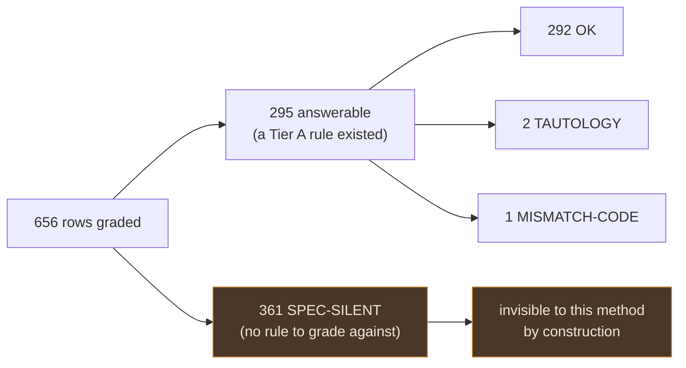

# Test audit — correlated blind spots — what to do with the reports

Rollup and action plan for the "correlated blind spots" test audit (Prompt 1 in the parent
workspace's `0_PROMPTS.md`): does this repo's test suite actually prove the code is correct, or
just prove "the test agrees with the code"? Full method and per-file evidence live in
`reports/audit/correlated-blind-spots/` (gitignored — local working files, not versioned); this
file is the versioned, at-a-glance summary of what's in them and what to do next.

Every row below carries a **status**. Some findings were already fixed before this rollup was
written; two do not survive re-verification against the current tree. See
[What changed in this revision](#what-changed-in-this-revision).

## The headline, stated honestly

The raw result reads as "1 defect in 656 rows examined." That framing overstates what was proven.

**361 of the 656 rows (55%) came back `SPEC-SILENT`** — meaning no Tier A source said anything
about what the test asserts, so the audit could not answer its own question for that row. The
audit's real denominator is the **295 rows where a spec existed to grade against**, and the
result there is 292 OK, 2 tautologies, 1 code defect.

This matters because of what the audit was hunting. A correlated blind spot is code and test
agreeing on the same wrong thing. Where the spec is silent, code and test _always_ agree — there
is nothing for them to drift from. **The 361 SPEC-SILENT rows are precisely where a correlated
blind spot would hide, and the method looked straight past them.** BE-5's own summary names the
casualties: anti-enumeration on login, token entropy and atomicity, cookie `SameSite`/`Secure`
policy — real security properties, correctly implemented, ungraded because no contract states
them.

The proof this isn't theoretical is **X-2** below. The password policy is a genuine rule with no
BE-side Tier A statement, so every BE password test graded SPEC-SILENT while code and test agreed
perfectly on a policy that does not exist server-side. P1's 656 rows missed it entirely. The
cross-repo differential caught it in a single pass.

**The primary output of this audit is therefore not a bug list. It is evidence that the contract,
not the test suite, is the thin layer** — and that the differential pass (P-A) buys more per unit
of effort than the spec-vs-test pass (P1). That inverts the plan's default ordering; see
[What to do, in order](#what-to-do-in-order).

## P1 batches — spec-vs-test, per file audited

| Batch     | Module                               | Rows    | OK       | SPEC-SILENT | TAUTOLOGY | MISMATCH-CODE | MISMATCH-TEST | MISMATCH-SPEC |
| --------- | ------------------------------------ | ------- | -------- | ----------- | --------- | ------------- | ------------- | ------------- |
| BE-1      | Orders lifecycle/totals/money        | 208     | 59       | 148         | 1         | 0             | 0             | 0             |
| BE-2      | Inventory reservations               | 39      | 28       | 10          | 1         | 0             | 0             | 0             |
| BE-3      | Cart & checkout                      | 100     | 32       | 68          | 0         | 0             | 0             | 0             |
| BE-4      | Payments                             | 40      | 32       | 8           | 0         | 0             | 0             | 0             |
| BE-5      | Account & auth (tokens/sessions/JWT) | 145     | ≈55      | ≈89         | 0         | **1**         | 0             | 0             |
| BE-6      | Cross-cutting authorization          | 124     | 86       | 38          | 0         | 0             | 0             | 0             |
| **Total** |                                      | **656** | **≈292** | **≈361**    | **2**     | **1**         | **0**         | **0**         |

Every batch row is internally consistent (columns sum to the row total). BE-5's OK/SPEC-SILENT
split is approximate — that batch's summary used prose ("~55") instead of an exact tally; its
MISMATCH-CODE and total counts are exact.

Zero `S1` findings of any verdict — nothing money/stock/permission/data-exposure-critical was
caught wrong **among the 295 answerable rows**. Read that as scoped, not as an all-clear.

## Findings — status and corrected severity

Severity is split where it matters: a finding can be harmless at runtime and still be a real
defect in what the tests prove. That distinction is the whole point of this audit and the previous
revision collapsed it.

| id                 | status                                                          | runtime impact | test-integrity impact | what                                                                                                                                                                                                                                                                                                                                                                                                                                                                                                                                                                                                                                                                                  |
| ------------------ | --------------------------------------------------------------- | -------------- | --------------------- | ------------------------------------------------------------------------------------------------------------------------------------------------------------------------------------------------------------------------------------------------------------------------------------------------------------------------------------------------------------------------------------------------------------------------------------------------------------------------------------------------------------------------------------------------------------------------------------------------------------------------------------------------------------------------------------- |
| **M-1**            | ✅ **fixed** in `9790d1ab`                                      | —              | —                     | Was: undeclared `404` from `updateProfile` on a since-deleted account. `profile.ts:258` now returns `401` with a comment citing the contract, and `self-service.test.ts:82` is titled _"answers 401, not 404, for an account that no longer exists"_. Nothing to do.                                                                                                                                                                                                                                                                                                                                                                                                                  |
| **X-1**            | 🔍 **re-scored** — open, FE-side                                | **none**       | **real**              | FE's `getTokenFromResponse` reads top-level first, _then falls back to_ `data.token` — it handles both shapes, so login does not break. The defect is that FE's comment claims login answers a bare `{token}` and its fixtures mock that shape, while BE's `LoginResponseEnvelope` requires `data` under `additionalProperties: false`. **FE's auth tests would pass against a server that violates the BE contract.** Fix in the frontend: correct the comment, move the fixtures to the wrapped shape. Keep the tolerant reader.                                                                                                                                                    |
| **X-2**            | 🔴 **escalated** — open, BE-side, security                      | **real**       | real                  | Not `/users` test drift. The shared `Password` schema (`openapi.root.yaml:205-207`) is `minLength: 8` with no pattern, `$ref`'d 18+ times — signup, reset-confirm, password-change, user create/edit. BE has **no** complexity check anywhere in source; the generated Zod is `z.string().min(…)`. FE applies `usersPasswordSchema` (four `.refine()`s) on `Signup.vue`, `PasswordResetConfirm.vue` and the users form. **The password policy exists only in the browser.** Any non-browser client — curl, a mobile app, a script — sets an 8-char all-lowercase password on any flow. Client-side-only validation is not enforcement; there is no "which side to fix" question here. |
| **T-1**            | ⚠️ **open, confirmed**                                          | —              | real                  | `orders/tests/unit/lifecycle.test.ts:164` — `orderActionsFor › agrees with the table it reads`. `actions.transitions` and `actions.cancel` are literal pass-throughs of `statusesReachableFrom`, asserted against a fresh call to the same function. Catches only a wiring bug in the wrapper; zero power over `ORDER_LIFECYCLE` or `canTransition`, which the title implies it covers. Found independently by P1 and the P-B sweep.                                                                                                                                                                                                                                                  |
| **T-1b**           | ⚠️ **open** — _was dropped from the previous rollup_            | —              | real                  | `lifecycle.test.ts:149` — `agrees with both directions of the table`. `statusesReachableFrom(from,a).includes(to)` and `statusesLeadingTo(to,a).includes(from)` both reduce algebraically to `canTransition(from,to,a)`. Same file, same shape, narrower blast radius than T-1: it can only catch the two filter wrappers disagreeing (an arg-order typo). Fix it in the same edit as T-1.                                                                                                                                                                                                                                                                                            |
| **T-2**            | 🔻 **withdrawn as a tautology; downgraded to a weak assertion** | —              | minor                 | `inventory/tests/unit/transitions.test.ts:16` iterates `EVERY_REASON = Object.values(StockMovementReason)` — but `StockMovementReason` is **orval-generated from the OpenAPI root bundle** (`api/models/stockMovementReason.ts`, _"Do not edit manually"_). The enum _is_ the contract; it cannot shrink without a contract edit. That is the independent anchor the audit wanted, so this is not a tautology in the audit's own sense. Its actual weakness is narrower: the assertion checks only shape (`expect.any(Number)`), never a value. Different defect, different fix — pin the deltas, don't "add a spec-anchored assertion" it already has.                               |
| **BE-6 title bug** | ✅ **fixed** in `9790d1ab`                                      | —              | —                     | `authorizations.test.ts:326` now reads _"answers 401, not 403, for an unauthenticated caller"_, matching its assertion.                                                                                                                                                                                                                                                                                                                                                                                                                                                                                                                                                               |

## Coverage gaps — verified against the current tree

Each of these was reported as "no test in scope." Scope was per batch, so some were phantoms: the
test existed, in another batch's file set. **Every "no test in scope" claim needs a repo-wide grep
before it becomes a work item** — that is the systemic lesson from this section.

| gap                                                                                                    | status                                                                                                                                                                                                                                                                                                                                  |
| ------------------------------------------------------------------------------------------------------ | --------------------------------------------------------------------------------------------------------------------------------------------------------------------------------------------------------------------------------------------------------------------------------------------------------------------------------------- |
| BE-4: `cancelById` as a non-admin passing `refund:false` — the "customer cannot waive the refund" rule | ❌ **withdrawn.** `orders/tests/integration/cancel.test.ts:160` (_"refunds a customer whatever they ask for"_) does exactly this and asserts the refund is forced back to `true`. It predates the audit; it was simply outside BE-4's payments-scoped file list.                                                                        |
| BE-2: nothing asserts `runReservationSweep` emits `inventory.reservation_expired`                      | ⚠️ **stands.** No test file anywhere references `RESERVATION_EXPIRED`. The cross-module glue the sweep exists to provide — telling `orders` a hold died — is unverified repo-wide, not just in scope. Compounded by there being no `reservation.expired` channel in `asyncapi.yaml` either, so this is a contract gap _and_ a test gap. |
| BE-3: checkout `addressId` / `shippingAddress` snapshot                                                | ⚠️ **stands, narrowed.** `addressId` appears in no cart or checkout test. `shippingAddress` is pinned as an order _field_ (`orders/tests/unit/schema-contract.test.ts`) but nothing asserts checkout **copies** the address onto the order. The snapshot behaviour is the untested part.                                                |
| BE-3: `reorder`, and `422` for all 7 operations that document it                                       | ⚠️ **stands.** `reorder` appears only in route-wiring and audit tests, never driven end to end.                                                                                                                                                                                                                                         |
| BE-1: stock release on cancel, atomic-cancel race, `hardDelete` any-source-wins merge                  | ⚠️ **stands as stated** — correctly implemented, no assertion that would fail if the specific clause regressed. Lower priority than the above: the code paths do execute under other tests.                                                                                                                                             |
| X-8: `POST /cart/checkout` never driven into `CART_ADDRESS_NOT_FOUND`                                  | ⚠️ **stands.** FE has dedicated asserted handling; BE has no test at any layer. Note P-A explicitly ruled out three lookalikes (`CART_CHANGED`, `CART_PRODUCT_UNAVAILABLE`, `CART_SHIPPING_METHOD_NOT_FOUND`) as tested-elsewhere or doc-drift — this one is the real remainder.                                                        |

## P-A — cross-repo differential (BE vs `boilerplate-vue-frontend`)

**Coverage: 59 of 75 endpoints (auth 23/39, commerce 36/36).** The 16 unchecked endpoints are all
in the auth group — this differential is not complete, and the previous revision presented it as
if it were.

X-1, X-2 and X-8 are covered in the tables above. The remainder are low-urgency drift:

| id  | severity | endpoint                   | disagreement                                                                                                        |
| --- | -------- | -------------------------- | ------------------------------------------------------------------------------------------------------------------- |
| X-3 | S3       | `POST /locales`            | BE treats `direction`/`active` as optional-with-defaults; FE's create schema requires both.                         |
| X-4 | S3       | `PUT /locales/{locale}`    | BE treats every field optional on update; FE's edit schema still requires `name`/`nativeName`/`direction`/`active`. |
| X-5 | S3       | `GET /observability/audit` | Field name: BE `actor_user_id` vs FE `actor`.                                                                       |
| X-6 | S3       | `GET /observability/audit` | Field name: BE `timestamp` vs FE `createdAt`.                                                                       |
| X-7 | S3       | `GET /observability/audit` | FE fixture invents an `id` the BE schema doesn't define (`additionalProperties: false`).                            |

X-5..X-7 are softer than X-1..X-4: the BE side is the module's `openapi.yaml` rather than a live
assertion, because the observability contract test validates against that schema instead of naming
fields literally. They are still three fixtures in a row that would fail against the real endpoint,
which is its own signal about how that FE composable is tested.

**Not yet done**: `boilerplate-vue-frontend` needs its own rollup carrying X-1..X-8, with X-1 and
X-2 stated as re-scored here.

## P-B — tautology sweep, full suite

227 test files scanned. 6 candidates; the two high-confidence ones are **T-1** and P-B #3 below,
the medium one is **T-1b** (restored to the tables above). Zero snapshot tests and zero
schema-self-parse hits in the whole suite — worth recording as a genuine clean result.

- P-B #3 — `inventory/tests/unit/schema-contract.test.ts:38`: `MOVEMENT_REASONS` compared against
  `Object.values(StockMovementReason)`, where `model.ts:22` defines `MOVEMENT_REASONS` as literally
  that expression. Cannot fail unless the import binding breaks. **This one is a real tautology**
  — note the contrast with T-2, which merely _looked_ like one: here both sides are the same
  expression, where T-2's expectation comes from the generated contract. Belongs to BE-7, not yet
  audited.
- The three low-confidence rows (`hashToken` round-trips, `hashBackupCode` determinism,
  `orderTotal` shipping-absence) were inspected and judged legitimate. Recorded as checked, not as
  work.

## P-C — mutation-survivor prior for P2/P3 ordering

Ordering guidance, not findings. Ranking by raw survivor count favours the big `model.ts` files;
ranking by **density and blast radius** gives a different and better order:

- **`src/infrastructure/http/validation-messages.ts` — 49 survivors at a 0% baseline score.** The
  single worst-scoring file in the report: the entire `messageFor` switch survives, including every
  translation-key literal collapsed to `""`. It has a documented contract to grade against
  (`docs/theory/request-flow.md` L197). This is the strongest single-file signal in P-C and the
  previous revision omitted it.
- **`image-signatures.ts` (7) and `image-store.ts` (7)** — small counts, but P-C calls these the
  _tightest_ mutant-to-documented-rule match in scope, and the rule is a security property: magic-byte
  identification is "the defence against an HTML file uploaded as an image," and `image-store.ts` is
  the only path allowed to turn an `imageUrl` into a filesystem path. Five regex variants of the
  URL-scheme detector all survive.
- **`src/modules/users/model.ts` — 62 survivors**, highest raw count, including all 14 variants of
  the email-format regex — the only place `Email: format: email` is actually enforced. Still the
  right first file _within_ BE-7.
- **BE-7 overall** has the most consistent signal: every one of the 12 module `model.ts` files has
  double-digit survivors, many mapping onto a `required:`/`unique:`/`enum:` line the module's
  `openapi.yaml` states in words.
- `src/modules/feedback/repository.ts` — **11 of 11 mutants survive**. A 100% survival rate is a
  qualitatively different signal from a large count, and worth one cheap look regardless of batch order.
- Not from this prior, but adjacent: `orders/controllers/get-order-invoice.ts` has 27 mutants, all
  `NoCoverage` — nothing executes it during the mutation run.
- BE-12's migrations and all of BE-13 sit outside Stryker's `mutate` globs — no data, so run them in
  the plan's default order.

Caveat carried from P-C: `stryker-incremental.json` is a past snapshot. Line numbers have drifted;
treat them as "near here."

## What to do, in order

Ordered by evidence, which is not the order the previous revision gave — M-1 was already done, and
X-2 turned out to be the only finding with live production impact.

1. **X-2 — server-side password policy.** The only open finding with real runtime impact, and it is
   a security one. **Do not add the rule to the shared `Password` schema** — it is `$ref`'d by both
   the flows that _set_ a password and the ones that _prove_ one (`LoginRequest`,
   `ChangePasswordRequest.currentPassword`, `ReauthRequest`), so a blanket pattern locks out every
   account whose password predates the policy. Add a second schema alongside it and repoint only
   the 13 setting sites; keep `Password` permissive for the three proving sites. Then regenerate
   (`npm run regenerate`) and `sync:frontend`.
2. **The SPEC-SILENT security properties.** Write the Tier A text for anti-enumeration on login,
   token entropy and atomicity, and cookie `SameSite`/`Secure` policy. These are already correctly
   implemented — the point is that nothing _states_ them, so no future audit can grade them and no
   regression would be caught as a contract break. This is the audit's main output; treat it as such.
3. **T-1 and T-1b** — one edit, same file. Add an assertion anchored to `BE-1.expectations.md`'s
   E-numbers beside each existing one. Separately, **T-2**'s narrower fix: assert actual delta
   values, not `expect.any(Number)`.
4. **X-1** — frontend only. Correct the comment, move the fixtures to the wrapped shape, keep the
   tolerant reader.
5. **Finish P-A's remaining 16 auth endpoints — before starting BE-7.** The differential found the
   one live defect in this entire audit at a fraction of P1's cost, and it is 78% done. Completing
   it is a better bet than opening a new P2 batch.
6. **The coverage gaps that survived re-verification** — X-8 and the BE-2/BE-3 rows above. BE-2's
   sweep event needs an `asyncapi.yaml` channel first; it is a contract gap before it is a test gap.
7. **X-3..X-7** — requiredness and naming drift, batch together, lowest urgency.
8. **Give `boilerplate-vue-frontend` its own rollup** carrying X-1..X-8 as re-scored here.
9. **BE-7 whenever P2 resumes** — but start with `validation-messages.ts` and the two image
   adapters, then `users/model.ts`, per the reordering above.

## What this method cannot find

Stated so the next pass doesn't re-learn it:

- **Anything the spec is silent about.** 55% of graded rows. By construction.
- **Anything outside a batch's file scope.** Produced at least one phantom gap (BE-4's refund
  waiver). Grep repo-wide before filing.
- **Anything the mutation run never executed.** `NoCoverage` mutants were excluded from the P-C
  prior by design; `get-order-invoice.ts` is a 27-mutant example.
- **Client-side-only enforcement**, unless a differential pass happens to cover the endpoint. X-2
  was invisible to all 656 P1 rows.

## Where the underlying reports live

`reports/audit/correlated-blind-spots/` — gitignored, not versioned:

- `BE-1..6.expectations.md` — the blind spec reads, frozen before any code/test was opened.
- `BE-1..6.findings.md` — the per-`it()` grading against those frozen expectations.
- `P-A.group-auth.candidates.md`, `P-A.group-commerce.candidates.md` — the cross-repo diff detail.
- `P-B.candidates.md` — the tautology-sweep detail.
- `P-C.candidates.md` — the full mutation-survivor tables per P2/P3 batch.

## What changed in this revision

The previous version was written as if the audit's output were still pending. It wasn't, and three
of its claims do not hold against the current tree. Verified changes:

- **M-1 and the BE-6 title bug were already fixed** in `9790d1ab` (_"fix: prompt-1 audit
  follow-ups"_, Sep 1, 20 commits back). The claim "nothing listed below has been fixed yet" was
  false, and M-1 was listed as action item #1.
- **BE-4's refund-waiver gap is a phantom** — the test exists in `orders/tests/integration/cancel.test.ts`,
  outside BE-4's scope.
- **T-2 is not a tautology** — its enum is orval-generated from the contract.
- **X-1 does not break login** — FE's reader handles both envelope shapes. Its real defect is
  FE-side test fixtures.
- **X-2 is bigger than reported** — a repo-wide missing server-side password policy, not `/users`
  test drift.
- **Restored**: P-B's medium-confidence candidate (T-1b), P-A's 59/75 endpoint coverage, and P-C's
  `validation-messages.ts` / image-adapter signals — all present in the source reports, all absent
  from the previous rollup.
- **Added**: the SPEC-SILENT reading, per-finding status, runtime-vs-test-integrity severity, and
  the method's own limits.
