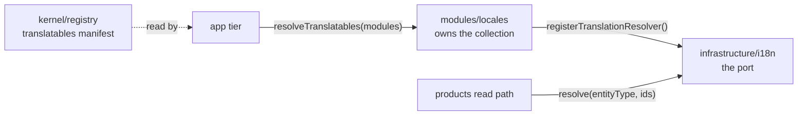

# Translating user-authored content

**Status:** phases 1–4 done, phase 5 backend done. Phase 5's frontend half, and phases 6–9, remain
— see `PRODUCT_WRITE_REWORK.md` for phase 5's own status.

The shop's UI copy is bilingual; its **product content is not**. This document is the agreed design
and the build order.

## The gap, as measured

The shop's UI copy is already bilingual, in two tiers — see `docs/tools/i18n.md` and
`docs/modules/locales.md`:

- **Tier 1** — deployed files (`src/locales/*.json` + every module's `locales/`), loaded into
  i18next at boot. What `t()` resolves: API messages, validation text, email and PDF copy.
- **Tier 2** — the `localeEntries` collection, runtime-editable rows keyed `(locale, tenant, key)`.
  The `backend` tenant overlays tier 1; `frontend` tenants are what a client downloads for its own
  screens.

**Product content has neither tier.** `src/modules/products/model.ts`: `title` and `description`
are single scalar strings; `categories`/`tags` are English slugs that double as facet chip labels.
No product endpoint takes a language parameter. The frontend renders the value verbatim — labels go
through `t()`, the product's own words never do.

The sharpest demonstration is `src/modules/orders/emails.ts:49` (`orderConfirmEmail`): every string
in an order-confirmation email is resolved through a locale-bound `t`, except `item.product.title`,
interpolated raw. An Italian customer receives a fully Italian email listing an English product
name. `src/modules/orders/emails.ts:87` does the same in the PDF invoice.

## The decisions

| Question                            | Decision                                                              |
| ----------------------------------- | --------------------------------------------------------------------- |
| Storage shape                       | A side collection, one row per `(entityType, entityId, locale)`       |
| Does the source language get a row? | **Yes** — every locale is a row, no special case                      |
| Which locale is the source?         | The deployment's `NODE_FALLBACK_LOCALE`. No per-product field         |
| Review workflow                     | **None.** A translator's write is live immediately                    |
| Search                              | Follows the caller's locale, falling back to source                   |
| Fallback chain                      | `it-CH` → `it` → the fallback-locale row. Never a 404                 |
| Permission surface                  | New subject `Translation`, keys `translations.read` / `.manage`       |
| Who writes the source row?          | `productService.create`, from the write payload. Never a caller's job |
| Scope                               | Full: catalogue, orders, emails, demo data, frontend                  |
| Generic or product-specific?        | Generic, driven by a kernel registry entry                            |

The multilingual product write surface these decisions force is its own piece of work — the
existing single-language create and edit endpoints cannot express a product in five languages, and
replacing them reaches the frontend forms too. See `PRODUCT_WRITE_REWORK.md`.

## The row

Unique compound index on `(entityType, entityId, locale)`, resolved server-side so a public read's
wire shape stays `title: string` — the storefront needs no contract change to consume it.

| field          | why it exists                                                                    |
| -------------- | -------------------------------------------------------------------------------- |
| `entityType`   | `'product'` in V1. The registry key — see below.                                 |
| `entityId`     | The translated document's id.                                                    |
| `locale`       | A BCP 47 tag that MUST exist and be `active` in the `locales` collection.        |
| `fields`       | `Record<string, string>` — `{ title, description }` for a product.               |
| `sourceDigest` | Hash of the fallback-locale row's fields at translation time. Mismatch is stale. |
| `origin`       | `machine` or `human` — what a reviewer needs to prioritise.                      |
| `translatedBy` | The `translator` who last wrote it, for the audit trail the roles work added.    |

`sourceDigest` is written, never derived on read, and there is no `stale` flag anywhere. A row
stores the hash of the fallback row as it stood when that row was written; staleness is the
comparison, made when something asks. So writing the fallback locale's copy does not touch, or need
to touch, the other locales' rows — which is what keeps a source edit O(1) instead of O(languages).

No `status` field. Immediate publish was chosen deliberately: the `translator` is a trusted human
role, nobody has asked for review, and a status arm costs a branch in the busiest query in the app.
The field is easy to add later and hard to remove.

## Why a collection, not an embedded map

1. **Translation has its own lifecycle.** Who translated it, when, machine or human, and — the one
   that matters most — _stale_, when the source changed after the translation was made. That is a
   first-class document with its own fields, not a nested blob with none of them.
2. **"Which products lack Italian?" becomes a query.** Against an embedded map it is a `$exists`
   walk over every document; against a collection it is one indexed query.
3. **A read ships one language, not all of them.** An embedded map sends every translated language
   on every request, whatever the caller asked for.
4. **It is its own subject.** A translator gets a key on the translation and never needs
   `products.update` — so a mistranslation can never become a mischanged price.

This is the mainstream shape, which is the point: Rails' `globalize`, Django's `parler`, Strapi's
i18n and Shopify's translatable resources all store translations as side rows keyed by resource and
locale, and Shopify's write API requires a digest of the source for exactly the staleness reason
above.

## Why generic, not `productTranslations`

The gap is products, but the repo will meet it again for category descriptions, CMS pages and
editable email templates. A generic collection costs almost nothing more now and saves the second
migration.

`src/kernel/registry.ts` already has the pattern this needs. `imageTargets`
(`src/kernel/registry.ts:126`) is a `Record<collection, ImageTarget>` a module puts on its manifest,
so a worker that may not import `src/modules/*` can still write back to a module's collection. A
`translatables` manifest entry is the same move: a module declares which of its collections are
translatable, which fields, and which cache tag a write must clear. The translation module resolves
it by `entityType` without importing anything.

It also gives the `translator` role one permission surface instead of one per entity.

**The cost, stated plainly:** the fields are a `Record<string, string>`, not a typed per-entity
schema, so validation moves from the contract to a registry lookup at write time. For a single
product-shaped app that is a downgrade. For a boilerplate whose whole architecture is "modules
register into a kernel", it is the version that matches.

## Where the code lives, and the wall it must not cross

`src/modules/locales/module.ts:6` states it outright: _"No `index.ts`: nothing imports this module
and nothing should."_ `boundaries/dependencies` (`eslint.config.ts:696`) agrees — a module reaches a
sibling through `index.ts` and nothing else.

So the translation resolver **cannot** be an import from `products` into `locales`. It uses the
inversion that module already uses for its own overlay:

- The **port** lives in `@infrastructure/i18n`, beside the existing `registerLocaleOverrideProvider`.
- The **implementation** is registered by `locales/module.ts` at import time.
- The **manifest lookup** is built by the `app` tier, the way `app/workers.ts` builds `imageTargets`.
  The kernel knows that translatables exist, never which ones.

Products never imports locales. No new `index.ts`. No boundary exemption.

## The read path is not the serializer

`applySerialization` returns a `SerializeTransform` — synchronous, one plain object at a time
(`src/infrastructure/persistence/serialize.ts:13`). Resolution is an async batched query over a
whole page, so it belongs in a decorator over `createRepository`'s read path and
`@infrastructure/surfaces/create-search-controller`, not in `applyProductTransform`.

**The locale needs no threading.** `runWithLocaleContext` already carries the negotiated locale down
through services and repositories via AsyncLocalStorage (`src/infrastructure/i18n/context.ts:29`), so
the resolver reads it ambiently and no signature changes. The corollary matters as much: out-of-band
work — the order-confirmation email job — falls outside that chain and must bind explicitly with
`runWithLocale`. That is precisely what makes the email fix possible.

## The derived index column

Every locale being a row means `title`/`description` stop being the product's own data. Three things
in the code lose the column they stand on:

1. `src/modules/products/repository.ts:89` declares `text: ['title', 'description']` and
   `regex: { title: 'title' }`. Both search the source column.
2. `src/modules/products/repository.ts:325` sorts the admin stock board
   `{ available: 1, title: 1, _id: 1 }` — `title` breaks ties so a page boundary cannot show one
   product twice. `tests/cross-cutting/paginated-sort-is-total.test.ts` guards that property.
3. `zodProductSchema` enforces the title's length in `src/modules/products/model.ts`.

**The resolution:** the product document keeps `title`/`description` as a **derived index column** —
written only by the translation write path when the **fallback-locale** row changes, never by hand,
never read by the API response. Mongo keeps something to sort and index on; the wire shape comes
entirely from the resolver.

It is not a second source of truth. It is a materialized copy with exactly one writer.

## Three details, settled

### The source locale is the deployment's, not the product's

No `sourceLocale` field. The fallback bottoms out at `getFallbackLocale()`
(`src/infrastructure/i18n/catalog.ts:26`) — `NODE_FALLBACK_LOCALE`, defaulting to `en`.

That constant already means _"the locale a missing key falls back to"_ for tier 1. Product content
is the same question one tier down, and answering it the same way costs no new field, no migration
and no second concept.

The trade, stated: every product is authored in one deployment-wide language. A marketplace whose
sellers each write in their own would need this per-product, and that is a migration rather than a
config change. This is a single-shop boilerplate; the editor writes in the shop's language.

It also makes the resolver's query cheaper than a per-product source would: the fallback locale is
one known string for the whole page, so the `$in` stays a **single index arm** instead of collecting
each product's own source locale first.

### The translator gets its own subject

New keys `translations.read` and `translations.manage`, on a new CASL subject `Translation`, granted
to the `translator` role.

This is what keeps the founding argument true — _a mistranslation can never become a mischanged
price_. It also does not collide with the existing conformance row _"a translator may not update a
price"_, which asserts `action: update, subject: Product`. A translation write is a different
subject entirely.

**Open, deliberately deferred:** `shared/authorization-keys.yaml` is byte-identical with
`../boilerplate-php-laravel-backend` (verified). Adding a key is a two-repository change, and the
PHP twin would declare a key with no feature behind it. That is a known cost, accepted, to be
handled when the PHP side is next touched.

### The source row is written by the service, never by the caller

`productService.create` (`src/modules/products/service.ts:159`) writes the fallback-locale row as
part of the same operation that writes the product. A caller never has to remember, and the
invariant — a product always has a row to fall back to — holds by construction.

The write payload must carry the fallback locale's fields, or the write is a 422. Which is what
forces the multilingual write surface: see `PRODUCT_WRITE_REWORK.md`.

---

# Build order

Tests are **not** a phase. `CLAUDE.md` requires them in the same change as the behaviour, so each
phase below ships its own — [the test map](#the-test-map) says which suite owes what, and names the
few journeys that can only exist once every phase has landed.

## Phase 1 — Plumbing, no behaviour (done)

- `translatables` on the module manifest (`src/kernel/registry.ts`), mirroring `imageTargets`: per
  collection, the translatable field names and the cache tag a write must clear.
- `resolveTranslatables()` beside `resolveImageTargets`, built by the `app` tier.
- A `registerTranslationResolver` port in `@infrastructure/i18n`.
- Contract fragments: the `Translation` schema and the admin resource in
  `src/modules/locales/openapi.yaml`. **`Product` itself is unchanged** — no `sourceLocale`, and the
  public wire shape stays exactly what it is today.
- `npm run regenerate`.

## Phase 2 — The collection and its writes (done)

- The `translations` collection in the `locales` module, with the compound unique index.
- `GET` / `PATCH` `/translations/{entityType}/{id}` — the admin shape, every locale at once. Merging,
  with `null` deleting one locale's row, exactly as `PRODUCT_WRITE_REWORK.md` specifies for the
  editor's door. The two doors differ in who may use them and what else they may touch, never in how
  a language is written.
- The write validates field names against the registry, and the locale against `locales` (must
  exist and be `active`).
- The write clears the registry-declared cache tag through `invalidateCache`. The precedent exists:
  `infrastructure/adapters/image.worker.ts` already clears the `products` tag from outside the
  module that owns it.
- The write updates the derived index column when the row's locale is `getFallbackLocale()`.
- Permission keys, `shared/authorization-keys.yaml`, and `shared/authorization-conformance.yaml`.

`/translations/{entityType}/{id}` is the **translator's** door and stays generic — it is how a CMS
page or an email template becomes translatable later without a second endpoint. The editor's door,
which writes a product's price and all its languages together, is `PRODUCT_WRITE_REWORK.md`. Two
doors on purpose: only one of them may touch a price.

### Nothing outlives what it describes

A translation row is meaningless once its product or its language is gone, and an orphan is
invisible: nothing lists it, nothing reads it, and it never stops taking space. Both cascades belong
in this phase, with the collection, rather than being discovered later as a cleanup job.

**When a product is deleted.** `productService.remove` (`src/modules/products/service.ts:271`) has
two paths and they are not the same question:

- **Soft delete** flips `deletedAt`, and it is a _flip_ — running it again restores the product. The
  rows MUST survive, or a restore returns a product with no name in any language.
- **Hard delete** destroys the row and its image. The translations go with it, **in the same
  operation**, through the port that already exists for reads. No orphan window, and no boundary
  problem: the port lives in `@infrastructure/i18n`, which every module may import.

Not via the `PRODUCT_DELETED` event, tempting as it looks. That event fires on **both** paths with
an identical `{ productId }` payload, so a subscriber cannot tell a hard delete from a soft one
without an AsyncAPI change — and it would leave a window where the rows are orphaned but not yet
collected.

**When a language is deleted.** It cascades, the way that collection's neighbour already does:
`src/modules/locales/repository.ts:240` deletes a language's dictionary entries in one call, and the
service refuses to delete a language that is still active. Product translations join that cascade,
and the response reports **how many went with it** — `deletedCount` is already the shape there, and
a person retiring a language should see the size of what they are retiring, not discover it after.

Only a real delete cascades. Deactivating a language merely hides it, so "turn Italian off for a
season" costs nothing.

**The fallback locale is not deletable, and not deactivatable.** Every product's source row lives in
it; losing it empties the catalogue in every language at once. This is a guard, not a policy —
`getFallbackLocale()` is refused by the delete and deactivate paths outright.

## Phase 3 — Reads resolve (done)

- A resolver decorator over `createRepository`'s read path and `create-search-controller`.
- One batched `$in` per page: `(entityType, entityId ∈ page, locale ∈ [exact, base, fallback])`,
  merged in fallback order. All three are known strings before the query — the fallback is the
  deployment's, not each product's — so this stays one index arm.
- The locale comes from AsyncLocalStorage. No signature changes anywhere.

## Phase 4 — Search and facets (done)

- `text` and the `title=` filter query the translations collection for the caller's locale, union
  the matching ids, and still reach products whose only row is the source one.
- The admin stock board keeps sorting on the derived index column — behaviour unchanged.
- `categories`/`tags` stay English slugs. The words a shopper reads come from the frontend tier-2
  dictionary keyed by slug, the way `SHIPPING_METHODS` already does in
  `src/modules/delivery/domain/rates.ts:15`.

## Phase 5 — The multilingual write surface (backend done, frontend not started)

Its own document, because it replaces three endpoints and both frontend forms:
**`PRODUCT_WRITE_REWORK.md`**.

Depends on phases 1–3. Everything after this phase assumes a product can be authored in every
language in one request.

## Phase 6 — Orders, emails, PDF

- Order line snapshots freeze **resolved** text plus the locale they froze it in. An order's
  embedded snapshot stops being a `Product`, and `orders/model.ts` has to say so.
- `orderConfirmEmail` (`src/modules/orders/emails.ts:49`) — the motivating bug, fixed by the
  snapshot.
- `invoiceDocument` (`src/modules/orders/emails.ts:87`) — the same.

The invoice PDF renders on demand against `request.locale`
(`src/modules/orders/controllers/get-order-invoice.ts:58`), so an admin reading an Italian
customer's invoice gets Italian **lines** inside English **chrome**. That is correct: the lines are
what was bought.

## Phase 7 — Demo data

Smaller than it looks. `demo/demo-catalog.ts` **generates** its 126 filler rows from 6 animals × 7
product types × 3 tiers; only 6 named products are hand-written.

Translating the demo catalogue is **16 template pieces plus 6 products**, not 132 rows. The
generator emits both languages. Then `db:seed`, `seed:export` and `demo/locales.ts`.

## Phase 8 — Frontend

The API client needs no change: `Accept-Language` is already sent on every request
(`src/infrastructure/http/interceptors.ts:53` in the paired frontend).

The problem is the cache. `useProductsStore` keys its dictionary by product id alone
(`src/modules/products/store.ts`), so switching language leaves English products in the store with
nothing to trigger a refetch. Cart lines, wishlist rows and order history hold product text too.

**Wipe on switch**, rather than keying the toolkit's cache by locale:

- `localeSensitive: true` on the frontend `AppModule` manifest (`src/kernel/registry.ts:135`).
- The locale guard (`src/app/guards/locale-choice.ts`) resets those stores after `changeLanguage`,
  through the toolkit's existing `resetAll()`.

Keying the cache by locale would mean changing `@guebbit/vue-toolkit` — a separately published
package every consumer inherits — to buy an instant switch back to a language already visited.
People pick a language and stay; one refetch is the cheaper trade.

Then the admin translation screens, and `npm run sync:frontend`.

## Phase 9 — Docs

`docs/modules/products.md`, `docs/modules/locales.md`, `docs/tools/i18n.md`,
`docs/demo-ecommerce/translator.md` (its scope genuinely widens), and the role grid in
`docs/demo-ecommerce/index.md`. The resolve-and-fallback path gets a Mermaid diagram.

---

# The test map

Which suite owes what, and to which phase. Placement follows `docs/reference/tests.md`: a test about
one module lives in `src/modules/<module>/tests/`, a test about the system lives in `tests/`.

## Backend

| suite                  | what it must prove                                                                                                                  | phase |
| ---------------------- | ----------------------------------------------------------------------------------------------------------------------------------- | ----- |
| unit (locales)         | The fallback chain: `it-CH` → `it` → fallback locale. Digest computation. The registry refuses an unknown field.                    | 2, 3  |
| unit (products)        | The derived index column is written by the fallback-locale write and by nothing else.                                               | 2     |
| integration (locales)  | The compound index actually refuses a duplicate triple. A write to an inactive locale is refused.                                   | 2     |
| integration (products) | A page of products resolves in ONE query. An untranslated product falls back rather than blanking.                                  | 3     |
| contract (products)    | `Accept-Language: it` returns an Italian `title`, and the wire shape is byte-identical — `additionalProperties: false` still holds. | 3     |
| contract (locales)     | The admin translation resource matches its spec.                                                                                    | 2     |
| integration (system)   | A translation write clears the `products` cache tag, over real HTTP.                                                                | 2     |
| cross-cutting          | Every `translatables` entry names a real collection and real fields — the shape `module-permissions.test.ts` already uses for keys. | 1     |
| cross-cutting          | `paginated-sort-is-total.test.ts` stays green: assert the derived column reaches the stock board's `$sort`, don't assume it.        | 4     |
| cross-cutting          | `seed-conformance.test.ts` extended: every translatable seed row has a fallback-locale row.                                         | 7     |
| cross-cutting          | `authorization-conformance.yaml`: a translator MAY write a product translation, and MAY NOT update a price.                         | 2     |
| integration (locales)  | A hard-deleted product takes its translation rows with it; a soft-deleted one keeps them, and a restore still has every language.   | 2     |
| integration (locales)  | Deleting a language cascades its product translations and reports the count.                                                        | 2     |
| integration (locales)  | The fallback locale cannot be deleted or deactivated.                                                                               | 2     |
| fuzz                   | The spec, hostile: a garbage `Accept-Language`, an unregistered locale, a `q`-value list, a locale that exists but is inactive.     | 3     |
| unit (orders)          | A line snapshot freezes the buyer's language, and the email builder reads it rather than re-resolving.                              | 6     |

`locale-parity.test.ts` is deliberately **not** extended. Its own docblock draws the line: it is
about tier 1, the deployed files, and dynamic completeness of database rows is `entryCount` in
`GET /locales`. A half-translated catalogue must not fail the suite of a repo that does not own the
translation.

## Frontend

| suite          | what it must prove                                                                                                                                                          | phase |
| -------------- | --------------------------------------------------------------------------------------------------------------------------------------------------------------------------- | ----- |
| unit (vitest)  | The kernel collects locale-sensitive modules, and only those stores are reset.                                                                                              | 8     |
| unit (vitest)  | `useProductsStore` drops its dictionary on a locale change and refetches on the next read.                                                                                  | 8     |
| e2e            | `tests/e2e/specs/locale.cy.ts`, extended: switch language on the catalogue, product titles change, a refetch actually happened, switching back restores the first language. | 8     |
| e2e (products) | Searching an Italian word finds a product whose Italian row is the only place that word appears.                                                                            | 8     |
| e2e (admin)    | A translator signs in, edits a product translation, and the storefront shows it — the full invalidation path, end to end.                                                   | 8     |
| visual         | The admin translation screen's snapshot.                                                                                                                                    | 8     |
| a11y           | The admin translation screen.                                                                                                                                               | 8     |

Run the Cypress suites and Stryker separately — they cannot share the machine.

---

# What this does not solve

Multi-language search **relevance**. `src/infrastructure/persistence/search.ts`'s `addTextFilter` is
an unanchored `$regex` scan — no text index, no `default_language`, no stemming, no ranking, in any
language. This plan makes search follow the right locale; it does not make search good. Per-language
analyzers need a real search engine (Atlas Search, OpenSearch), and that is equally true of every
storage shape considered here.

# Blast radius

Product model and contract, the kernel registry, an admin translation resource and its screens, the
products cache tag's invalidation path, free-text search, the admin stock board's sort, order line
snapshots, order-confirmation emails, PDF invoices, facet chips, the demo catalogue generator and
its export, the `translator` role's permission grid, and the paired frontend's store-cache
lifecycle.
