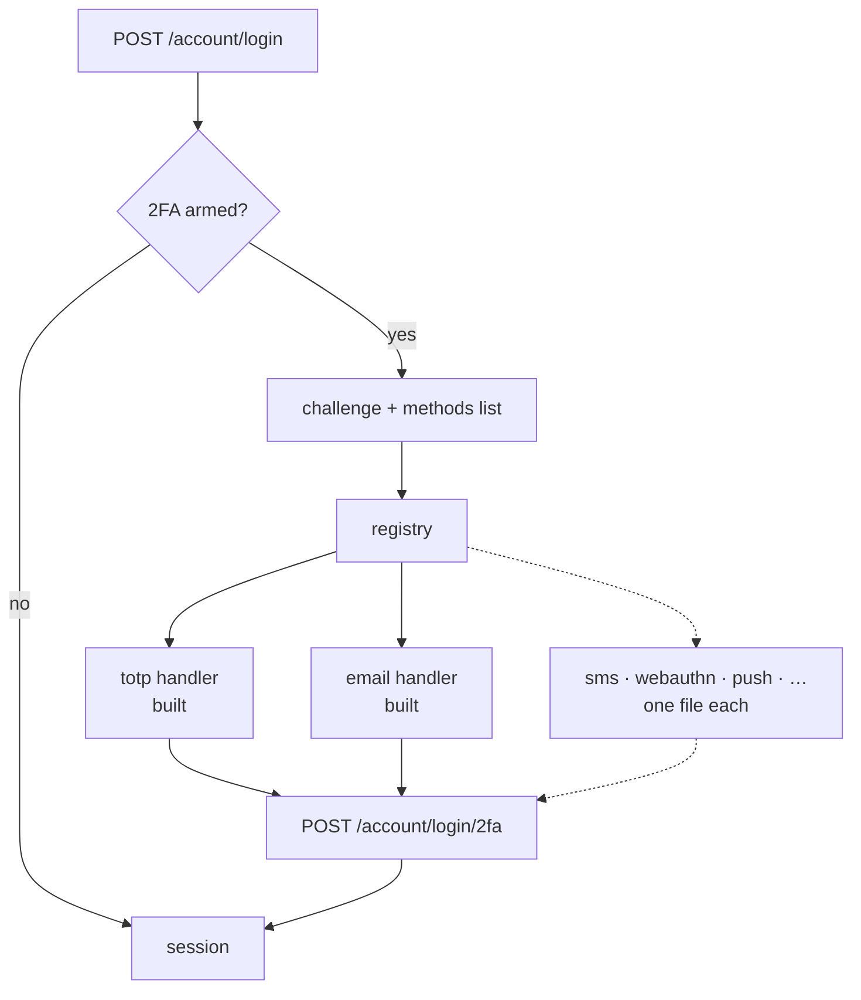

# Second factors: what else we could add, and what each one costs

Status: **`totp` and `email` are built.** Everything below `§3` is a design note, not a plan of
record.

This document exists because the registry made the question cheap to ask. Adding a factor is a
handler file plus copy — no change to the login flow, the contract, the services, or the client —
so the interesting part is no longer "how" but "is this one worth it".

---

## 1. The seam every method plugs into

`src/modules/account/two-factor/registry.ts`:

```ts
interface TwoFactorMethodHandler {
    readonly name: string; // wire name; the contract carries a string, never an enum
    readonly delivers: boolean; // server sends the code, or the user reads it off a device
    available(): boolean; // can THIS DEPLOYMENT run it — SMTP host, provider keys
    eligibility(user): { enrollable; reason? }; // can THIS ACCOUNT — a verified address, a phone
    target(user): string | undefined; // masked destination, server-side
    setup(user, entry, ctx): Promise<TwoFactorSetup>;
    verify(user, entry, code): Promise<boolean>;
    send?(user, entry, ctx): Promise<TwoFactorDelivery>; // exactly when `delivers`
}
```

One storage shape serves all of them (`users.twoFactorMethods[]`): `method`, `enrolledAt`, plus
either device fields (`secret`, `lastUsedStep`) or delivered fields (`codeHash`, `codeExpiresAt`,
`codeSentAt`, `codeAttempts`). A new method that fits this shape needs **no migration**.



## 2. What "adding a method" actually costs

| step             | for a _delivered_ method                                                    | for a _device_ method                        |
| ---------------- | --------------------------------------------------------------------------- | -------------------------------------------- |
| handler file     | ~90 lines, mostly the adapter call                                          | ~50 lines, plus its crypto                   |
| shared machinery | **none** — `delivered-codes.ts` already does TTL, cooldown, attempt ceiling | usually its own                              |
| storage          | none                                                                        | maybe a field, if its secret is not a string |
| contract         | none                                                                        | none, unless setup needs a new field         |
| copy             | one email/SMS template + locale keys                                        | locale keys                                  |
| eligibility gate | usually one: a verified destination                                         | usually none                                 |
| frontend         | none, if it renders from `methods[]`                                        | a new setup view                             |

That asymmetry is the whole point of the split: `sms` is genuinely a small job, `webauthn` is not.

---

## 3. SMS — the obvious next one

**What it is.** A six-digit code by text. Same `delivered` machinery as email, different adapter.

**Cost.** Small, with one real prerequisite: **phone verification does not exist**. `users.phone`
is a free-text profile field nobody has proved control of, so it is not a second factor yet. That
prerequisite is bigger than the handler.

**Worth it?** Only for an audience that will not install an authenticator app and does not trust
email. Be honest about what it buys: NIST has discouraged SMS as an out-of-band authenticator
since SP 800-63B, and SIM-swap is not a hypothetical. It is **weaker than the email factor we
already have**, not stronger — it is a convenience option, not a security upgrade.

**Cost centre nobody remembers:** texts cost money per message, so the send endpoint stops being
merely rate-limited and starts being a billable one. The existing `NODE_MFA_SEND_MAX` budget and
per-code cooldown carry over, but the ceiling wants to be lower.

**Sketch.**

```ts
export const smsMethod: TwoFactorMethodHandler = {
    name: 'sms',
    delivers: true,
    available: () => Boolean(process.env.NODE_SMS_PROVIDER_KEY),
    eligibility: (user) =>
        user.phoneVerified
            ? { enrollable: true }
            : { enrollable: false, reason: t('account.two-factor.phone-unverified') },
    target: (user) => maskPhone(user.phone),
    setup: (u, e, ctx) => deliver(u, e, ctx).then(toSetup),
    send: deliver,
    verify: (_u, entry, code) => Promise.resolve(consumeDeliveredCode(entry, code))
};
```

Line for line, the email handler with a different adapter and a different gate.

---

## 4. WebAuthn / passkeys — the one that is actually better

**What it is.** A platform authenticator (Touch ID, Windows Hello, a phone) or a security key signs
a challenge with a private key that never leaves the device.

**Why it matters.** It is the only option here that is **phishing-resistant**: the signature is
bound to the origin, so a convincing fake login page gets a signature it cannot replay against the
real one. Every code-based method on this list — TOTP included — can be relayed by a proxy in real
time. This is the difference between "harder to phish" and "cannot be phished".

**Cost.** The largest on the list, and the one that stretches the seam:

- Registration is a **two-step ceremony with server-held state** (a challenge nonce), which
  `setup` → `confirm` already models, but the payloads are structured objects rather than a string
  code. `TwoFactorSetup` would grow an `options` field; `verify` would take an object, not
  `code: string`. **This is the one method that changes the handler interface.**
- The stored credential is a public key plus a signature counter — a new shape in
  `twoFactorMethods[]`, so a migration.
- `amr` becomes `['pwd', 'hwk']`, which the array was designed for and nothing yet reads.
- The frontend needs real `navigator.credentials` work, not a text field.
- A library (`@simplewebauthn/server`) is unavoidable; hand-rolling CBOR/COSE attestation parsing
  is not a good use of anyone's week.

**Worth it?** Yes, eventually, and it is the only entry here that would change the security story
rather than the convenience story. It deserves its own plan.

---

## 5. Push approval

**What it is.** "Tap to approve" on a notification, rather than typing digits.

**Cost.** Requires a mobile app, which does not exist. Everything else — a pending-approval record,
polling or a websocket for the result — is straightforward but pointless without one.

**Worth it?** Not until there is an app. And when there is, note the failure mode it introduces:
**MFA fatigue**, where a user bombarded with prompts eventually taps yes. Mitigated by number
matching (show two digits on the login screen, make the user pick them in the app) — which, done
properly, is most of the work.

---

## 6. Email magic link

**What it is.** A signed link in the mail instead of a code to type.

**Cost.** Small: the email factor with a different template and a `GET` route that spends a token.

**Worth it? No — and it is worth writing down why**, because it looks like an easy win.

1. It teaches the reflex we deliberately avoided when writing the code mail: our two-factor email
   carries no link at all, precisely so "click the button in the email" never becomes the habit a
   phishing page relies on. Adding one undoes that on purpose.
2. It breaks cross-device login: the link opens in the mail client's browser, which is not the tab
   holding the challenge, so the session lands in the wrong place.

A code is typed into the tab the user already opened. That is a feature.

---

## 7. Backup / recovery codes

Already built, and worth listing so it is not mistaken for a gap: ten one-time sha256-hashed codes,
minted by whichever method an account arms first, discarded when the last factor goes.

**What is missing** is lifecycle, not the mechanism:

- no way to see how many are left (`backupCodesRemaining` now reports it — the frontend has to show it),
- no regenerate endpoint; burning all ten currently means re-enrolling.

Both are small, both belong with the frontend work rather than here.

---

## 8. Trusted devices — "don't ask again for 30 days"

Not a factor, an **exemption** from one, so it does not fit the registry at all: a signed
device cookie, checked at `POST /account/login` before the challenge is built.

**Worth it?** It is the first thing users ask for after their second week of typing codes, and it
is also the single easiest way to weaken everything above — a stolen device cookie is a bypass with
a month-long lifetime. If it is built: bind it to the account, cap the lifetime hard, list the
trusted devices next to the sessions list, and let "log out everywhere" revoke them too.

---

## 9. Recommendation

1. **Nothing next.** `totp` + `email` covers the realistic audience; the gap that actually costs
   users today is the _frontend_, which has none of it.
2. Then **backup-code lifecycle** — small, and the current dead end (burn ten codes, call an admin)
   is a real one.
3. Then **WebAuthn**, as its own project, because it is the only entry that improves security
   rather than convenience.
4. **SMS only on demand**, and only after phone verification exists. It is weaker than what we
   already ship.
5. **Magic link: no**, for the reasons in §6.
