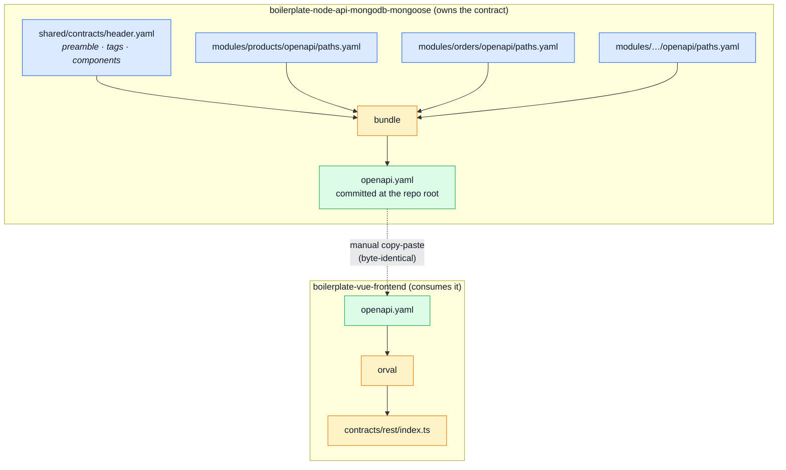

# Contract Ownership & Fragmentation

[OpenAPI Workflow](./openapi-workflow.md) covers **how to change** the contract. This page covers
**who owns it, where it lives, and how it reaches the frontend** — the part that involves two
repositories and is easy to get wrong from either side.

## The one-line version

> This repository **owns** the shared, domain-shaped documents. The frontend **holds
> byte-identical copies** of the four it consumes and never edits them.

## The seven bundles

`openapi.yaml` is not a special case. Seven documents are assembled here from per-module
fragments; the first four also exist in `boilerplate-vue-frontend` as byte-identical copies,
because the frontend's toolchain reads them. The three client collections stay in this repo
only — they are derived from `openapi.yaml`, so a frontend copy could never disagree without
the spec disagreeing first, and nothing there reads them:

| Bundle            | Committed at                                | Fragments live in                                              |
| ----------------- | ------------------------------------------- | -------------------------------------------------------------- |
| `openapi`         | `openapi.yaml`                              | `src/modules/<name>/openapi/{paths,schemas}.yaml`               |
| `asyncapi`        | `asyncapi.yaml`                             | `src/modules/<name>/asyncapi/{channels,messages,schemas}.yaml`  |
| `analytics-events`| `src/infrastructure/observability/analytics-events.ts`| `src/modules/<name>/analytics.fragment.ts`                      |
| `seed-identities` | `db/seeds/seed-identities.ts`               | `src/modules/<name>/seed-identities.fragment.ts`                |
| `bruno`           | `contract.bruno.yml`                        | `src/modules/<name>/dev/bruno.yml` — **generated**              |
| `insomnia`        | `contract.insomnia.json`                    | `src/modules/<name>/dev/insomnia.yml` — **generated**           |
| `mockoon`         | `contract.mockoon.json`                     | `src/modules/<name>/dev/mockoon.{routes,tree}.json` — **generated** |

Whatever more than one domain reads stays in `shared/contracts/`, and each bundle's section order,
layout and shared parts are declared in one file under `scripts/contracts/`.

The first four are authored fragment by fragment. The three client collections are one step longer:
their fragments are themselves generated from `openapi.yaml`, because a hand-written restatement of
the contract is a copy, and copies rot — see [The three client collections](#the-three-client-collections).

```bash
npm run contracts:bundle              # bundle the specs, regenerate the collections, rebuild all seven
npm run contracts:collections         # only the generated collection fragments
npm run check:contracts-bundle        # fail if a bundle is stale or a collection is out of date
```

`tests/cross-cutting/contract-bundles.test.ts` asserts every bundle equals its committed file on
every run, so a fragment edited without re-bundling fails the build rather than drifting.

The three shared files that are **not** bundled are the three that name no domain: `spectral.yaml`
is a lint ruleset, `check-mutation-baseline.ts` and `gen-asyncapi-types.ts` are tooling.
`src/types/asyncapi.ts` is absent for the opposite reason — it is generated from a bundle by
`npm run gen:asyncapi`, so it follows one rather than being one.

## The flow



The picture is drawn for `openapi.yaml`; the other six bundles differ only in what reads the output
(the seed runner, the analytics tracker, three API clients). Three properties fall out of it, and
each is load-bearing:

1. **Fragments are authored here, and only here.** A module owns its slice of every shared document
   the same way it owns its routes and its seeds.
2. **The bundled file stays committed.** It is not a build artefact you can delete — it is what
   `spectral`, `orval`, the seed runner, the API clients and the frontend all read.
3. **The frontend receives finished files.** It does not bundle, does not fragment, does not author.

## Why the root file stays whole

It would be tidier to ship only fragments and bundle on demand. Three reasons not to:

- **The frontend's toolchain reads one file.** `orval.config.ts` there points at `./openapi.yaml`
  three times, and `spectral lint openapi.yaml` runs in both repos.
- **Byte-identity is enforced by a test.** `scripts/specIdentity.ts` compares this repo's copy with
  the frontend's and fails the build when they fork. That check needs one file on each side to
  compare.
- **The comments are part of the document.** `openapi.yaml` currently carries **149 comment lines**
  explaining decisions that no schema can express. No YAML bundler preserves comments, and most
  re-order keys and re-quote strings besides. So the bundler's output must be committed and
  hand-reviewed like any other generated file — not regenerated silently on both sides and assumed
  to match.

That last point is the one that bites. **If the bundle step ever produces different bytes here than
what the frontend holds, `specIdentity` fails and neither repo can build.** Bundle once, commit the
result, copy that.

## Which fragment owns which operation

The rule is the one the module registry already uses: **a module owns the paths under its
`basePath`.** As of today the contract's 82 operations map onto the enabled modules like this:

| Module          | `basePath`       | OpenAPI tag(s)        | Ops |
| --------------- | ---------------- | --------------------- | --- |
| `account`       | `/account`       | `Auth` + `Account`    | 21  |
| `orders`        | `/orders`        | `Orders`              | 12  |
| `users`         | `/users`         | `Users`               | 9   |
| `products`      | `/products`      | `Products`            | 10  |
| `cart`          | `/cart`          | `Cart`                | 7   |
| `wishlist`      | `/wishlist`      | `Wishlist`            | 4   |
| `payments`      | `/payments`      | `Payments`            | 3   |
| `delivery`      | `/delivery`      | `Delivery`            | 3   |
| `inventory`     | `/inventory`     | `Inventory`           | 2   |
| `observability` | `/observability` | `Observability`       | 5   |
| `feedback`      | `/feedback`      | `Feedback`            | 3   |
| `locales`       | `/locales`       | `System` (2 of 3)     | 2   |
| `audit-logs`    | —                | —                     | 0   |

**The two rows that are not a clean split are the interesting ones**, and whoever does the work will
hit them first:

- **`GET /` — the health probe — belongs to no module.** It is the application shell answering for
  itself. It goes in a `shared` or `root` fragment alongside `components:`, not into a module.
- **`audit-logs` has no HTTP surface of its own.** It is read through `GET /observability/audit`,
  which lives in the `observability` fragment. A module with no paths simply contributes no
  fragment — it is not an error, and it is a good sign: that module is consumed through another
  one's API rather than exposing its own.

Also note that `Auth` and `Account` are two tags over one `basePath`. **Fragment by `basePath`, not
by tag** — tags are a documentation grouping and one module may legitimately use several.

## What a fragment contains

Everything the module's paths need and nothing else:

- its `paths:` entries,
- the `components.schemas` only it uses,
- its `tags:` declaration.

Anything used by two or more modules — the error envelope, pagination parameters, the security
schemes — stays in the shared root fragment. **Duplicating a shared schema into two fragments is
the failure mode to watch for**: the bundle will contain two definitions that drift apart silently,
and nothing but a careful reading catches it.

## Practical example: the `products` module

Today `products` already owns everything about itself except its slice of the contract:

```
src/modules/products/
├── module.ts        name, basePath '/products', routes, seeds, locales
├── routes.ts        the express router
├── controllers/     request handling
├── service.ts       business rules
├── repository.ts    persistence
├── model.ts         the mongoose schema
├── events.ts        what it publishes and subscribes to
├── seeds.ts         its own seed data
├── locales/         its own copy
└── tests/           its own specs
```

After fragmentation it also owns `openapi/paths.yaml`, holding the nine operations under
`/products`:

```
GET    /products                POST   /products
PUT    /products                DELETE /products
POST   /products/search         GET    /products/{id}
PUT    /products/{id}           DELETE /products/{id}
DELETE /products/{id}/hard
```

At which point the goal test the whole module architecture exists to satisfy finally includes the
contract:

> Deleting a domain is `rm -rf` of one folder plus removing one line from `src/modules.ts` —
> **and one line from the bundler's input list.**

## Current state

**Done — paths and schemas.** Every operation and every single-domain type now lives with the module
that owns it.

```
shared/contracts/header.yaml          preamble · tags · securitySchemes · parameters · responses
shared/contracts/schemas.yaml         the 20 types more than one module references
shared/contracts/system.schemas.yaml  HealthPing — the shell answering for itself
shared/contracts/paths.header.yaml    the `paths:` key
shared/contracts/system.paths.yaml    GET /
src/modules/<name>/openapi/schemas.yaml
src/modules/<name>/openapi/paths.yaml
```

```bash
npm run contracts:bundle              # rebuild every bundle from the fragments
npm run check:contracts-bundle        # fail if any committed bundle is stale
```

To rebuild one document while iterating, call the script directly —
`npx tsx scripts/bundle-contracts.ts openapi`. Passing the name through
`npm run contracts:bundle --` does not narrow the run; see [Regenerating After a
Change](./regenerating.md#regenerate-one-bundle-only).

`tests/cross-cutting/contract-bundles.test.ts` asserts every bundle equals its committed file on
every run, so a fragment edited without re-bundling fails the build rather than drifting.

### The bundler does not parse YAML, and that is the whole trick

A fragment-and-rebundle round trip cannot reproduce a hand-maintained file through any bundler that
*parses* — measured, not assumed: a `js-yaml` round trip of this document returns 3453 lines from
3062, and none of the 149 comments.

So `scripts/contracts/fragments.ts` never parses. A fragment is a **verbatim slice of the original
lines** — comments, indentation, quoting and key order exactly as written — and bundling is string
concatenation in the order the bundle's section list records. The 149 comments survive **in the
fragments and in the bundle**, which is the property that matters: the explanation now sits in the
module folder it explains.

The one thing concatenation cannot do is separate list items. A JSON array and a TypeScript object
literal need a comma **between** slices and none after the last, which is a property of the join
rather than of any fragment — so a segment is either a file pasted verbatim or a group of files
joined by a separator. Still no parsing, and a module fragment never has to know whether it happens
to be last, which is what keeps deleting a module a one-line change.

### Which schemas stayed shared, and why

73 of the 93 schemas reference nothing outside one module's paths, computed as a transitive closure
over `$ref` rather than guessed from names. The other 20 stayed in `shared/contracts/schemas.yaml`:

| Kind | Examples | Why shared |
| ---- | -------- | ---------- |
| Scalars | `Id`, `Email`, `Password`, `Locale`, `Page`, `PageSize`, `Text`, `ImageUrl` | referenced everywhere |
| Envelope machinery | `PaginationMeta`, `ErrorItem`, `ErrorResponse`, `ValidationErrorResponse`, `MessageResponse` | every operation's failure shape |
| Cross-domain entities | `Product`, `Order`, `OrderItem`, `CartItem`, `User`, `UserEnvelope` | a cart line embeds a product, a checkout returns an order, `account` authenticates the record `users` administers |
| Cross-domain requests | `HardDeleteRequest` | products, users and orders all take it |

**Duplicating one of these into two module fragments is the failure to watch for** — the bundle
would carry two definitions that drift apart silently. Deleting `src/modules/products` today removes
4 paths and 11 schemas and leaves `Product` standing, because order items still embed it; spectral
confirms no `$ref` is left dangling.

### What the split changed in the bundle

Only key ORDER. Parsed and compared ignoring order, the contract before and after is identical, and
orval's generated output does not change at all — which is why the frontend needed nothing but the
new copy of the file.

The 10 by-kind section separators (`# ---------- Request DTOs — Users ----------`) were dropped:
they labelled a grouping the split dissolves. Each fragment carries its own header instead. The
substantive comment blocks — the one explaining why `imageUpload` declares no limits, the one
explaining `active` versus `deletedAt` — travelled with the schemas they explain, which is the whole
point of doing this textually.

What is already true and does not change:

- the module registry, the `basePath` per module, and the one-line enable/disable in `src/modules.ts`
- `npm run lint:openapi`, `npm run gen:api`, and the `specIdentity` check
- the frontend holding a byte-identical copy

## The other six, and what each one taught

### `asyncapi.yaml` — three sections per domain

A domain appears three times in this document (`channels:`, `components.messages:`,
`components.schemas:`), so it contributes three fragments and the key lines between them are
fragments of their own. `observability` owns the SSE channels because the module serving
`/observability/events` decides what it pushes down them. The `worker.*` queues belong to no module
— the email and PDF workers are substrate, enqueued by whichever domain needs a mail sent — so they
sit under `workers` in `shared/contracts/`, exactly as `GET /` sits under `system`.

### `analytics-events.ts` — a name lives with the code that emits it

`PRODUCTS_SEARCHED` is a fact about products and `CART_ITEM_ADDED` one about the cart, and both were
declared in `src/infrastructure/`, the layer that must know no domain at all. Each module now owns its names.

One rule decides which: **the module that emits the event owns it.** So `CHECKOUT_*` sits with
`cart`, because `POST /cart/checkout` is what reports it — delete that module and the two outcomes
leave the funnel along with the endpoint that produced them. The frontend emits the same two names
from its orders store and applies the same rule to its own code, which is why ownership is a
per-repo mapping while the section order, which decides the bytes, is shared. The same is already
true of the REST contract: a path this repo files under `observability` is the frontend's `admin`.

The entries are an object literal, so this is the bundle where the comma-as-separator rule earns its
keep. Prettier's `trailingComma: 'none'` makes it load-bearing: a fragment that ended with a comma
would leave a dangling one before `}` and fail `prettier:check`.

### `seed-identities.ts` — the data follows the runner

`db/seeds/index.ts` already named no domain; the facts its seeders read did not follow. Each domain
now owns its records **and** its interface. What stays shared is what more than one reads: the four
credentials and `ISeedCartItem`, which describes both a line in a cart and a line in an order.

`cart` contributes no fragment, and that is correct rather than an omission — a cart is embedded in
its user, so those records live in the users fragment. A module's own `seeds.ts` still imports from
the **bundle** (`@seed-identities`), not from the fragment beside it: fragments are text, not
modules, and nothing imports one.

### The three client collections — generated, because a restatement is a copy

These were written by hand, and they rotted exactly as a copy does. Measured before the generator
existed:

| | requests | operations missing (of 56) | requests hitting URLs the app no longer serves |
| --- | --- | --- | --- |
| Bruno | 37 | 19 | 0 |
| Mockoon | 37 | 19 | 0 |
| Insomnia | 39 | 47 | **30** |

None of them named a `feedback`, `locales` or `observability` endpoint at all. Mockoon was worse
than incomplete: its bodies predated the response envelope, so it mocked a bare user for `GET
/account` where the API returns `UserEnvelope`, and every error body was the old
`{ success, error, traceId }` shape. **A mock server serving shapes the frontend cannot parse is
worse than no mock server.**

So `scripts/contracts/generateCollections.ts` writes their fragments instead:

- **shapes come from `openapi.yaml`** — every operation, its auth, its request body, one example per
  declared response;
- **values come from `seed-identities.ts`** — `GET /products/{id}` asks for a product the database
  actually holds, and `POST /account/login` sends credentials that work. That is the difference
  between a collection you can click and one you have to fix first;
- **ownership comes from the OpenAPI fragments** — a path in `src/modules/orders/openapi/paths.yaml`
  is the orders module's, so the mapping is recorded once and a path that moves between modules
  moves in all three collections with it;
- **identifiers are hashed from method and path**, not generated fresh, so regenerating rewrites
  only what actually changed rather than re-forking all three files against the frontend's copy.

Two assertions hold it in place: the committed fragments must equal a fresh run, and all three
collections must carry one request per operation the contract declares — which is precisely the
check that was missing while they rotted.

**A request the contract cannot describe still has a home — `dev/probes.yml`.** A collection is
also where you keep the requests that prove the API *rejects* things, and a spec describes valid
calls and their declared answers, so no generator can derive them. A module declares its probes as
data — method, path, headers, body, and a `why` that becomes the description — and they are
generated into Bruno and Insomnia after its contract-derived requests. Not into Mockoon: a mock
server answers requests, it does not send them.

There are 14 today, and each one is a question a contract cannot ask:

| Module | Probes |
| --- | --- |
| `account` | log in as the non-admin · 401 from a bogus token · 409 from a duplicate signup · 429 from the rate limiter |
| `products` | 422 from a body that breaks two constraints · the same product under `Accept-Language: it` · every optional filter at once · the soft-deleted product · the inactive one |
| `cart` | checkout with an empty cart (the `checkout_failed` path) · a product id nothing owns · a quantity of zero |
| `orders` | the owner asking for their own soft-deleted order · another user's order |

A probe refers to seed records as `{{seedSoftDeletedProductId}}` rather than pasting an id — the
tokens are derived from `seed-identities.ts` (the soft-deleted product is *found*, not named), so a
fixture that stops being soft-deleted takes its probe with it instead of leaving one that quietly
tests nothing. An unknown token fails the generator with the list of known ones.

The format differences are the same three as everywhere: Bruno and Insomnia are YAML lists, where an
item needs no separator; Mockoon is JSON, where every route appears twice — once in `routes`, once as
a `rootChildren` reference fixing the order its UI shows them in — so a module owns two Mockoon
fragments and both are joined rather than pasted. A test asserts those two arrays stay in lockstep.

## What the frontend does — and does not — do

Worth stating explicitly, because it is the question that prompted this page:

| | |
| --- | --- |
| Authors the contract | ❌ never |
| Holds a byte-identical copy | ✅ at its own repo root |
| Fragments the spec | ❌ no — it would be a second source of truth for a document it does not own |
| Owns a per-module slice of the contract | ✅ but as **code**, not YAML: `src/modules/<name>/responseSchemas.ts` maps that module's URLs to the generated Zod response schemas |

So both repos end up with per-module contract ownership — this one in YAML, the frontend in
TypeScript — while exactly one of them decides what the contract says.

## How this connects to the rest of the docs

- [OpenAPI Workflow](./openapi-workflow.md) — how to change the contract once you know who owns it
- [Theory / Layers](../theory/layers.md) — where implementation code lands after a spec change
- [Contract Testing](../tools/contract-testing.md) — how the running app is held to the spec
- [API overview](./index.md) — REST conventions used throughout

## Useful links

- [OpenAPI 3.1 specification](https://spec.openapis.org/oas/v3.1.0)
- [Redocly CLI](https://redocly.com/docs/cli/commands/bundle) — `bundle` / `split` for OpenAPI
- [swagger-cli bundle](https://github.com/APIDevTools/swagger-cli#bundle)
- [`$ref` resolution rules](https://swagger.io/docs/specification/using-ref/)
