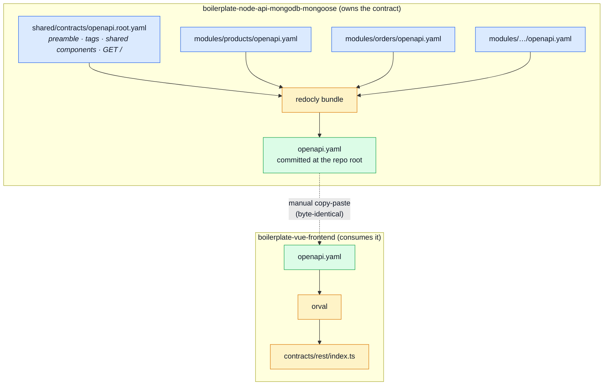

# Contract Ownership & Fragmentation

[OpenAPI Workflow](./openapi-workflow.md) covers **how to change** the contract. This page covers
**who owns it, where it lives, and how it reaches the frontend** — the part that involves two
repositories and is easy to get wrong from either side.

## The one-line version

> This repository **owns** the shared, domain-shaped documents. The frontend **holds
> byte-identical copies** of the two it consumes and never edits them.

## The seven bundles

`openapi.yaml` is not a special case. Seven documents are produced here from per-module
sources; two of them — `openapi` and `asyncapi-public` — also exist in
`boilerplate-vue-frontend` as byte-identical copies, because the frontend's toolchain reads them.
The four client collections stay in this repo only — they are derived from `openapi.yaml`, so a
frontend copy could never disagree without the spec disagreeing first, and nothing there reads
them:

| Bundle            | Written to                                  | Built from                                                     |
| ----------------- | ------------------------------------------- | -------------------------------------------------------------- |
| `openapi`         | `openapi.yaml`                              | `src/modules/<name>/openapi.yaml` — **compiled by `redocly bundle`** |
| `asyncapi`        | `asyncapi.yaml`                             | `src/modules/<name>/asyncapi.yaml` + `shared/contracts/asyncapi.{root,workers}.yaml` — **merged** |
| `asyncapi-public` | `asyncapi.public.yaml`                      | the same sources minus the backend-only ones — the half the frontend receives |
| `bruno`           | `contract.bruno.yml` *(untracked)*          | `openapi.yaml` + the demo dataset — **generated whole**         |
| `insomnia`        | `contract.insomnia.json` *(untracked)*      | `openapi.yaml` + the demo dataset — **generated whole**         |
| `mockoon`         | `contract.mockoon.json` *(untracked)*       | `openapi.yaml` + the demo dataset — **generated whole**         |
| `postman`         | `contract.postman.json` *(untracked)*       | `openapi.yaml` + the demo dataset — **generated whole**         |

Whatever more than one domain reads stays in `shared/contracts/`, and each bundle's section order,
layout and shared parts are declared in one file under `scripts/contracts/`.

**Four different verbs, and the difference is not cosmetic:**

| Bundle                   | Verb          | What does it                                                             |
| ------------------------ | ------------- | ------------------------------------------------------------------------ |
| `openapi.yaml`           | **compiled**  | `redocly bundle` resolves `$ref` across whole documents                  |
| `asyncapi.yaml`          | **merged**    | `scripts/contracts/asyncapi-bundles.ts` copies four maps; `$ref`s stay untouched |
| `asyncapi.public.yaml`   | **merged**    | the same merge over the shared sections only — one `SHARED_SECTIONS` list decides which |
| the 4 client collections | **generated** | produced whole from `openapi.yaml` + the dataset, nothing on disk between; untracked |

A hand-written restatement of the contract is a copy and copies rot, which is why the last row
exists at all. See [The client collections](#the-client-collections-generated).

```bash
npm run contracts:bundle              # build the committed specs
npm run contracts:bundle -- bruno     # one collection, from the committed contract
npm run check:contracts-bundle        # fail if any committed bundle is stale
```

`tests/cross-cutting/contract-bundles.test.ts` asserts every bundle equals its committed file on
every run, so a fragment edited without re-bundling fails the build rather than drifting.

Nothing else is shared. `shared/contracts/spectral.yaml`, `check-mutation-baseline.ts`, `report-test-results.ts` and
`generate-asyncapi-types.ts` were on the list once, hand-maintained on both sides and compared but never
written — a fork in one of those was a question (which copy is right?) that no script could answer.
They came off it: the two repos still keep them identical because it is convenient, and convenience
does not earn a gate. `src/types/asyncapi.generated.ts` is absent for the opposite reason — it is generated from a bundle by
`npm run gen:asyncapi`, so it follows one rather than being one. `asyncapi.yaml` is absent for a third:
it is a bundle, but not a SHARED one — the frontend receives `asyncapi.public.yaml` instead, so the
full contract is compared against nothing and is marked `shared: false` to say so.

## The flow



The picture is drawn for `openapi.yaml`; the other five bundles differ only in what reads the output
(the realtime type generator, four API clients). Three properties fall out of
it, and each is load-bearing:

1. **Fragments are authored here, and only here.** A module owns its slice of every shared document
   the same way it owns its routes and its seeds.
2. **The bundled file stays committed.** It is not a build artefact you can delete — it is what
   `spectral`, `orval`, the seed runner, the API clients and the frontend all read.
3. **The frontend receives finished files.** It does not bundle, does not fragment, does not author.

## Why the root file stays whole

It would be tidier to ship only fragments and bundle on demand. Three reasons not to:

- **The frontend's toolchain reads one file.** `orval.config.ts` there points at `./openapi.yaml`
  three times, and Spectral lints `openapi.yaml` in both repos.
- **Byte-identity is enforced by a test.** `scripts/pairing/spec-identity.ts` compares this repo's copy with
  the frontend's and fails the build when they fork. That check needs one file on each side to
  compare.
- **Regeneration is not reproducible across repos.** `redocly bundle` output depends on the
  installed CLI version, so two repos bundling independently can produce different bytes from the
  same sources. The output must be committed and copied, not rebuilt on both sides and assumed to
  match.

That last point is the one that bites. **If the bundle step ever produces different bytes here than
what the frontend holds, `check:spec-identity` fails and neither repo can build.** Bundle once, commit the
result, copy that.

The comments do **not** travel into `openapi.yaml` — a parse cannot keep them, and Redocly parses.
They live in the module documents instead, which is where they are read and edited; the 252 comment
lines across the sources are asserted by `contract-bundles.test.ts`. See
[Why the REST contract stopped concatenating](#why-the-rest-contract-stopped-concatenating-and-the-rest-did-not).

## Which fragment owns which operation

The rule is the one the module registry already uses: **a module owns the paths under its
`basePath`.** As of today the contract's 82 operations map onto the enabled modules like this:

| Module          | `basePath`       | OpenAPI tag(s)        | Ops |
| --------------- | ---------------- | --------------------- | --- |
| `account`       | `/account`       | `Auth` + `Account`    | 21  |
| `orders`        | `/orders`        | `Orders`              | 11  |
| `users`         | `/users`         | `Users`               | 9   |
| `products`      | `/products`      | `Products`            | 10  |
| `cart`          | `/cart`          | `Cart`                | 8   |
| `wishlist`      | `/wishlist`      | `Wishlist`            | 4   |
| `payments`      | `/payments`      | `Payments`            | 3   |
| `delivery`      | `/delivery`      | `Delivery`            | 3   |
| `inventory`     | `/inventory`     | `Inventory`           | 5   |
| `observability` | `/observability` | `Observability`       | 5   |
| `feedback`      | `/feedback`      | `Feedback`            | 3   |
| `locales`       | `/locales`       | `System` (2 of 3)     | 2   |
| `audit-logs`    | —                | —                     | 0   |

**The two rows that are not a clean split are the interesting ones**, and whoever does the work will
hit them first:

- **`GET /` — the health probe — belongs to no module.** It is the application shell answering for
  itself. It goes in a `shared` or `root` fragment alongside `components:`, not into a module.
- **`audit-logs` has no HTTP surface of its own.** It is read through `GET /observability/audit`,
  which lives in the `observability` fragment. A module with no paths simply contributes no
  fragment — it is not an error, and it is a good sign: that module is consumed through another
  one's API rather than exposing its own.

Also note that `Auth` and `Account` are two tags over one `basePath`. **Fragment by `basePath`, not
by tag** — tags are a documentation grouping and one module may legitimately use several.

## What a fragment contains

Everything the module's paths need and nothing else:

- its `paths:` entries,
- the `components.schemas` only it uses,
- its `tags:` declaration.

Anything used by two or more modules — the error envelope, pagination parameters, the security
schemes — stays in the shared root fragment. **Duplicating a shared schema into two fragments is
the failure mode to watch for**: the bundle will contain two definitions that drift apart silently,
and nothing but a careful reading catches it.

## Practical example: the `products` module

Today `products` already owns everything about itself except its slice of the contract:

```
src/modules/products/
├── module.ts        name, basePath '/products', routes, seeds, locales
├── routes.ts        the express router
├── controllers/     request handling
├── service.ts       business rules
├── repository.ts    persistence
├── model.ts         the mongoose schema
├── events.ts        what it publishes and subscribes to
├── demo.ts         its own seed data
├── locales/         its own copy
└── tests/           its own specs
```

After fragmentation it also owns `openapi.yaml`, holding the ten operations under
`/products`:

```
GET    /products                POST   /products
PUT    /products                DELETE /products
POST   /products/search         GET    /products/categories
GET    /products/{id}           PUT    /products/{id}
DELETE /products/{id}           DELETE /products/{id}/hard
```

At which point the goal test the whole module architecture exists to satisfy finally includes the
contract:

> Deleting a domain is `rm -rf` of one folder plus removing one line from `src/modules.ts` —
> **and one line from the bundler's input list.**

## Current state

**Done — paths and schemas.** Every operation and every single-domain type now lives with the module
that owns it.

```
shared/contracts/openapi.root.yaml    preamble · tags · securitySchemes · parameters · responses ·
                                      the 20 shared types · GET / · the per-module path index
src/modules/<name>/openapi.yaml       one standalone OpenAPI document per module:
                                      its paths, and the schemas only its paths reference
```

```bash
npm run contracts:bundle              # rebuild every bundle from the fragments
npm run check:contracts-bundle        # fail if any committed bundle is stale
```

To rebuild one document while iterating, name it: `npm run contracts:bundle -- openapi`. The
ordering lives inside `scripts/contracts/build-bundles.ts` rather than as an `&&` chain in `package.json`,
which is what makes that flag narrow the run instead of silently doing everything else. See
[Regenerating After a Change](./regenerating.md#regenerate-one-bundle-only).

`tests/cross-cutting/contract-bundles.test.ts` asserts every bundle equals its committed file on
every run, so a fragment edited without re-bundling fails the build rather than drifting.

### Why the REST contract stopped concatenating, and the rest did not

The other bundles are still built by pasting verbatim line slices together, because a parse destroys
what they carry — measured, not assumed: a `js-yaml` round trip of the old `openapi.yaml` returned
3453 lines from 3062, and none of the 149 comments.

`openapi.yaml` no longer needs that guarantee, because **the question changed from "does the bundle
keep its comments" to "do the sources keep theirs"**. A module's contract is now a whole OpenAPI
document rather than a slice of one, so the explanations sit in the file that is actually read and
edited, and the bundle is an artefact nobody opens by hand. Once that is true, `redocly bundle` does
the job the standard way — resolving `$ref` — and the 252 comments across the sources are untouched
by it.

What this bought, beyond deleting a custom bundler:

- **A module contract is a valid document.** `npm run lint:openapi:modules` lints each one on its
  own; you can open one in Swagger Editor. A slice was only valid once pasted.
- **Refs are checkable where they are written.** A module `$ref`s the root across a file boundary
  instead of assuming a neighbour's text will be concatenated above it.
- **The layout is one every tool already understands** — no section-order file, no indentation
  contract between files.

**The anchors had to go, and that is what made it possible at all.** The old fragments shared the
success-envelope preamble through YAML anchors (`*envelopeSuccess`, 84 uses across 13 files) whose
definitions lived in `shared/contracts/schemas.yaml`. A YAML anchor cannot cross a file, which is <!-- doc-paths:ignore -->
precisely why nothing could ever parse a fragment. They are named schemas now — `EnvelopeSuccess`,
`EnvelopeStatus`, `EnvelopeMessage` — which is the same sharing expressed in a way a `$ref` can
reach. `additionalProperties: false` is unaffected: it constrains property *names*, so a `$ref` at a
property's value position is not the `allOf` problem the anchors were avoiding. The migration was
verified by dereferencing both contracts and deep-comparing: **82 operations before and after, three
added schemas, nothing else.**

Concatenation is gone entirely. `scripts/contracts/bundle-kinds.ts` used to hold a general
segment/separator engine for every bundle; once the REST and AsyncAPI contracts moved to whole
documents, nothing declared a segment any more and it was removed. The last holdout was the
analytics catalogue, which spliced verbatim line slices out of each module's `analytics.ts` so the
comments explaining a name would reach the other repo — it went with the catalogue itself, below.

### Which schemas stayed shared, and why

The split was computed as a transitive closure over `$ref` rather than guessed from names. Measured
2026-08-16: the bundle declares **133 schemas, 107 of them owned by exactly one module** and
**26 in `shared/contracts/openapi.root.yaml`**:

| Kind | The 26 | Why shared |
| ---- | -------- | ---------- |
| Scalars | `Id`, `Email`, `Password`, `Locale`, `Page`, `PageSize`, `Text`, `ImageUrl` | referenced everywhere |
| Envelope machinery | `EnvelopeSuccess`, `EnvelopeStatus`, `EnvelopeMessage`, `PaginationMeta`, `MessageResponse`, `ErrorItem`, `ErrorResponse`, `ValidationErrorResponse` | every operation's success and failure shape |
| Cross-domain entities | `Product`, `Order`, `OrderItem`, `OrderAddress`, `CartItem`, `User`, `UserEnvelope` | a cart line embeds a product, a checkout returns an order, `account` authenticates the record `users` administers |
| Cross-domain requests | `HardDeleteRequest` | products, users and orders all take it |
| The shell's own | `HealthPing`, `HealthPingEnvelope` | `GET /` belongs to no module, so neither does its answer |

The per-module counts are the same measurement from the other side: `account` 22, `products` 14,
`observability` 11, `inventory` 12, `cart` 10, `users` 10, `orders` 8, `delivery` 7, `feedback` 7,
`locales` 4, `payments` 4, `wishlist` 4.

**Duplicating one of these into two module fragments is the failure to watch for** — the bundle
would carry two definitions that drift apart silently. Deleting `src/modules/products` today removes
5 paths and its 14 schemas and leaves `Product` standing, because order items still embed it;
spectral confirms no `$ref` is left dangling.

### What the split changed in the bundle

Only key ORDER. Parsed and compared ignoring order, the contract before and after is identical, and
orval's generated output does not change at all — which is why the frontend needed nothing but the
new copy of the file.

The 10 by-kind section separators (`# ---------- Request DTOs — Users ----------`) were dropped:
they labelled a grouping the split dissolves. Each fragment carries its own header instead. The
substantive comment blocks — the one explaining why `imageUpload` declares no limits, the one
explaining `active` versus `deletedAt` — travelled with the schemas they explain, which is the whole
point of doing this textually.

What is already true and does not change:

- the module registry, the `basePath` per module, and the one-line enable/disable in `src/modules.ts`
- `npm run lint:openapi`, `npm run gen:api`, and the `check:spec-identity` check
- the frontend holding a byte-identical copy

## The other five, and what each one taught

### `asyncapi.yaml` — one whole document per section, merged

A domain appears three times in this document (`channels:`, `components.messages:`,
`components.schemas:`), and it used to contribute a fragment for each — `channels.yaml`,
`messages.yaml`, `schemas.yaml`, with the key lines between them being fragments of their own.
That is gone. **A section is now one complete AsyncAPI document**: `src/modules/<name>/asyncapi.yaml`
for a domain, exactly as it carries one `openapi.yaml`, and
`shared/contracts/asyncapi.workers.yaml` for the `worker.*` queues that belong to no domain — the
async twin of filing `GET /` under `system`. Each section also declares the SERVER its channels bind
to, so a bundle that leaves a section out leaves its transport out with it — which is what produces
`asyncapi.public.yaml` without a second list of servers to keep in step.
`shared/contracts/asyncapi.root.yaml` holds what
describes the deployment rather than a domain, and no channels.

`observability` owns the SSE channels because the module serving `/observability/events` decides
what it pushes down them, and it is the only module with a channel today. The `worker.*` queues are
shared because the email and PDF workers are substrate, enqueued by whichever domain needs a mail
sent.

What that bought is the property a fragment could never have: **each section is valid on its own** —
lintable by `npm run lint:asyncapi:modules`, and openable in AsyncAPI Studio. `channels.yaml` and
its two siblings were half-objects that parsed as nothing until concatenated in the right order at
the right indentation.

**Why this is a merge and not `asyncapi bundle`.** The obvious symmetry, once the sources are whole
documents, is to shell out to `@asyncapi/cli` the way `openapi` shells out to Redocly. It was tried
and it does the wrong thing: **`asyncapi bundle` dereferences.** Every `$ref` is inlined, the
document grows from 239 lines to 819, each payload is repeated once per channel that names it *and*
kept under `components` — and `scripts/contracts/generate-asyncapi-types.ts`, which walks
`channels[*].{publish,subscribe}.message.$ref` to decide what to name a generated model, is left
with nothing to follow. So the merge happens in about thirty lines in
`scripts/contracts/asyncapi-bundles.ts`, deliberately dumber than a bundler: it copies four maps and
refuses on a collision, carrying `$ref` strings across untouched because every section already
resolves its own refs internally. That file's header is the full argument, and it is the file to
read before anyone tries the symmetry again.

### The analytics names — the bundle that stopped being one

`PRODUCTS_SEARCHED` is a fact about products and `CART_ITEM_ADDED` one about the cart, and both were
declared in `src/infrastructure/`, the layer that must know no domain at all. Each module now owns
its names — as **ordinary TypeScript**, in `src/modules/<name>/analytics.ts`, exported as a normal
`as const` its own controllers import and augmenting the analytics port's `AnalyticsEventMap` exactly
as `audit.ts` augments `AuditActionMap`.

**The bug that started it.** A single catalogue said which names EXIST and never which side EMITS
them, both repos held it, and both fired most of it. One add-to-cart wrote two indistinguishable
rows into Umami, and every count built on those names read twice reality.

The first answer was a published half. Names only a browser could produce were declared in
`shared/contracts/analytics.frontend.ts`, bundled into
`src/infrastructure/observability/analytics-events.frontend.ts` and carried to the frontend, which
imported them; a module's own names were never published, because its controllers import them
directly and a copy would have no reader on either side. A cross-cutting test walked both scopes and
rejected a name declared twice anywhere.

**The second answer was to publish nothing, and it is the one that stands.** Looked at again, the
client's half held four names and three of them were not client-only at all:

| Name | Why it left |
| ---- | ----------- |
| `app_started`, `app_ready` | the Umami tag writes a pageview on load by itself — these restated it |
| `user_logged_out` | both logout routes are real requests this API answers, so it is emitted here, from `logoutCurrentSession` and `tokenRemoveAll` |
| `checkout_request_failed` | a request that never arrived is already a failed span in the frontend's Faro tracing |

So the frontend emits no custom events, the file crossing the boundary is gone, and with it the
bundle, the `sync:frontend` entry and the `check:spec-identity` row. Every name in the shared Umami
website is written in exactly one place — a module's `analytics.ts` — which is a stronger guarantee
than the check it replaced, because there is no second catalogue left to disagree with.

What survives is the sweep: `tests/cross-cutting/analytics-events.test.ts` reads every
`src/modules/<name>/analytics.ts` off disk and rejects two modules claiming one constant name or one
event string, a name outside the convention, or a module that exports names without the
`declare module` block that puts them in `AnalyticsEventMap`. No list to maintain, and a module
added or deleted changes nothing but its own folder.

The lesson worth keeping: **a shared artefact is only worth its machinery when both sides really
write.** The split scope was the right fix for a real double count; the empty half was the sign that
the whole document could go.

### The demo dataset — not a bundle at all, any more

It used to be one. `db/seeds/seed-identities.ts` was assembled from a <!-- doc-paths:ignore -->
`seed-identities.fragment.ts` in every module, for the same reason as everything else on this page:
the frontend needed the same records, one file had to hold them, and no module should own a file
that lists every domain.

It is gone, and the machinery went with it. The dataset is now **published rather than assembled**:
`npm run seed:export` seeds a throwaway database with the real seeders and writes what the API
answers to `db/demo/demo-data.json`. Each module states its records in an ordinary
`src/modules/<name>/demo.ts` that its own code imports — no fragment, no text concatenation, no
staleness check on this CLI. `npm run check:seed-export` is its equivalent.

The reason is worth keeping, because it is the one case on this page where fragmenting the SOURCE
was the wrong answer. Sharing facts left each repo writing its own mapper over them, and the mappers
drifted where the facts could not: the frontend's mock hand-wrote `active: true` and `verified: true`
from a reading of the backend's schema defaults and omitted `locale` entirely. Fragmenting a
document is right when both repos consume the same document. When what they actually need is the
same ANSWER, publish the answer. See `docs/tools/mongodb-mongoose.md`.

### The client collections — generated, because a restatement is a copy {#the-client-collections-generated}

These were written by hand, and they rotted exactly as a copy does. Measured before the generator
existed:

| | requests | operations missing (of 56) | requests hitting URLs the app no longer serves |
| --- | --- | --- | --- |
| Bruno | 37 | 19 | 0 |
| Mockoon | 37 | 19 | 0 |
| Insomnia | 39 | 47 | **30** |

None of them named a `feedback`, `locales` or `observability` endpoint at all. Mockoon was worse
than incomplete: its bodies predated the response envelope, so it mocked a bare user for `GET
/account` where the API returns `UserEnvelope`, and every error body was the old
`{ success, error, traceId }` shape. **A mock server serving shapes the frontend cannot parse is
worse than no mock server.**

So `scripts/contracts/client-collections-bundle.ts` produces them instead — **one committed file per
tool, generated whole.** There is no intermediate on disk: no per-module slice to hand-edit, no
header to keep in step with a footer, and nothing under `src/` that must never be opened.

The traversal, the example synthesis and the four emitters live in
[`@guebbit/openapi-runnable-collections`](https://www.npmjs.com/package/@guebbit/openapi-runnable-collections),
which knows nothing about this repo. That file is **configuration**: which module owns which path,
where the values come from, where the probes are, and where the output lands. Everything below is a
property of that configuration rather than of the package.

- **shapes come from `openapi.yaml`** — every operation, its auth, its request body, one example per
  declared response;
- **values come from `db/demo/demo-data.json`** — `GET /products/{id}` asks for a product the database
  actually holds, and `POST /account/login` sends credentials that work. That is the difference
  between a collection you can click and one you have to fix first. It is also why the examples carry
  real derived values: an order's `totalPrice` is the number the serializer computed, not arithmetic
  this file repeated;
- **ownership comes from the module contracts** — a path in `src/modules/orders/openapi.yaml`
  is the orders module's, so the mapping is recorded once and a path that moves between modules
  moves in all four collections with it;
- **identifiers are hashed from method and path**, not generated fresh, so regenerating rewrites
  only what actually changed rather than re-forking all three files.

Two assertions hold it in place: each committed collection must equal a fresh run, and every
collection must carry one request per operation the contract declares — which is precisely the
check that was missing while they rotted.

**A request the contract cannot describe still has a home — `src/modules/<name>/probes.ts`.** A
collection is also where you keep the requests that prove the API *rejects* things, and a spec
describes valid calls and their declared answers, so no generator can derive them. A module declares
its probes as data — method, path, headers, body, and a `why` that becomes the description — and
they are emitted after its contract-derived requests. Not into Mockoon: a mock server answers
requests, it does not send them.

They are TypeScript rather than YAML, and the generator is called with them directly. That buys two
things a data file cannot: the seed tokens and the probe shape are typechecked, and a module deleted
without its probes leaving `scripts/contracts/client-collections-bundle.ts` stops the build — which is the
failure [module lifecycle](../theory/module-lifecycle.md) asks for, rather than a collection that
silently comes out short.

There are 14 today, and each one is a question a contract cannot ask:

| Module | Probes |
| --- | --- |
| `account` | log in as the non-admin · 401 from a bogus token · 409 from a duplicate signup · 429 from the rate limiter |
| `products` | 422 from a body that breaks two constraints · the same product under `Accept-Language: it` · every optional filter at once · the soft-deleted product · the inactive one |
| `cart` | checkout with an empty cart (the `checkout_failed` path) · a product id nothing owns · a quantity of zero |
| `orders` | the owner asking for their own soft-deleted order · another user's order |

A probe refers to seed records as `{{seedSoftDeletedProductId}}` rather than pasting an id — the
tokens are derived from `demo-data.json` (the soft-deleted product is *found*, not named), so a
fixture that stops being soft-deleted takes its probe with it instead of leaving one that quietly
tests nothing. An unknown token fails the generator with the list of known ones.

**Two serialisations, four tools.** Bruno and Insomnia are YAML; Mockoon and Postman are JSON.
Mockoon needs one thing the others do not — every route appears twice, once in `routes` and once as
a `rootChildren` reference fixing the order its UI shows them in — and the generator handles that
inside its own document rather than leaving two lists for this repo to keep in step. A test still
asserts the two arrays match.

**Why Postman is its own emitter and not a renamed Insomnia**, since the two look interchangeable
from outside: Insomnia exports `collection.insomnia.rest/5.0` YAML, while Postman reads Collection
Format v2.1 JSON, which splits a URL into `raw`/`host`/`path`/`query` and reads the *parts* rather
than the string. The compatibility runs one way only — Insomnia imports Postman, Postman does not
import Insomnia — so one emitter could not have served both.

## What the frontend does — and does not — do

Worth stating explicitly, because it is the question that prompted this page:

| | |
| --- | --- |
| Authors the contract | ❌ never |
| Holds a byte-identical copy | ✅ at its own repo root |
| Fragments the spec | ❌ no — it would be a second source of truth for a document it does not own |
| Owns a per-module slice of the contract | ✅ but as **code**, not YAML: `src/modules/<name>/responseSchemas.ts` maps that module's URLs to the generated Zod response schemas |

So both repos end up with per-module contract ownership — this one in YAML, the frontend in
TypeScript — while exactly one of them decides what the contract says.

## How this connects to the rest of the docs

- [OpenAPI Workflow](./openapi-workflow.md) — how to change the contract once you know who owns it
- [Theory / Layers](../theory/layers.md) — where implementation code lands after a spec change
- [Contract Testing](../tools/contract-testing.md) — how the running app is held to the spec
- [API overview](./index.md) — REST conventions used throughout

## Useful links

- [OpenAPI 3.1 specification](https://spec.openapis.org/oas/v3.1.0)
- [Redocly CLI](https://redocly.com/docs/cli/commands/bundle) — `bundle` / `split` for OpenAPI
- [swagger-cli bundle](https://github.com/APIDevTools/swagger-cli#bundle)
- [`$ref` resolution rules](https://swagger.io/docs/specification/using-ref/)
