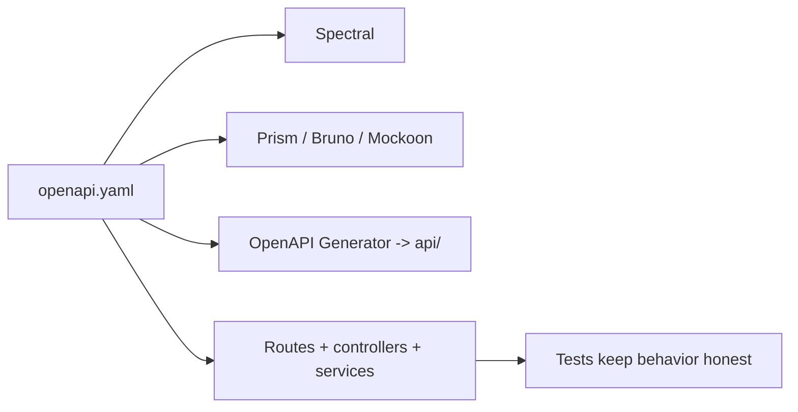

# API

This section explains the REST contract and the tools around it.

## API in one view

## What matters most here

- [`openapi.yaml`](./openapi-workflow.md#openapi-is-the-source-of-truth) is the source of truth.
- The REST API should stay boring, predictable, and reusable.
- This is a **boilerplate contract**, so examples stay generic on purpose.
- Do **not** explode docs into one page per request or response type; keep things grouped by workflow and style.

## Read by task

| Need | Go to |
| --- | --- |
| Change the contract and related tooling | [OpenAPI Workflow](./openapi-workflow.md) |
| Understand route style and response patterns | [REST Style](./rest-style.md) |
| Understand why implementation is layered this way | [Theory](../theory/) |

## Repo-specific reminder

This repo is the **REST API** flavor of the boilerplate family.
So this section focuses on contract-first backend work, not UI pages, monorepo boundaries, or deep domain rules.
