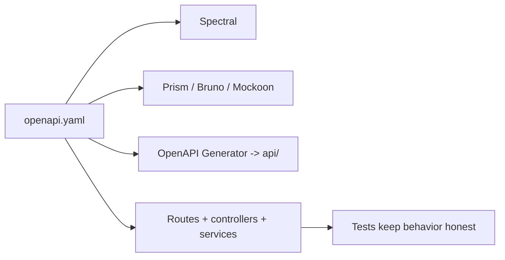

# API

This section explains the API contracts and the tools around them.

## API in one view

## What matters most here

- [`openapi.yaml`](./openapi-workflow.md#openapi-is-the-source-of-truth) is the source of truth for REST.
- [`asyncapi.yaml`](./asyncapi-workflow.md#asyncapi-is-the-async-contract-source-of-truth) is the source of truth for async contracts.
- The REST API should stay boring, predictable, and reusable.
- This is a **boilerplate contract**, so examples stay generic on purpose.
- Do **not** explode docs into one page per request or response type; keep things grouped by workflow and style.

## Read by task

| Need | Go to |
| --- | --- |
| Change the contract and related tooling | [OpenAPI Workflow](./openapi-workflow.md) |
| Change WebSocket/SSE/event contracts | [AsyncAPI Workflow](./asyncapi-workflow.md) |
| Understand route style and response patterns | [REST Style](./rest-style.md) |
| Understand the app layers behind the API | [Theory / Layers](../theory/layers.md) |
| Understand runtime, cache, and observability tools around the API | [Tools](../tools/) |

## Repo-specific reminder

This repo is the **REST API** flavor of the boilerplate family.
So this section focuses on contract-first backend work, not UI pages, monorepo boundaries, or deep domain rules.
