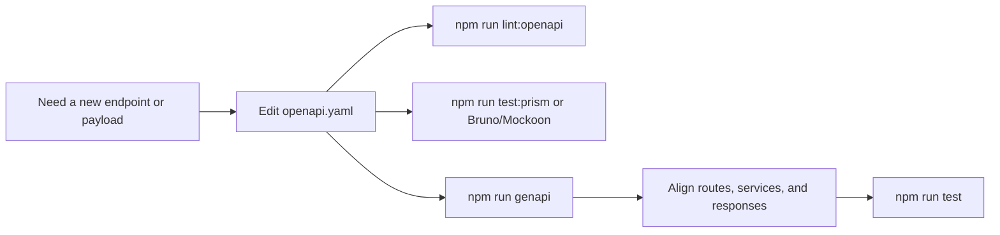

# OpenAPI Workflow

## OpenAPI is the source of truth

For this boilerplate, the safest order is:



If the contract changes, start with the contract.
That keeps backend, generated types, and consumers in sync.

## Tools around the contract

| Tool | Job |
| --- | --- |
| `openapi.yaml` | single contract file |
| Spectral | lint the spec |
| OpenAPI Generator | generate the `api/` client and types |
| Prism | mock the API from the spec |
| Bruno / Mockoon / Insomnia assets | explore or fake the API during development |

## Commands used in this repo

```bash
npm run lint:openapi
npm run genapi
npm run test:prism
```

## What to document here

Document:

- source of truth rules,
- contract workflow,
- REST conventions,
- mock/codegen usage.

Do **not** create a page for every tiny request or response object.
Those belong in the spec itself.

## Related pages

- [REST Style](./rest-style.md)
- [Theory / Request Flow](../theory/request-flow.md)
- [Tools / Runtime & Security](../tools/runtime-and-security.md)
