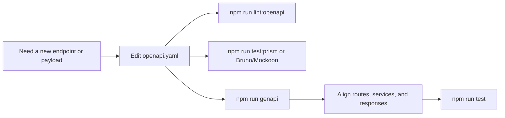

# OpenAPI Workflow

## OpenAPI is the source of truth

For this boilerplate, the safest order is:



If the contract changes, start with the contract.
That keeps backend, generated types, and consumers in sync.

## OpenAPI vs AsyncAPI in this repository

- Use OpenAPI for REST endpoint contracts.
- Use AsyncAPI (`asyncapi.yaml`) for WebSocket/SSE/event-driven contracts.

## Tools around the contract

| Tool                                                                                       | Job                                                |
| ------------------------------------------------------------------------------------------ | -------------------------------------------------- |
| [`openapi.yaml`](https://spec.openapis.org/oas/latest.html)                                | single contract file (OpenAPI 3.x specification)   |
| [Spectral](https://stoplight.io/open-source/spectral)                                      | lint the spec                                      |
| [openapi-typescript-codegen](https://github.com/ferdikoomen/openapi-typescript-codegen)    | generate the `api/` client and types               |
| [Prism](https://stoplight.io/open-source/prism)                                            | mock the API from the spec                         |
| [Bruno](https://www.usebruno.com/) / [Mockoon](https://mockoon.com/) / [Insomnia](https://insomnia.rest/) assets | explore or fake the API during development         |

## Commands used in this repo

```bash
npm run lint:openapi
npm run genapi
npm run test:prism
```

## How this connects to the rest of the docs

- [Theory / Layers](../theory/layers.md) explains where implementation code lands after the spec changes.
- [Tools](../tools/) explains the non-OpenAPI dependencies around the API runtime.
- [REST Style](./rest-style.md) explains the style choices used by the contract.

## What to document here

Document:

- source of truth rules,
- contract workflow,
- REST conventions,
- mock/codegen usage.

Do **not** create a page for every tiny request or response object.
Those belong in the spec itself.

## Useful links

- [OpenAPI 3.1 specification](https://spec.openapis.org/oas/v3.1.0)
- [Swagger guide](https://swagger.io/docs/specification/about/)
- [OpenAPI Initiative on GitHub](https://github.com/OAI/OpenAPI-Specification)
- [Spectral rulesets](https://docs.stoplight.io/docs/spectral/01baf06bdd05a-rulesets) — basis for `spectral.yaml`
- [Prism mock options](https://docs.stoplight.io/docs/prism/83dbbd75532cf-http-mocking)
- [openapi-typescript-codegen options](https://github.com/ferdikoomen/openapi-typescript-codegen#usage)
