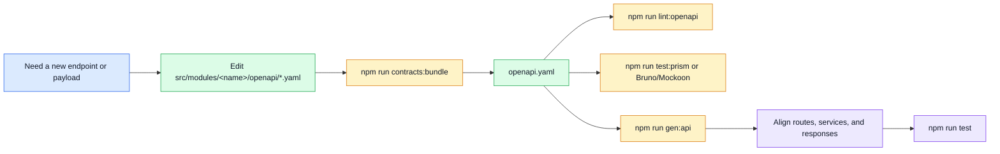

# OpenAPI Workflow

## OpenAPI is the source of truth

For this boilerplate, the safest order is:


```mermaid
%%{init: {'flowchart': {'nodeSpacing': 50, 'rankSpacing': 65}}}%%
flowchart LR
    Idea[Need a new endpoint or payload] --> Frag["Edit src/modules/&lt;name&gt;/openapi/*.yaml"]
    Frag --> Bundle[npm run contracts:bundle]
    Bundle --> Spec[openapi.yaml]
    Spec --> Lint[npm run lint:openapi]
    Spec --> Mock[npm run test:prism or Bruno/Mockoon]
    Spec --> Generate[npm run gen:api]
    Generate --> Implement[Align routes, services, and responses]
    Implement --> Test[npm run test]

    classDef change fill:#dbeafe,stroke:#2563eb,color:#111827;
    classDef contract fill:#dcfce7,stroke:#16a34a,color:#111827;
    classDef tooling fill:#fef3c7,stroke:#d97706,color:#111827;
    classDef app fill:#ede9fe,stroke:#7c3aed,color:#111827;
    class Idea change;
    class Frag,Spec contract;
    class Bundle,Lint,Mock,Generate tooling;
    class Implement,Test app;
```

If the contract changes, start with the contract.
That keeps backend, generated types, and consumers in sync.

**Edit the fragment, never `openapi.yaml` itself.** The root file is assembled from per-module
fragments by `npm run contracts:bundle`, which overwrites whatever you hand-edited — and a test
fails first if you forget to re-bundle. [Regenerating After a
Change](./regenerating.md) is the short version of what to run when.

## Who owns this file

This repository owns the contract; the frontend holds a byte-identical copy and never edits it.
How the file is meant to be split per module and how it travels between the two repos is
[Contract Ownership & Fragmentation](./contract-fragmentation.md).

## Declaring state-machine `links`

A response's `links` block names the operation a legal next request would call, and how to read
its parameters out of this response — e.g. `createOrder`'s `201` names `createPaymentIntent`,
reading `orderId` from `$response.body#/data/id`. Declared per leaf fragment, same as everything
else in the contract, on the response object that starts the transition.

This is what lets a tool follow a **sequence** (create an order, pay it, cancel it) instead of one
request at a time — see [Stateful fuzzing](../tools/fuzz-testing.md#stateful-fuzzing-sequences-not-single-requests)
for the consumer. It is pure documentation until something reads it; nothing in the app enforces
that a `links` chain matches the actual lifecycle, so keep it in sync with `lifecycle.ts` by hand.

## OpenAPI vs AsyncAPI in this repository

- Use OpenAPI for REST endpoint contracts.
- Use AsyncAPI (`asyncapi.yaml`) for SSE/event-driven/queue contracts.

## Tools around the contract

| Tool | Job |
| --- | --- |
| [`openapi.yaml`](https://spec.openapis.org/oas/latest.html) | single contract file (OpenAPI 3.x specification) |
| [Spectral](https://stoplight.io/open-source/spectral) | lint the spec against `spectral.yaml` rules |
| [orval](https://orval.dev) | generate `api/` types and Zod validators from the spec |
| [Prism](https://stoplight.io/open-source/prism) | mock the API from the spec |
| [Bruno](https://www.usebruno.com/) / [Mockoon](https://mockoon.com/) / [Insomnia](https://insomnia.rest/) | explore or fake the API during development (generated on demand) |

## Generated output (`api/`)

Running `npm run gen:api` deletes and regenerates the entire `api/` directory (`rm -rf ./api && orval`).
**Never edit files inside `api/` manually** — changes will be overwritten.

```
api/
├── schemas.zod.ts    ← one Zod schema per operation's request and response
└── models/
    ├── index.ts      ← barrel re-export of all types and enum consts
    └── *.ts          ← one file per schema or enum
```

There is no generated HTTP client: nothing in this repo calls its own API, so `orval.config.ts`
generates the `zod` client only. Its comments list the other flavors and why each is not used here.

**Importing generated types** — always go through the `@types` alias, which re-exports everything from `@api/models`:

```typescript
import type { CreateProductRequest, Product } from '@types';
```

**Importing enum const objects** — orval generates enums as `as const` objects (not TypeScript enum declarations). Import the const object to use it with `z.nativeEnum()` or for runtime value checks:

```typescript
import { UpdateFeedbackRequestStatusRequestStatus } from '@types';

z.nativeEnum(UpdateFeedbackRequestStatusRequestStatus)
```

The enum naming convention is: schema name + property name, PascalCase. For example, `UpdateFeedbackRequestStatusRequest.status` → `UpdateFeedbackRequestStatusRequestStatus`.

## Commands used in this repo

```bash
npm run contracts:bundle  # rebuild openapi.yaml (and the other six bundles) from the fragments
npm run gen:api            # regenerate api/ from openapi.yaml via orval
npm run lint:openapi      # lint openapi.yaml with Spectral
npm run test:prism        # smoke-test Prism mock server against the spec
```

The full "I changed X, run Y" table is [Regenerating After a Change](./regenerating.md).

## Orval configuration

`orval.config.ts` at the project root controls code generation:

- `input` — source spec (`./openapi.yaml`)
- `output.target` — generated Zod schemas (`./api/schemas.zod.ts`)
- `output.schemas` — generated types (`./api/models/`)
- `output.client` — generator flavor (`zod`)
- `output.mode` — `single` (one output file, all operations)

Changing the mode to `tags-split` generates one file per OpenAPI tag instead.

Note that this splits the **generated output**, not the spec. Splitting the spec itself is a
separate idea — see [Contract Ownership & Fragmentation](./contract-fragmentation.md).

## How this connects to the rest of the docs

- [Regenerating After a Change](./regenerating.md) is the command cheat sheet: which fragment triggers which rebuild, and what each failure message means.
- [Contract Ownership & Fragmentation](./contract-fragmentation.md) explains who owns the spec, how it is meant to be split per module, and how the frontend receives it.
- [Theory / Layers](../theory/layers.md) explains where implementation code lands after the spec changes.
- [Tools](../tools/) explains the non-OpenAPI dependencies around the API runtime.
- [API overview](./index.md#rest-patterns-used-here) summarizes the style choices used by the contract.

## What to document here

Document:

- source of truth rules,
- contract workflow,
- REST conventions,
- mock/codegen usage.

Do **not** create a page for every tiny request or response object.
Those belong in the spec itself.

## Useful links

- [OpenAPI 3.1 specification](https://spec.openapis.org/oas/v3.1.0)
- [Swagger guide](https://swagger.io/docs/specification/about/)
- [OpenAPI Initiative on GitHub](https://github.com/OAI/OpenAPI-Specification)
- [Spectral rulesets](https://docs.stoplight.io/docs/spectral/01baf06bdd05a-rulesets) — basis for `spectral.yaml`
- [Prism mock options](https://docs.stoplight.io/docs/prism/83dbbd75532cf-http-mocking)
- [orval documentation](https://orval.dev/guides/overview)
- [orval configuration reference](https://orval.dev/reference/configuration/overview)
