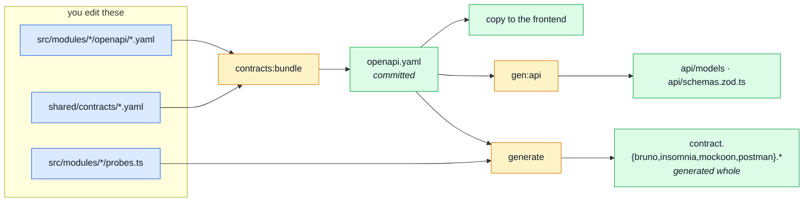

# Regenerating After a Change

The cheat sheet for "I edited a fragment — now what?".

[Contract Ownership & Fragmentation](./contract-fragmentation.md) explains **why** the pipeline has
this shape. This page is the short version you keep open while working.

## The one command

Whatever you edited — a path, a schema, an event name, a seed record, a probe:

```bash
npm run regenerate    # every generator, in dependency order, then the sync to the frontend
```

Then the gate that would have caught you anyway:

```bash
npm run complete      # build + test + lint + format — the same thing pre-commit runs
```

`regenerate` **writes**; `complete` only **verifies**. A gate failure saying `STALE` means the
first one was not run.

Over in the paired frontend the mirror command is `npm run regenerate` as well — run it after every
pull, or the app ships a client for the previous contract.

The steps are still individually runnable (`contracts:bundle`, `gen:api`, `gen:asyncapi`,
`seed:export`, `sync:frontend`) and worth reaching for when you know exactly what changed. The
umbrella exists because the order is not guessable — see below.

## Why two steps and not one

Bundling and generating are different jobs with different inputs, and only the first one is
reversible by hand:



The four client collections are **generated from `openapi.yaml`**, so the contract has to be
assembled before they can be produced — and they also read `db/demo/demo-data.json`
(`scripts/contracts/generate-collections.ts` imports it) for their example request bodies. That file
is produced by `seed:export`, which runs the real application and so needs `api/`, which is itself
generated from the contract:

```
openapi.yaml  ──►  api/  ──►  demo-data.json  ──►  the four client collections
```

Nothing has to sequence that for you, because nothing generates a collection unless you ask. Ask
last — after `regenerate` has settled the contract and the dataset — and what you get is current by
construction. There is no committed copy to go stale in the meantime, which is why neither
`npm run complete` nor `check:contracts-bundle` has anything to say about them.

The ordering deliberately does not live in `package.json` as commands joined by `&&`: npm appends
`--` arguments to the LAST command of a chain only, so a narrowing flag would silently apply to one
phase and not the others.

## I changed X — run Y

| You edited                                            | Run                                                | Because                                           |
| ----------------------------------------------------- | -------------------------------------------------- | ------------------------------------------------- |
| `src/modules/*/openapi.yaml`                           | `contracts:bundle` → `gen:api`                       | `openapi.yaml`, then the types and Zod schemas from it |
| `shared/contracts/openapi.root.yaml`                   | `contracts:bundle` → `gen:api`                   | same, for the parts no single module owns          |
| `src/modules/*/asyncapi.yaml`, `shared/contracts/asyncapi.{root,workers}.yaml` | `contracts:bundle` → `gen:asyncapi`                  | `asyncapi.yaml` and `asyncapi.public.yaml`, then `src/types/asyncapi.generated.ts` |
| `src/modules/*/analytics.ts`                          | `contracts:bundle`                                  | rebuilds `src/infrastructure/observability/analytics-events.frontend.ts` |
| `src/modules/*/demo.ts`                             | `regenerate` → `db:seed:reset`                      | `seed:export` rebuilds `db/demo/demo-data.json`, then the collections have to be bundled AGAIN because they embed its values; the reset is because the database still holds the old records |
| `src/modules/*/probes.ts`                             | `contracts:bundle`                                  | probes are hand-authored, then emitted into every client collection |
| A route, controller or service (no contract change)   | nothing                                             | no bundle reads source code                       |
| `openapi.yaml` / `asyncapi*.yaml` **directly**        | stop — edit the fragment instead                    | the next bundle overwrites you, and `contracts:bundle --check` fails first |
| `contract.{bruno,insomnia,mockoon,postman}.*`         | stop — these are generated                          | edit the contract or the probes; a hand edit is reverted by the next run |

When in doubt, `npm run contracts:bundle` on its own is always safe: it compares before it writes
and touches only the bundles that actually drifted.

## Regenerate one bundle only

Useful while iterating on a single document. A named bundle is produced from what is COMMITTED, so
a collection named here regenerates from the contract on disk rather than one this run just built:

```bash
npm run contracts:bundle -- openapi     # just openapi.yaml
npm run contracts:bundle -- asyncapi    # just asyncapi.yaml (asyncapi-public is its own name)
npm run contracts:bundle -- bruno       # just contract.bruno.yml
```

Known names: `openapi`, `asyncapi`, `asyncapi-public`, `analytics-events`, `bruno`, `insomnia`, `mockoon`, `postman`.
An unknown name exits with the list rather than doing nothing.

The four collections are **only** produced by naming them: a full `contracts:bundle` assembles the
authored documents and stops, because the collections are `.gitignore`d and nothing else reads them.
For the same reason `--check` refuses them outright — an uncommitted file cannot be stale.

::: tip A narrowed run really does narrow
It did not always. `contracts:bundle` used to be several commands joined by `&&` in `package.json`,
and npm appends `--` arguments to the **last** one only — so naming a bundle bundled everything
except the thing you named. The ordering lives in `scripts/bundle-contracts.ts` now, precisely so
the flag can mean what it says.
:::

A named collection regenerates from the **committed** contract, which is the right question while
iterating: is the state on disk self-consistent? Finish with a full `npm run contracts:bundle`
before committing — a narrowed run leaves every other bundle untouched, and staleness is asserted
across all seven.

## Verifying, and what each failure means

```bash
npm run check:contracts-bundle    # is any bundle stale against its fragments?
npm run lint:openapi              # is openapi.yaml a valid spec, per spectral.yaml?
npm run lint:asyncapi             # same, for asyncapi.yaml and asyncapi.public.yaml
npm run check:spec-identity       # does the paired frontend hold the same bytes?
npm run test:contract             # do real responses match the contract?
```

| Failure                                                            | What happened                                                                            | Fix                                                     |
| ------------------------------------------------------------------ | ---------------------------------------------------------------------------------------- | ------------------------------------------------------- |
| `[contracts] STALE — these do not match the fragments`             | a fragment was edited without re-bundling, or a bundle was hand-edited                    | `npm run contracts:bundle`                              |
| `contract-bundles.test.ts` fails                                    | the same thing, caught by the test suite instead                                          | `npm run contracts:bundle`                              |
| `check:spec-identity` fails                                         | this repo and the frontend hold different bytes of a shared document                       | copy the bundle over; never re-bundle on both sides     |
| `prettier:check` fails on `analytics-events.frontend.ts`              | a section's `as const` ends with a trailing comma — the join adds the separator, not the source | drop the trailing comma from that section's last entry    |
| `check:seed-export` says the dataset is STALE                         | a fixture changed and the dataset was not re-exported                                       | `npm run seed:export`, then copy the result to the frontend |
| `gen:api` produces a diff in CI                                      | `api/` was not regenerated after a contract change                                         | `npm run gen:api` and commit the result                   |
| spectral reports a dangling `$ref`                                   | a schema moved into a module document while another module still references it              | move it to `shared/contracts/openapi.root.yaml`         |

Two guards run without you asking: `tests/cross-cutting/contract-bundles.test.ts` asserts every
bundle equals a fresh assembly on **every** test run (so the pre-commit `complete` covers it),
and CI re-runs `gen:api` and `gen:asyncapi` to prove the committed output is fresh.

## The generated output is committed, all of it

Not one of these is a build artefact you can delete and forget:

| Committed output                                       | Read by                                                       |
| ------------------------------------------------------ | ------------------------------------------------------------- |
| `openapi.yaml`                                         | spectral · orval · Prism · `jest-openapi` · the frontend      |
| `asyncapi.yaml`                                        | the AsyncAPI CLI · `gen:asyncapi`                              |
| `asyncapi.public.yaml`                                 | the AsyncAPI CLI · the frontend's whole realtime pipeline      |
| `api/models/` · `api/schemas.zod.ts`                   | `@types` and the services that validate input                 |
| `src/types/asyncapi.generated.ts`                                | every SSE, domain-event and queue call site                   |
| `src/infrastructure/observability/analytics-events.frontend.ts` | the analytics tracker                                         |
| `db/demo/demo-data.json`                                | the generated collections and the paired frontend's mocks     |
| `contract.{bruno,insomnia,mockoon,postman}.*`          | you, and whoever explores the API without running it          |

`api/` is the one exception to "review the diff": `npm run gen:api` starts with `rm -rf ./api`, so it
is fully derived, and the only thing to check is that the diff is limited to what you changed.
**Never hand-edit anything in `api/`.**

## Handing the contract to the frontend

The frontend holds **byte-identical copies** of the three bundles it consumes — `openapi.yaml`,
`asyncapi.public.yaml` and `analytics-events.frontend.ts` — and never bundles or authors them. The
four client collections stay here, and are not committed at all: they are derived from
`openapi.yaml`, so a copy there could not disagree without the spec disagreeing first, and nothing
in either repo reads them.

You do not move them by hand. `npm run regenerate` ends with `npm run sync:frontend`, which copies
every backend-owned file into the sibling checkout — under its own name on that side, since three of
the shared files are called something else there — and then runs the frontend's own `regenerate`, so
its client is rebuilt from the contract it was just handed:

```bash
npm run regenerate                  # rebuild here, copy over there, regenerate over there
npm run sync:frontend -- --dry      # say what would move, write nothing
npm run sync:frontend -- --forced   # rewrite even the files that already match
npm run check:spec-identity         # the gate: hashes both sides, fails on a fork
```

`sync:frontend` refuses to run on stale sources — `check:contracts-bundle` and `check:seed-export`
go first, because copying a stale bundle makes both repos agree on a document neither one's sources
produce. It also never writes the four hand-maintained files: it reports them as differing and
leaves the decision to you.

The sibling is found beside this repo, or wherever `FRONTEND_PATH` in `.env` points. The pre-commit
hook runs `regenerate -- --no-sync`, because a commit here must not write into a checkout you are
not looking at.

Do **not** run the bundler in both repos and assume the bytes agree. They are compared, not parsed,
and that check is the thing standing between you and a silent contract fork — see
[Why the root file stays whole](./contract-fragmentation.md#why-the-root-file-stays-whole).

## Adding a new module to the pipeline

A module joins each bundle by dropping a fragment in the expected place and adding one line to that
bundle's section list under `scripts/contracts/`:

```
src/modules/<name>/openapi.yaml      its operations, and the types only it uses
src/modules/<name>/asyncapi.yaml     its server, channels, messages and schemas — one whole document
src/modules/<name>/analytics.ts      the events it emits
src/modules/<name>/demo.ts          the demo records it owns
src/modules/<name>/factory.ts        how those records are built
src/modules/<name>/probes.ts         the requests a spec cannot describe
```

Every one is optional: a module with no HTTP surface contributes no OpenAPI fragment, and that is a
good sign rather than an omission. Deleting a module is `rm -rf` of the folder, one line out of
`src/modules.ts`, and one line out of each section list it appeared in. A module that declared
probes is also named in `scripts/contracts/generate-collections.ts`, and that one announces itself:
the import stops compiling.

## Related pages

- [OpenAPI Workflow](./openapi-workflow.md) — how to decide what the contract should say
- [Contract Ownership & Fragmentation](./contract-fragmentation.md) — who owns what, and why the bundler never parses
- [AsyncAPI Workflow](./asyncapi-workflow.md) — the async half of the same pipeline
- [Package Scripts](../tools/package-scripts.md) — every script, grouped by job
- [Getting Started](../getting-started.md) — first run, before any of this matters
