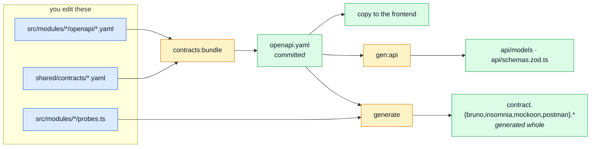

# Regenerating After a Change

The cheat sheet for "I edited a fragment — now what?".

[Contract Ownership & Fragmentation](./contract-fragmentation.md) explains **why** the pipeline has
this shape. This page is the short version you keep open while working.

## The two commands

For 90% of edits — a path, a schema, an event name, a seed record:

```bash
npm run contracts:bundle    # fragments  ->  the 7 committed bundles
npm run gen:api              # openapi.yaml -> api/ (types + Zod)
```

Then the gate that would have caught you anyway:

```bash
npm run complete      # build + test + lint + format — the same thing pre-commit runs
```

Nothing else is needed unless you touched `asyncapi` fragments (add `npm run gen:asyncapi`).

## Why two steps and not one

Bundling and generating are different jobs with different inputs, and only the first one is
reversible by hand:



The four client collections are **generated from `openapi.yaml`**, so the contract has to be
assembled before they can be produced. `scripts/bundle-contracts.ts` owns that ordering — the
authored documents first, then everything — so a single `npm run contracts:bundle` is all there is
to remember.

The ordering deliberately does not live in `package.json` as commands joined by `&&`: npm appends
`--` arguments to the LAST command of a chain only, so a narrowing flag would silently apply to one
phase and not the others.

## I changed X — run Y

| You edited                                            | Run                                                | Because                                           |
| ----------------------------------------------------- | -------------------------------------------------- | ------------------------------------------------- |
| `src/modules/*/openapi/{paths,schemas}.yaml`           | `contracts:bundle` → `gen:api`                       | `openapi.yaml`, then the types and Zod schemas from it |
| `shared/contracts/*.yaml` (header, shared schemas, system) | `contracts:bundle` → `gen:api`                   | same, for the parts no single module owns          |
| `src/modules/*/asyncapi/*.yaml`                       | `contracts:bundle` → `gen:asyncapi`                  | `asyncapi.yaml`, then `src/types/asyncapi.ts`     |
| `src/modules/*/analytics.fragment.ts`                 | `contracts:bundle`                                  | rebuilds `src/infrastructure/observability/analytics-events.ts` |
| `src/modules/*/seed-identities.fragment.ts`           | `contracts:bundle` → `db:seed:reset`                | rebuilds `db/seeds/seed-identities.ts`; the collections embed its values, and the database holds the old records |
| `src/modules/*/probes.ts`                             | `contracts:bundle`                                  | probes are hand-authored, then emitted into every client collection |
| A route, controller or service (no contract change)   | nothing                                             | no bundle reads source code                       |
| `openapi.yaml` / `asyncapi.yaml` **directly**         | stop — edit the fragment instead                    | the next bundle overwrites you, and `contracts:bundle --check` fails first |
| `contract.{bruno,insomnia,mockoon,postman}.*`         | stop — these are generated                          | edit the contract or the probes; a hand edit is reverted by the next run |

When in doubt, `npm run contracts:bundle` on its own is always safe: it compares before it writes
and touches only the bundles that actually drifted.

## Regenerate one bundle only

Useful while iterating on a single document. A named bundle is produced from what is COMMITTED, so
a collection named here regenerates from the contract on disk rather than one this run just built:

```bash
npm run contracts:bundle -- openapi     # just openapi.yaml
npm run contracts:bundle -- asyncapi    # just asyncapi.yaml
npm run contracts:bundle -- bruno       # just contract.bruno.yml
```

Known names: `openapi`, `asyncapi`, `analytics-events`, `seed-identities`, `bruno`, `insomnia`,
`mockoon`, `postman`. An unknown name exits with the list rather than doing nothing.

::: warning `npm run contracts:bundle -- openapi` does not narrow the run
`contracts:bundle` is three commands joined by `&&`, and npm appends `--` arguments to the **last**
one only. So that invocation still bundles all four authored documents and regenerates the collection
fragments — it just skips bundling the three client collections at the end, leaving `contract.<tool>.*` stale.
The cross-cutting suite catches it, but the failure looks unrelated to what you typed.
:::

Finish with a full `npm run contracts:bundle` before committing: a narrowed run leaves every other
bundle untouched, and staleness is asserted across all seven.

## Verifying, and what each failure means

```bash
npm run check:contracts-bundle    # is any bundle stale against its fragments?
npm run lint:openapi              # is openapi.yaml a valid spec, per spectral.yaml?
npm run lint:asyncapi             # same, for asyncapi.yaml
npm run check:spec-identity       # does the paired frontend hold the same bytes?
npm run test:contract             # do real responses match the contract?
```

| Failure                                                            | What happened                                                                            | Fix                                                     |
| ------------------------------------------------------------------ | ---------------------------------------------------------------------------------------- | ------------------------------------------------------- |
| `[contracts] STALE — these do not match the fragments`             | a fragment was edited without re-bundling, or a bundle was hand-edited                    | `npm run contracts:bundle`                              |
| `contract-bundles.test.ts` fails                                    | the same thing, caught by the test suite instead                                          | `npm run contracts:bundle`                              |
| `check:spec-identity` fails                                         | this repo and the frontend hold different bytes of a shared document                       | copy the bundle over; never re-bundle on both sides     |
| `prettier:check` fails on `analytics-events.ts` / `seed-identities.ts` | a `.fragment.ts` ends with a trailing comma — the join adds the separator, not the fragment | drop the trailing comma from the fragment               |
| `gen:api` produces a diff in CI                                      | `api/` was not regenerated after a contract change                                         | `npm run gen:api` and commit the result                   |
| spectral reports a dangling `$ref`                                   | a schema moved into a module fragment while another module still references it              | move it to `shared/contracts/schemas.yaml`              |

Two guards run without you asking: `tests/cross-cutting/contract-bundles.test.ts` asserts every
bundle equals a fresh assembly on **every** test run (so the pre-commit `complete` covers it),
and CI re-runs `gen:api` and `gen:asyncapi` to prove the committed output is fresh.

## The generated output is committed, all of it

Not one of these is a build artefact you can delete and forget:

| Committed output                                       | Read by                                                       |
| ------------------------------------------------------ | ------------------------------------------------------------- |
| `openapi.yaml`                                         | spectral · orval · Prism · `jest-openapi` · the frontend      |
| `asyncapi.yaml`                                        | the AsyncAPI CLI · `gen:asyncapi`                              |
| `api/models/` · `api/schemas.zod.ts`                   | `@types` and the services that validate input                 |
| `src/types/asyncapi.ts`                                | every SSE, domain-event and queue call site                   |
| `src/infrastructure/observability/analytics-events.ts` | the analytics tracker                                         |
| `db/seeds/seed-identities.ts`                          | the seed runner and the generated collections                 |
| `contract.{bruno,insomnia,mockoon}.*`                  | you, and whoever explores the API without running it          |

`api/` is the one exception to "review the diff": `npm run gen:api` starts with `rm -rf ./api`, so it
is fully derived, and the only thing to check is that the diff is limited to what you changed.
**Never hand-edit anything in `api/`.**

## Handing the contract to the frontend

The frontend holds **byte-identical copies** of the seven bundles and never bundles or authors them.
After a contract change lands here:

1. `npm run contracts:bundle` here, and commit the result.
2. Copy the changed bundle(s) to `boilerplate-vue-frontend` verbatim.
3. `npm run check:spec-identity` — it compares against the sibling checkout and fails on a fork.

Do **not** run the bundler in both repos and assume the bytes agree. They are compared, not parsed,
and that check is the thing standing between you and a silent contract fork — see
[Why the root file stays whole](./contract-fragmentation.md#why-the-root-file-stays-whole).

## Adding a new module to the pipeline

A module joins each bundle by dropping a fragment in the expected place and adding one line to that
bundle's section list under `scripts/contracts/`:

```
src/modules/<name>/openapi/paths.yaml       its operations
src/modules/<name>/openapi/schemas.yaml     the types only it uses
src/modules/<name>/asyncapi/*.yaml          its channels, messages, schemas
src/modules/<name>/analytics.fragment.ts    the events it emits
src/modules/<name>/seed-identities.fragment.ts  the demo records it owns
src/modules/<name>/probes.ts                 the requests a spec cannot describe
```

Every one is optional: a module with no HTTP surface contributes no OpenAPI fragment, and that is a
good sign rather than an omission. Deleting a module is `rm -rf` of the folder, one line out of
`src/modules.ts`, and one line out of each section list it appeared in. A module that declared
probes is also named in `scripts/contracts/generateCollections.ts`, and that one announces itself:
the import stops compiling.

## Related pages

- [OpenAPI Workflow](./openapi-workflow.md) — how to decide what the contract should say
- [Contract Ownership & Fragmentation](./contract-fragmentation.md) — who owns what, and why the bundler never parses
- [AsyncAPI Workflow](./asyncapi-workflow.md) — the async half of the same pipeline
- [Package Scripts](../tools/package-scripts.md) — every script, grouped by job
- [Getting Started](../getting-started.md) — first run, before any of this matters
