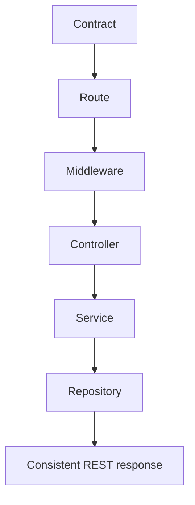

# REST Style

## REST shape used by this boilerplate

```mermaid
flowchart LR
    Collection[/products] --> Item[/products/:id]
    Item --> Write[POST / PUT / PATCH / DELETE]
    Collection --> Read[GET list]
    Item --> ReadOne[GET item]
```

## Practical rules

- Keep URLs resource-oriented.
- Keep controllers thin and move logic down to services.
- Reuse shared schemas and parameters inside [`openapi.yaml`](./openapi-workflow.md#openapi-is-the-source-of-truth).
- Keep response handling consistent so the API feels predictable.
- Let auth, validation, caching, and observability plug into the same request path.

## Boilerplate examples, not product law

The entities in this repo (`users`, `products`, `orders`, `cart`, `account`, `admin`) are examples.
They exist to demonstrate patterns such as:

- public vs protected endpoints,
- CRUD + search,
- admin-only flows,
- auth flows,
- metrics/audit/admin support.

## Style visual



## Related pages

- [OpenAPI Workflow](./openapi-workflow.md)
- [Theory / Architecture](../theory/architecture.md)
- [Tools / Observability & Quality](../tools/observability-and-quality.md)
