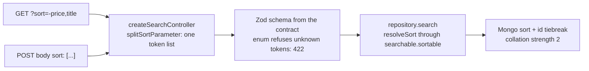

# Sorting a List

Every paged list can be ordered by the server, so "sort by price" orders the **whole** catalogue
and not just the ten rows on screen. One parameter, one grammar, everywhere.

| | Standard |
| --- | --- |
| The grammar | [JSON:API sorting](https://jsonapi.org/format/#fetching-sorting) — `sort=-price,title` |
| The query encoding | OpenAPI `style: form`, `explode: false` — a comma-separated list |

## The rule

| | |
| --- | --- |
| Parameter | `sort` — in the query of `GET /x` **and** in the body of `POST /x/search` |
| Query form | `?sort=-price,title` — comma-separated |
| Body form | `{ "sort": ["-price", "title"] }` — an array of the same tokens |
| Direction | `field` ascending, `-field` descending |
| Several fields | the earlier one ranks first; at most 3 |
| Absent or blank | the resource's default order, newest first |
| A field outside the list | **422** — the contract enum refuses it |

Ties always end on the id, so page 2 never repeats or skips a row of page 1. Text fields compare
case-insensitively (`Apple` before `banana`).

## Who can be sorted, by what

The list is an **enum per resource** in that module's `openapi.yaml` (`ProductSort`, `UserSort`,
`OrderSort`, `FeedbackRequestSort`). It is a whitelist on purpose: an unindexed or derived field
would let a stranger ask for a collection scan.

| Resource | Sortable fields |
| --- | --- |
| Products | `createdAt` · `price` · `title` (the fallback-locale column) |
| Users | `createdAt` · `email` · `username` |
| Orders | `createdAt` · `status` · `email` — `totalPrice` is derived, not a column |
| Feedback | `createdAt` · `status` · `email` |

## How it flows

## Adding a sortable field

1. Add the token (and its `-` twin) to the module's `*Sort` enum in its `openapi.yaml`.
2. Add `wireField: 'mongoPath'` to the repository's `searchable.sortable`.
3. `npm run regenerate`. Nothing else: the controller, the cache key and the frontend's types
   follow from the contract.

The pieces live in `src/infrastructure/persistence/search.ts` (`splitSortParameter`, `resolveSort`).
