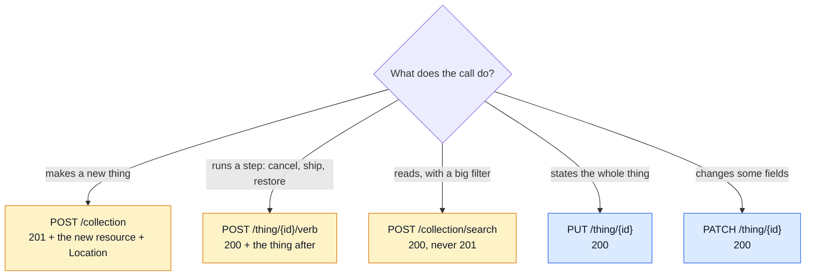
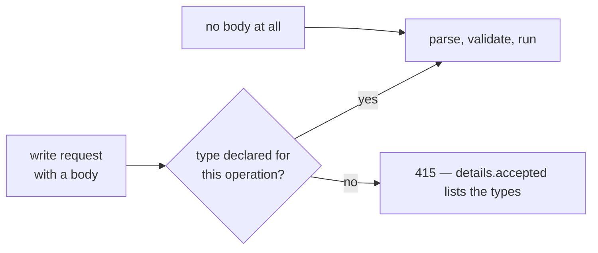

# Write Methods: POST, PUT, PATCH

Every write route follows the web's own rules for its verb. This page is those rules, in the
form this API applies them, and the few places it deliberately does something else.

| | Standard |
| --- | --- |
| POST, PUT, status codes | [RFC 9110](https://www.rfc-editor.org/rfc/rfc9110) — HTTP Semantics |
| PATCH | [RFC 5789](https://www.rfc-editor.org/rfc/rfc5789) — the method |
| What a PATCH body means | [RFC 7396](https://www.rfc-editor.org/rfc/rfc7396) — JSON Merge Patch |
| Retrying a POST safely | [`Idempotency-Key`](https://datatracker.ietf.org/doc/draft-ietf-httpapi-idempotency-key-header/) — IETF draft |

## The three verbs in one table

| | POST | PUT | PATCH |
| --- | --- | --- | --- |
| Means | create in a collection, or run an action | replace the whole resource | change part of it |
| Target | `/products` · `/orders/{id}/cancel` | `/products/{id}` | `/products/{id}` |
| Body | the new resource, or the action's input | the **full** new representation | only what changes |
| An omitted field | the server's default | **cleared** (see [PUT](#put-replace)) | left alone |
| `null` | 422 — nothing to clear yet | clears | clears |
| `''` | 422 wherever the field has `minLength: 1` | same | same |
| Safe to repeat | no — send `Idempotency-Key` | yes (idempotent) | yes, in practice |
| Success | **201** + the created resource + `Location` · **200** for an action | **200** + the resource | **200** + the resource |
| Target missing | — | 404 | 404 |

## POST

### Create → 201

- The body answered is the created resource, in the usual envelope — a checkout answers the order
  itself, an address write answers the address.
- `Location` names the new resource's URI (RFC 9110 §9.3.3) — `Location: /products/{id}`. The
  contract declares it `required` on every 201, and the shared response check
  (`tests/support/response-contract.ts`) fails a 201 without it.
- A retried create under its `Idempotency-Key` replays the `Location` with the body.
- **A 201 means something was created** (RFC 9110 §15.3.2). An intent that only refreshes the
  order's one payment row, or a cart "add" that only grows a line, answers **200**.
- Anything the contract does not declare is a 422 (`additionalProperties: false`), never a column.

### Action → 200

- `POST /orders/{id}/cancel`, `/ship`, `/restore`, `/rotate-secret`: a state change on a thing that
  already exists. 200, with the thing as it now stands.
- An action may create a record on the side (a shipment, a stock movement). It still answers the
  thing the caller acts on next.

### Search → 200

`POST /x/search` is a read that needs a body — see
[Request Input](../theory/request-input.md). It creates nothing, so it is never a 201.

### Retrying a POST

A POST is not idempotent: sent twice, it may create twice. Every POST that moves money, stock or
an account takes an `Idempotency-Key` — orders, checkout, payments, stock receipts and
adjustments. See [Idempotency](../tools/idempotency.md).

## PUT — replace

The body **is** the new resource (RFC 9110 §9.3.4).

| A field in the representation is… | Omitted from a PUT |
| --- | --- |
| clearable (`nullable`) | cleared — as if it were sent as `null` |
| not clearable (no legal empty state) | **required**: omitting it is a 422 |
| outside the representation (below) | unchanged, always |

**Outside the representation** — a PUT neither sets nor clears these:

| Kind | Examples | Changed only by |
| --- | --- | --- |
| server-managed | `id`, timestamps, lifecycle `status`, totals, `verifiedAt` | the server |
| a secret with its own door | `password` | `POST /account/password`, the reset flow |
| an uploaded file | `imageUrl` | a multipart upload; an explicit `null` clears |
| a pointer owned by the parent | an address's `default` | `PUT /account/addresses/{id}/default` |

An image is the case that shapes the rule: a client can no longer send the current path back
(`imageUrl` accepts `null` only), so a PUT that never mentions it must keep it, or every
GET → edit → PUT round trip would delete the picture.

**Idempotent.** The same PUT twice leaves the same state as once (RFC 9110 §9.2.2). A value equal
to the stored one is no change — no second email, no role re-grant, no version or revision bump.
Logging each request is allowed.

**A PUT with no body sets a flag or a membership.** When the URI is the whole statement, the
body is empty: `PUT /wishlist/{productId}` (this product is saved), `PUT
/account/addresses/{id}/default` (this address is the default). Sent twice, nothing changes —
the GitHub-stars pattern (`PUT`/`DELETE /user/starred/{owner}/{repo}`).

**Create by PUT only where the client names the thing.** A PUT on an id that does not exist is a
404. The one exception is a URI the caller owns by construction — a cart line, `PUT
/cart/{productId}`: it creates the line and answers **201**, or updates it and answers 200
(RFC 9110 §9.3.4).

**A server may transform.** RFC 9110 lets the stored state differ from the body. Here that is one
case: `PUT /account`'s `email` becomes `pendingEmail` until the new address is proven.

**A keyed map is part of the representation.** A product's `translations` on a PUT is the whole
set: a stored locale it leaves out is deleted, the fallback locale is required, and a locale it
states is stated whole (its omitted `description` is cleared).

## PATCH — JSON Merge Patch

The body is a merge patch (RFC 7396):

| The body says | The server does |
| --- | --- |
| `"field"` absent | leaves it alone |
| `"field": value` | replaces it |
| `"field": null` | clears it |
| `"list": [ … ]` | replaces the whole array |
| `"object": { … }` | merges into it by the same rules, one level down — `"translations": {"it": {"title": "x"}}` changes only the Italian title |

Sent as `application/merge-patch+json` (RFC 7396's own media type) or plain `application/json`
(what GitHub accepts). Both are declared in the contract on every PATCH; the frontend calls the
JSON one.

## Content-Type: 415

The JSON body parser handles only the types it is told to, so a body in any other type used to arrive as
`{}` — and an all-optional PATCH schema accepts `{}`: a 200 that changed nothing.

The guard is `requireDeclaredContentType`, built from `api/request-content-types.ts`, which
`npm run gen:api` derives from the contract's own `requestBody` media types. A request with no
bytes is not judged: a missing required body is the schema's own 422.

## Empty, `null`, omitted

| On the wire | Means | Legal on |
| --- | --- | --- |
| omitted | nothing to say about this field | every write |
| `null` | clear it | PUT and PATCH, where the field is `nullable` |
| `''` | an empty value — **never** "clear" | only a field with no `minLength` (a blank translation) |

Every optional free-text field in a write body carries `minLength: 1`, so a blank string is a
422 rather than a stored `''`. Search bodies are reads: an empty filter there is ignored.

A create body declares nothing `nullable` — there is nothing to clear yet, so `null` is a 422 and
"no value" is spelt by leaving the field out.

## Multipart

`multipart/form-data` has no `null`: every part is a string or a file.

- The server validates a multipart body with the **JSON** schema of the same verb, after decoding
  booleans, numbers, arrays and JSON parts.
- So a clear cannot travel with an upload. Clear with a JSON PATCH; send the file alone, or with
  the fields that have values.
- The `*Multipart` schemas are documentation and client codegen only. They declare nothing
  `nullable`.

## Status codes a write answers

| Code | When |
| --- | --- |
| 200 | an update, an action, a search, an idempotent refresh |
| 201 | a create — something new exists, and `Location` says where |
| 404 | the target does not exist (or the caller may not know it does) |
| 409 | the write conflicts with the current state — a duplicate, a lifecycle refusal |
| 412 | an `If-Match` that no longer matches **(not built yet — its own lane)** |
| 415 | a body in a type the operation does not declare |
| 422 | the body breaks the contract or a domain rule |

The app-wide ones (400, 413, 429, 503) come from `x-app-level-responses` — see
[Regenerating](./regenerating.md).

## Deliberate exceptions

| Route | Differs how | Why |
| --- | --- | --- |
| `PUT /account` | `email` is stored as `pendingEmail` | an address is proven before it replaces the old one |
| `POST /account/signup` | a refused address still gets a 201 and the same `Location: /account`, and nothing is created | antibot: the refusal must look like a success |
| `PUT /cart/{productId}`, `PUT /cart/shipping-method`, `PUT /locales/{locale}/entries/{entryId}`, `PUT /wishlist/{productId}`, `PUT /account/addresses/{id}/default` | no PATCH | one field, or none; a PATCH would say exactly what the PUT says |
| `POST /cart` | adds to an existing line instead of creating a second one; 201 only when the line is new | "add to cart" — Shopify, commercetools, WooCommerce and Magento all grow the line |
| `POST /payments/intent`, `POST /payments/order/{id}/offline` | 200 when they refresh or convert the order's one payment row | one payment per order is a database fact |
| `PUT`/`PATCH /locales/{locale}/tenants/{tenant}/entries` | the tenant is a path segment | a PUT replaces exactly what the GET on the same URI lists |

## How it is kept true

| Guard | Catches |
| --- | --- |
| `createUpdateController` — [Request Flow](../theory/request-flow.md#put-replaces-patch-merges) | one PUT/PATCH pipeline for every factory-backed resource |
| `tests/cross-cutting/replace-patch-parity.test.ts` | a PUT and a PATCH schema declaring different fields |
| `tests/support/response-contract.ts` | a 201 without its `Location`, a status the operation does not document |
| `tests/contract/write-methods.test.ts` | an empty string stored, an undeclared type accepted, a `Location` missing or wrong |
| `tests/contract/request-contract.test.ts` | a body the contract refuses being accepted |
| `tests/fuzz/endpoints.fuzz.test.ts` | a hostile body answered with a 5xx |
