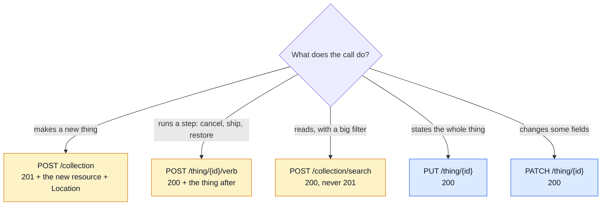
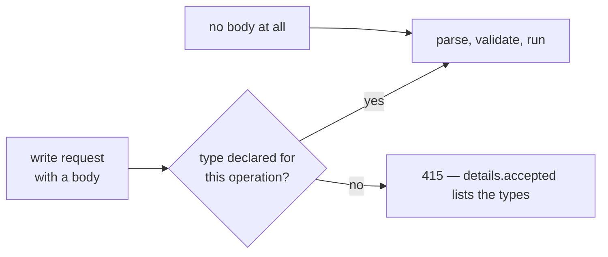
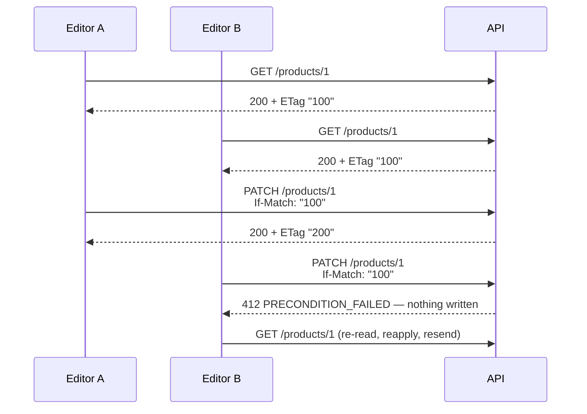

# Write Methods: POST, PUT, PATCH

Every write route follows the web's own rules for its verb. This page is those rules, in the
form this API applies them, and the few places it deliberately does something else.

| | Standard |
| --- | --- |
| POST, PUT, status codes | [RFC 9110](https://www.rfc-editor.org/rfc/rfc9110) — HTTP Semantics |
| PATCH | [RFC 5789](https://www.rfc-editor.org/rfc/rfc5789) — the method |
| What a PATCH body means | [RFC 7396](https://www.rfc-editor.org/rfc/rfc7396) — JSON Merge Patch |
| Retrying a POST safely | [`Idempotency-Key`](https://datatracker.ietf.org/doc/draft-ietf-httpapi-idempotency-key-header/) — IETF draft |

## The three verbs in one table

| | POST | PUT | PATCH |
| --- | --- | --- | --- |
| Means | create in a collection, or run an action | replace the whole resource | change part of it |
| Target | `/products` · `/orders/{id}/cancel` | `/products/{id}` | `/products/{id}` |
| Body | the new resource, or the action's input | the **full** new representation | only what changes |
| An omitted field | the server's default | **cleared** (see [PUT](#put-replace)) | left alone |
| `null` | 422 — nothing to clear yet | clears | clears |
| `''` | 422 wherever the field has `minLength: 1` | same | same |
| Safe to repeat | no — send `Idempotency-Key` | yes (idempotent) | yes, in practice |
| Success | **201** + the created resource + `Location` · **200** for an action | **200** + the resource | **200** + the resource |
| Target missing | — | 404 | 404 |

## POST

### Create → 201

- The body answered is the created resource, in the usual envelope — a checkout answers the order
  itself, an address write answers the address.
- `Location` names the new resource's URI (RFC 9110 §9.3.3) — `Location: /products/{id}`. The
  contract declares it `required` on every 201, and the shared response check
  (`tests/support/response-contract.ts`) fails a 201 without it.
- A retried create under its `Idempotency-Key` replays the `Location` with the body.
- **A 201 means something was created** (RFC 9110 §15.3.2). An intent that only refreshes the
  order's one payment row, or a cart "add" that only grows a line, answers **200**.
- Anything the contract does not declare is a 422 (`additionalProperties: false`), never a column.

### Action → 200

- `POST /orders/{id}/cancel`, `/ship`, `/restore`, `/rotate-secret`: a state change on a thing that
  already exists. 200, with the thing as it now stands.
- An action may create a record on the side (a shipment, a stock movement). It still answers the
  thing the caller acts on next.

### Search → 200

`POST /x/search` is a read that needs a body — see
[Request Input](../theory/request-input.md). It creates nothing, so it is never a 201.

### Retrying a POST

A POST is not idempotent: sent twice, it may create twice. Every POST that moves money, stock or
an account takes an `Idempotency-Key` — orders, checkout, payments, stock receipts and
adjustments. See [Idempotency](../tools/idempotency.md).

## PUT — replace

The body **is** the new resource (RFC 9110 §9.3.4).

| A field in the representation is… | Omitted from a PUT |
| --- | --- |
| clearable (`nullable`) | cleared — as if it were sent as `null` |
| not clearable (no legal empty state) | **required**: omitting it is a 422 |
| outside the representation (below) | unchanged, always |

**Outside the representation** — a PUT neither sets nor clears these:

| Kind | Examples | Changed only by |
| --- | --- | --- |
| server-managed | `id`, timestamps, lifecycle `status`, totals, `verifiedAt` | the server |
| a secret with its own door | `password` | `POST /account/password`, the reset flow |
| an uploaded file | `imageUrl` | a multipart upload; an explicit `null` clears |
| a pointer owned by the parent | an address's `default` | `PUT /account/addresses/{id}/default` |

An image is the case that shapes the rule: a client can no longer send the current path back
(`imageUrl` accepts `null` only), so a PUT that never mentions it must keep it, or every
GET → edit → PUT round trip would delete the picture.

**Idempotent.** The same PUT twice leaves the same state as once (RFC 9110 §9.2.2). A value equal
to the stored one is no change — no second email, no role re-grant, no version or revision bump.
Logging each request is allowed.

**A PUT with no body sets a flag or a membership.** When the URI is the whole statement, the
body is empty: `PUT /wishlist/{productId}` (this product is saved), `PUT
/account/addresses/{id}/default` (this address is the default). Sent twice, nothing changes —
the GitHub-stars pattern (`PUT`/`DELETE /user/starred/{owner}/{repo}`).

**Create by PUT only where the client names the thing.** A PUT on an id that does not exist is a
404. The one exception is a URI the caller owns by construction — a cart line, `PUT
/cart/{productId}`: it creates the line and answers **201**, or updates it and answers 200
(RFC 9110 §9.3.4).

**A server may transform.** RFC 9110 lets the stored state differ from the body. Here that is one
case: `PUT /account`'s `email` becomes `pendingEmail` until the new address is proven.

**A keyed map is part of the representation.** A product's `translations` on a PUT is the whole
set: a stored locale it leaves out is deleted, the fallback locale is required, and a locale it
states is stated whole (its omitted `description` is cleared).

## PATCH — JSON Merge Patch

The body is a merge patch (RFC 7396):

| The body says | The server does |
| --- | --- |
| `"field"` absent | leaves it alone |
| `"field": value` | replaces it |
| `"field": null` | clears it |
| `"list": [ … ]` | replaces the whole array |
| `"object": { … }` | merges into it by the same rules, one level down — `"translations": {"it": {"title": "x"}}` changes only the Italian title |

Sent as `application/merge-patch+json` (RFC 7396's own media type) or plain `application/json`
(what GitHub accepts). Both are declared in the contract on every PATCH; the frontend calls the
JSON one.

## Content-Type: 415

The JSON body parser handles only the types it is told to, so a body in any other type used to arrive as
`{}` — and an all-optional PATCH schema accepts `{}`: a 200 that changed nothing.

The guard is `requireDeclaredContentType`, built from `api/request-content-types.ts`, which
`npm run gen:api` derives from the contract's own `requestBody` media types. A request with no
bytes is not judged: a missing required body is the schema's own 422.

## Empty, `null`, omitted

| On the wire | Means | Legal on |
| --- | --- | --- |
| omitted | nothing to say about this field | every write |
| `null` | clear it | PUT and PATCH, where the field is `nullable` |
| `''` | an empty value — **never** "clear" | only a field with no `minLength` (a blank translation) |

Every optional free-text field in a write body carries `minLength: 1`, so a blank string is a
422 rather than a stored `''`. Search bodies are reads: an empty filter there is ignored.

A create body declares nothing `nullable` — there is nothing to clear yet, so `null` is a 422 and
"no value" is spelt by leaving the field out.

## Multipart

`multipart/form-data` has no `null`: every part is a string or a file.

- The server validates a multipart body with the **JSON** schema of the same verb, after decoding
  booleans, numbers, arrays and JSON parts.
- So a clear cannot travel with an upload. Clear with a JSON PATCH; send the file alone, or with
  the fields that have values.
- The `*Multipart` schemas are documentation and client codegen only. They declare nothing
  `nullable`.

## Status codes a write answers

| Code | When |
| --- | --- |
| 200 | an update, an action, a search, an idempotent refresh |
| 201 | a create — something new exists, and `Location` says where |
| 404 | the target does not exist (or the caller may not know it does) |
| 409 | the write conflicts with the current state — a duplicate, a lifecycle refusal |
| 412 | an `If-Match` that no longer matches — see [Conditional writes](#conditional-writes-etag-and-if-match) |
| 415 | a body in a type the operation does not declare |
| 422 | the body breaks the contract or a domain rule |

The app-wide ones (400, 413, 429, 503) come from `x-app-level-responses` — see
[Regenerating](./regenerating.md).

## Conditional writes: ETag and If-Match

Two admins open the same product. Both save. Without a check, the second save silently overwrites
the first — the *lost update*. A versioned resource lets the client say "only if it is still the
version I read" (RFC 9110 §13.1.1); the server refuses with **412** when it is not.

| | Standard |
| --- | --- |
| `ETag`, `If-Match`, 412 | [RFC 9110](https://www.rfc-editor.org/rfc/rfc9110) §8.8.3, §13.1.1, §15.5.13 |
| Same idea elsewhere | Kubernetes `resourceVersion`, Google [AIP-154](https://google.aip.dev/154) `etag` |

**Optional.** No `If-Match`, no check: the write runs as it always did, last writer wins. Requiring
it (428, RFC 6585) can come later without changing anything below.

### Which resources are versioned

A resource is versioned when its item read hands out an `ETag` **and** its write honours `If-Match`.
The contract says so with one marker on the path item — `x-versioned: [get, put, patch, delete]` —
and the bundler adds the header parameter, the 412 and the response header from it.

| Resource | Read that sends `ETag` | Writes that take `If-Match` |
| --- | --- | --- |
| product | `GET /products/{id}`, `GET /products/{id}/admin` | `PUT`, `PATCH`, `DELETE /products/{id}`, `DELETE /products/{id}/hard` |
| user | `GET /users/{id}` | `PUT`, `PATCH`, `DELETE /users/{id}`, `DELETE /users/{id}/hard` |
| order | `GET /orders/{id}` | `PUT`, `PATCH`, `DELETE /orders/{id}`, `DELETE /orders/{id}/hard` |
| the caller's account | `GET /account` | `PUT`, `PATCH /account` |

Not versioned: a resource with no item read to take a tag from (feedback, webhook subscriptions,
locales, an address inside its book) and anything with its own concurrency rule (cart lines,
stock). A `PUT` or `DELETE` with `If-Match` on one of those is simply not declared.

### What the tag is

- **`ETag: "<updatedAt in epoch ms>"`** — strong, quoted, opaque to the client: compare it, never
  parse it. Every `save()` that changes a row moves `updatedAt` in the same atomic update.
- **Why `updatedAt` and not Mongoose's `__v`.** `__v` moves only when an *array* changes, so a
  scalar edit would leave it — and any tag built on it — unchanged. `updatedAt` moves on every edit.
- **What does NOT move it.** Writes that are not an editor's edit already pass `timestamps: false`:
  the stock mirror, the image digest, a session token. An admin's form is never invalidated by a
  customer logging in.
- **A product edited only through its `translations`** writes rows outside the product document,
  so the product's `updatedAt` is stamped by the same edit and the tag moves with it. That holds
  for `PUT`/`PATCH /locales/translations/product/{id}` too, whichever locale it names
  (`TranslatableTarget.markEdited`).
- **A user edited only through its `role`** changes the membership, not the user document, so the
  save stamps `updatedAt` on purpose (`markModified('updatedAt')`): two admins on one tag cannot
  both change the role.
- **The orders anonymisation sweep is an edit.** It moves `updatedAt`, so an edit form opened
  before it cannot put the scrubbed email back.

### What the server does with `If-Match`

| Header | Result |
| --- | --- |
| absent | the write runs unconditionally |
| `"<tag>"` matching the stored version | the write runs; the response carries the **new** `ETag` |
| `"<tag>"` no longer matching, or the row is gone | **412** `PRECONDITION_FAILED`, nothing written |
| several tags, `"a", "b"` | matches if any does |
| `*` | matches any row that exists |
| weak (`W/"…"`), or anything that is not a quoted tag | never matches → 412 (`If-Match` compares strongly) |

- **The check and the write are one atomic step for `PUT`/`PATCH`/`DELETE`, hard or soft.** The version the
  service loaded is compared with the header, and the same version becomes part of the update's
  filter (Mongoose `$where`) — two editors holding the same tag cannot both win. A hard `DELETE`
  is fenced the same way: Mongoose 9 applies `$where` to a document delete, and a delete that
  removed nothing is a 412.
- **It lives in the repository, not in each module.** `createUpdateController` and
  `createDeleteController` open the precondition for the request; `repository.save` and
  `repository.deleteOne` meet it. A module's service never sees a header.
- **The body is validated first.** A 422 for a body the schema refuses wins over a 412.
- **A read never answers `304`.** The tag covers the row's own edits, not what is derived from
  config (prices, the caller's language), so it validates *writes* only. `If-None-Match` is ignored
  on these reads.
- **Browsers** may send `If-Match` and read `ETag` cross-origin: both are in the CORS allow and
  expose lists.

### For a client

1. Keep the `ETag` of the record the form loaded.
2. Send it back as `If-Match` on the save; take the new `ETag` from the 200.
3. On 412 the record changed under you: re-read it, show the user what is different, resend.

## Deliberate exceptions

| Route | Differs how | Why |
| --- | --- | --- |
| `PUT /account` | `email` is stored as `pendingEmail` | an address is proven before it replaces the old one |
| `POST /account/signup` | a refused address still gets a 201 and the same `Location: /account`, and nothing is created | antibot: the refusal must look like a success |
| `PUT /cart/{productId}`, `PUT /cart/shipping-method`, `PUT /locales/{locale}/entries/{entryId}`, `PUT /wishlist/{productId}`, `PUT /account/addresses/{id}/default` | no PATCH | one field, or none; a PATCH would say exactly what the PUT says |
| `POST /cart` | adds to an existing line instead of creating a second one; 201 only when the line is new | "add to cart" — Shopify, commercetools, WooCommerce and Magento all grow the line |
| `POST /payments/intent`, `POST /payments/order/{id}/offline` | 200 when they refresh or convert the order's one payment row | one payment per order is a database fact |
| `PUT`/`PATCH /locales/{locale}/tenants/{tenant}/entries` | the tenant is a path segment | a PUT replaces exactly what the GET on the same URI lists |

## How it is kept true

| Guard | Catches |
| --- | --- |
| `createUpdateController` — [Request Flow](../theory/request-flow.md#put-replaces-patch-merges) | one PUT/PATCH pipeline for every factory-backed resource |
| `tests/cross-cutting/replace-patch-parity.test.ts` | a PUT and a PATCH schema declaring different fields |
| `tests/support/response-contract.ts` | a 201 without its `Location`, a status the operation does not document |
| `tests/contract/write-methods.test.ts` | an empty string stored, an undeclared type accepted, a `Location` missing or wrong, a 412 the contract does not declare, an `ETag` a versioned 200 forgot |
| `tests/integration/conditional-writes.test.ts` | a stale `If-Match` that still wrote, two editors on one tag both winning, a translations-only edit that left the tag alone |
| `tests/unit/scripts/contracts/openapi-bundle.test.ts` | an `x-versioned` marker that did not reach the bundled operation |
| `tests/contract/request-contract.test.ts` | a body the contract refuses being accepted |
| `tests/fuzz/endpoints.fuzz.test.ts` | a hostile body answered with a 5xx |
