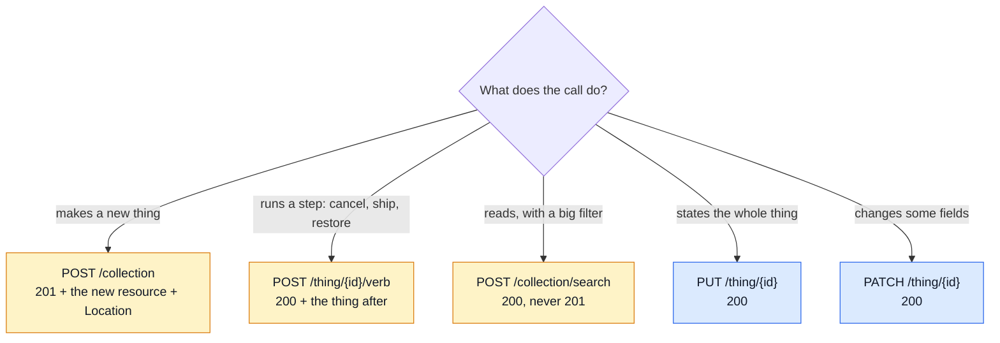
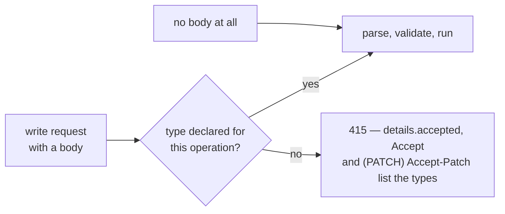
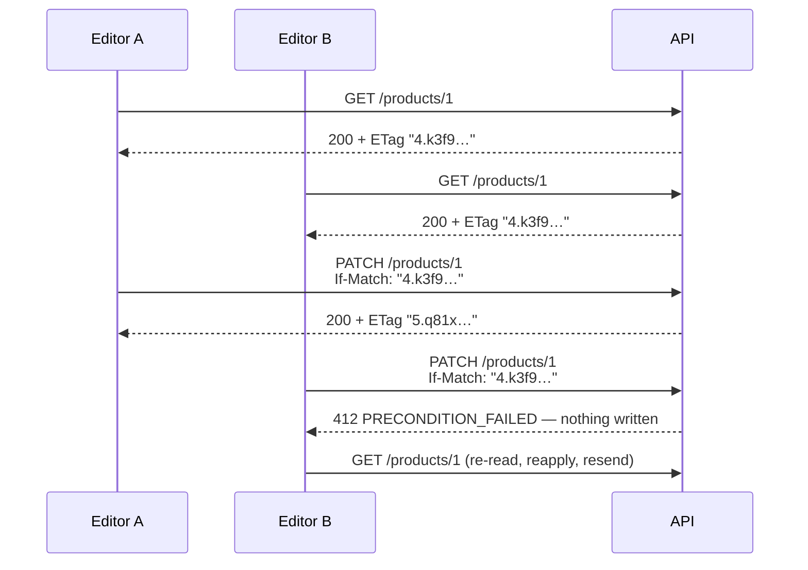
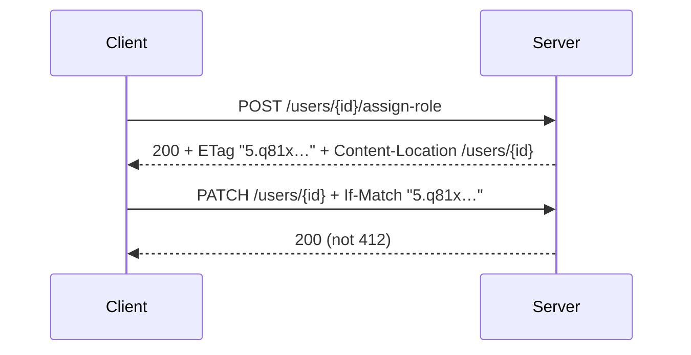

# Write Methods: POST, PUT, PATCH

Every write route follows the web's own rules for its verb. This page is those rules, in the
form this API applies them, and the few places it deliberately does something else.

| | Standard |
| --- | --- |
| POST, PUT, status codes | [RFC 9110](https://www.rfc-editor.org/rfc/rfc9110) — HTTP Semantics |
| PATCH | [RFC 5789](https://www.rfc-editor.org/rfc/rfc5789) — the method |
| What a PATCH body means | [RFC 7396](https://www.rfc-editor.org/rfc/rfc7396) — JSON Merge Patch |
| Retrying a POST safely | [`Idempotency-Key`](https://datatracker.ietf.org/doc/draft-ietf-httpapi-idempotency-key-header/) — IETF draft |

## The three verbs in one table

| | POST | PUT | PATCH |
| --- | --- | --- | --- |
| Means | create in a collection, or run an action | replace the whole resource | change part of it |
| Target | `/products` · `/orders/{id}/cancel` | `/products/{id}` | `/products/{id}` |
| Body | the new resource, or the action's input | the **full** new representation | only what changes |
| An omitted field | the server's default | **cleared** (see [PUT](#put-—-replace)) | left alone |
| `null` | 422 — nothing to clear yet | clears | clears |
| `''` | 422 wherever the field has `minLength: 1` | same | same |
| Safe to repeat | no — send `Idempotency-Key` | yes (idempotent) | yes, in practice |
| Success | **201** + the created resource + `Location` · **200** for an action | **200** + the resource | **200** + the resource |
| Target missing | — | 404 | 404 |

```mermaid
flowchart TD
    Q{"What does the call do?"}
    Q -->|"makes a new thing"| C["POST /collection<br/>201 + the new resource + Location"]
    Q -->|"runs a step: cancel, ship, restore"| A["POST /thing/{id}/verb<br/>200 + the thing after"]
    Q -->|"reads, with a big filter"| S["POST /collection/search<br/>200, never 201"]
    Q -->|"states the whole thing"| P["PUT /thing/{id}<br/>200"]
    Q -->|"changes some fields"| M["PATCH /thing/{id}<br/>200"]

    classDef post fill:#fef3c7,stroke:#d97706,color:#111827;
    classDef put fill:#dbeafe,stroke:#2563eb,color:#111827;
    class C,A,S post;
    class P,M put;
```

## POST

### Create → 201

- The body answered is the created resource itself ([Success Responses](./responses.md)) — a checkout answers the order
  itself, an address write answers the address.
- `Location` names the new resource's URI (RFC 9110 §9.3.3) — `Location: /products/{id}`. The
  contract declares it `required` on every 201, and the shared response check
  (`tests/support/response-contract.ts`) fails a 201 without it.
- A retried create under its `Idempotency-Key` replays the `Location` with the body.
- A sub-collection create is a create too: `POST /delivery/fulfillment-orders/{id}/shipments`
  and the digital door `POST /delivery/fulfillment-orders/{id}/fulfill` answer 201 with `Location`
  naming the shipment, and `POST /payments/{id}/refunds` answers 201
  with the new `Refund` and `Location: /payments/{id}/refunds/{refundId}`. The payment's running
  totals are one `GET /payments/{id}` away.
- **A 201 means something was created** (RFC 9110 §15.3.2). An intent that only refreshes the
  order's one payment row answers **200**.
- Anything the contract does not declare is a 422 (`additionalProperties: false`), never a column.

### Action → 200

- `POST /orders/{id}/cancel`, `/restore`, `/override-status`: a state change on a
  thing that already exists. 200, with the thing as it now stands.
- When the body answered IS the new record, it is a create (201 + `Location`). When an action
  answers the thing acted on, it may create records on the side (refunds, credit notes, override
  shipments, stock movements) and stays 200.

#### A toggle is a pair of actions

A toggle on a resource is a state of a record that stays, flipped both ways (assigned or not, held
or not). When either direction has its own effect, guard, permission, audit row or notification, it
is a pair of POST actions, `POST /x/{id}/<verb>` and `POST /x/{id}/<opposite>`, never a PUT/DELETE
pair (Google [AIP-136](https://google.aip.dev/136): POST for a method with side effects):

- `assign` / `unassign` a task, `place-purchase-hold` / `lift-purchase-hold` on a user, `assign-role` /
  `revoke-role` on a user (the staff role; naming a different role replaces it, the last write wins).
- Each answers 200 and the resource. A repeat that finds the target state already reached is 409
  (`<RESOURCE>_ALREADY_<STATE>` or `<RESOURCE>_NOT_<STATE>`). No `Idempotency-Key`: the state
  machine refuses the repeat.
- A direction whose body names a value (assign to X, place a hold until D) treats "the same value
  already in force" as that repeat; its `actions` flag stays true, and the client hides the control
  for the value in force. A body-less direction's flag is false once its state is reached.
- PUT/DELETE sub-paths stay for what writes a value or names a thing: a line, a body-less pointer,
  a pending request its owner discards, a value of the parent (`…/shipping-address`,
  `/cart/shipping-method`, `…/cover`), the `/hard` delete.
- A toggle with no direction of its own is a field of PUT/PATCH (`Product.active`).

#### Action or field

A status or flag moves through an action when the move has its OWN effect, guard or permission.
Otherwise it is a field of `PUT` / `PATCH`.

| The move has... | So it is | Example |
| --- | --- | --- |
| a side effect of its own (ends sessions, clears a cache, resets a streak, releases a hold) | an action | `POST /users/{id}/deactivate`, `POST /orders/{id}/cancel` |
| a guard or a permission of its own | an action | `POST /locales/{locale}/deactivate` (fallback guard) |
| an identity of its own: a sign-in or recovery channel, with a step-up and mails of its own | an action at its own door, never a field of the profile | `POST /account/email-change {email}`, `POST /account/password` |
| consequences that come only from the state it leaves behind | a field | `Product.active`, `purchasable`, `allowBackorder` |

`product.buyable_again` does not make `active` an action: it follows the derived `buyable` state,
whichever of five fields or a stock receipt changed it. The same test is written from the domain
side in [`tactical-ddd.md`](../theory/tactical-ddd.md#action-endpoints-execute-update-does-not-decide).

### A line is written through its parent

A **line** is a part of a parent with no life of its own: a cart line, a saved product, a
back-in-stock request, an OAuth link, a task's note, a webhook subscription's secret. It is written through the
parent. It has no read of its own: where a line has a URL, that URL only adds, changes or removes
the line.

| Parent                    | Line collection         | Add                                  | Change                              | Remove                                            |
| ------------------------- | ----------------------- | ------------------------------------ | ----------------------------------- | ------------------------------------------------- |
| the cart                  | `/cart/items`           | `POST /cart/items {productId, quantity}` | `PATCH /cart/items/{productId}` | `DELETE /cart/items/{productId}`, all: `DELETE /cart/items` |
| the wishlist              | `/wishlist/items`       | `POST /wishlist/items {productId}`   | none (a line is a yes/no)           | `DELETE /wishlist/items/{productId}`              |
| the stock-alert list      | `/stock-alerts` itself  | `POST /stock-alerts {productId}`     | none                                | `DELETE /stock-alerts/{productId}`                |
| the caller's OAuth links  | `/account/oauth/links`  | `POST /account/oauth/links/{provider}` (a redirect flow) | none         | `DELETE /account/oauth/links/{provider}`          |
| a task's staff thread     | `/tasks/{id}/notes`     | `POST /tasks/{id}/notes {body}`      | none (append-only)                  | none (append-only)                                |
| a webhook subscription's secret ring | `/webhooks/subscriptions/{id}/secrets` | `POST …/secrets` | none                  | `DELETE …/secrets/{secretId}`                     |

- The collection is `/items` when the parent holds one kind of line, the line's own noun when it
  has one (`/secrets`, `/links`), and the parent itself when it is nothing but the list.
- Every write answers **200 + the whole parent**: no 201, no `Location`, no GET of one line. A GET
  on the line collection is a 405 naming the writes; the parent's GET is the read.
- **A PUT never creates**, and a PATCH on a line the parent does not hold is a 404.
- A repeat is not an error for an add: adding what is saved is the same 200 and fires nothing
  twice. A cart add GROWS an existing line instead (Shopify, commercetools). Removing a line the
  parent does not hold is a 404. An append-only line (a note) has no identity to repeat on: each
  add appends one, and a retry is made safe by `Idempotency-Key` alone.
- Names: a line add is `create*` (`add*` for a cart line, which may grow instead), its removal
  `delete*` or `remove*`, its change `update*`.

Why: a 201 says a resource was created at a URL, and a line has no read of its own to name (RFC 9110
§9.3.3: a POST that creates SHOULD answer 201 with a `Location`, a SHOULD this API sets aside for a
line, with the reason here; §9.3.4 makes a PUT that creates a MUST-201). The parent is what the
client re-renders, so the parent is the answer (§15.3.1: a 200 carries "the result of the
action"). Medusa v2 (`POST`/`DELETE /store/carts/{id}/line-items[/{line_id}]`), BigCommerce
(`POST /carts/{id}/items`, `POST`/`DELETE /wishlists/{id}/items[/{item_id}]`), Shopify's
`cartLinesAdd`/`Update`/`Remove`, commercetools' cart update actions and Auth0's identity unlink
all answer the parent.

### A child created under its parent

A **child** with a life of its own (an id, a status, actions of its own) may be created at
`POST /parent/{id}/children` with no `GET` on that path (it answers 405 with `Allow: OPTIONS, POST`), when:

1. each child has its own `GET` by id;
2. all of a parent's children come back from one **named read**;
3. the POST's `description` names that read.

| Create                                                  | Listed by                         | One child                           |
| ------------------------------------------------------- | --------------------------------- | ----------------------------------- |
| `POST /payments/{id}/refunds`                           | `GET /payments/{id}` (`refunds`)  | `GET /payments/{id}/refunds/{refundId}` |
| `POST /delivery/fulfillment-orders/{id}/shipments`      | `GET /orders/{id}/shipments`      | `GET /delivery/shipments/{id}`      |

Why: Solidus (the reference for API shape) creates under the parent with no index, and Shopify's
current API reads children through the parent. AIP-121 says a resource "must support List"; a list
here is a small additive change the day a real caller asks for one. A **line** (above) differs: it
has no id or read of its own.

### Repeating an action (409)

An action whose target state is already reached is **refused**, not answered with a second success:
`409` with a `<RESOURCE>_ALREADY_<STATE>` code and a plain message. This is the lifecycle rule
(RFC 9110 §15.5.10: a conflict with the current state; Google's AIP-216 "state transition not
allowed", with 409 where Google says 400).

- `POST /users/{id}/activate` on an active account: `USER_ALREADY_ACTIVE`; `deactivate` on a
  deactivated one: `USER_ALREADY_INACTIVE`.
- `POST /tasks/{id}/resolve` on a resolved task: `TASK_ALREADY_RESOLVED`; `mark-spam` on spam:
  `TASK_ALREADY_SPAM`; `reopen` on an open one: `TASK_ALREADY_OPEN`. A reopen that finds a newer
  open task on the same situation: `TASK_SUPERSEDED`, with the newer task's id in `details`.
- `POST /users/{id}/lift-purchase-hold` on an account with no hold and no review flag:
  `USER_PURCHASE_HOLD_NOT_SET`.
- `POST /users/{id}/revoke-role` on an account with no staff role: `USER_ROLE_NOT_ASSIGNED`;
  `POST …/assign-role` naming the role it holds already: `USER_ROLE_ALREADY_ASSIGNED`. Both write and
  audit nothing.
- `POST /tasks/{id}/unassign` on a task nobody holds: `TASK_NOT_ASSIGNED`; `POST …/assign` to the
  person who holds it already: `TASK_ALREADY_ASSIGNED`. Both write, announce and audit nothing.
- A retried `DELETE` is never this refusal: what it answers with nothing left to remove is
  [DELETE — remove](#delete-—-remove). The line rule's repeat 200 is for adds only: removing a line
  not held is a 404.
- The caller's `actions` flag for the move is `false` in that state, so a screen never offers it.
- Every 409 names a code, and the code is listed in a contract fragment's `x-error-codes`: a bare
  message cannot be told from its neighbour by a client. `tests/cross-cutting/api-standards.test.ts`
  reads the source for it.

#### An action whose target state is already reached

`POST …/enable` on an enabled subscription, `POST …/disable` on a disabled one: **409**, with
`<RESOURCE>_ALREADY_<STATE>` (`WEBHOOK_SUBSCRIPTION_ALREADY_ENABLED`) and a plain message. Not
200, because an action may carry an effect a repeat must not re-run (enabling resets the failure
streak). Not 400, which Google's [AIP-216](https://google.aip.dev/216) uses: the lifecycle rule is
"a refusal that depends on the current state is 409 + code" (RFC 9110 §15.5.10). A `DELETE` is
not this refusal: see [DELETE — remove](#delete-—-remove).

### An item write has an item read

A resource that can be changed by id can be read by id. Without `GET /x/{id}` a detail or edit page
has to find its record in a list: past the page size it never finds it, and it cannot tell "gone"
from "not loaded". The read is scoped like the list's rows (a row the caller may not see is a 404,
never a 403 that confirms it exists), and answers the same shape the list rows carry. Webhook
subscriptions are the example: `GET /webhooks/subscriptions/{id}`.

The item reads, and what each is scoped by:

| Item read                                              | Scoped by                                          |
| ------------------------------------------------------ | -------------------------------------------------- |
| `GET /webhooks/subscriptions/{id}`                     | the shop's own subscriptions                       |
| `GET /payments/{id}`                                   | the payer's own, or `display:Payment`              |
| `GET /payments/{id}/refunds/{refundId}`                | the payment's scope; a record it does not hold     |
| `GET /tasks/{id}`                                   | `read:Task`, and for a system task its route set |
| `GET /api-keys/{id}`                                   | this shop's credentials, `read:ApiKey`             |
| `GET /account/addresses/{addressId}`                   | the caller's own book                              |
| `GET /account/sessions/{sessionId}`                    | the caller's own live sessions                     |
| `GET /locales/{locale}/apps/{app}/entries/{entryId}`   | `update:Locale`, the editing screen's key          |
| `GET /delivery/shipments/{id}`                         | the order's scope: the buyer's own, or `display:Order` |
| `GET /delivery/fulfillment-orders/{id}`                | the order's scope: the buyer's own, or `display:Order` |
| `GET /notifications/{id}`                              | the caller's own inbox                             |
| `GET /webhooks/deliveries/{id}`                        | this shop's delivery log, `read:WebhookSubscription` |
| `GET /inventory/levels/{productId}`                    | `read:StockLevel`, the stock board's key           |

A row the caller may not see, an unknown id and a malformed one are the same 404.

A successful write answers the resource exactly as a GET by the same caller reads it (AIP-133/134/164):
the same language, the same `translations` and stock counters for the same grants. `POST /products`,
`PUT` and `PATCH /products/{id}` and `POST /products/{id}/restore` are the example.

### Search → 200

`POST /x/search` is a read that needs a body — see
[Request Input](../theory/request-input.md). It creates nothing, so it is never a 201.

### Retrying a POST

A POST is not idempotent: sent twice, it may create twice. Every POST or PATCH whose repeat would
write again accepts an optional `Idempotency-Key`. Where a repeat would move money or stock twice (the do-not-retry class) the key is
required (400 without it), and a key whose first attempt never reported an outcome answers a stored
409 `IDEMPOTENCY_OUTCOME_UNKNOWN` instead of running again. See
[Do-not-retry operations](../tools/idempotency.md#do-not-retry-operations). A deliberate second click is a new intent with a new key, and acts
again. A PATCH whose merge patch sets absolute values is idempotent by construction and needs
none. Everything else is named, by class, in
[Named exceptions](../tools/idempotency.md#named-exceptions).

## PUT — replace

The body **is** the new resource (RFC 9110 §9.3.4).

| A field in the representation is… | Omitted from a PUT |
| --- | --- |
| clearable (`type` lists `'null'`) | cleared — as if it were sent as `null` |
| not clearable (no legal empty state) | **required**: omitting it is a 422 |
| outside the representation (below) | unchanged, always |

**Outside the representation** — a PUT neither sets nor clears these:

| Kind | Examples | Changed only by |
| --- | --- | --- |
| server-managed | `id`, timestamps, lifecycle `status`, totals, `verifiedAt` | the server |
| a secret with its own door | `password` | `POST /account/password`, the reset flow |
| a sign-in channel with its own door | `email` | `POST /account/email-change` |
| an uploaded file | `imageUrl` | a multipart upload; an explicit `null` clears |
| a pointer owned by the parent | an address's `default` | `PUT /account/addresses/{id}/default` |

An image is the case that shapes the rule: a client can no longer send the current path back
(`imageUrl` accepts `null` only), so a PUT that never mentions it must keep it, or every
GET → edit → PUT round trip would delete the picture.

**Idempotent.** The same PUT twice leaves the same state as once (RFC 9110 §9.2.2). A value equal
to the stored one is no change — no second email, no role re-grant, no version or revision bump.
Logging each request is allowed.

**A PUT with no body points at something.** When the URI is the whole statement, the body is
empty: `PUT /account/addresses/{id}/default` (this address is the default). Sent twice, nothing
changes — Shopify's `PUT …/addresses/{id}/default.json` is the same shape. A line of a parent
(a saved product, a cart line) is not this: it is written through the parent, see
[A line is written through its parent](#a-line-is-written-through-its-parent).

**A PUT never creates.** A PUT on an id that does not exist is a 404 (a PUT that creates MUST
answer 201, RFC 9110 §9.3.4, and nothing here has a URL the client may name).

**Offer a PUT only when the body can be the whole resource.** A route that changes part of a
bigger record is a PATCH alone (`PATCH /delivery/shipments/{id}` changes only the tracking code),
never a PUT that clears the rest.

**A server may transform.** RFC 9110 lets the stored state differ from the body. No route does
today: the one that did, an email held as `pendingEmail` until proven, is its own door now
(`POST /account/email-change`), so `PUT /account` stores exactly what it is sent.

**A keyed map is part of the representation.** A product's `translations` on a PUT is the whole
set: a stored locale it leaves out is deleted, the fallback locale is required, and a locale it
states is stated whole (its omitted `description` is cleared).

## PATCH — JSON Merge Patch

The body is a merge patch (RFC 7396):

| The body says | The server does |
| --- | --- |
| `"field"` absent | leaves it alone |
| `"field": value` | replaces it |
| `"field": null` | clears it |
| `"list": [ … ]` | replaces the whole array |
| `"object": { … }` | merges into it by the same rules, one level down — `"translations": {"it": {"title": "x"}}` changes only the Italian title |

Sent as `application/merge-patch+json` (RFC 7396's own media type) or plain `application/json`
(what GitHub accepts). Both are declared in the contract on every PATCH; the frontend calls the
JSON one.

## DELETE — remove

A `DELETE` has no body; one is refused with 415 (see [Content-Type: 415](#content-type-415)).
Success is 204; 200 when the answer is the parent (a cart or wishlist line) or the list left; 202
when the removal is scheduled (`DELETE /account`). A webhook secret's removal is a 204 too: the
subscription is one read away. A `DELETE` answer is never tagged.

Sent again, it writes nothing and sends no second domain event, mail or audit row (RFC 9110
§9.2.2). An analytics hit or a stream refresh may repeat. What it answers with nothing left to
remove follows what the URI names now:

| The URI names... | Sent again, it answers | Example |
| --- | --- | --- |
| one thing that no longer answers a GET | 404 | a row, a line, a session, a link, a withdrawn order note |
| one thing that still answers a GET, marked deleted or revoked, for the caller allowed to delete it | the same success | a soft-deleted product, user or order; a revoked API key |
| a collection or a pending request | the same success, even when empty | `DELETE /cart/items`, `/notifications`, `/account/email-change` |

A row kept with its content withdrawn but with no GET of its own (an order note) is gone: 404.

A `DELETE` is never the "already done" 409 of an action (see
[Repeating an action](#repeating-an-action-409)). A 409 on a `DELETE` is a guard
(`ORDER_NOT_CANCELED`, `LOCALE_LANGUAGE_IS_FALLBACK`).

Why: RFC 9110 §15.5.5 says 404 means the target has no current representation. §13.1.1 allows a
2xx when the change was already applied to a representation that still exists, as after a lost
response, and the RFC ranks above Google's AIP-164, which answers NOT_FOUND for a repeated soft
delete (as does Solidus). The no-op success was chosen deliberately: a double-click is not an
error. GitHub answers 204 for remove-all-labels and 404 for one label that is missing; Shopify's
Ajax cart clear returns the empty cart. See
[`collection-delete`](../theory/api-standards.md#where-we-differ-and-why) for the collection form
against Google's AIP.

## Content-Type: 415

The JSON body parser handles only the types it is told to, so a body in any other type would arrive as
`{}` — and an all-optional PATCH schema accepts `{}`: a 200 that changed nothing. The guard refuses it instead.

```mermaid
flowchart LR
    R["write request<br/>with a body"] --> G{"type declared for<br/>this operation?"}
    G -->|"yes"| P["parse, validate, run"]
    G -->|"no"| E["415 — details.accepted, Accept<br/>and (PATCH) Accept-Patch list the types"]
    N["no body at all"] --> P
```

The guard is `requireDeclaredContentType`, built from `api/request-content-types.ts`, which
`npm run gen:api` derives from the contract's own `requestBody` media types. A request with no
bytes is not judged: a missing required body is the schema's own 422.

The 415 also sends `Accept` with the declared types, and `Accept-Patch` (the same list) on a
`PATCH` (RFC 9110 §12.5.1, RFC 5789 §2.2). An operation with no declared body sends neither. The
`OPTIONS` answer reads the same row (`declaredOperation`), so the two lists never differ.

Any write (`POST`, `PUT`, `PATCH`, `DELETE`) that declares no body is listed with no types at all
(`types: []`), and the guard refuses ANY body on it, `{}` included, `details.accepted` empty. An
action button (`POST /users/{id}/deactivate`) therefore never drops a `{"reason": …}` with a 200:
the sender is told the field was not read. The contract declares the 415 on every such operation.
For a `DELETE` that is also why `DELETE /products/{id}` takes no `{hardDelete}`
body: a client or gateway that drops it would turn a hard delete into a soft one, so the flag lives
in the query or the `/hard` path and a body is refused instead of ignored.

## A known path with the wrong method

A path the contract declares, asked with a method it does not give it, answers **405** with an
`Allow` header (RFC 9110 §15.5.6) — never the catch-all's 404. `DELETE /tasks/{id}` is fine,
`PATCH /tasks/{id}` is a 405 naming `DELETE, GET, HEAD, OPTIONS`: a task's `status` is read-only and moves only through its doors.

- **`Allow` is sorted**, with HEAD beside GET and `OPTIONS` on every path: every served path
  answers it, and a 405 must list what the resource supports (RFC 9110 §15.5.6). The 405 and the
  `OPTIONS` answer (below) take it from one function, so they never disagree. The guard never
  judges `OPTIONS` itself: that answer runs before any router.
- **A trailing slash is the same path.** `/things/` reads as `/things`.
- **A literal path wins over a templated one.** `DELETE /products/facets` would otherwise
  read `categories` as the `{id}` of `/products/{id}` and answer 404, so the guard runs a second
  time before the routers, for paths with no `{param}` only.
- **A module this build does not serve stays a 404**: its paths are in the table, but nothing is
  mounted to ask.
- **Not declared per operation.** The 405 belongs to a request that matched no operation, so no
  operation's `responses` could carry it; its code, `METHOD_NOT_ALLOWED`, is in the contract's
  `x-error-codes`.
- **Swept over the whole spec.** `tests/integration/method-not-allowed.test.ts` asks every path of
  `openapi.yaml` with every verb it does not declare and expects 405 plus the exact `Allow`. It
  asks as an admin: a router-level auth guard answers an anonymous caller 401 first, on purpose,
  so an anonymous caller learns nothing about which routes and methods exist.

## `OPTIONS` says what a path accepts

`OPTIONS` asks a path what it can do (RFC 9110 §9.3.7; RFC 5789 §3.1 for `Accept-Patch`). `cors`
runs with `preflightContinue: true`, so ONE handler (`answerOptions`, mounted right after it in
`src/app/security.ts`) answers every `OPTIONS`, whatever the Origin.

| Request | Answer |
| --- | --- |
| a path of a served module | 204 + `Allow`; `Accept-Patch` only when `Allow` has `PATCH` |
| `OPTIONS *`, or a preflight (`Access-Control-Request-Method`) on any path | 204 |
| a plain `OPTIONS` on a path no served module owns | the 404 problem |

- **No `Content-Length` on the 204** (RFC 9110 §8.6).
- **Same `Allow` for an allowed, a refused and an absent Origin.** A refused Origin gets no
  `Access-Control-*` headers, so the browser still fails the call.
- **`Allow` lists `OPTIONS`**, the same as the 405.
- **A literal path wins**: `/products/facets` answers `GET, HEAD, OPTIONS`, not the `/products/{id}` set.
- **`Accept-Patch`** is the media types the contract declares for that path's `PATCH` body.
- **A module this build does not serve** is a 404 for a plain `OPTIONS`, like any other method.

The guard is `methodNotAllowed`, built from `api/operation-routes.ts`, which `npm run gen:api`
derives from the contract's paths and mounted twice in `src/app/routes.ts`: before the routers
(literal paths) and right before the 404 (every other path).

## Empty, `null`, omitted

`null` is a **write verb**. It travels in a request, never in a response.

| | request (write) | response (read) |
| --- | --- | --- |
| key absent | nothing to say (POST: default · PATCH: untouched · PUT: cleared if clearable, else 422) | no value |
| `null` | clear it; PUT/PATCH only, only where `type` lists `'null'`; 422 on a create | **never sent** |
| `''` | an empty value, never "clear"; only where no `minLength` | only a real empty value (a blank translation), never "none" |

The read half is guarded twice: `tests/cross-cutting/contract-responses-never-null.test.ts` refuses
a `'null'` type in any response schema, and `tests/support/response-contract.ts` fails any real
response body that holds a `null` anywhere, free-form objects included (an audit row's `changes`, a
timeline row's `data`). An unset side of an audit `{ from, to }` is the absent key.

One exception: permission rule conditions on the session answers (a sign-in, `GET /account`, a
refresh). A permission rule's conditions are a query, not a value; `null` there is the operand "has no
value", and the only form allowed is `{ deletedAt: null }`. The client never evaluates a condition
(`can()` takes a type name only); the rule travels as the server holds it. Any other `null`, and any
other response carrying the same shape, is still refused.

The same spelling is the house query rule for a soft delete: `deletedAt: null`, never
`deletedAt: { $exists: false }`, so a permission rule and a repository filter read alike
(`products`' `PUBLIC_SCOPE` follows it). The rule is limited to `deletedAt` and permission
conditions: other fields legitimately ask `$exists` (`lockedUntil`, `supersededAt`, `trackingCode`).

A stored `null` that means something (a product's `backorderLimit`: no cap) is mapped in the
presenter, so the wire still says "absent". RFC 7396 §1 is why: a `GET` that served `"x": null`,
written back by a `PATCH`, would delete `x`.

Every optional free-text field in a write body carries `minLength: 1`, so a blank string is a
422 rather than a stored `''`. Search bodies are reads: an empty filter there is ignored.

A create body declares no `'null'` type — there is nothing to clear yet, so `null` is a 422 and
"no value" is spelt by leaving the field out.

## Multipart

`multipart/form-data` has no `null`: every part is a string or a file.

- The server validates a multipart body with the **JSON** schema of the same verb, after decoding
  booleans, numbers, arrays and JSON parts.
- So a clear cannot travel with an upload. Clear with a JSON PATCH; send the file alone, or with
  the fields that have values.
- The `*Multipart` schemas are documentation and client codegen only. They declare no
  `'null'` type.

## Status codes a write answers

| Code | When |
| --- | --- |
| 200 | an update, an action, a search, an idempotent refresh |
| 201 | a create — something new exists, and `Location` says where |
| 204 | a delete, a logout, a confirm step: done, nothing to say, no body — see [No content](./responses.md#no-content) |
| 404 | the target does not exist (or the caller may not know it does) |
| 409 | the write conflicts with the current state — a duplicate, a lifecycle refusal, an action whose target state is already reached, a cap reached (`WEBHOOK_SUBSCRIPTION_LIMIT_REACHED`: deleting a record would let the same request through) |
| 412 | an `If-Match` that no longer matches — see [Conditional writes](#conditional-writes-etag-and-if-match) |
| 415 | a body in a type the operation does not declare |
| 422 | the body breaks the contract or a domain rule |

An action endpoint (`POST …/activate`) whose target state is already reached is refused, not
answered with a silent 200: **409** with `<RESOURCE>_ALREADY_<STATE>` and a plain message, as
Google AIP-216 asks for a state that cannot be moved to, kept at 409 because RFC 9110 §15.5.10
defines it as a conflict with the current state. `DELETE` stays idempotent: [DELETE — remove](#delete-—-remove).

The app-wide ones (400, 413, 415, 429, 500, 503) come from `x-app-level-responses` — see
[Regenerating](./regenerating.md).

## Conditional writes: ETag and If-Match

Two admins open the same product. Both save. Without a check, the second save silently overwrites
the first — the *lost update*. A versioned resource lets the client say "only if it is still the
version I read" (RFC 9110 §13.1.1); the server refuses with **412** when it is not.

| | Standard |
| --- | --- |
| `ETag`, `If-Match`, 412 | [RFC 9110](https://www.rfc-editor.org/rfc/rfc9110) §8.8.3, §13.1.1, §15.5.13 |
| Same idea elsewhere | Kubernetes `resourceVersion`, Google [AIP-154](https://google.aip.dev/154) `etag` |

**Optional.** No `If-Match`, no check: the write runs as it always did, last writer wins. Requiring
it (428, RFC 6585) can come later without changing anything below.

```mermaid
sequenceDiagram
    participant A as Editor A
    participant B as Editor B
    participant S as API
    A->>S: GET /products/1
    S-->>A: 200 + ETag "4.k3f9…"
    B->>S: GET /products/1
    S-->>B: 200 + ETag "4.k3f9…"
    A->>S: PATCH /products/1<br/>If-Match: "4.k3f9…"
    S-->>A: 200 + ETag "5.q81x…"
    B->>S: PATCH /products/1<br/>If-Match: "4.k3f9…"
    S-->>B: 412 PRECONDITION_FAILED — nothing written
    B->>S: GET /products/1 (re-read, reapply, resend)
```

### Which resources are versioned

A resource is versioned when its item read hands out an `ETag` **and** its write honours `If-Match`.
A PUT answer never carries a validator: every PUT here transforms what it stores, and RFC 9110 §9.3.4
forbids a validator on the answer then. `dropUnownedValidators` (`http/preconditions.ts`) strips it
whatever the controller or Express set.
The contract says so with one marker on the path item — `x-versioned: [get, put, patch, delete]` —
and the bundler adds the header parameter, the 412 and the response header from it.

#### A create, a restore or an action answers the real tag

A write that answers a versioned resource hands back **that resource's tag**, plus
`Content-Location` naming it (RFC 9110 §8.8.3, §15.3.2, §6.4.2 rule 7: without `Content-Location` a
POST answer's body is "unidentified", and its tag ambiguous). The next edit then needs no read:

```mermaid
sequenceDiagram
    participant C as Client
    participant S as Server
    C->>S: POST /users/{id}/assign-role
    S-->>C: 200 + ETag "5.q81x…" + Content-Location /users/{id}
    C->>S: PATCH /users/{id} + If-Match "5.q81x…"
    S-->>C: 200 (not 412)
```

- **Who:** creates (products, users, examples, orders, cart checkout, webhook subscriptions,
  languages), restores (products, users, orders) and actions (user activation, role, purchase hold;
  order cancel, override, process; example publish, archive, unarchive; subscription enable,
  disable and secret rotation; language activate, deactivate; the caller's own email-change
  request, which answers what `GET /account` does).
- **How:** the controller calls `answerAsResource(response, row, uri)`: `setEtag` plus
  `Content-Location`, in the path convention `Location` uses. The body must be what a `GET` on that
  URI returns right after (§8.7); users share `toUserContract`, products `presentForCaller`.
- **The hook marks, it does not guess.** `setEtag` marks the response; on any write that is not a
  PUT, `dropUnownedValidators` removes an `ETag` that nothing marked. That is Express's byte-hash,
  which no `If-Match` accepts. On a PUT it removes every validator, whoever set it.
- **Replays:** an idempotent retry replays `ETag` and `Content-Location` and keeps the tag.
- **Not tagged:** signup and login (nothing to edit yet), a search, a delete. A POST that answers a
  row nobody can edit later answers no tag.
- **Contract:** `x-versioned: [post]` on the create's or the action's own path item. The bundler adds
  `ETag` and `Content-Location` (both required) to its 2xx, and no `If-Match` or 412. The optional
  app-level `ETag` is left off every write answer.

| Resource | Read that sends `ETag` | Writes that take `If-Match` |
| --- | --- | --- |
| product | `GET /products/{id}` | `PUT`, `PATCH`, `DELETE /products/{id}`, `DELETE /products/{id}/hard` |
| user | `GET /users/{id}` | `PUT`, `PATCH`, `DELETE /users/{id}`, `DELETE /users/{id}/hard` |
| order | `GET /orders/{id}` | `PUT`, `PATCH`, `DELETE /orders/{id}`, `DELETE /orders/{id}/hard` |
| the caller's account | `GET /account` | `PUT`, `PATCH /account` |
| example | `GET /examples/{id}` | `PUT`, `PATCH`, `DELETE /examples/{id}` |
| webhook subscription | `GET /webhooks/subscriptions/{id}` | `PUT`, `PATCH`, `DELETE /webhooks/subscriptions/{id}` |
| language | `GET /locales/{locale}`; `POST /locales` answers its tag | `PUT`, `PATCH /locales/{locale}` (not the `DELETE`: removing a language is unconditional) |
| a language's dictionary entries | `GET /locales/{locale}/entries`, `GET /locales/{locale}/apps/{app}/entries` | the two imports, `PUT`, `PATCH /locales/{locale}/apps/{app}/entries` (the single-entry writes take none) |
| translations of an entity | `GET /locales/translations/{entityType}/{id}` | `PUT`, `PATCH /locales/translations/{entityType}/{id}` |

The role door (`POST /users/{id}/assign-role`, `/revoke-role`) is not in that column: a POST is a
state change with its own 409, not an overwrite, so two callers naming different roles both succeed
and the last write wins. It still moves the row's `editRevision`, so an edit holding an older tag is
refused.

Not versioned: a resource with one owner or one field (an address in its book), no item read to take a
tag from (the cart), or its own concurrency rule (cart lines, stock, a task's status doors). A `PUT` or
`DELETE` with `If-Match` on one of those is simply not declared; the reasons are in
[`unversioned-writes`](../theory/api-standards.md#where-we-differ-and-why).

A language is addressed by its tag, so its `If-Match` is keyed by the tag (case-insensitive: `pt-br`
is `pt-BR`), while the counter lives on its row. Switching it on or off moves the edit counter and
`updatedAt`, so an open name form is refused after a toggle; writing a dictionary entry moves
neither.

A language's entries are fenced on a second counter of the same row, its `revision` (what clients
re-fetch on). One counter per language, not per app: both lists, the one app's and the all-apps one
the export reads, answer it as the version of their `ETag`, so the tag of the export is the tag of
the import. The cost is one retry: a write to app X refuses an open import into app Y once, and
that is safe, where a per-app counter could not describe the all-apps list at all.

- **The imports take it.** `PUT` and `PATCH /locales/{locale}/apps/{app}/entries` send the tag of a
  list read as `If-Match`; a language whose `revision` moved since is a 412 and nothing is written.
  An import that would change nothing is checked too (RFC 9110 §13.1.1 evaluates the condition
  before the method). The `PATCH` answers the new tag.
- **The single-entry writes do not take it**, as the edit of one string is not an overwrite of a
  list. They move the same counter, and the row and the bump are one transaction, so an import
  cannot land between the two and pass a fence that has not moved yet.
- **An import's check and its bump are inside its own transaction** too: the fence is a read of
  the language row, so a bump that lands afterwards conflicts with the import's own and re-runs
  the whole attempt against the new counter.
- **Using a page's tag on the import URL is a house convention** (`if-match-edit-version`): the
  tag came from a GET with a query, the import has none. The client strips the query when it files
  a tag, and sends the all-apps list's tag explicitly on an import.

The translations of an entity are fenced on the OWNER's counter (the product's or the example's
`editRevision`), not on one of their own: a translation save already moves it, and a product read
shows the translations. So a translation save and a product edit refuse each other's stale tag, on
purpose; a stock move refuses neither. The read answers 404 for an entity that does not exist.

A webhook subscription's delivery bookkeeping (the failure streak, the auto-disable) writes with
`timestamps: false`, so a delivery outcome never moves the edit counter and never refuses an open
edit form.

### The pattern: optimistic locking

The edit counter is a **version number**, the pattern called *optimistic locking*
([Fowler: Optimistic Offline Lock](https://martinfowler.com/eaaCatalog/optimisticOfflineLock.html)).
Rails `lock_version`, JPA `@Version` and Kubernetes `resourceVersion` are the same idea.
`If-Match` is how HTTP carries it.

It is not a nonce, though both are "a value the server checks":

| | Version counter (this) | Nonce |
| --- | --- | --- |
| Value | an integer that goes up by one per edit | random |
| Order | yes: 5 is newer than 4 | none |
| Shared? | everyone who reads the row gets the same one, until the next edit | each one is issued once |
| Answers | "has this changed since I read it?" | "have I seen this message before?" |
| Here | `editRevision`, the edit part of the `ETag` | the `Idempotency-Key` ledger, the OAuth `state`, the ALTCHA antibot challenge |

Three rules keep it honest. Break any one and a lost update gets through:

1. **Check and write in one atomic step.** "Update where the counter is 7, and make it 8"; nothing
   matched → 412. A check in one step and a write in the next lets a second editor in between.
   See [What the server does with `If-Match`](#what-the-server-does-with-if-match).
2. **Every edit moves the counter in the same atomic step as the edit.** A row and its own counter:
   one update (`$inc`). Many rows under one counter: one transaction. A bump made afterwards leaves
   a window where the data has changed and the counter still says it has not.
3. **The tag describes exactly what the client read.** A read that covers a whole set of rows
   hands out the set's counter, so a write based on that read is checked against the set.

### What the tag is

- **`ETag: "<editRevision>.<digest>"`** — strong, quoted, opaque to the client: compare it, never
  parse it. Two parts, one for each job:
  - **The edit part** (`editRevision`): an integer stored on the row (never in the representation)
    that every edit moves by one, in the same atomic update as the edit itself (`$inc`). A write's
    `If-Match` compares only this.
  - **The digest**: a short sha256 of the exact body sent, so the whole tag changes whenever the
    bytes do (stock, price, language, a stock move) and a read can safely answer `304` on a match.
    A write never compares it, so a sale never refuses an editor's open form. This is the one
    registered difference from RFC 9110 §13.1.1, `if-match-edit-version`
    (`docs/theory/api-standards.md`); FHIR's version-only `If-Match` is the same kind of choice.
  - A Redis copy stores the tag and replays it, so a hit and a miss send the same one.
- **Why a counter, and not `updatedAt` or Mongoose's `__v`.** A strong validator must change
  whenever the representation does (RFC 9110 §8.8.1). Two edits in one millisecond share an
  `updatedAt` (and the PHP twin's timestamps have whole seconds); `__v` moves only when an *array*
  changes. A counter incremented by the database cannot repeat: two writers who both read 4 do not
  both write 5, even with no `If-Match` at all.
- **One rule says what moves it: the counter moves wherever `updatedAt` moves.** Mongoose's
  `timestamps` stamps `updatedAt` on every `save()` and query update that is an edit, and the
  plugin (`persistence/revision-plugin.ts`) adds the `$inc` beside that stamp — through `save()`,
  `updateOne`, `updateMany` and `findOneAndUpdate`, pipeline updates included. A write that is NOT
  an editor's edit passes `timestamps: false` and so never touches either: the stock mirror, the
  image digest, a session token, a password change, the reaper's warning, and another module's
  report on an order (a refund or return word, the stamp that money landed, a shipment's
  fulfillment summary, a guarantee extension). A status move stays an edit, a full shipment
  included. An admin's form is never invalidated by a customer logging in.
- **Where the counter lives.** It is the schema's Mongoose version key (`editRevision`, replacing
  `__v` on every versioned schema). It is not called `revision` because `locales` owns a wire
  field of that name with another meaning. It is stripped from every response and carried beside
  the shaped object (`carryVersion`) so a presenter can reshape a row without losing its tag.
- **An edit that changes nothing on the row still moves it, by stamping `updatedAt` by hand.**
  - A product edited only through its `translations` writes rows outside the product document
    (`TranslatableTarget.markEdited`, also for `PUT`/`PATCH /locales/translations/product/{id}`,
    whichever locale it names).
  - A user edited only through its `role` changes the membership, not the user document
    (`markModified('updatedAt')`): two admins on one tag cannot both change the role.
- **The orders anonymisation sweep is an edit.** It stamps `updatedAt`, so the counter moves and
  an edit form opened before it cannot put the scrubbed email back.
- **One private Mongoose touch.** `save()` has no public door for "increment, but add no version
  filter" (`Document#increment()` does both, which would turn every unconditional save into a
  failure when the row moved), so the plugin sets Mongoose's own `VERSION_INC` bit. A Mongoose
  upgrade that moves it fails `tests/integration/persistence/revision.test.ts` loudly.

### What the server does with `If-Match`

| Header | Result |
| --- | --- |
| absent | the write runs unconditionally |
| `"<tag>"` whose edit part matches the stored version | the write runs; a PATCH's response carries the **new** `ETag`, a PUT's carries none |
| `"<tag>"` whose edit part is old, or the row is gone | **412** `PRECONDITION_FAILED`, nothing written |
| several tags, `"a", "b"` | matches if any edit part does |
| `*` | matches any row that exists |
| weak (`W/"…"`), or anything that is not a quoted tag | never matches → 412 (`If-Match` compares strongly) |

- **The check and the write are one atomic step for `PUT`/`PATCH`/`DELETE`, hard or soft.** The version the
  service loaded is compared with the header, and the same version becomes part of the update's
  filter (Mongoose `$where`, on `editRevision`) — two editors holding the same tag cannot both win. A hard `DELETE`
  is fenced the same way: Mongoose 9 applies `$where` to a document delete, and a delete that
  removed nothing is a 412.
- **It lives in the repository, not in each module.** `createUpdateController` and
  `createDeleteController` open the precondition for the request; `repository.save` and
  `repository.deleteOne` meet it. A module's service never sees a header.
- **The body is validated first.** A 422 for a body the schema refuses wins over a 412.
- **The whole tag validates reads; the edit part validates writes.** A versioned item read
  (`products`, `users`, `orders`, `examples`) answers `If-None-Match` with `304` when the whole tag
  matches, on a Redis miss and a hit alike. The digest moves with prices, language and stock, so a
  `304` is never stale; the edit part is the only thing a write checks.
- **The cached reads are a separate case.** Two families answer `If-None-Match` with `304` on no
  change, through Express's own ETag check: the `privateNoCache` reads (`orders`, `users`,
  `tasks`, `payments`, `returns`, `stats`, `example`: a private copy the browser revalidates) and every
  `setCache` read (`locales`, `products` `/facets` and `/:id`: the shared copy, revalidated once
  `max-age` runs out or at once under `browserRevalidate`). Each such `GET` carries
  `x-cache` in its fragment, and the bundler declares the answer (the shared `NotModified`: no
  body, an `ETag` header) on every operation that does, so no fragment repeats it.
  `tests/cross-cutting/cache-policy-declared.test.ts` walks the mounted routers and holds them
  equal to the `x-cache` operations, both ways.
  The sitemap streams its XML and carries no `ETag`, so it is not one of them.
- **`no-store` reads get no declared `304`**: a compliant cache never revalidates them. A client that
  sends `If-None-Match` anyway is still answered per RFC 9110 §13.1.2, undeclared.
- **Browsers** may send `If-Match` and read `ETag` cross-origin: both are in the CORS allow and
  expose lists.

### For a client

1. Keep the `ETag` of the record the form loaded.
2. Send it back as `If-Match` on the save; take the new `ETag` from a PATCH's 200, or from a create's
   or an action's answer (its `Content-Location` says which resource it is for). After a PUT, re-read
   with GET: a PUT answer carries no `ETag` or `Last-Modified` (RFC 9110 §9.3.4).
3. On 412 the record changed under you: re-read it, show the user what is different, resend.

## Date filters

A date filter on a read has one of three spellings. Each means one thing.

| Spelling | Meaning | Where |
| --- | --- | --- |
| `<field>From` / `<field>To` | Inclusive, date-time, optional; filters that field | orders `createdFrom`/`createdTo`, `paidFrom`/`paidTo`; payments `createdFrom`/`createdTo` |
| `from` / `to` | A report period in calendar days, required | `stats` |
| `since` | A log's "strictly after", exclusive, date-time | `audit-logs`, `observability` |

A new date filter picks one of the three; a fourth spelling needs a card.

## Deliberate exceptions

| Route | Differs how | Why |
| --- | --- | --- |
| `POST /account/signup` | a refused address still gets a 201 and the same `Location: /account`, and nothing is created | antibot: the refusal must look like a success |
| `PUT /cart/shipping-method`, `PUT /locales/{locale}/apps/{app}/entries/{entryId}`, `PUT /account/addresses/{id}/default` | no PATCH | one field, or none; a PATCH would say exactly what the PUT says |
| `POST /payments`, `POST /orders/{id}/payments` | 200 when they refresh or convert the order's one payment row | one payment per order is a database fact |
| `PUT`/`PATCH /locales/{locale}/apps/{app}/entries` | the app is a path segment; the body is `{ entries: { <key>: text } }`, and under PATCH a `null` deletes its key | a PUT replaces exactly what the GET on the same URI lists; the map is a real merge patch (RFC 7396) |
| `PATCH /locales/translations/{entityType}/{id}` | an empty `fields` for a locale is a 422 | a locale with no fields is not a translation; deleting one is the locale's own `null` |

## How it is kept true

| Guard | Catches |
| --- | --- |
| `createUpdateController` — [Request Flow](../theory/request-flow.md#put-replaces-patch-merges) | one PUT/PATCH pipeline for every factory-backed resource |
| `tests/cross-cutting/replace-patch-parity.test.ts` | a PUT and a PATCH schema declaring different fields |
| `tests/support/response-contract.ts` | a 201 without its `Location`, a status the operation does not document, a write answering an `ETag` that is not the API's own or that its operation never declares |
| `tests/contract/etag-on-every-answer.test.ts` | a create, a restore or an action whose tag its own `If-Match` refuses, a tag on a write with no resource, a replay that lost the tag |
| `tests/contract/write-methods.test.ts` | an empty string stored, an undeclared type accepted, a `Location` missing or wrong, a 412 the contract does not declare, an `ETag` a versioned 200 forgot |
| `tests/integration/conditional-writes.test.ts` | a stale `If-Match` that still wrote, two editors on one tag both winning, a translations-only or role-only edit that left the tag alone, a non-edit write that moved it |
| `tests/integration/persistence/revision.test.ts` | a counter that repeats under two writers, moves for a non-edit, or misses a form of write (`save`, `updateOne`, `updateMany`, `findOneAndUpdate`, a pipeline) |
| `tests/unit/scripts/contracts/openapi-bundle.test.ts` | an `x-versioned` marker (read, write or `post`) that did not reach the bundled operation |
| `tests/contract/request-contract.test.ts` | a body the contract refuses being accepted |
| `tests/fuzz/endpoints.fuzz.test.ts` | a hostile body answered with a 5xx |
