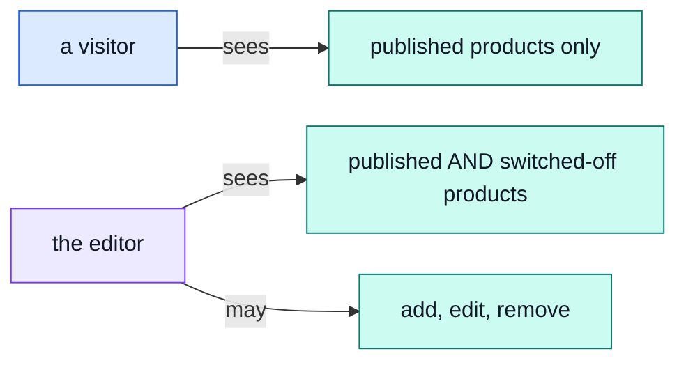

# The editor

Writing the catalogue: what a product is called, what it says, what it costs, and what it looks
like.

Log in as `editor@example.com` / `Demo-Editor1!` — a real, narrower account, not the owner's.

## One key, one whole record

The editor's whole job comes from a single permission: `products.manage`. That is not "write
access to some fields" — it is the entire Product record, price included, and it also removes the
one condition a public read carries, so the editor sees a product nobody else can:

That is genuinely everything: a soft-deleted product, a switched-off one, a price change, a whole
new listing. → [`products`](../modules/products.md)

::: tip Yes, the editor can change a price
It is tempting to read "content editor" as "words and pictures only", but there is no separate key
for that — a product's price is a field on the same record as its title, and `products.manage`
grants the record, not a subset of it. If a deployment wants price locked to someone else, that is
a new, narrower key to add — not something this role already enforces.
:::

## What this role cannot reach, and why each one is a different reason

| Cannot touch           | Because                                                                        |
| ---------------------- | ------------------------------------------------------------------------------ |
| **Stock**              | A different subject — `inventory.manage` — which this role holds none of.      |
| **A delivery rule**    | Delivery pricing is a fixed table, not a product field.                        |
| **An order**           | No `orders.*` key at all — an editor cannot even read one.                     |
| **An account**         | No `users.*` key — cannot see who bought anything.                             |
| **The action history** | No `audit.read` — that is [the moderator's](./moderator.md) key, not this one. |

Try it: log in as the editor and open `/orders` or `/users`. The 403 is not a bug in the demo —
it is the whole reason this account exists rather than everyone sharing the owner's.

## Why `locales.read` rides along

The editor also holds `locales.read` — not enough to change a phrase, only enough to see the
dictionary the product copy is written against. It answers "what does this shop call a category in
Italian" without granting the [translator's](./translator.md) own key.

::: warning Product copy is not translated, in any language
`locales.read` is about the shop's own screen text — buttons, labels, messages. A product's
`title` and `description` are a single value, the same for every visitor whatever language they
are reading in. Writing one in Italian does not create an Italian version; it replaces the only
one there is. See [`products`](../modules/products.md) and the note on
[the support page](./support.md#languages).
:::

## The words we used

| Word                  | In plain terms                                                                                                              |
| --------------------- | --------------------------------------------------------------------------------------------------------------------------- |
| **`products.manage`** | The one key this role holds — the whole Product record, unconditionally.                                                    |
| **Switched off**      | Not deleted, just not currently for sale — an editor sees these, a visitor does not. → [`products`](../modules/products.md) |
| **Soft delete**       | Hidden from customers, kept in the records, restorable.                                                                     |
