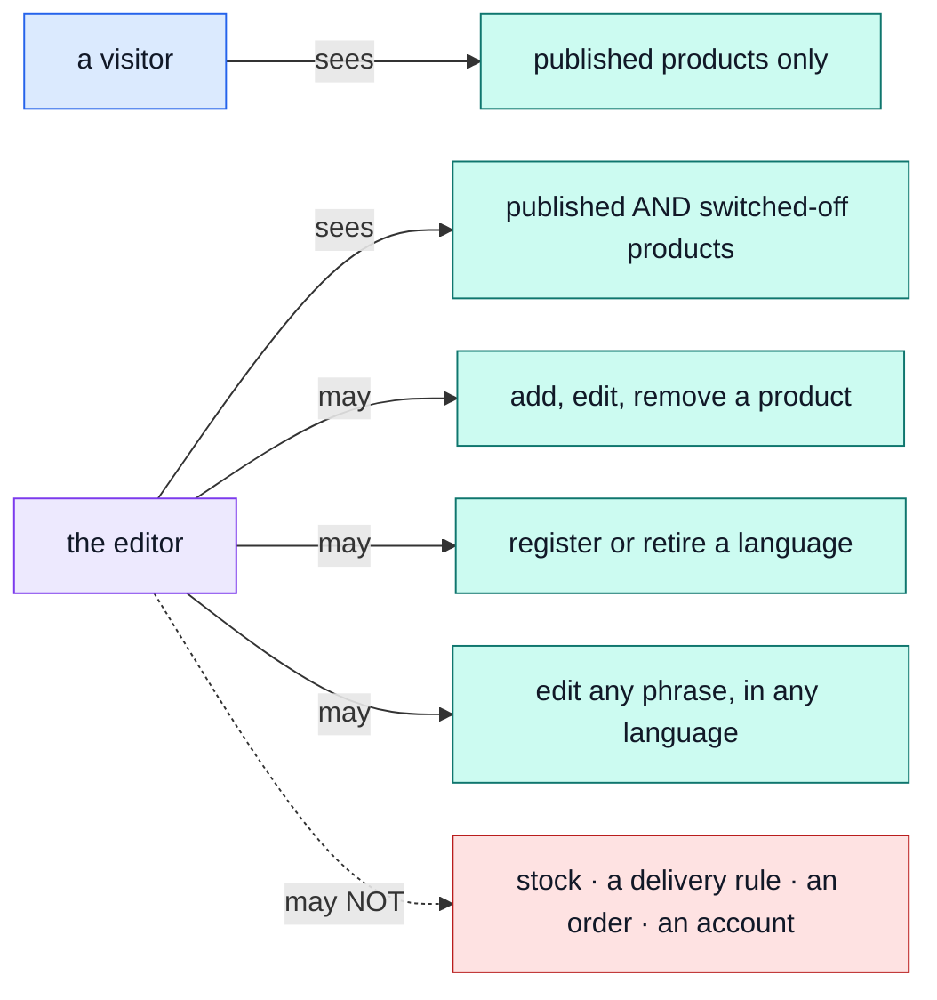

# The editor

Everything the shop **says and shows**: what a product is called, what it says, what it costs and
what it looks like — plus the words on every screen, in every language the shop speaks.

Log in as `editor@example.com` / `Demo-Editor1!` — a real, narrower account, not the owner's.

## Three keys, one job

| Key                   | What it grants                                                                                                       |
| --------------------- | -------------------------------------------------------------------------------------------------------------------- |
| `products.manage`     | The whole Product record, price included, drafts included.                                                           |
| `locales.manage`      | The shop's own dictionary — every phrase, every language, and registering a language the shop has not spoken before. |
| `translations.manage` | A translatable entity's own words — a product's `title`/`description`, per language.                                 |

::: tip Yes, the editor can change a price
It is tempting to read "editor" as "words and pictures only", but there is no separate key for
that — a product's price is a field on the same record as its title, and `products.manage` grants
the record, not a subset of it. If a deployment wants price locked to someone else, that is a new,
narrower key to add, not something this role already enforces.
:::

## The two doors onto a product's words

A product's copy can be reached two ways, and they are genuinely different endpoints:

| Door                                       | Reaches                                                                       | Key                                             |
| ------------------------------------------ | ----------------------------------------------------------------------------- | ----------------------------------------------- |
| `PATCH /products/{id}`                     | the whole record — price, stock flags, and every language's copy in one write | `products.update` **and** `translations.update` |
| `PATCH /locales/translations/product/{id}` | that product's words only, never a price                                      | `translations.update`                           |

The second is generic: it is the same endpoint that would translate a category description or a
CMS page were one added — `product` is simply the only thing the kernel registers as translatable
today. See [`products`](../modules/products.md#writing-translated-content) for the split.

## What this role cannot reach, and why each one is a different reason

| Cannot touch           | Because                                                                        |
| ---------------------- | ------------------------------------------------------------------------------ |
| **Stock**              | A different subject — `inventory.manage` — which this role holds none of.      |
| **A delivery rule**    | Delivery pricing is a fixed table, not a product field.                        |
| **An order**           | No `orders.*` key at all — an editor cannot even read one.                     |
| **An account**         | No `users.*` key — cannot see who bought anything.                             |
| **The action history** | No `audit.read` — that is [the moderator's](./moderator.md) key, not this one. |

Try it: log in as the editor and open `/users` — a 403, and not a bug in the demo: it is the whole
reason this account exists rather than everyone sharing the owner's. `/orders` answers differently,
not because the editor can reach it but because nothing routes a list read through a permission
check at all — with no `orders.*` key to match, the row-scoping filter matches nothing and the
list comes back 200 and empty, the same shape as a shop with no orders. Open one specific order
(`/orders/:id`) and it 404s instead, for the same underlying reason.

## Existing wording only

Editing replaces what a phrase, or a product's copy, currently says. It never invents a new field
or a new screen — that is a developer's job in both cases; this role only decides what an existing
slot currently reads, in whichever language it is editing.

The demo ships Spanish, Italian, French and Japanese in deliberately different states of
completeness, for BOTH kinds of content, so a half-translated shop and a half-translated catalogue
can each be seen behaving — fixing either is this role's job.

::: warning This role used to be two
`editor` and `translator` were separate, and the argument for the split was that "a mistranslation
cannot become a mischarge" — a translator held `translations.manage` and never `products.*`, so
no amount of rewriting could reach a price. They are one role now, and that guarantee no longer
holds of any shipped account.

It still holds of the KEYS. `Translation` is its own CASL subject, entirely separate from
`Product`, so `translations.manage` grants no way to touch a price by itself — a deployment that
wants a words-only person back cuts a role holding `locales.manage` + `translations.manage` and
gets exactly that. `shared/authorization-conformance.yaml` still pins it.
:::

## The words we used

| Word                      | In plain terms                                                                                                              |
| ------------------------- | --------------------------------------------------------------------------------------------------------------------------- |
| **`products.manage`**     | The whole Product record, unconditionally — price included.                                                                 |
| **`locales.manage`**      | Every language, every screen phrase, unconditionally.                                                                       |
| **`translations.manage`** | Write a translatable entity's words. Never grants a read or write on the entity's own record.                               |
| **Switched off**          | Not deleted, just not currently for sale — an editor sees these, a visitor does not. → [`products`](../modules/products.md) |
| **Soft delete**           | Hidden from customers, kept in the records, restorable.                                                                     |
| **Locale**                | One language the shop can speak. → [`locales`](../modules/locales.md)                                                       |
| **Entry**                 | One phrase, in one language, in the shop's own dictionary — not a product's words.                                          |
| **Translation**           | One entity's words, in one language — a product's `title`/`description`, in V1.                                             |
