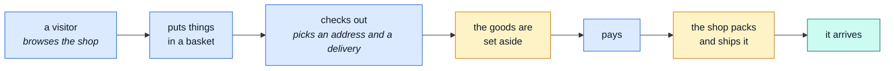

# The demo shop

**A small online shop that really works.** You can browse it, put things in a basket, pay, and
watch the parcel go out. Nothing here is a mock-up or a slideshow — it is the real thing, with
pretend money and a pretend courier.

::: tip Who this section is for
People who need to understand **what the application does**, not how it is built. No code on any of
these five pages. Every technical word is explained the first time it appears, and links point to
the deeper page if you ever want it.

The rest of this site is written for developers. This part is not.
:::

## The whole shop on one picture

Someone buys something. That is the sentence the entire application exists to support:



Blue is the customer doing something. Amber is the shop doing something in the background. Every
other page in this section is one of those boxes, opened up.

## What the shop sells

132 products — a pet-supply retailer. Six are hand-picked, each there to show the shop behaving
differently; the other 126 are a combinatorial grid (six animals × seven product types × three
quality tiers) so lists, pagination and the category filters have enough real rows to work with:

| Product                                              | Price | In stock | Why it exists                                      |
| ---------------------------------------------------- | ----- | -------- | -------------------------------------------------- |
| Premium Grain-Free Dog Food, 15kg                    | €68   | 30       | a completely normal product                        |
| Orthopedic Memory Foam Dog Bed                       | €84   | 45       | another normal one, so baskets can have two lines  |
| Heavy-Duty Cat Scratching Post                       | €45   | **0**    | shows what "out of stock" looks like               |
| Universal Small Animal Water Bottle                  | €9    | 100      | has only a name and a price, nothing else          |
| 150W Ceramic Heat Emitter                            | €55   | 12       | **deleted** — proves a deleted product disappears  |
| Rabbit Starter Bundle — Hutch, Feeder & Water Bottle | €96   | 18       | **switched off** — visible to staff, not to buyers |
| _...126 more_                                        | —     | —        | a generated catalogue, e.g. "Premium Bird Carrier" |

So a visitor sees **130** products (the four ordinary ones above, plus all 126 generated).
Staff see all 132. That difference is deliberate and it is explained on
[the shop manager's page](./manager.md).

## The people in it

Every account below comes with a password you can actually type in:

| Who                | Email                    | Password            | Can do                                |
| ------------------ | ------------------------ | ------------------- | ------------------------------------- |
| **A customer**     | `customer@example.com`   | `Demo-User1!`       | shop, buy, track their own orders     |
| **The owner**      | `root@root.it`           | `Demo-Admin1!`      | everything, plus run the shop         |
| **The editor**     | `editor@example.com`     | `Demo-Editor1!`     | the catalogue, and nothing else       |
| **The translator** | `translator@example.com` | `Demo-Translator1!` | the dictionary, and a product's words |
| **The moderator**  | `moderator@example.com`  | `Demo-Moderator1!`  | accounts, orders, payments            |

The manager, warehouse and support pages are jobs, not logins — the owner account does all three,
and this section splits them up because it reads better, not because the software forces a
narrower one. **The last three rows are different on purpose.** They exist to show restriction
actually happening, and an omnipotent account cannot demonstrate a restriction — only a narrower
one, refused when it reaches past its own job, can. Log into `editor@example.com` and try to open
`/users`; the 403 is the point of the account existing — `/orders` shows the same restriction a
different way, coming back 200 and empty rather than refused, since nothing routes that list read
through a permission check at all. See [the editor's own page](./editor.md#what-this-role-cannot-reach-and-why-each-one-is-a-different-reason)
for why the two shapes differ.

→ [The editor](./editor.md) · [The translator](./translator.md) · [The moderator](./moderator.md)

A further ten customer accounts exist too — `amelia.clarke`, `benjamin.hughes` and so on — with an
order history spread across them (mostly one small order each, three with a couple more) so the
staff side has more than one shopper's activity to look at. Nobody is meant to log in as one of
the ten; they exist to be _looked at_, not signed into.

## What each role may do

Two tables, generated from the permission model on every `npm run regenerate` — the first is what
somebody edits, the second is what the server answers. They are here rather than in the theory
pages because this is where you pick an account to log in as.

<!-- role-matrix:start -->

### What each role is given

| Role         | Scope    | Permissions, as written in `shared/authorization-roles.yaml`                                                                                          |
| ------------ | -------- | ----------------------------------------------------------------------------------------------------------------------------------------------------- |
| `guest`      | tenant   | `products.read`, `locales.read`, `delivery.read`                                                                                                      |
| `customer`   | tenant   | `products.read`, `locales.read`, `delivery.read`, `orders.read`, `payments.read`                                                                      |
| `manager`    | tenant   | `products.manage`, `orders.manage`, `locales.manage`, `payments.read`, `inventory.read`, `delivery.read`, `feedback.read`, `users.read`, `audit.read` |
| `warehouse`  | tenant   | `products.read`, `orders.read`, `inventory.manage`, `delivery.manage`                                                                                 |
| `support`    | tenant   | `feedback.manage`, `users.read`, `users.update`, `orders.read`, `payments.read`, `audit.read`                                                         |
| `editor`     | tenant   | `products.manage`, `locales.read`, `translations.manage`                                                                                              |
| `translator` | tenant   | `locales.manage`, `translations.read`, `translations.manage`                                                                                          |
| `moderator`  | tenant   | `users.manage`, `orders.manage`, `payments.manage`, `audit.read`                                                                                      |
| `owner`      | tenant   | `all.manage`                                                                                                                                          |
| `operator`   | platform | `platform.observability.manage`                                                                                                                       |

`guest` is not an account anybody logs into — it is what an unauthenticated request
resolves to, and the floor every signed-in role is raised to. Signing in can only ever
widen what a person sees.

### What that actually grants

The same roles after the evaluator has had them: `manage` expanded into its module’s own
keys, and the baseline folded in. This is what a route guard and a listing actually
answer.

| Role         | products | orders  | payments | inventory | delivery | feedback | locales | users   | account | audit-logs | observability |
| ------------ | -------- | ------- | -------- | --------- | -------- | -------- | ------- | ------- | ------- | ---------- | ------------- |
| `guest`      | r        | —       | —        | —         | r        | —        | r       | —       | —       | —          | —             |
| `customer`   | r        | r       | r        | —         | r        | —        | r       | —       | —       | —          | —             |
| `manager`    | **all**  | **all** | r        | r         | r        | r        | **all** | r       | —       | r          | —             |
| `warehouse`  | r        | r       | —        | **all**   | **all**  | —        | r       | —       | —       | —          | —             |
| `support`    | r        | r       | r        | —         | r        | **all**  | r       | ru      | —       | r          | —             |
| `editor`     | **all**  | —       | —        | —         | r        | —        | **all** | —       | —       | —          | —             |
| `translator` | r        | —       | —        | —         | r        | —        | **all** | —       | —       | —          | —             |
| `moderator`  | r        | **all** | **all**  | —         | r        | —        | r       | **all** | —       | r          | —             |
| `owner`      | **all**  | **all** | **all**  | **all**   | **all**  | **all**  | **all** | **all** | d       | r          | —             |
| `operator`   | —        | —       | —        | —         | —        | —        | —       | —       | —       | —          | **all**       |

**all** — every key that module declares · `r` read · `c` create · `u` update · `d` delete · — nothing

Read down a column to see who touches one part of the shop; read across a row to see one
person’s whole job. `operator` is the only row outside the shop entirely: it runs the
installation and reads no shop’s rows, which is why its row is empty everywhere else and
why `owner` — unrestricted **inside one shop** — cannot reach observability either.

<!-- role-matrix:end -->

The rules behind them, and why a role cannot span both scopes, are in
[Authorization](../theory/authorization.md).

## Money and delivery

Prices are in **euros**. Delivery is picked by the customer at checkout:

| Delivery   | Costs | Note                         |
| ---------- | ----- | ---------------------------- |
| Standard   | €5    | **free** on orders over €100 |
| Express    | €15   | always €15                   |
| Pick it up | €0    | the customer collects it     |

Paying is fake. There is no real card processing and no real money — a made-up card number is
accepted, and one specific number (`4000000000000002`) is always refused, so the "your card was
declined" path can be shown on demand.

## Which page do you want

| You are…                                              | Read                              |
| ----------------------------------------------------- | --------------------------------- |
| Wondering what a customer experiences                 | [The customer](./shopper.md)      |
| Running the shop — products, prices, orders           | [The shop manager](./manager.md)  |
| Looking after stock and getting parcels out           | [The warehouse](./warehouse.md)   |
| Answering emails, resets, complaints                  | [The support desk](./support.md)  |
| Writing and photographing products, not prices        | [The editor](./editor.md)         |
| Translating the shop's screens, and a product's words | [The translator](./translator.md) |
| Handling accounts, disputed orders and refunds        | [The moderator](./moderator.md)   |
| A developer who took a wrong turn                     | [Modules](../modules/)            |

## Opening it yourself

Two things to type, and you need nothing installed but Node:

```bash
npm install
npm run demo
```

That starts the shop with its own throwaway database, already filled with everything described
above. Close it and it all disappears; start it again and it is back exactly as it was. Nothing you
click can break anything permanently.

::: info This section describes _this_ shop
The application underneath is a reusable starting point — a **boilerplate** — and this pet-supply
shop is just the example built on top of it. These five pages describe the example. The pages under
[Modules](../modules/) describe the parts it is assembled from, one per area of the business.
:::
