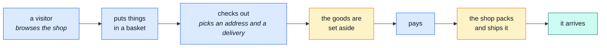

# The demo shop

**A small online shop that really works.** You can browse it, put things in a basket, pay, and
watch the parcel go out. Nothing here is a mock-up or a slideshow — it is the real thing, with
pretend money and a pretend courier.

::: tip Who this section is for
People who need to understand **what the application does**, not how it is built. No code on any of
these five pages. Every technical word is explained the first time it appears, and links point to
the deeper page if you ever want it.

The rest of this site is written for developers. This part is not.
:::

## The whole shop on one picture

Someone buys something. That is the sentence the entire application exists to support:



Blue is the customer doing something. Amber is the shop doing something in the background. Every
other page in this section is one of those boxes, opened up.

## What the shop sells

Six products. They are silly on purpose — this is a demo of Italian cat snacks — but each one is
there to show the shop behaving differently:

| Product          | Price | In stock | Why it exists                                      |
| ---------------- | ----- | -------- | -------------------------------------------------- |
| Sallyno Panino   | €100  | 25       | a completely normal product                        |
| Micino pufettino | €77   | 40       | another normal one, so baskets can have two lines  |
| Miciona inutile  | €1    | **0**    | shows what "out of stock" looks like               |
| Scatolone        | €5    | 100      | has only a name and a price, nothing else          |
| Sallyno Carino   | €50   | 10       | **deleted** — proves a deleted product disappears  |
| Bundle micini    | €40   | 15       | **switched off** — visible to staff, not to buyers |

So a visitor sees **four** products. Staff see all six. That difference is deliberate and it is
explained on [the shop manager's page](./manager.md).

## The two people in it

The demo comes with two accounts already made:

| Who            | Username       | Password   | Can do                            |
| -------------- | -------------- | ---------- | --------------------------------- |
| **A customer** | `ginopinoshow` | `password` | shop, buy, track their own orders |
| **The owner**  | `root`         | `rootroot` | everything, plus run the shop     |

There are only these two levels. Either you are staff, or you are a customer. There is no
"warehouse-only" or "support-only" login — those are jobs, not accounts, and this section splits
the pages up that way because it is easier to read, not because the software does.

## Money and delivery

Prices are in **euros**. Delivery is picked by the customer at checkout:

| Delivery   | Costs | Note                         |
| ---------- | ----- | ---------------------------- |
| Standard   | €5    | **free** on orders over €100 |
| Express    | €15   | always €15                   |
| Pick it up | €0    | the customer collects it     |

Paying is fake. There is no real card processing and no real money — a made-up card number is
accepted, and one specific number (`4000000000000002`) is always refused, so the "your card was
declined" path can be shown on demand.

## Which page do you want

| You are…                                    | Read                             |
| ------------------------------------------- | -------------------------------- |
| Wondering what a customer experiences       | [The customer](./shopper.md)     |
| Running the shop — products, prices, orders | [The shop manager](./manager.md) |
| Looking after stock and getting parcels out | [The warehouse](./warehouse.md)  |
| Answering emails, resets, complaints        | [The support desk](./support.md) |
| A developer who took a wrong turn           | [Modules](../modules/)           |

## Opening it yourself

Two things to type, and you need nothing installed but Node:

```bash
npm install
npm run demo
```

That starts the shop with its own throwaway database, already filled with everything described
above. Close it and it all disappears; start it again and it is back exactly as it was. Nothing you
click can break anything permanently.

::: info This section describes _this_ shop
The application underneath is a reusable starting point — a **boilerplate** — and this cat-snack
shop is just the example built on top of it. These five pages describe the example. The pages under
[Modules](../modules/) describe the parts it is assembled from, one per area of the business.
:::
