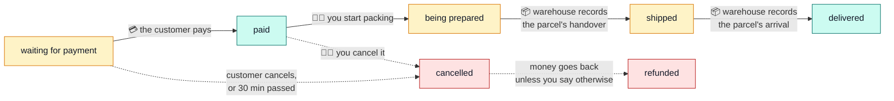
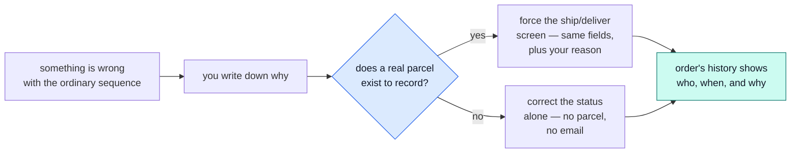
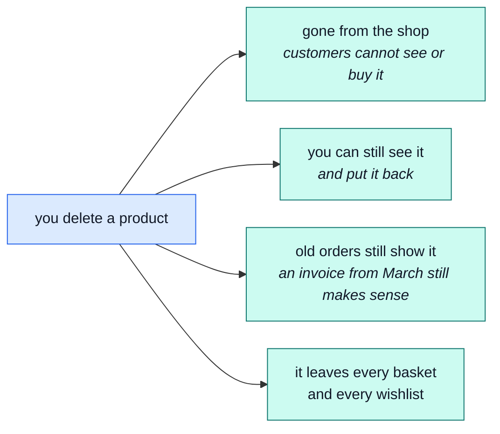
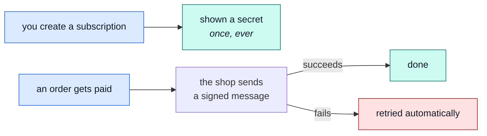

# The shop manager

Running the shop: what is for sale, at what price, and what happens to orders after they arrive.

Everything on this page needs the staff login (`root@root.it` / `Demo-Admin1!`).

## An order's life

An order is never edited. It **moves**, one step at a time, and everyone can see where it is:

Four kinds of hands move an order along — colour-coded below: the **customer** (blue), the
**payment system** (green, nobody clicks anything), the **warehouse** (amber), and **you**, the
shop manager (purple).

One of those steps happens without anyone at the shop pressing anything — the payment confirming is
a fact from outside the application, not a button:

- **The warehouse marks it shipped by recording the handover**, not the other way around — they
  scan or type the tracking code (when the method needs one) into the shipment screen, and THAT is
  what creates the parcel record, moves the order to **shipped**, and sends the customer their
  tracking email. There is no separate "mark shipped" switch to forget.
- Cancelling a **paid** order refunds it by default. Cancelling an unpaid one has nothing to refund,
  so it does not try.

::: tip Fixing a mistake
If a parcel was scanned against the wrong order, or a status needs correcting outside the normal
sequence, you can force a move with a reason — see "Correcting a mistake" below. It is deliberately
a separate, logged action, not a quiet edit.
:::

::: warning Who cancelled decides whether the money goes back
If the **customer** cancels, they are always refunded. That is the promise a paid order is
cancellable on, and staff cannot override it.

If **you** cancel, the refund still happens unless you say otherwise — because sometimes it should
not: a replacement is going out, a correction is being made, or the money is being returned some
other way. Cancelling and refunding are one action by default and two when you need them to be.
:::

→ [`orders`](../modules/orders.md) · [`payments`](../modules/payments.md)

## Correcting a mistake

The ordinary sequence above sometimes cannot be followed — a parcel was scanned against the wrong
order, or fulfilment needs to be corrected out of the normal order. Staff with the right permission
can force a move, but it always needs a reason, and it is always written down:

Neither path can move an order backward, and neither can ever mark one **paid** by hand — money
landing is still the one fact only the payment system reports. The order's own page shows every
correction, in order, so a customer support question always has an answer.

## The catalogue

Adding, editing and removing what the shop sells. Products can be changed one at a time or in
bulk.

**Deleting a product does not really delete it.** It disappears from the shop immediately, but the
record stays:

::: tip Why it works this way
If deleting really erased a product, every past order that contained it would become unreadable —
an invoice with a blank line on it. So the shop hides products instead of destroying them, and
orders keep their own copy of what was bought at the price it was bought for.

Changing a price today does **not** change what a customer was charged last month.
:::

There is a separate, permanent delete for when a record genuinely has to go.

## Hidden two different ways

The demo has one of each, which is why the shop shows 130 products but the manager sees all 132:

| Product                                              | State            | What it means                                           |
| ---------------------------------------------------- | ---------------- | ------------------------------------------------------- |
| 150W Ceramic Heat Emitter                            | **deleted**      | removed, but recoverable and still on old orders        |
| Rabbit Starter Bundle — Hutch, Feeder & Water Bottle | **switched off** | not deleted, just not for sale right now — flip it back |

"Switched off" is for a seasonal item or one you are still writing the description for.
→ [`products`](../modules/products.md)

## What you cannot do from here

**You cannot type a new stock number into a product.** Stock is only ever changed by recording a
reason — a delivery arrived, or a count was corrected. That is deliberate, and it is
[the warehouse's page](./warehouse.md).

The one exception is creating a brand-new product, which can start with an opening quantity.

## Prices and delivery

Product prices are set per product. Delivery prices are fixed rules, not settings:

| Delivery   | Costs | Rule                             |
| ---------- | ----- | -------------------------------- |
| Standard   | €5    | free once the basket passes €100 |
| Express    | €15   | —                                |
| Pick it up | €0    | —                                |

The customer's basket is priced by those same rules, so what they are quoted at checkout and what
they are charged cannot disagree. → [`delivery`](../modules/delivery.md)

::: tip Why the invoice splits shipping across rates
Delivery has no VAT rate of its own — it is taxed as part of what it delivers. A basket with a
standard-rated item and a reduced-rated item splits the €5 shipping fee between the two,
proportionally to what each item cost, and each half is taxed at ITS OWN item's rate.

The invoice still prints one summary line per rate, so a customer sees "22%: €X" and "10%: €Y"
rather than one shipping line they have to reconcile by hand.
:::

## Customers

The staff side can list, search and open a customer account — enough to answer "who is this" while
looking at their orders. Editing an account or erasing one is not part of this job: that is
[the support desk's](./support.md), and erasure is the owner's alone, gated on a freshly proved
session.
→ [`users`](../modules/users.md)

## Notifying other systems

A **webhook subscription** tells the shop to send a message to some other system — your
accounting software, a mailing-list tool — the moment something happens: an order is paid, an
order ships, a payment fails. You pick the URL and which events it cares about.

::: warning The secret is shown exactly once
When you create a subscription, or rotate its secret, the secret itself is shown on screen a
single time and never again — not even to you. It proves to the other system that a message really
came from this shop. Copy it somewhere safe immediately; if you lose it, rotate for a new one.
:::

**Rotating** a secret does not break anything mid-flight: the old one keeps working until you
separately remove it, so the other system has time to switch over. If a delivery keeps failing —
the other system was down, its URL changed — that shows up in the delivery log, which is
[the support desk's](./support.md) to read.
→ [`webhooks`](../modules/webhooks.md)

## Everything is written down

Every staff action — a price change, a cancellation, a deleted product — is recorded with who did
it and when. The record is kept for **90 days** and then disappears on its own.

Nobody can turn this off from inside the application, which is the point.
→ [`audit-logs`](../modules/audit-logs.md)

## The words we used

| Word             | In plain terms                                                                                               |
| ---------------- | ------------------------------------------------------------------------------------------------------------ |
| **Soft delete**  | Hidden from customers, kept in the records, restorable. → [`products`](../modules/products.md)               |
| **Switched off** | Not deleted, just not currently for sale.                                                                    |
| **Refund**       | Money returned. Happens automatically when a paid order is cancelled. → [`payments`](../modules/payments.md) |
| **Audit log**    | The 90-day record of who did what. → [`audit-logs`](../modules/audit-logs.md)                                |
| **Bulk**         | The same change applied to many rows at once.                                                                |
| **Webhook**      | A message the shop sends to another system when something happens. → [`webhooks`](../modules/webhooks.md)    |
| **Secret**       | The one-time-shown key that proves a webhook message came from this shop.                                    |
