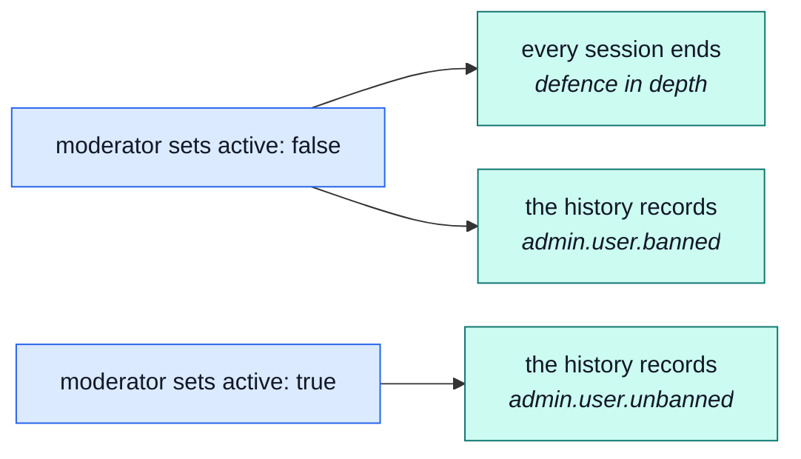

# The moderator

Accounts that need action taken against them, orders that need sorting out, and money that needs
to go back.

Log in as `moderator@example.com` / `Demo-Moderator1!` — a real, narrower account, not the
owner's.

## Three keys, three jobs

| Key               | Buys                                                      |
| ----------------- | --------------------------------------------------------- |
| `users.manage`    | Add, edit, erase an account — and ban one.                |
| `orders.manage`   | Read and update any order in the shop, not only your own. |
| `payments.manage` | Read any payment, and refund it.                          |
| `audit.read`      | Read the history of what everyone with a key did.         |

## Banning an account is not a fourth feature

There is no separate "ban" button in the data model. Banning an account **is** setting `active` to
`false` on it — the same field, the same endpoint, that a support agent or an owner would use to
deactivate one for any other reason:

What makes it show up as a **ban** rather than an ordinary edit is the action history, not a new
code path: flipping `active` from true to false is recorded as `admin.user.banned`, and flipping it
back is `admin.user.unbanned` — everything else that changes on the same request is still recorded
as a plain update. → [`users`](../modules/users.md)

## Reading the shop's own history

`audit.read` opens `GET /audit` — this role's own window onto who did what, scoped to this shop.
It is the same underlying trail [the observability dashboard](../modules/observability.md) reads
for the platform operator, reached through a different door with a different key: this one asks
nothing about the platform, only about this shop, which is exactly the key a shop's own staff can
be handed. → [`audit-logs`](../modules/audit-logs.md)

## One deliberate rough edge

`orders.manage` is a wildcard: it grants every action `orders` declares, including delete. There is
no narrower key that grants read-and-update-but-not-delete, so this role can technically delete an
order — the price of being able to update any order rather than only its own. Nothing in the demo
exercises that edge; it is named here rather than left for someone to discover by trying it.

::: tip What this role cannot touch
No `products.*` — a moderator cannot change what a thing costs or looks like; that is
[the editor's](./editor.md) job. No `locales.*` — also [the editor's](./editor.md). No
`inventory.*` — a moderator reads an order, never moves stock.
:::

## The words we used

| Word               | In plain terms                                                                    |
| ------------------ | --------------------------------------------------------------------------------- |
| **Ban**            | `active: false` on an account, recorded under its own name in the history.        |
| **Refund**         | Money returned on a payment already taken. → [`payments`](../modules/payments.md) |
| **Action history** | Who did what, when, to which row. → [`audit-logs`](../modules/audit-logs.md)      |
