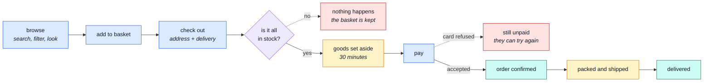
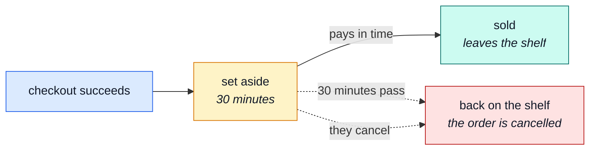

# The customer

What someone buying cat snacks actually experiences, start to finish.

## The journey

## Before buying

**Browsing needs no account.** Anyone can look at the shop, search it, filter by category
(`food`, `pets`, `bundles`), and see what is in stock. Out-of-stock items are still shown — that is
why Miciona inutile exists in the demo — because hiding them makes a shop look emptier than it is.

**The basket lives on the server, not in the browser.** Add something on a phone and it is there on
a laptop. Close the browser for a week and it is still there.
→ [`cart`](../modules/cart.md)

**A wishlist is the "maybe later" pile.** Saved items sit there until they are moved into the
basket, at which point they leave the wishlist. → [`wishlist`](../modules/wishlist.md)

## Checking out

This is the only complicated moment in the shop, so it is worth understanding.

At checkout, four things have to be true at the same instant: the prices are current, the address is
real, the delivery has a cost, and **everything is actually in stock**. The shop checks all of them
together and then does one of two things.

::: warning It is all or nothing
If any line is short, the whole checkout is refused and **nothing is charged and nothing is
reserved**. The refusal lists every problem line at once — what was wanted, what is available — so
the basket can be fixed in one pass instead of discovering the next problem after each retry.
:::

If it all agrees, the goods are **set aside**: still on the shelf, but promised to that order and no
longer sellable to anyone else.

## The 30-minute hold

Setting goods aside is a promise with a deadline.

This is why an abandoned checkout does not silently eat the shop's stock. If the customer wanders
off, the goods come back on their own and the half-finished order is cancelled.

→ [`inventory`](../modules/inventory.md) · [the detail](../modules/inventory-reservations.md)

## Paying

The card form is real; the card is not. Any made-up number is accepted **except**
`4000000000000002`, which is always refused — so a refusal can be demonstrated on purpose rather
than waited for.

A refused card is not a failure of the order. The order stays unpaid, the goods stay set aside for
the rest of the 30 minutes, and the customer can try again.

Once payment goes through, the money and the goods are settled in the same instant: the order
becomes **paid** and the goods stop being "set aside" and become "sold".
→ [`payments`](../modules/payments.md)

## Afterwards

- **They see their own orders, and only their own.** → [`orders`](../modules/orders.md)
- **They can download an invoice** as a PDF.
- **They can cancel.** If they had paid, the money goes back automatically.
- **They can re-order** — one click puts everything from a past order back in the basket.
- **They can track the parcel** once it ships. → [`delivery`](../modules/delivery.md)

## Their account

Sign up, verify by email, log in, forget the password and reset it, change it, and see every device
currently logged in — with a "log me out everywhere" button that ends all of them at once.

An address book holds the places they have shipped to, with one marked as the usual.

Deleting the account is deliberately two steps, and it takes everything with it: the basket, the
wishlist and the address book all go. → [`account`](../modules/account.md)

## The words we used

| Word          | In plain terms                                                                                                        |
| ------------- | --------------------------------------------------------------------------------------------------------------------- |
| **Set aside** | Stock promised to an unpaid order. Not sold yet, but nobody else can buy it. → [`inventory`](../modules/inventory.md) |
| **Checkout**  | The single moment the basket becomes an order. → [`cart`](../modules/cart.md)                                         |
| **Order**     | A frozen record of what was bought, at the prices of that day. → [`orders`](../modules/orders.md)                     |
| **Invoice**   | The PDF receipt for an order.                                                                                         |
| **Session**   | One logged-in device. Logging out everywhere ends all of them. → [`account`](../modules/account.md)                   |
