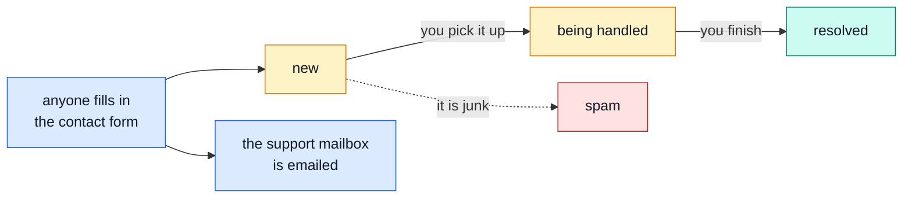
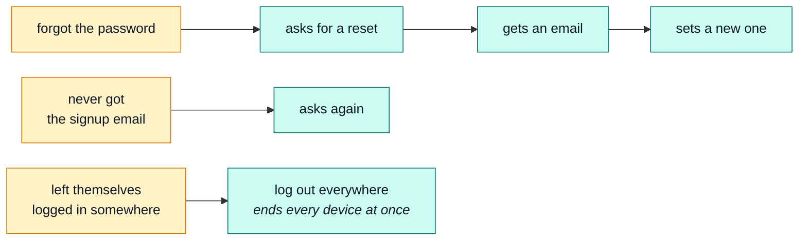
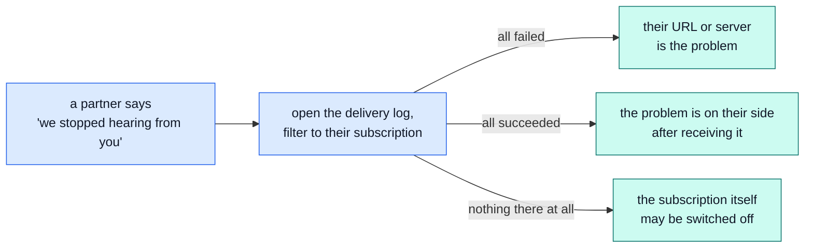

# The support desk

Messages from people, accounts that need help, and knowing whether the shop is actually broken.

## The contact form

Anyone can send a message — no account needed. It is the only thing in the whole application a
complete stranger can write to.

Four states, and that is the entire workflow. Private notes can be attached to a message; the person
who sent it never sees them.

::: tip It records an email address, not a customer
The form asks for an email rather than requiring a login, because the people most likely to need
help are the ones who cannot get in. A consequence worth knowing: **deleting someone's account does
not delete their messages** — they were never attached to the account in the first place.
:::

→ [`feedback`](../modules/feedback.md)

## "I can't get in"

Most of what a support desk does, and none of it needs staff intervention:

A person can see every device currently signed in to their account and end any of them, or all of
them, themselves. → [`account`](../modules/account.md)

::: warning An unverified account still works
Signing up sends a verification email, but nothing in the shop refuses an unverified customer. If
someone says "I never got the email but I can still order" — that is correct, not a bug.
:::

## "Where is my order?"

Everything a customer might ask has an answer they can already see themselves: their order list, its
current step, the tracking code once it ships, and a PDF invoice to download.

If they want to cancel, they can — and a paid order refunds itself when they do. Nobody has to
process it.
→ [The customer](./shopper.md) · [`orders`](../modules/orders.md)

## Languages

The shop's buttons, labels and messages speak more than one language, and **that wording can be
changed without a developer** — the [editor](./editor.md) does exactly this, and needs no other
access to do it.

Someone in that role can edit the text customers see on-screen, and register or retire a language.
The demo ships with Spanish, Italian, French and Japanese in deliberately different states of
completeness, so a half-translated shop can be seen behaving.

::: tip You can change what a phrase says, not invent new ones — and not what a product says
Editing replaces existing wording. A brand-new label still needs a developer — the application
decides _what text exists_, the editor decides _what it says_. A product's own title and
description are translated too, but through a different door — see
[`products`](../modules/products.md#writing-translated-content).
:::

→ [`locales`](../modules/locales.md)

## "Is the shop down?"

There is a health page that answers plainly, plus a live activity view that updates by itself while
you watch it — useful for "is anything happening at all right now".

And there is the **90-day record of every staff action**: who changed that price, who cancelled that
order, when. Most "what happened here?" questions end there — reachable from your own role, without
needing the platform-wide view a developer or operator would use instead.

→ [`observability`](../modules/observability.md) · [`audit-logs`](../modules/audit-logs.md)

## "Our other system stopped getting notified"

When a shop is wired up to notify another system — accounting software, a mailing list — every
attempt to deliver that notification is logged: what event, when, whether it succeeded, and why it
didn't when it didn't.

Filtering the log by subscription and by status is usually the whole investigation — the error
column says what actually went wrong (timed out, refused, a wrong status code back).

::: tip Replay does not wait for the retry schedule
A failed delivery retries itself automatically for a while, then gives up. Once whatever was
wrong is fixed, **replay** sends that exact attempt again immediately, right now, without waiting
for a next scheduled try or asking the other system to trigger the event over again.
:::

→ [The shop manager](./manager.md) · [`webhooks`](../modules/webhooks.md)

## What is pretend here

Worth knowing before promising anything to a customer:

| Thing              | In the demo                                                     |
| ------------------ | --------------------------------------------------------------- |
| Card payments      | Fake. No money moves. One card number always refuses.           |
| The courier        | Fake. A button marks parcels delivered.                         |
| Emails             | Not actually sent — they are collected where you can read them. |
| The whole database | Thrown away when the demo stops.                                |

→ [Demo profile](../tools/demo-profile.md)

## The words we used

| Word             | In plain terms                                                                                 |
| ---------------- | ---------------------------------------------------------------------------------------------- |
| **Triage**       | Deciding what a new message is and who deals with it. → [`feedback`](../modules/feedback.md)   |
| **Verified**     | Confirmed their email. Informational here — nothing is refused without it.                     |
| **Session**      | One signed-in device. → [`account`](../modules/account.md)                                     |
| **Audit log**    | The 90-day record of staff actions. → [`audit-logs`](../modules/audit-logs.md)                 |
| **Health check** | A page that says whether the shop is running. → [`observability`](../modules/observability.md) |
| **Delivery**     | One attempt to notify another system of one event. → [`webhooks`](../modules/webhooks.md)      |
| **Replay**       | Resending a delivery right now, instead of waiting for its next automatic retry.               |
