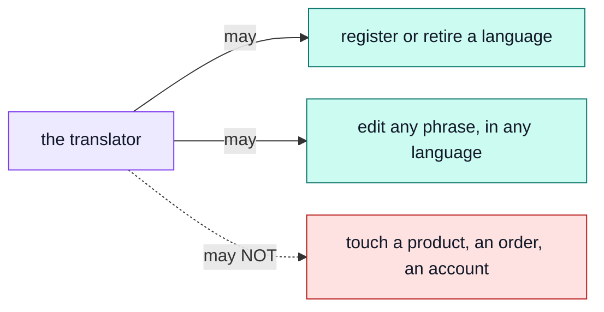

# The translator

The words on every screen — buttons, labels, messages — in every language the shop speaks.

Log in as `translator@example.com` / `Demo-Translator1!` — a real, narrower account, not the
owner's.

## One key, the whole dictionary

`locales.manage` is the only permission this role holds, and it is enough on its own: register a
language, retire one, edit any phrase in any of them. Nothing else in the shop needs this role at
all, and this role needs nothing else in the shop:

A mistranslation cannot become a mischarge — that is the whole design. → [`locales`](../modules/locales.md)

## What this role edits, exactly

Only the shop's own screen text: what a button says, what a validation message reads, what an
email's subject line is. The demo ships Spanish, Italian, French and Japanese in deliberately
different states of completeness, so a half-translated shop can be seen behaving — that state is
this role's to fix.

::: warning A product's own words are not part of this
A product's `title` and `description` are a single value today, in every language — see
[`products`](../modules/products.md). This role edits the WORDS AROUND a product (its category
chip's label, "Add to basket", the checkout button); it has no way to translate the product's own
name, because the application has nowhere to write one yet.
:::

## Existing wording only

Editing replaces what a phrase says. It never invents a new one — a brand-new label on a screen
still needs a developer, because the application decides which screens have which pieces of text
at all; this role only decides what each one currently says.

## What this role cannot reach

No `products.*`, no `orders.*`, no `users.*`, no `payments.*`, no `audit.read`. Try opening
`/products` while logged in as the translator — a 403, the same shape an editor gets from `/orders`.
Neither narrower account can reach into the other's job.

## The words we used

| Word                 | In plain terms                                                               |
| -------------------- | ---------------------------------------------------------------------------- |
| **`locales.manage`** | The one key this role holds — every language, every phrase, unconditionally. |
| **Locale**           | One language the shop can speak. → [`locales`](../modules/locales.md)        |
| **Entry**            | One phrase, in one language — what this role actually edits.                 |
