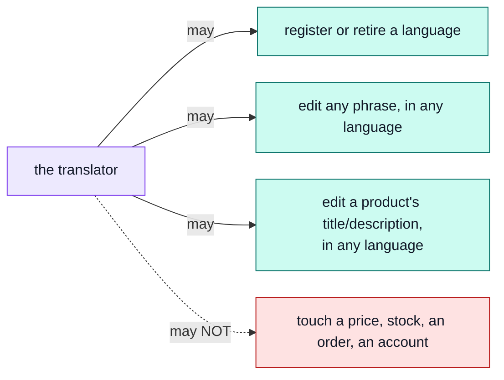

# The translator

The words on every screen — buttons, labels, messages — in every language the shop speaks, and now
a product's own `title`/`description` too, in every language the catalogue offers.

Log in as `translator@example.com` / `Demo-Translator1!` — a real, narrower account, not the
owner's.

## Three keys, never a price

`locales.manage` — the dictionary, unconditionally, same as always. `translations.read` and
`translations.manage` — an entity's translated content, product content in V1. All three are held
without ever touching `products.*`:

A mistranslation cannot become a mischarge — that is the whole design. `Translation` is its own
CASL subject, entirely separate from `Product`, so holding `translations.manage` grants no way to
touch a price even by accident. → [`locales`](../modules/locales.md#the-translations-collection)

## What this role edits, exactly

Two different things, both words, neither a price:

| What                              | Where                                                         | How                                                                              |
| --------------------------------- | ------------------------------------------------------------- | -------------------------------------------------------------------------------- |
| The shop's own screen text        | A button's label, a validation message, an email subject line | `locales.manage` — the dictionary screens                                        |
| A product's `title`/`description` | The catalogue's own words, per language                       | `translations.read`/`.manage` — `GET`/`PATCH /locales/translations/product/{id}` |

The demo ships Spanish, Italian, French and Japanese in deliberately different states of
completeness, for BOTH kinds of content, so a half-translated shop and a half-translated catalogue
can each be seen behaving — fixing either is this role's job.

::: tip The generic door, not the editor's
`/locales/translations/product/{id}` is the SAME endpoint that would translate a category
description or a CMS page were one added — generic across whatever the kernel registers as
translatable, `product` being the only one today. It is a different door from
`/products/{id}`, which the [editor](./editor.md) uses to change a price alongside every language
at once: only that door may touch a price, and this role never holds the key it needs to reach it.
See [`products`](../modules/products.md#writing-translated-content) for the two-door split.
:::

If the paired frontend has shipped its admin translation screen, this is where the role actually
does the work — an `EntityTranslations` view in the frontend's `locales` module, reachable from the
editor's own product screen, one tab per language the product has a row for.

## Existing wording only

Editing replaces what a phrase, or a product's copy, currently says. It never invents a new field
or a new screen — that is a developer's job in both cases; this role only decides what an existing
slot currently reads, in whichever language it is editing.

## What this role cannot reach

No `products.*`, no `orders.*`, no `users.*`, no `payments.*`, no `audit.read`. Try opening
`/products` while logged in as the translator: not a 403 — signing in only ever WIDENS what the
anonymous baseline already grants, and that baseline includes `products.read`, so the translator
sees exactly the public catalogue a logged-out visitor does, no more. Holding `translations.manage`
changes none of that: it is a key on a different subject, and it grants no read or write on
`Product` itself — a translator can rewrite every word a product has and still never see its stock
count. `/orders` is the real difference: the translator holds no `orders.*` key at all, baseline or
otherwise, so that answers 200 with an empty list rather than a refusal — no route has a guard to
refuse it with. Neither narrower account can reach into the other's job; the shapes of "cannot" just
differ by route.

## The words we used

| Word                      | In plain terms                                                                     |
| ------------------------- | ---------------------------------------------------------------------------------- |
| **`locales.manage`**      | Every language, every screen phrase, unconditionally.                              |
| **`translations.read`**   | See every language a translatable entity — a product, in V1 — has a row for.       |
| **`translations.manage`** | Write those rows. Never grants a read or write on the entity's own record.         |
| **Locale**                | One language the shop can speak. → [`locales`](../modules/locales.md)              |
| **Entry**                 | One phrase, in one language, in the shop's own dictionary — not a product's words. |
| **Translation**           | One entity's words, in one language — a product's `title`/`description`, in V1.    |
