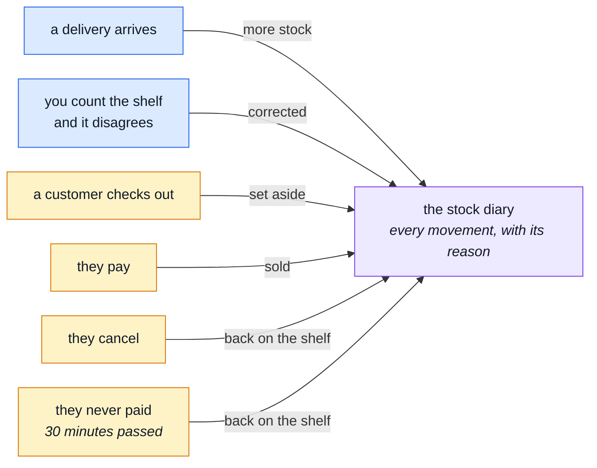
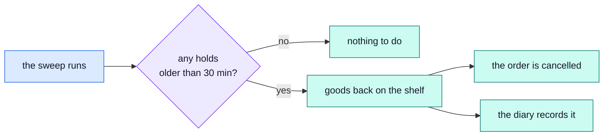
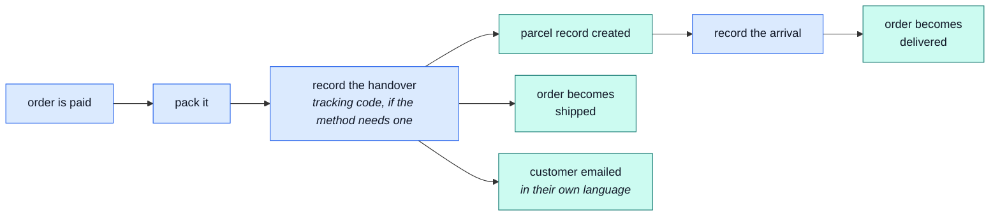

# The warehouse

Stock, and getting parcels out of the door.

## The one rule

**Nobody types a stock number in directly.** Not the manager, not the shop, not anyone.

Stock only ever moves because something happened, and that something is always recorded. There are
six ways a number can change and no seventh:

Blue is you doing something. Amber happens on its own. Either way the diary gets a line, so
"why is this number 23?" always has an answer.

::: tip Why this matters
A shop where anyone can overwrite the stock figure is a shop where the figure is eventually wrong
and nobody can say when it went wrong. Recording the _reason_ instead of the _result_ means the
number can always be rebuilt from its history.
:::

→ [`inventory`](../modules/inventory.md)

## Two numbers, not one

Every product carries two figures, and confusing them is the classic warehouse mistake:

| Figure        | Means                                                      |
| ------------- | ---------------------------------------------------------- |
| **On hand**   | Physically on the shelf right now                          |
| **Set aside** | Of those, how many are already promised to unpaid orders   |
| **Available** | On hand minus set aside — what a customer can actually buy |

A product with 10 on hand and 4 set aside sells to 6 more people, not 10.

## The two things you do by hand

**A delivery arrived** — record what came in. Stock goes up, the diary gets a line.

**The count is wrong** — record the correction. Somebody dropped a box, or two got miscounted at
some point. Stock moves to the true figure, the diary gets a line saying it was a correction rather
than a sale.

Both are entries in a book, not edits to a number. That distinction is the whole design.

## Clearing expired holds

When a customer checks out but never pays, their goods sit "set aside" for 30 minutes and then need
releasing.

::: warning This does not happen by itself
The shop does not ship with anything that runs on a timer. **Somebody or something has to trigger
the sweep** — the job that finds expired holds and puts the goods back.

Until it runs, those goods are invisible to customers even though nobody is buying them. Run it at
least as often as the hold lasts.
:::

→ [the detail](../modules/inventory-reservations.md)

## The running-low list

There is a stock board showing everything with a "show me only the low ones" filter. Anything at
**5 or fewer** counts as low, unless that figure is changed.

In the demo, the Heavy-Duty Cat Scratching Post sits at zero — a permanent example of what the
bottom of that list looks like.

## Getting parcels out of the door

The same rule as the stock diary above applies here: **you record what happened, and the status
follows from it — you never set the status directly.** There is no "mark it shipped" switch on its
own; recording the handover IS what marks it shipped.

Only one shipping method in the demo actually needs a tracking code — the others move a parcel
along with nothing but the record of the handover itself. Either way, the three things after
recording the handover all happen on their own: you do not separately create the parcel, or write
the status field, or send the email.

**There is no courier simulation.** Recording the arrival is a real action on a real
parcel, the same way recording the handover is — not a button standing in for a delivery company's
own report. → [`delivery`](../modules/delivery.md)

::: tip When the ordinary sequence does not fit
A parcel scanned against the wrong order, or a correction needed outside the normal pack → ship →
deliver order, goes through an admin's forced correction instead — see
[Correcting a mistake](./manager.md#correcting-a-mistake). It still creates the same record; it
just carries a reason and skips the ordinary gate.
:::

## The words we used

| Word           | In plain terms                                                                          |
| -------------- | --------------------------------------------------------------------------------------- |
| **On hand**    | Physically present on the shelf.                                                        |
| **Set aside**  | On the shelf, but promised to an unpaid order. → [`inventory`](../modules/inventory.md) |
| **Available**  | On hand minus set aside. What can still be sold.                                        |
| **The sweep**  | The job that releases holds nobody paid for. Must be triggered.                         |
| **Adjustment** | A recorded correction after counting the shelf.                                         |
| **Receipt**    | A recorded delivery from a supplier.                                                    |
