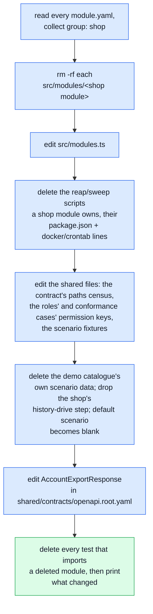

# Start a New Project

What to do the day this boilerplate stops being a demo shop and starts being YOUR project.

::: warning The honest promise
**Template or clone, strip, no automatic upstream updates.** `npm run demo:remove` deletes the demo
e-commerce domain from your own copy in one command — it does not turn this repo into a package you
`npm update`, and it does not follow future fixes made upstream. A packaged, updatable version of
the foundation is a later, bigger piece of work (tracked as FRAMEWORK in this repo's own planning);
today, forking and stripping is the whole story.
:::

## What "the demo" actually is

Every module under `src/modules/` carries a `group` in its own `module.yaml` —
`foundation` or `shop` (`docs/theory/strategic-ddd.md#4a-foundation-and-shop`). `foundation` ships
with every deployment whatever the project becomes; `shop` is the pet-supply e-commerce domain this
boilerplate demos itself with, and nothing else may depend on it —
`.dependency-cruiser.cjs`'s `foundation-cannot-reach-shop` rule fails closed on that, so "is the
demo actually removable" is an enforced fact, not a claim.

[The module index](./modules/index.md#every-module) lists every module under its group. It is
generated from each module's own `module.yaml`, so it is never behind.

`npm run measure:demo-strip` is the checked version of that claim: on every push and PR, CI copies
the repo to a scratch directory, applies a removal recipe (`--recipe shop` runs the real
`demo:remove`; `--recipe locales` deletes the optional locales module), then runs `regenerate`,
`ts-check`, the cross-cutting suite and `docs:build` against what's left. It reports on its own
squares (`demo-strip-measure` in `.github/workflows/ci.yml`) without blocking the merge gate —
deliberately, until it has stayed green long enough to be promoted into the merge gate. It is the
checked form of the promise: both recipes currently leave a repo that regenerates, type-checks and
passes the cross-cutting suite.

## Removing it



```bash
npm run demo:remove
npm run regenerate     # rebundle the contract, regenerate the typed client and every doc page
npm run ts-check        # see exactly what is left
```

`demo:remove` is a real edit of your working tree, not a scratch-copy measurement — run it on a
branch, or after committing whatever you had in progress. It touches:

- **Every `group: shop` module folder**, deleted outright — its routes, model, tests, everything.
- **The handful of central files a module folder cannot own by itself**: the module registry
  (`src/modules.ts`) and the shared contract fragment (`shared/contracts/openapi.root.yaml`), for
  the account data-export schema. Everything else that names a module is read from disk or from the
  registry — the contract's path index, the client collections' probes, the test suite's router
  map, the docs index and sidebar — and their order lists are only a preference.
  `account`'s own export service already reads its section list off the module registry at
  runtime (`src/modules/account/services/personal-data-registry.ts`) and just omits a section no
  module registers, so only the **contract text** was behind, not the code.
- **The reap/sweep scripts a shop module owns** (`scripts/ops/reap-orders.ts` and friends), found by
  their own `Removal: owned by` doc comment rather than a second hand-kept list, plus the
  `package.json` script and `docker/crontab` line each one has.
- **The removed modules' permission keys** in `shared/authorization-roles.yaml` (every role's grants)
  and `shared/authorization-conformance.yaml` (the callers' keys, and every case about a subject only
  a removed module declared).
- **Every test that imports a removed module** — or says `// requires-module: <name>` — along with any
  test helper or test that imported one of those. The report lists each file it deleted.
- **The demo catalogue's own scenario data** (`scenarios/products.ts`, `scenarios/wishlist.ts`, the
  generated catalogue images, the flows that drive and backdate a shop's order history) — deleted,
  since none of it means anything without a shop. The `shop` scenario keeps seeding its
  foundation-only fixtures (named accounts, address books, locale entries, a webhook subscription);
  the default scenario becomes `blank` once there is no catalogue left to make `shop` the more
  interesting choice.

## What it does not do

After `demo:remove`, `regenerate`, `ts-check` and the cross-cutting suite pass (and so does the
unit suite) — `measure:demo-strip` checks the first three on every push. What goes with the shop is
coverage that only existed because the shop did: a test that imported it is deleted whole, and where
that test also covered a foundation module the shop-dependent cases were already in a file of their
own, so the foundation cases stay. The exceptions are the **system** tests that used the shop as sample data
throughout (the mailer-template sweep, the analytics port's suite, the write-methods and
request-contract suites) — they go entirely;
rewrite them around your own domain if you want that coverage back.

`docs/theory/module-lifecycle.md`'s "residue" is what is left over: a test that names a removed
module in a string or a table rather than an import. `ts-check` and the suites name each one.

## Next: build your own domain

Once `demo:remove` leaves you with a green `npm run complete`,
the remaining `foundation` modules are what every deployment of this boilerplate keeps, whatever it
becomes next.

**The module to copy is `feedback`.** It is `foundation`, so it is still there after the strip and
depends on nothing shop-shaped, and it carries most of what a new module needs. Do not start from a
shop module: the strip deletes it, and its dependencies with it.

**Or let the scaffolder start it for you.** `npm run scaffold:module -- <name>` writes a working
`feedback`-shaped module, its docs page and its registry line, then regenerates —
[Module scaffolder](./tools/module-scaffolder.md) says what it writes and what it leaves to you.
`docs/theory/modules.md#the-module-template` is the shape a new module follows; `docs/theory/module-lifecycle.md#adding-a-module` walks through adding one from
nothing, the same way this page walks through removing one.

## Related pages

- [Foundation and shop](./theory/strategic-ddd.md#4a-foundation-and-shop) — the `group` field, and
  why it is enforced rather than aspirational
- [Module Lifecycle](./theory/module-lifecycle.md) — the manual removal procedure this page's
  command replaces, and the "three piles" a deletion's own breakage sorts into
- [Modules](./theory/modules.md) — the module template a new domain follows
- [Contract Fragmentation](./api/contract-fragmentation.md) — why `shared/contracts/openapi.root.yaml`
  is hand-edited and what "belongs to no module" means
