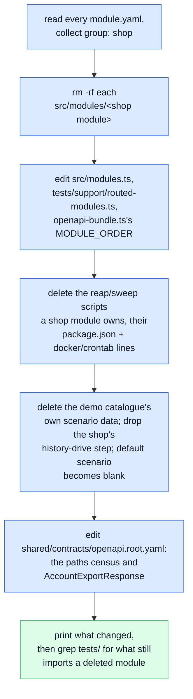

# Start a New Project

What to do the day this boilerplate stops being a demo shop and starts being YOUR project.

::: warning The honest promise
**Template or clone, strip, no automatic upstream updates.** `npm run demo:remove` deletes the demo
e-commerce domain from your own copy in one command — it does not turn this repo into a package you
`npm update`, and it does not follow future fixes made upstream. A packaged, updatable version of
the foundation is a later, bigger piece of work (tracked as FRAMEWORK in this repo's own planning);
today, forking and stripping is the whole story.
:::

## What "the demo" actually is

Every module under `src/modules/` carries a `group` in its own `module.yaml` —
`foundation` or `shop` (`docs/theory/strategic-ddd.md#4a-foundation-and-shop`). `foundation` ships
with every deployment whatever the project becomes; `shop` is the pet-supply e-commerce domain this
boilerplate demos itself with, and nothing else may depend on it —
`.dependency-cruiser.cjs`'s `foundation-cannot-reach-shop` rule fails closed on that, so "is the
demo actually removable" is an enforced fact, not a claim.

| Group        | Modules                                                                                                                                              |
| ------------ | ---------------------------------------------------------------------------------------------------------------------------------------------------- |
| `shop`       | `cart`, `delivery`, `inventory`, `invoicing`, `orders`, `payments`, `products`, `wishlist`                                                           |
| `foundation` | everything else — `account`, `addresses`, `antibot`, `api-keys`, `audit-logs`, `feedback`, `locales`, `observability`, `users`, `webhooks`, `access` |

`npm run measure:demo-strip` is the checked version of that claim: on every push and PR, CI copies
the repo to a scratch directory, deletes every `group: shop` folder, and runs `ts-check`, the
cross-cutting suite and `docs:build` against what's left. It reports on its own square
(`demo-strip-measure` in `.github/workflows/ci.yml`) without blocking the merge gate — deliberately:
it is a punch list for drift, not a promise that removing the shop today leaves a perfect repo, and
`npm run demo:remove` (below) is the thing that actually clears that list for your own copy.

## Removing it



```bash
npm run demo:remove
npm run regenerate     # rebundle the contract, regenerate the typed client and every doc page
npm run ts-check        # see exactly what is left
```

`demo:remove` is a real edit of your working tree, not a scratch-copy measurement — run it on a
branch, or after committing whatever you had in progress. It touches:

- **Every `group: shop` module folder**, deleted outright — its routes, model, tests, everything.
- **The handful of central files a module folder cannot own by itself**: the module registry
  (`src/modules.ts`), the test suite's own router map (`tests/support/routed-modules.ts`), the
  OpenAPI bundler's section order, and the shared contract fragment
  (`shared/contracts/openapi.root.yaml`) that lists every module's paths and the account data-export
  schema — `account`'s own export service already reads its section list off the module registry at
  runtime (`src/modules/account/services/personal-data-registry.ts`) and just omits a section no
  module registers, so only the **contract text** was behind, not the code.
- **The reap/sweep scripts a shop module owns** (`scripts/ops/reap-orders.ts` and friends), found by
  their own `Removal: owned by` doc comment rather than a second hand-kept list, plus the
  `package.json` script and `docker/crontab` line each one has.
- **The demo catalogue's own scenario data** (`scenarios/products.ts`, `scenarios/wishlist.ts`, the
  generated catalogue images, the flows that drive and backdate a shop's order history) — deleted,
  since none of it means anything without a shop. The `shop` scenario keeps seeding its
  foundation-only fixtures (named accounts, address books, locale entries, a webhook subscription);
  the default scenario becomes `blank` once there is no catalogue left to make `shop` the more
  interesting choice.

## What it does not do

`demo:remove` gets the repo **compiling and bundling** — `ts-check`, `lint`, `contracts:bundle`,
`gen:api` and `gen:asyncapi` all pass afterward with nothing outside `tests/` broken. It does not,
and is not trying to, fix every test that USED the shop as convenient sample data rather than
testing the shop itself. `docs/theory/module-lifecycle.md`'s own removal procedure calls this the
**residue pile** — a system-level test (`tests/cross-cutting/money-reconciliation.property.test.ts`,
say) built a fixture out of a product because a product was there, not because the test is ABOUT
products. `demo:remove`'s own last step greps `tests/` for exactly these candidates and prints them;
deciding which to delete and which to rewrite around your own domain is a human judgement call this
script will not guess at.

A module-owned test (`src/modules/orders/tests/**`) is not on that list — it went with its folder
automatically. Only a **system**-level test that reached into a shop module from outside is left for
you.

## Next: build your own domain

Once `demo:remove` and a pass through the residue list leave you with a green `npm run complete`,
the remaining `foundation` modules — account, addresses, users, access, webhooks, feedback,
observability, locales, antibot, api-keys, audit-logs — are what every deployment of this boilerplate
keeps, whatever it becomes next. `docs/theory/modules.md#the-module-template` is the shape a new
module follows; `docs/theory/module-lifecycle.md#adding-a-module` walks through adding one from
nothing, the same way this page walks through removing one.

## Related pages

- [Foundation and shop](./theory/strategic-ddd.md#4a-foundation-and-shop) — the `group` field, and
  why it is enforced rather than aspirational
- [Module Lifecycle](./theory/module-lifecycle.md) — the manual removal procedure this page's
  command replaces, and the "three piles" a deletion's own breakage sorts into
- [Modules](./theory/modules.md) — the module template a new domain follows
- [Contract Fragmentation](./api/contract-fragmentation.md) — why `shared/contracts/openapi.root.yaml`
  is hand-edited and what "belongs to no module" means
