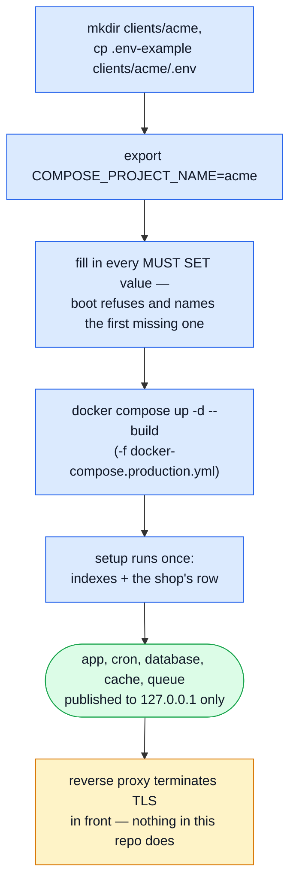

# Getting Started — Production

The deployment shape of this stack, not the development one. `docker-compose.yml` bind-mounts the
working tree and brings up the whole observability estate because seeing everything is the point
of a dev box. `docker-compose.production.yml` is the other half: it runs the **built** image, binds
the API port to loopback only, and stops at the four services the application cannot run without.

::: warning Read this alongside the file, not instead of it
Every decision below — why the port is loopback-only, why clustering is off, why observability is
absent — is explained inline in `docker-compose.production.yml` and `docker/Dockerfile.production`
themselves. This page is the short version; the compose file is the source of truth.
:::

## First run

A production stack serves **one client organisation**. It is named, and the name picks up that
client's configuration:



```bash
mkdir -p clients/acme
cp .env-example clients/acme/.env
export COMPOSE_PROJECT_NAME=acme
```

`COMPOSE_PROJECT_NAME` does two jobs at once: it prefixes every container, network and volume, and
it selects `clients/acme/.env` below. Unset, the stack refuses to start rather than guessing. To
run a second client on the same host, repeat with a different name and a different `NODE_PORT` —
nothing is shared between them.

Then edit `clients/acme/.env` and set real values. Rather than a hand-copied list here — which goes
stale the moment a new secret is added — boot itself tells you what it needs: start the stack with
the shipped placeholders still in place and it refuses, naming the first one it hit. Generate a
strong value for each with:

```bash
node -e "console.log(require('crypto').randomBytes(32).toString('hex'))"
```

`.env-example`'s own `MUST SET` markers (Part A) and its production-only block (Part D6) are the
complete list; `MONGO_ROOT_USER` defaults to `root`, `MONGO_APP_USER` and `MONGO_DB` default to
`api`, `RABBITMQ_USER` defaults to `guest`. `MONGO_ROOT_USER`/`MONGO_ROOT_PASSWORD` are
maintenance-only — the app itself authenticates as `MONGO_APP_USER`, a `readWrite` user scoped to
`MONGO_DB` and created by `docker/mongo-init.js` the first time the volume is empty.

**Bundled or managed backing services.** `COMPOSE_PROFILES=bundled` (`.env-example`'s default)
starts the `database`/`cache`/`queue` containers below. Pointing at a managed MongoDB, Redis or
RabbitMQ instead is two edits, not a compose-file change: set `NODE_DB_URI`/`NODE_REDIS_URL`/
`NODE_RABBITMQ_URL` to the managed connection string, and clear `COMPOSE_PROFILES` so the bundled
containers never start.

```bash
docker compose --env-file "clients/acme/.env" -f docker-compose.production.yml up -d --build
```

The file is named twice — once by `--env-file`, once by `env_file:` inside the compose file —
because compose reads it through two separate channels. `--env-file` resolves the `${...}`
substitutions in the compose file itself; `env_file:` is what the container receives. Naming only
one of them silently gives every client the same application config.

That builds `docker/Dockerfile.production` (multi-stage: type-checks in a build stage, ships only
production dependencies in the runtime stage), runs `setup` once — indexes and the shop's row, see
[below](#the-first-owner) — then starts the API, `cron`, and (bundled profile) `database`, `cache`
and `queue`, the production names for Mongo, Redis and RabbitMQ. No bind mount, no hot reload:
what's running is exactly what was built.

## Check it worked

```bash
docker compose --env-file "clients/acme/.env" -f docker-compose.production.yml logs -f app
curl http://127.0.0.1:3000/          # health probe
```

The port is published to `127.0.0.1`, not `0.0.0.0` — reachable from the host, not from the
network. That is deliberate, see [Putting a reverse proxy in front](#putting-a-reverse-proxy-in-front) below.

## The first owner

`setup` gives the database its shop and its preset roles, but nobody starts with a role above
`customer` — the first signup racing to become owner is a known vulnerability pattern, so nothing
does that automatically. Sign up through the app once, then grant the account a role from the host:

```bash
docker compose --env-file "clients/acme/.env" -f docker-compose.production.yml \
    exec app npm run access:grant -- you@example.com owner
```

The same command is the recovery path if every owner is ever locked out — `--scope platform` grants
an installation-wide role (an operator) instead of a shop role.

## What's different from dev

| Dev (`docker-compose.yml`)                                  | Production (`docker-compose.production.yml`)                                                                                     |
| ----------------------------------------------------------- | -------------------------------------------------------------------------------------------------------------------------------- |
| Source bind-mounted, `tsx` watches for changes              | Source baked into the image at build time                                                                                        |
| API port published to all interfaces                        | API port published to `127.0.0.1` only                                                                                           |
| Full observability stack included                           | No observability containers — see [below](#observability-in-production)                                                          |
| `NODE_ENABLE_CLUSTERING=1` (multi-process in one container) | `NODE_ENABLE_CLUSTERING=0` — one process per container, always                                                                   |
| Runs as whatever user starts compose                        | Runs as the non-root `node` user inside the image                                                                                |
| Mongo is a standalone with no auth                          | Mongo is a single-node replica set (`rs0`), a scoped `readWrite` app user behind a root account, Redis requires `REDIS_PASSWORD` |

Clustering is off on purpose: scale replicas with `--scale app=N` or an orchestrator instead, so
one thing decides how many processes are live, not two layers of process management fighting a
rolling deploy.

## Putting a reverse proxy in front

Nothing in this repo terminates TLS. The API is bound to loopback specifically so that publishing
it on a public interface — plain HTTP, carrying the auth cookies this application sets — is not the
easy path. Put nginx, Caddy, Traefik or a managed load balancer in front, terminate TLS there, and
proxy to `127.0.0.1:${NODE_PORT}`.

Running **several client stacks on one host** is different enough to have its own recipe —
`docker-compose.proxy.yml` fronts them all with one shared Traefik, discovering each stack straight
off its own container labels. See [Two Client Stacks](./tools/two-client-stacks.md).

## Uploaded images do not outlive the container

`imageStore` (`src/infrastructure/adapters/image-store.ts`) writes uploads to disk. The compose
file mounts a named volume (`uploads:/app/public/images`) as the stopgap — without it, a redeploy
loses every uploaded image. The volume still pins the deployment to one host, and two replicas do
not share what they store. The durable answer is an S3-compatible `ImageStore` implementation;
nothing selects a backend yet, on purpose.

## Observability in production

The dev stack's Prometheus, Loki, Tempo, Grafana and OTel Collector are **not** in the production
file, because a real deployment usually points at a collector it already runs rather than hosting
one next to the API. Set `OTEL_EXPORTER_OTLP_ENDPOINT` to that collector; an empty value is a valid
choice and simply means no traces leave the process.

To run the same observability estate here anyway, the service definitions already exist — copy the
ones you want from `docker-compose.yml` into your own override file rather than layering the two
compose files directly (`-f docker-compose.production.yml -f docker-compose.yml` drags the dev
bind-mounts back in).

See [Docker & Podman](./tools/docker-and-podman.md) for what each of those containers does and
[Observability Reference](./tools/observability-reference.md) for how the app talks to them.

## Where to go next

| You want to                                      | Read                                              |
| ------------------------------------------------ | ------------------------------------------------- |
| Run the dev stack instead                        | [Getting Started](./getting-started.md)           |
| Understand every container, dev or production    | [Docker & Podman](./tools/docker-and-podman.md)   |
| Run two client stacks, or share one proxy        | [Two Client Stacks](./tools/two-client-stacks.md) |
| Pick a host that can run this                    | [Hosting](./tools/hosting.md)                     |
| Back up what a stack holds                       | [Backups](./tools/backups.md)                     |
| Understand why one stack serves one client       | [Tenancy](./theory/tenancy.md)                    |
| See every host port and its env var              | [Pairing & Ports](./tools/pairing-and-ports.md)   |
| Understand graceful shutdown under SIGTERM       | [Clustering & Shutdown](./theory/clustering.md)   |
| Look up a file in `docker/` or the compose files | [Ops & Assets](./reference/ops.md)                |
