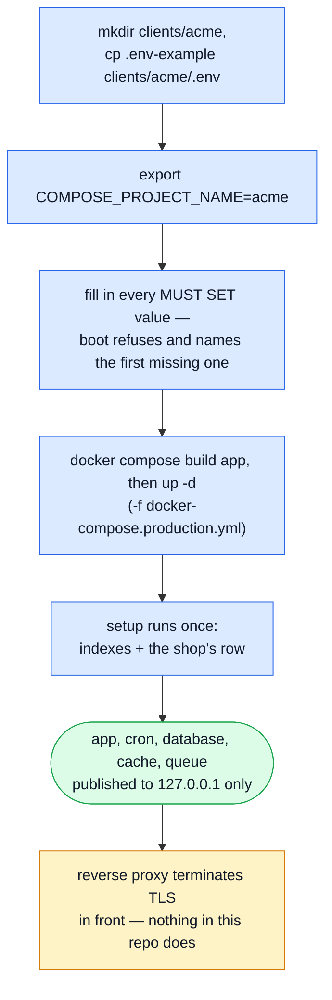
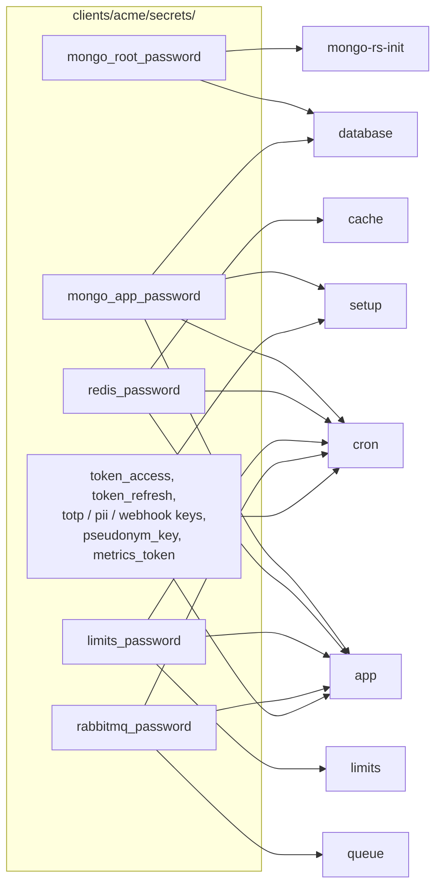
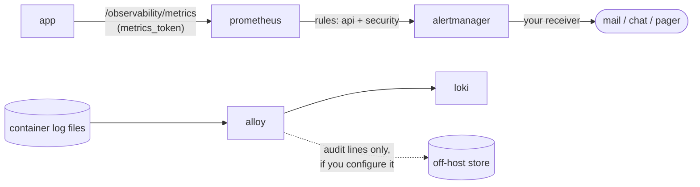

# Getting Started — Production

The deployment shape of this stack, not the development one. `docker-compose.yml` bind-mounts the
working tree and brings up the whole observability estate because seeing everything is the point
of a dev box. `docker-compose.production.yml` is the other half: it runs the **built** image, binds
the API port to loopback only, and stops at the four services the application cannot run without.

::: warning Read this alongside the file, not instead of it
Every decision below — why the port is loopback-only, why clustering is off, why observability is
absent — is explained inline in `docker-compose.production.yml` and `docker/Dockerfile.production`
themselves. This page is the short version; the compose file is the source of truth.
:::

## First run

A production stack serves **one client organisation**. It is named, and the name picks up that
client's configuration:


```mermaid
flowchart TD
    Dir["mkdir clients/acme,\ncp .env-example clients/acme/.env"] --> Name["export COMPOSE_PROJECT_NAME=acme"]
    Name --> Secrets["fill in every MUST SET value —\nboot refuses and names the first missing one"]
    Secrets --> Up["docker compose build app, then up -d\n(-f docker-compose.production.yml)"]
    Up --> Setup["setup runs once:\nindexes + the shop's row"]
    Setup --> Running(["app, cron, database, cache, queue\npublished to 127.0.0.1 only"])
    Running --> Proxy["reverse proxy terminates TLS\nin front — nothing in this repo does"]

    classDef step fill:#dbeafe,stroke:#2563eb,color:#111827;
    classDef done fill:#dcfce7,stroke:#16a34a,color:#111827;
    classDef warn fill:#fef3c7,stroke:#d97706,color:#111827;
    class Dir,Name,Secrets,Up,Setup step;
    class Running done;
    class Proxy warn;
```

```bash
mkdir -p clients/acme
cp .env-example clients/acme/.env
export COMPOSE_PROJECT_NAME=acme
```

`COMPOSE_PROJECT_NAME` does two jobs at once: it prefixes every container, network and volume, and
it selects `clients/acme/.env` below. Unset, the stack refuses to start rather than guessing. To
run a second client on the same host, repeat with a different name and a different `NODE_PORT` —
nothing is shared between them.

Then edit `clients/acme/.env` and set real values. The credentials and keys are **not** in this file
(see [Secrets](#secrets)); delete their lines from your copy. Rather than a hand-copied list here —
which goes stale the moment a new setting is added — boot itself tells you what it needs: start the
stack with the shipped placeholders still in place and it refuses, naming the first one it hit.

`.env-example`'s own `MUST SET` markers (Part A) and its production-only block (Part D6) are the
complete list; `MONGO_ROOT_USER` defaults to `root`, `MONGO_APP_USER` and `MONGO_DB` default to
`api`, `RABBITMQ_USER` defaults to `guest`. The root account is maintenance-only — the app itself
authenticates as `MONGO_APP_USER`, a `readWrite` user scoped to `MONGO_DB` and created by
`docker/mongo-init.js` the first time the volume is empty.

## Secrets

Every credential and key is **one file** under `clients/acme/secrets/`, and compose hands each
service only the files it needs. A secret in an environment variable shows in `docker inspect` and
in every child process; a file mounted into one container does neither, and the Mongo root password
exists in exactly two containers, neither of them the app.


```mermaid
flowchart LR
    subgraph files["clients/acme/secrets/"]
        root["mongo_root_password"]
        appdb["mongo_app_password"]
        redis["redis_password"]
        limits_file["limits_password"]
        rabbit["rabbitmq_password"]
        keys["token_access, token_refresh,<br/>totp / pii / webhook keys,<br/>pseudonym_key, metrics_token"]
    end
    root --> database
    root --> rsinit["mongo-rs-init"]
    appdb --> database
    appdb --> app
    appdb --> cron
    appdb --> setup
    redis --> cache
    redis --> app
    redis --> cron
    limits_file --> limits
    limits_file --> app
    limits_file --> cron
    rabbit --> queue
    rabbit --> app
    rabbit --> cron
    keys --> app
    keys --> cron
    keys --> setup
```

Create them once, before the first `up`. Hex output, because Redis reads its password from a
whitespace-delimited config line:

```bash
mkdir -p -m 0700 "clients/acme/secrets"
for name in mongo_root_password mongo_app_password redis_password limits_password rabbitmq_password \
            token_access token_refresh totp_encryption_key pii_encryption_key \
            webhook_secret_encryption_key pseudonym_key metrics_token; do
  openssl rand -hex 32 > "clients/acme/secrets/$name"
  chmod 0644 "clients/acme/secrets/$name"
done
```

- **Modes:** the files are `0644` inside a `0700` directory. Compose ignores `uid`/`mode` for a file
  secret, and Redis (uid 999) and node (uid 1000) must both read it; the directory is what keeps
  other host users out.
- **How the app reads them:** `NODE_TOKEN_ACCESS_FILE=/run/secrets/token_access` and its siblings,
  set by the compose file. The URLs carry no password; each password file is merged into its URL
  ([Secrets as files](tools/configuration.md#secrets-as-files)).
- **Managed Mongo, Redis or RabbitMQ:** compose refuses to start a service whose secret file is
  missing, so leave the file **empty** (an empty file reads as unset, and the password in your
  `NODE_DB_URI` / `NODE_REDIS_URL` / `NODE_RABBITMQ_URL` stands), or put the managed password in it
  and leave it out of the URL.
- **Optional integrations** (SMTP, payments, OAuth, antibot) stay in `clients/acme/.env`, since a
  file secret cannot be optional here.
- **RabbitMQ:** the 4.x image refuses `RABBITMQ_DEFAULT_PASS_FILE`, so the password goes into a
  config file the broker reads; **Redis** gets it the same way, never on a command line.
- **Rotating** a Mongo or broker password: [security.md](tools/security.md#database-credential-and-key-rotation);
  then rewrite the file and recreate the services that mount it.

**Bundled or managed backing services.** `COMPOSE_PROFILES=bundled` (`.env-example`'s default)
starts the `database`/`cache`/`queue` containers below. Pointing at a managed MongoDB, Redis or
RabbitMQ instead is two edits, not a compose-file change: set `NODE_DB_URI`/`NODE_REDIS_URL`/
`NODE_RABBITMQ_URL` to the managed connection string, and clear `COMPOSE_PROFILES` so the bundled
containers never start. The bundled `database` requires TLS and its default `NODE_DB_URI` already
carries `tls=true&tlsCAFile=/ca-dir/...` against the self-signed CA `mongo-entrypoint.sh` mints
([Reaching the store](theory/defences/data-layer.md#reaching-the-store)) — a managed provider's own
connection string supplies its own TLS, so this is a bundled-default concern only.

**The managed database user.** Give the app a user with `readWrite` on its own database and
nothing else — never the provider's root or admin account. The bundled `database` already works
this way (`MONGO_APP_USER`, created by `docker/mongo-init.js`); a managed cluster needs the same
user created by hand. `readWrite` is enough for everything the app does, `setup`'s `db:sync`
index builds included.

```bash
docker compose --env-file "clients/acme/.env" -f docker-compose.production.yml build app
docker compose --env-file "clients/acme/.env" -f docker-compose.production.yml up -d
```

`build app` first: `setup` and `cron` run the image `app` builds rather than building their own,
so on a stack's first deploy that image has to exist before they start.

The file is named twice — once by `--env-file`, once by `env_file:` inside the compose file —
because compose reads it through two separate channels. `--env-file` resolves the `${...}`
substitutions in the compose file itself; `env_file:` is what the container receives. Naming only
one of them silently gives every client the same application config.

That builds `docker/Dockerfile.production` (multi-stage: type-checks in a build stage, ships only
production dependencies in the runtime stage), runs `setup` once — indexes and the shop's row, see
[below](#the-first-admin) — then starts the API, `cron`, and (bundled profile) `database`, `cache`
and `queue`, the production names for Mongo, Redis and RabbitMQ. No bind mount, no hot reload:
what's running is exactly what was built.

## Check it worked

```bash
docker compose --env-file "clients/acme/.env" -f docker-compose.production.yml logs -f app
curl http://127.0.0.1:3000/livez     # liveness probe
```

The port is published to `127.0.0.1`, not `0.0.0.0` — reachable from the host, not from the
network. That is deliberate, see [Putting a reverse proxy in front](#putting-a-reverse-proxy-in-front) below.

## The first admin

`setup` gives the database its shop and its preset roles, but nobody starts with a role above
`customer` — the first signup racing to become admin is a known vulnerability pattern, so nothing
does that automatically. Sign up through the app once, then the technician gives that account its
role by writing the membership into the database by hand. There is no command for it, the first
owner included, and the same hand-written fix is the way back if every admin is ever locked out.

The write, from the stack's own `database` container (the id is the account's `_id`, shown by
`db.users.findOne({ email: "<their email>" })`; the tenant id is the deployment's fixed one):

```bash
docker compose --env-file "clients/<name>/.env" -f docker-compose.production.yml \
  exec database mongosh --tls --tlsCAFile /keyfile-dir/mongo-ca.crt \
  -u "$MONGO_ROOT_USER" -p --authenticationDatabase admin "<MONGO_DB>" --eval '
    db.memberships.updateOne(
      { userId: "<the account id>", tenantId: "65dd20000000000000000001", scope: "tenant" },
      { $set: { role: "admin" }, $currentDate: { updatedAt: true, createdAt: true } },
      { upsert: true }
    )
  '
```

One membership per person per place, so the same command also _changes_ a role. An administrator
that was switched off, or erased, comes back with `db.users.updateOne({ _id: ObjectId("<id>") },
{ $set: { active: true }, $unset: { deletedAt: "" } })`. The app has no way to do either on an
administrator's behalf: nobody outranks one ([Authorization](./theory/authorization.md#acting-on-someone-else-s-things)).

## Publish a disclosure contact

Set `NODE_SECURITY_CONTACT`, `NODE_SECURITY_EXPIRES` (and optionally `NODE_SECURITY_POLICY_URL`) so
a researcher who finds a bug in your deployment knows where to send it. Left unset, nothing is
published. See [Reporting a vulnerability](tools/security.md#reporting-a-vulnerability).

## What's different from dev

| Dev (`docker-compose.yml`)                                  | Production (`docker-compose.production.yml`)                                                                                     |
| ----------------------------------------------------------- | -------------------------------------------------------------------------------------------------------------------------------- |
| Source bind-mounted, `tsx` watches for changes              | Source baked into the image at build time                                                                                        |
| API port published to all interfaces                        | API port published to `127.0.0.1` only                                                                                           |
| Full observability stack included                           | No observability containers — see [below](#observability-in-production)                                                          |
| `NODE_ENABLE_CLUSTERING=1` (multi-process in one container) | `NODE_ENABLE_CLUSTERING=0` — one process per container, always                                                                   |
| Runs as whatever user starts compose                        | Runs as the non-root `node` user inside the image, `read_only` root filesystem, all Linux capabilities dropped                   |
| Mongo is a standalone with no auth                          | Mongo is a single-node replica set (`rs0`), a scoped `readWrite` app user behind a root account, Redis requires `REDIS_PASSWORD` |
| Uploads/storage/quarantine are host paths or absent         | `uploads`, `storage` and `quarantine` are named volumes — `storage` also holds the outbound mail spool, so back it up            |

Clustering is off on purpose: scale replicas with `--scale app=N` or an orchestrator instead, so
one thing decides how many processes are live, not two layers of process management fighting a
rolling deploy.

## Putting a reverse proxy in front

Nothing in this repo terminates TLS. The API is bound to loopback specifically so that publishing
it on a public interface — plain HTTP, carrying the auth cookies this application sets — is not the
easy path. Put nginx, Caddy, Traefik or a managed load balancer in front, terminate TLS there, and
proxy to `127.0.0.1:${NODE_PORT}`.

Then set `NODE_TRUST_PROXY_HOPS` to the number of proxies in front (usually `1`; the Traefik overlay
below sets it for you). It defaults to `0`, which reads the caller's address from the socket — with a proxy in front, that is the proxy's
address for every request, so every caller shares one rate-limit bucket and every audit row names
the proxy. See [trust proxy](./tools/security.md#trust-proxy-and-the-two-ways-to-get-it-wrong).

Running **several client stacks on one host** is different enough to have its own recipe —
`docker-compose.proxy.yml` fronts them all with one shared Traefik that serves each stack from its
own route file, with no Docker socket mounted. See [Two Client Stacks](./tools/two-client-stacks.md).

## Uploaded images do not outlive the container

`imageStore` (`src/infrastructure/adapters/image-store.ts`) writes uploads to disk. The compose
file mounts a named volume (`uploads:/app/public/images`) as the stopgap — without it, a redeploy
loses every uploaded image. The volume still pins the deployment to one host, and two replicas do
not share what they store. The durable answer is an S3-compatible `ImageStore` implementation;
nothing selects a backend yet, on purpose.

## Monitoring and alerts

The `monitoring` profile adds four services, **off by default**: Prometheus (scrapes `app` and
evaluates the alert rules), Alertmanager (routes what fires), Loki (stores container logs) and Alloy
(ships them). Turn it on with `COMPOSE_PROFILES=bundled,monitoring`. There is no Grafana: it costs
about a gigabyte of memory and the alerts do not need a screen.


```mermaid
flowchart LR
    app["app"] -- "/observability/metrics<br/>(metrics_token)" --> prom["prometheus"]
    prom -- "rules: api + security" --> am["alertmanager"]
    am -- "your receiver" --> you(["mail / chat / pager"])
    logs[("container log files")] --> alloy["alloy"]
    alloy --> loki["loki"]
    alloy -. "audit lines only,<br/>if you configure it" .-> offhost[("off-host store")]
```

- **No host ports.** Prometheus and Alertmanager have web UIs with no login, so none of the four
  publishes a port; they reach each other and `app` over the compose network. Reach a UI with
  `docker compose exec` or an SSH tunnel, not a published port.
- **One credential.** Prometheus scrapes with the `metrics_token` secret file the app reads its own
  `NODE_METRICS_TOKEN` from, so rotating the token is one edit.
- **The rules** are the files the local stack loads: `docker/observability/prometheus.alert-rules.yaml`.
  The `security` group carries a "tune to your traffic" comment on every threshold.
- **You need an alert receiver.** Alerts that fire into nothing are a dashboard nobody opens.
  Alertmanager ships the `null` receiver, which notifies no one. Wire a real one in
  `docker/observability/alertmanager.config.yaml` before relying on any alert: an email (SMTP)
  receiver, a chat webhook (Slack, Mattermost, Teams) or a pager (PagerDuty, Opsgenie). This
  boilerplate picks none, because the right one is whatever your team already watches.
  [Receiver settings](https://prometheus.io/docs/alerting/latest/configuration/#receiver-integration-settings)
- **Logs.** Alloy tails the engine's container log files (Docker: `/var/lib/docker/containers`; set
  `CONTAINER_LOGS_PATH` for Podman, together with `CONTAINER_LOG_DRIVER=k8s-file`, because Podman's
  default driver writes no file). It reads the Docker and the Podman format at once.
- **The audit stream, off the host.** An audit trail the application can write is one an attacker
  who owns the application can rewrite, so the strongest copy lives on a system the application
  cannot reach. The pipeline can forward the lines tagged `log_type=audit` to a target you choose:
  copy `docker/observability/alloy.audit-forward.example.alloy`, fill in the target, and point
  `ALLOY_AUDIT_FORWARD_CONFIG` at the copy. Where it goes is yours to pick; the options worth
  weighing are object storage with object lock (WORM retention), a separate log host, or a managed
  log service with its own access control. This boilerplate picks none: **with no target there is
  no off-host copy**, and the audit entries live only in the host's logs and the application's
  database. Why not a protected database instead: its role needs `createIndex`, so a compromised
  app could plant a TTL index with `expireAfterSeconds: 0` and wipe the trail.

Traces are not in the profile: set `OTEL_EXPORTER_OTLP_ENDPOINT` to a collector you already run (an
empty value is a valid choice and means no traces leave the process). To run Tempo and Grafana here
anyway, copy their definitions from `docker-compose.yml` into your own override file rather than
layering the two compose files (`-f docker-compose.production.yml -f docker-compose.yml` drags the
dev bind-mounts back in).

See [Docker & Podman](./tools/docker-and-podman.md) for what each of those containers does and
[Observability Reference](./tools/observability-reference.md) for how the app talks to them.

## Where to go next

| You want to                                      | Read                                              |
| ------------------------------------------------ | ------------------------------------------------- |
| Run the dev stack instead                        | [Getting Started](./getting-started.md)           |
| Understand every container, dev or production    | [Docker & Podman](./tools/docker-and-podman.md)   |
| Run two client stacks, or share one proxy        | [Two Client Stacks](./tools/two-client-stacks.md) |
| Pick a host that can run this                    | [Hosting](./tools/hosting.md)                     |
| Back up what a stack holds                       | [Backups](./tools/backups.md)                     |
| Understand why one stack serves one client       | [Tenancy](./theory/tenancy.md)                    |
| See every host port and its env var              | [Pairing & Ports](./tools/pairing-and-ports.md)   |
| Understand graceful shutdown under SIGTERM       | [Clustering & Shutdown](./theory/clustering.md)   |
| Look up a file in `docker/` or the compose files | [Ops & Assets](./reference/ops.md)                |
