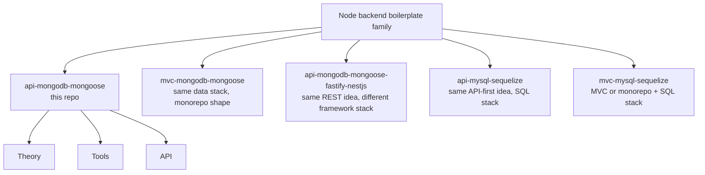
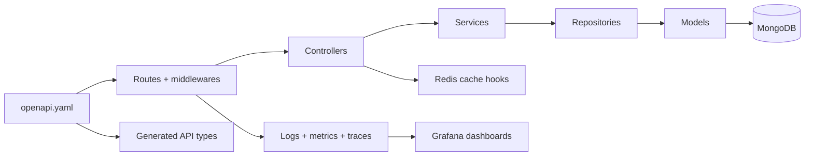

## What this docs site is for

This docs site stays short, visual, and practical.
Use it to understand **what this boilerplate is**, **how the app layers fit together**, and **which tools already exist in the repo**.

> Think of the repo as **an example backend blueprint**, not a finished product with product-specific business rules.

## Family map

## Read this repo as

- **API**: REST API.
- **Framework**: [Express](./tools/runtime.md).
- **Database**: [MongoDB + Mongoose](./tools/mongodb-mongoose.md).
- **Observability**: [Prometheus](./tools/prometheus.md), [OpenTelemetry](./tools/opentelemetry.md), and [Grafana](./tools/grafana.md).
- **Contract**: [`openapi.yaml`](./api/openapi-workflow.md#openapi-is-the-source-of-truth).
- **Shape**: layered code explained in [Theory](./theory/) and the dedicated [Layers](./theory/layers.md) page.

## Three sections, three jobs

### [Theory](./theory/)

Big picture: architecture, layers, and request flow.

### [Tools](./tools/)

Dependency-focused pages: runtime, security, database, cache, logs, metrics, traces, Grafana, analytics, testing, and docs.

### [API](./api/)

Contract-first workflow: OpenAPI, REST style, codegen, mocks, and implementation alignment.

## Quick visual of the current repo

## Good starting points

- Want the app shape? Start at [Theory Overview](./theory/) and [Layers](./theory/layers.md).
- Want a specific dependency? Start at [Tools](./tools/) and jump to the tool page you need.
- Want observability? Read [Prometheus](./tools/prometheus.md), [OpenTelemetry](./tools/opentelemetry.md), and [Grafana](./tools/grafana.md).
- Want to change payloads or routes? Start in [API Overview](./api/) and keep [`openapi.yaml`](./api/openapi-workflow.md#openapi-is-the-source-of-truth) first.
