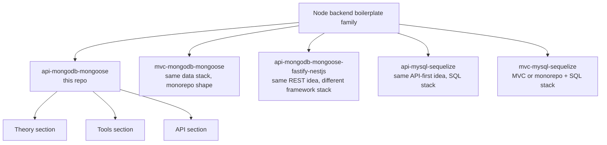
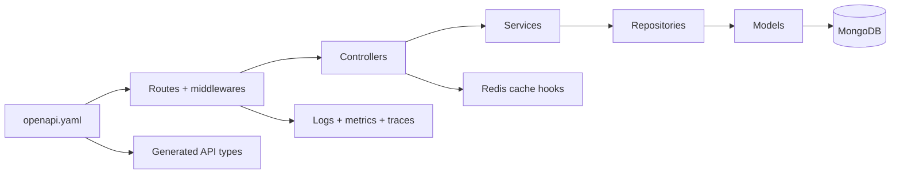

## What this docs site is for

This docs site stays intentionally short.
Use it to understand **what this boilerplate is**, **why the code is shaped this way**, and **where to change things safely**.

> Think of the repo as **an example backend blueprint**, not a finished product with product-specific business rules.

## Family map

### Read this repo as:

- **API**: REST API.
- **Transport/framework**: [Express](./tools/runtime-and-security.md#core-runtime).
- **Database**: [MongoDB](./tools/runtime-and-security.md#core-runtime) with [Mongoose](./tools/runtime-and-security.md#core-runtime).
- **Contract**: [`openapi.yaml`](./api/openapi-workflow.md#openapi-is-the-source-of-truth).
- **Style**: layered code with a contract-first workflow from [Theory](./theory/) to [API](./api/).

## Three sections, three jobs

### [Theory](./theory/)

Use this when you want the big picture: architecture, request flow, and the strategies already present in the code.

### [Tools](./tools/)

Use this when you want to know why dependencies exist: security, runtime, observability, testing, docs, and quality tools.

### [API](./api/)

Use this when you want to change the REST contract, regenerate types, mock endpoints, or keep implementation aligned with the spec.

## Quick visual of the current repo

## Good starting points

- Want the architecture? Start at [Theory Overview](./theory/).
- Want to know why [Helmet](./tools/runtime-and-security.md#security-stack) or [Prometheus](./tools/observability-and-quality.md#observability-stack) is here? Go to [Tools](./tools/).
- Want to change payloads or routes? Start in [API Overview](./api/) and keep [`openapi.yaml`](./api/openapi-workflow.md#openapi-is-the-source-of-truth) first.
